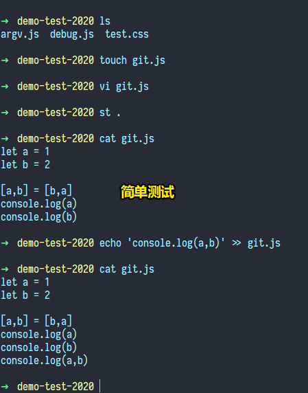

# 02-常用的 Linux 命令

> 在安装 Git 的过程中，注意勾选这样一个选项 -> 既能在 dos窗口 里边使用 Git，也能在 Git Bash 里边使用 Git -> 说白了，让doc窗口集成了个别Linux命令（勾选第3个）

## ★关于「命令」

- windows -> DOS 窗口 -> DOS 命令
- Linux -> Linux 命令
- Mac -> 终端也是 Linux 命令

你在 windows 旗下 使用 Git Bash 终端，意味着你得学会使用基本的 Linux 命令，因为 Git 中的命令大部分是 Linux 命令

### ◇常用命令（CRUD）

- `ls -l/-a`：`-a`包含隐藏的
- `cd dir`：如果没有右键Git Bash，那么可以复制路径，然后粘贴cd，也可以直接按住文件目录拖入到命令行窗口里边去
  - `cd /`：根目录，我这里是git的安装目录
  - `cd ./` or `cd .`：当前目录
  - `cd ../` or `cd ..`：上一级目录
  - `cd -`：返回，怎么进来的，就怎么回去
- `clear`：清屏
- `mkdir`：创建文件夹
- `touch`：创建空的文件
- `vi`：使用vim编辑器编辑文件 -> 进入到命令模式 -> 此状态下敲击键盘动作会被Vim识别为命令，而非输入字符。比如我们此时按下`i`，并不会输入一个字符，`i`被当作了一个命令
  - `i` -> 进入到插入模式 -> 输入字符
  - `ESC` -> 退出插入模式，回到命令模式
  - `ESC + :wq` -> 退出插入模式，保存刚才插入的内容 -> wq 是 Write And Quit （写入退出）
  - `ESC + :q!` -> 强制退出，当前内容不保存
- `echo`：向指定的文件中输入内容
  - `echo 'xxx' > xx` -> 对xx文件覆盖写入，如果不存在xx文件，会自动创建
  - `echo 'xxx' >> xx` -> 对xx文件追加写入，写到最后一行，如果不存在xx文件，会自动创建
- `cat`：查看文件中的内容
- `cp`：拷贝
- `rm`：删除文件，注意一旦删除无法还原哈！这可不是删到回收站里边
  - `-r` -> 递归删除
  - `-f` -> 强制删除
  - `-rf` -> 既有`-r`和`-f`
- `exit`：把当前命令行窗口给关了 -> 不需要你按「×」

测试：

➹：[Linux vi/vim - 菜鸟教程](https://www.runoob.com/linux/linux-vim.html)

➹：[Echo，Linux上最忧伤的命令 - 掘金](https://juejin.im/post/5d306da9f265da1bd424b828)

## ★小结

- 之前，我听到其它机构讲解vim，这让我觉得这些讲解是碎片的，比如就讲一个插入模式，不会说到，你用vi或vim打开一个文件，其实就已经进入到命令模式了，也只会说到 `ESC` 是退出输入模式，然后怎么保存，并没有告知「`:`是切换到底线命令模式，以在最底一行输入命令」 -> 操作的过程是有逻辑可循的，而不是孤零零的知识点 -> 这一点让我对「菜鸟教程」有了新的认识