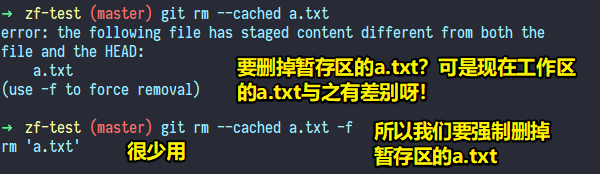
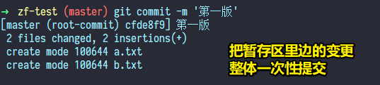

# 03-基础工作流程

## ★Git 的常规流程

### ◇Git 仓库 & 三区

每一个 Git 仓库都有三个区：

1. 工作区 -> 写代码
2. 暂存区 -> 临时存放每一次修改的代码，但这并没有生成历史版本
3. 历史区 -> 存放所有历史版本的地方（提交到历史区就会生成历史版本）


> 在开发中，为了降低问题的复杂度，通常会加个中间层……想想 Node.js 做中间层

### ◇通过一系列问题了解 Git 的基本使用

#### 1、如何创建一个 Git 仓库？

``` bash
git init
```

#### 2、我在 xxx 仓库里边，写了一个 js 文件，我该如何提交到暂存区？

``` bash
# 把当前工作区修改的内容全部提交到暂存区
git add -A 
# or
git add .

# 也可以指定具体提交的文件
git add xxx.js
```

#### 3、如何把暂存区里边的内容提交到历史区？即如何生成一个历史版本？

``` bash
# 备注信息 -> 声明当前版本的特点 -> 注意这是有规范的
git commit -m '备注信息'
```

#### 4、三区保持一致证明了当前仓库没有修改？

每一次区域间的信息提交都不会删除原有区域里边的内容，而这样保证了，下一次的提交，只是把区域对比出来不一样的内容给提交了，而不是所有的内容……

举例来说，这是一个新的仓库，你在这个仓库里边写了一个文件 xxx.js，你提交到「暂存区」，这样暂存区就有个 xxx.js 文件了，此时，你把 xxx.js 提交到「历史区」，重点来了，「暂存区」的 xxx.js 不会因此而 GG，因为下一次，你更改了工作区的 xxx.js，就会对比在「暂存区」里边的「xxx.js」，这样提交给「暂存区」的只是变更的信息，而不是一个完整的 xxx.js 文件，同理，从「暂存区」提交到「历史区」也是如此

而像 SVN 这样的版本控制系统，则是直接一个文件覆盖

#### 5、为啥需要暂存区？

一个功能模块的完成不是一蹴而就的

如果没有暂存区

那么假如我们每次完成个 20%就提交到「历史区」，那岂不是版本难以管理？太过琐碎？？

而如果有暂存区的话

那么完成一个 20%就提交到暂存区……逐渐地……暂存区就有个功能模块的 100% -> 这时我们就把这 100%一起全部提交到「历史区」

暂存区给我的感觉就像是一个缓存区一样……

对比 SVN 来说，SVN 就忒鸡肋了，因为每次提交都是直接提交到历史区

> 一个问题：假如发现提交到暂存区的代码有错了该怎么办呢？

#### 6、如何查看当前仓库有哪些文件被修改了或者是新创建的？

``` bash
git status
```

- 红色 -> 工作区 -> 表明这个文件在工作区
- 绿色 -> 暂存区 -> 表明这个文件在暂存区
- 看不见 -> 已经提交到历史区，三区保持一致了，意味着看不见


#### 7、初始化一个仓库，就会有个`.git`目录？

`.git`非常重要 -> 暂存区和历史区都在这个目录里边 -> 包含一些仓库的基本信息 -> 没有这个目录，即你把它删了，就不叫仓库了

而工作区 -> 就是我们在本地看到的代码，即`.git`目录以外的东西

#### 8、如何删除已经提交到暂存区的内容？ -> 不常用

这一点Git有提示哈，不需要记：

``` bash
# 把暂存区的某一个文件从工作区里边删除
git rm --cached <file>……
# 删除暂存区中所有提交
git rm --cached . -r
# 如果在删除过程中，发现该文件在工作区里边已经被修改了，那么你的加上 -f 才能强制删除
git rm --cached a.txt -f
```



何时用它？ -> **提交到暂存区的内容不好时，我们就可以删除它**，仅仅就是删除而已，不会影响到工作区里边的已变更内容 -> 其实挺少用的，因为如果你认为提交到暂存区的内容不好，如你提交了一个a.txt，当你在工作区，检查a.txt的内容时，发现有个错别字，于是，你有两种选择，一种是再次提交a.txt，另一种是删掉在暂存区里边的a.txt，然后再次提交a.txt（**这一种是不是有弊端？即会让我们失去变更信息？因为提交到历史版本区是需要对比暂存区的内容，如果该文件在暂存区里边重新变成了一枚小鲜肉，那么这意味着在历史区的变更记录，是删掉旧的所有，然后添加所有新的……**）

> 你每次提交Git都会提示了下一步干嘛，以及通过颜色告知你当前已变更的文件在哪个区

#### 9、场景：提交到暂存区一份，把工作区内容改了，但是改的东西不好，于是想把暂存区上次提交的内容撤回到工作区（覆盖工作区新写的内容） -> 常用

``` bash
# 指定某个文件撤回
git checkout a.txt
# 撤回所有
git checkout .
```


注意：

> 暂存区内容并没有消失，只是把工作区最新修改的信息给覆盖了 -> 让工作区和暂存区保持一致

这个操作，日常中常用，因为很多时候，我们在修改一个功能的时候，经常会遇到突然的思路短路，导致这个功能写不下去了，于是想重新写过……而不是再从这特别乱的代码重新改……

对了，暂存区是没有历史的，不管暂存区里边的文件被修改了多少次，文件的最终状态就是，最后 `git add` 的那个状态

#### 10、把暂存区里边的文件提交到历史区？

- 可单独指定文件提交
- 也可以全部整体提交 -> 一般是这个

``` bash
# 单独指定提交
git commit a.txt -m '测试a.txt'

# 整体提交
git commit -m '提交所有'
```

提交一次就生成一个历史版本，提交两次就生成两个历史版本……



#### 11、同一份文件差异比较 -> 比较工作区和暂存区？

``` bash
# 指定文件比较
git diff a.txt

# 所有文件比较
git diff
```


#### 12、比较暂存区和历史区？

``` bash
git diff --cached
git diff --staged
```

测试，咩有效果就咩有区别

#### 13、比较工作区和历史区？

``` bash
# 对比master分支
git diff master
```


> 11~13 -> 一般对比是用图形化界面来看的，毕竟以上这样的对比太难看了……

## ★实操

1. 初始化一个仓库，如叫「`xxx`」
2. `echo`两个文件，如`a.txt`、`b.txt`
3. 提交一个`a.txt`到暂存区，另一个文件则不提交，通过`git status`，查看这两个文件的状态（有颜色区分）
4. 测试 -> 删了提交到暂存区的a.txt，如果工作区的a.txt已修改，那么得加上 `-f` -> `git rm --cached a.txt`
5. 测试 -> 暂存区有一份a.txt，我们在工作区修改了a.txt，但修改的很无厘头，想还原成暂存区里边的那个a.txt，即归零 -> `git checkout a.txt`，也可以全部还原，用那个 `.` 就好了，即 `git checkout .`
6. 测试 -> 把暂存区里边所有的文件提交到历史区 -> `git status`检查，没有红绿颜色，因为三个区已经保持一致了……
7. 测试 -> 各区文件的比较

## ★小结

- 没听老师讲之前，我对Git的认识就是4条命令
  - `git init`
  - `git add .`
  - `git commit -m '版本x'`
  - `git push`
- 而现在，则
  - 了解到了三个区
  - 如何把暂存区的内容回退覆盖工作区已变更的内容
  - 各区文件变更对比

## ★Q&A

### <mark>1）Git提交原则？</mark>

➹：[你真的用好GIT吗 - 孟健的个人博客](https://erasermeng.github.io/2017/10/23/%E4%BD%A0%E7%9C%9F%E7%9A%84%E7%94%A8%E5%A5%BDGIT%E5%90%97/)

➹：[Git commits历史是如何做到如此清爽的？ - 知乎](https://www.zhihu.com/question/61283395)

➹：[Rebase - 廖雪峰的官方网站](https://www.liaoxuefeng.com/wiki/896043488029600/1216289527823648)

➹：[Git Commit Guidelines(指南) - 知乎](https://zhuanlan.zhihu.com/p/86535275)

