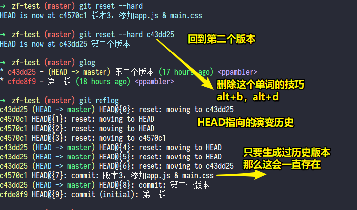
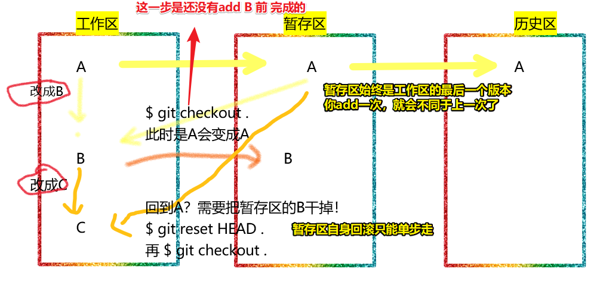

# 05-关于Git的回滚

## ★代码回滚

### ◇为什么需要？

1. 代码被提交到了历史区，但此时发现工作区的代码是有bug的
2. 代码被提交到了暂存区，但此时发现工作区的代码是有bug的

### ◇代码回滚操作

- `git checkout .`：暂存区 -> 回滚 -> 工作区（一旦回滚，工作区内容无法恢复，即归0） -> `.`表示所有文件
- `git reset HEAD .`：当前暂存区内容 -> 回滚到 -> 上一个暂存区（其实就是把当前的给删了） -> 目的 -> 把上一个暂存区内容回滚到工作区 -> **用得很少** -> **只能一个个撤，不能跳到某个版本号**……
- `git reset --hard 版本号（一般是7位）`：历史区 -> 回退到 -> 某一个版本 -> 副作用 -> 强制把暂存区和工作区都变成回退后的版本 -> **用得很多** -> 注意，这还可以回去的，只要曾经生成过历史版本，那么这个**历史版本就会一直存在**……
- `history > xx.txt`：把你在这个bash里边敲过的命令记录到这个xx.txt文件里边去，说白了，历史上你敲过的命令，都会写如到这个xx.txt里边去 -> **挺好用的**，因为可以**跳级拷贝**一些命令，而不是一直摁「上方向键」，然后找到所需要的命令

> 在实际工作中，我们改错了代码（工作区），一般是从历史区回滚撤回，而不是在暂存区

对了，工作区归0操作还可以直接这样：`git reset --hard` -> 直接回退到此时head指向的版本……

对了，如果你回退版本后悔了，忘记了之前的版本号，那么你可以这样：`git reflog`：

测试上边这三个操作：

## ★让你提升命令行效率的 Bash 快捷键

- `Ctrl + l`：清屏

➹：[让你提升命令行效率的 Bash 快捷键 [完整版] · LinuxTOY](https://linuxtoy.org/archives/bash-shortcuts.html)

