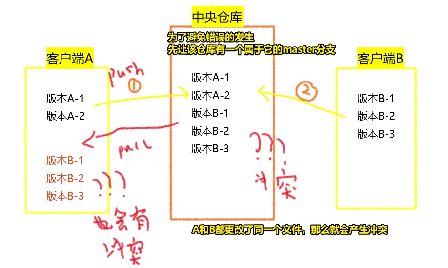
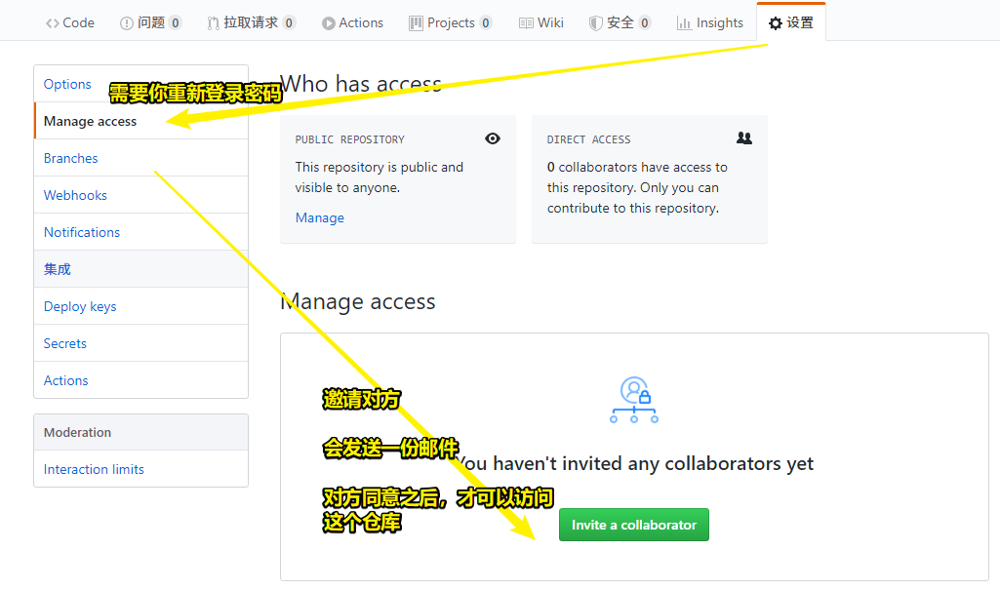
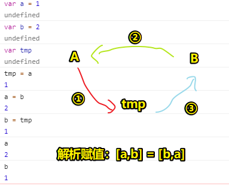

# 06-团队协作开发的基础流程

引子：

前5篇，讲的都是个人开发，而在真实项目里边，则是团队协作开发 -> 每个人都需要拿到其它小组成员的代码，因此需要一个中央仓库来做这件事……

中央仓库的创建 -> 一般由团队leader来搞

## ★中央仓库

- 大公司 -> 有自己私有的用作中央仓库的服务器
- 小公司 -> 开源平台 -> GitHub、Coding

### ◇了解有了中央仓库后，这团队协作开发是怎样一个基本流程

有客户端A、客户端B、中央仓库

- A -> 此时有两个版本A-1、A-2
- B -> 此时有三个版本B-1、B-2、B-3
- A -> `git push origin master` -> 把本地历史区中的信息**推送**到「中央服务器」上
- B -> 同上 -> 中央仓库会存在潜在问题 -> 代码冲突
- A -> `git pull origin master` -> 让中央仓库中的信息和本地仓库保持同步（**拉取**） -> A这个本地仓库同样会存在潜在问题 -> 代码冲突



## ★团队协作开发

### ◇基础流程操作

#### 1）创建中央仓库

可基于GitHub、Coding来创建 -> 注意：最好不要创建空仓库，因为空仓库里边咩有任何分支，只有你提交了一次历史信息才会生成master分支

有了中央仓库，我们还得把开发者都列入到这个仓库的开发群组当中去 -> 授权 -> 这样一来，每个开发者都可以用自己的github账号来操作这个仓库了



当然，也可以不这样做，让所有开发者用统一的一个账号来搞也可以，对了，为了防止不知道是谁提交的代码，我们需要让每一个客户端都在本地的Git全局配置里边，设置和该开发者的GitHub账号相同的用户名和邮箱（这里表示有疑问……难道每个开发者的电脑都绑定了leader给的账号吗？）

#### 2）创建客户端本地仓库

一个开发者就是一个单独的仓库 -> 让本地仓库和远程仓库保持关联，这样才可以实现后续的信息同步

``` bash
# 创建本地仓库
git init

# 让本地仓库和远程仓库保持关联,这样才可以实现后续的信息同步
git remote add origin '远程仓库Git地址'

# 查看连接信息（origin是连接的名称，一般都用这个名字，当然，你自己可以随便设置哈！）
git remote -v

# 移除本地仓库和远程仓库的连接
git remote rm origin

# 更新连接通道
git remote update origin
```

对了，还有更简单的方式完成以上工作：

只要把远程仓库clone到本地，那么这就相当于是创建了一个本地仓库，而且还自动建立了连接，以及把远程仓库中的内容也同步到了本地

``` bash
git clone '远程仓库地址（ssh）' '本地仓库文件夹名字（不写默认是这个远程仓库名）'
```

#### 3）各自 和 中央服务器同步信息

- 推送 -> `git push origin master` -> 每一次push之前最好都pull一下，毕竟如果有冲突的话，就会报错了，所以先在本地pull一下处理一下冲突，然后再push
- 拉取 -> `git pull origin master`

### ◇测试不冲突这种情况

不冲突 -> 客户端A和B，不是操作同一个文件，那么这就永远不会涉及冲突的问题 -> 假如加上老大，这个team总共6人，老大给任务，每个人完成一个独立的模块，这5个人所弄的代码不会影响其它人所写的代码……

## ★小结

- origin就是我们遵守约定给远程仓库起的名字 -> `git push origin master` -> 表示push到远程仓库的master分支上！
- 如果本地仓库与远程仓库内容不一致，那么这会无法pus代码，因此需要先拉取远程仓库的代码，然后再push
- 一个仓库是否有分支？得要这个仓库生成历史版本记录才会有，当你往一个空的远程仓库pull代码时，是会报类似没有master这样的错误… -> 而这也是为啥，我都会先初始化一个远程仓库，然后在本地初始化提交一次……
- 在clone远程仓库前，请保证这个远程仓库是有master分支的 -> 空仓库的意思是说咩有master分支 -> 所以可以在GitHub里边init 一个 README -> 不然，你在clone了两份空仓库到两个客户端A和B，A push 了一份代码之后（此时远程仓库是A的master分支），不管 B pull 还是 push都会报错……因为B在clone时是个空仓库，而此时的远程仓库因为有了A的push，导致有了历史版本，即有了属于A的master分支……一个是有着B master分支的仓库，一个是有着A master分支的远程仓库，显然这会冲突哈！ -> 总之先确保有个属于中央仓库的master分支……即你先创建个README.md之类的文件初始化一下，当然，如果你是个人solo开发那就不需要了……
- 不管是本地的仓库push到远程仓库，还是本地的仓库pull远程仓库，其本质都是在同步两个仓库信息
- 中央仓库 或者说是 远程仓库，给我的感觉就像是编程时，如何交互两个变量的值一样，当然，有解析赋值，并不需要第三方……不然，就得准备一个临时变量，来搞个圈圈
  
  

- 在日常开发中leader给我们的仓库，已经是有很多内容的了，直接clone下来即可，不需要理会上边提到空仓库问题……


