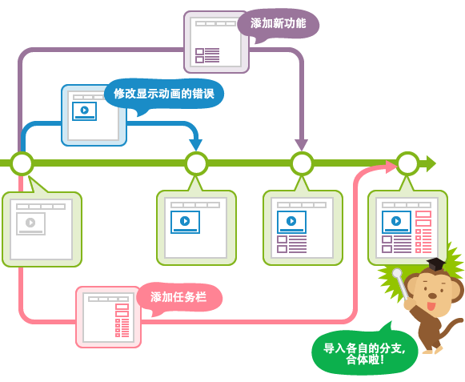
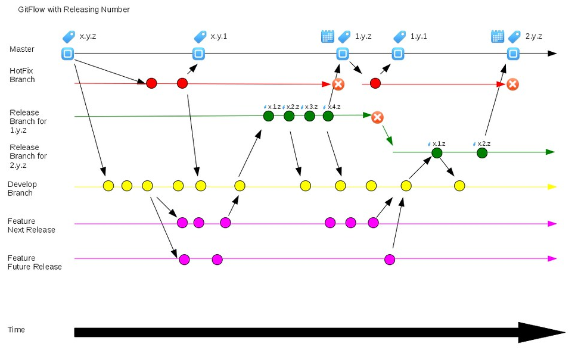
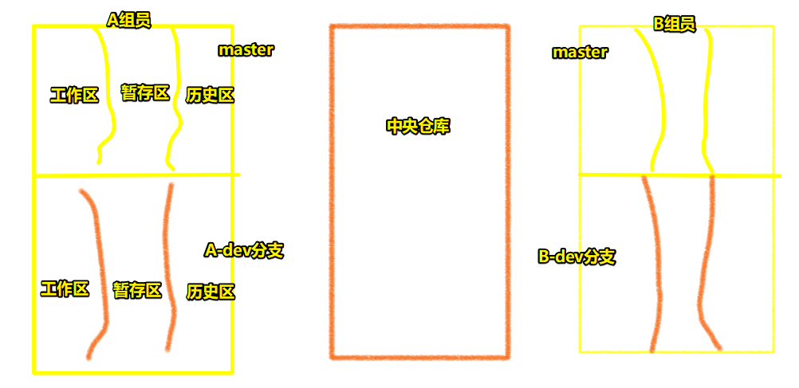

# 07-分支处理和团队协作

## ★引子

之前的开发只涉及到master分支，并没有提到如何创建其它分支，以及如何使用其它分支、为何使用其它分支

在真实项目开发里边，有多种团队协作模式，但常用的就两种：

- 无分支管理模式 -> 不是一个分支都咩有，而是就只有一个主分支master来管理我们的代码 -> 涉及到冲突合并
- 单独分支管理模式 -> 

## ★无分支管理模式

场景：xx项目有个`utils.js`文件，A开发者改了这个文件，而B开发者也改了这个文件

我们知道不同文件不会发生冲突，而同一个文件发生冲突则分为两种：

1. 同一个文件里边的同一行发生代码冲突
2. 同一个文件里边的不同行发生代码冲突

### ◇模拟过程

1. A -> 新建一个 `utils.js` 并写上5行代码 -> add  -> commit -> pull -> push -> 中央仓库（多了个`utils.js`文件）
2. B -> pull -> 得到 `utils.js` -> update该文件（只是追加操作、追加了两行，第5行是空行，第6行是有代码的，目前总共有7行） -> add、commit -> push -> 中央仓库（`utils.js`被B开发者修改了）
3. B改了utils.js，但A不知道，也不知道远程服务器的版本已经更新了，于是A在update工作区代码时没有pull，这意味着该文件还是5行代码 -> A在该文件的第6行追加了代码 -> add、commit -> pull -> 发生冲突 -> 打开utils.js（多了一些B开发者操作的信息） -> 对比A自己的与B的代码，手动改冲突 -> 选择两个留，还是去掉一个，还是两个都不要
4. B -> 不知道中央仓库更新了 -> update utils.js -> 改第一行代码 -> add、commit -> 不pull直接push会报错，然后告知你要push之前先pull -> pull -> 报错 -> 同一行代码冲突 -> 选择要中央的，还是要自己修改的这个 -> 留本地的 `ESC、:wq`，留中央的直接`:q` -> push

### ◇小结

无分支管理模式 -> 解决冲突简单

所有人使用的都是master分支，那么每天上班的第一件事，以及每天提交自己代码的时候 -> 那么第一件事就是先拉取

``` bash
git pull origin master
# 一顿操作
git add .
git commit -m ''
git push origin master
```

冲突合并：

- 文件有冲突 -> 但这不是同一个文件里边的同一行代码
- 同一个文件 -> 相同行代码冲突

同一行代码冲突：

- 在提示的冲突命令行中同意即可 -> `ESC、:wq`（回车） -> push

不是同一行代码冲突：

- pull时 -> 提示尝试合并失败 -> 手动把代码进行合并 -> push

非黑即白 -> 要么敲命令（同一行冲突） -> 要么手动合并（不同行冲突） -> 可是这两种一同出现了呢？

无分支管理冲突 -> 超简单 -> 大公司也会用这种方式 -> 毕竟老大只要在分配任务的时候，不要让组员都操作同一个文件就贼鸡儿简单，无需要理会切换分支的问题了……

一般真实项目用一个分支其实绝对是够的 -> 不然，假如leader任务分配不好的话，很容易发生组员之间的打架，如你TM改了我的代码、我裂开了，昨天写好的代码不知道被哪个王八蛋给改了，不过幸好我本地有版本管理……

总之，公共部分让leader写，当然这公共部分平时也是很少频繁去修改的……其余的你用了Vue和React，各写各的组件就好了 -> 每个人负责各自的一块就好了……

## ★单独分支管理模式

### <mark>1）pull & 创建分支</mark>

每天第一件事 -> 把远程仓库的master分支内容拉取到本地的master上（注意，push代码之前也是如此） -> 每个人在自己的本地仓库中，先进行分支创建以及切换分支

``` bash
# 查看当前存在的分支 -> * master （ * 表示当前在哪个分支上）
git branch

# 创建一个叫做dev的分支
git branch dev

# 切换到dev分支上
git checkout dev

# 创建并切换到这个分支 -> 做两个操作的命令
git checkout -b dev
```

为啥需要分支？ -> 作为一个临时版本库存在 -> 在分支上开发完一个模块功能才去合并到master分支上 -> 然后再push -> 分支的效果类似于暂存区

分支 -> 相当于是从master分支 或者说是 master主干分了一条树枝出去 -> 我们在本地创建一个分支，该分支就有master主干所有的版本信息了



总之，分支指的是**历史区的分支（基于分支的历史区还可以创建分支）**，我们创建分支就是创建不同的线路，来管理历史版本



你还可以这样看分支：



### <mark>2）在分支上的操作</mark>

正常的开发和提交 -> 所有的操作都是在自己的分支上

### <mark>3）Merge</mark>

把自己在本地分支中搞的内容，合并到自己本地master分支上

``` bash
# 暂存文件 -> 分支有更改，那么就不能直接切换分支，需要把修改的内容暂存
git stash

# 切换到master分支上

# 还原暂时存储的内容
git stash pop

# 把dev分支合并到master分支上 -> 有冲突则按照之前的规则修改
git merge dev
```

### <mark>4）删除本地创建的分支</mark>

如果你想把本地分支提交到远程分支里边去，如这样 `git push origin xxx:xxx`（xxx是分支名），那么你就得保证其它小伙伴用的不是跟你一样的分支名了，当然，给分支起名字时，可以加上自己的用户名前缀 -> 这或许是有团队规范的吧！

删除本地分支的目的：

1. 下一次重新创建本地分支时，可以让分支和master分支统一，即「影分身之术」啦
2. 远程仓库中不记录任何的分支信息，防止冲突

``` bash
# 删除dev分支 -> 删除时需要先切换到其它分支上才可以删除，即你不能在当前的分支上，删除当前分支
git branch -D dev
```

### <mark>5）push</mark>

将本地master分支中的内容提交到远程仓库中

## ★知识点总结

#### 1、`git clone '远程仓库地址'`

把远程仓库clone到本地 -> 本地自动和远程仓库建立连接，自动把远程中的信息同步到本地，这样本地也是一个单独的仓库了

> 建议远程仓库不要是空的，至少有一个master分支哈！ -> 说白了，你要无中生有commit一次内容哈！

#### 2、`git pull origin master`

把远程仓库master中的信息同步到本地仓库master中

#### 3、`git push origin master`

本地仓库master中的信息 -> 同步到 -> 远程仓库master中

> 需要使用github的用户名密码来进行权限校验（想想你随便在github上clone了一个仓库到本地，你看看你能不能push内容到人家的仓库里边去「显然不能哈！」） -> 一般都是组长在远程仓库中把组员的账号都放到了小组中 -> 这样组员用自己的账号也有权限操作这个仓库了，注意，你最好在本地的Git全局配置中把用户名和邮箱修改为和你被邀请的github账号是一样的信息

#### 4、如果有冲突

1. 同一文件中单行冲突 -> 进入到编辑框模式，`i` -> `ESC` -> `:wq`
2. 同一文件中不同行冲突 -> push前会把两份代码都保存在本地文件中，自己手动去选择要哪一个，改完后重新提交即可

#### 5、分支创建

1. `git checkout -b xxx` -> 创建分支并且切换到指定分支下（可以把本地master中的历史信息同步到新创建的分支中）
2. `git branch` -> 查看当前存在的分支
3. `git branch xxx`
4. `git checkout xxx`
5. `git branch -D xxx` -> 删除分支

#### 6、合并

1. `git merge xxx` -> 把`xxx`分支的历史信息合并到当前分支下
2. `git stash` -> 切换到master分支上 -> `git stash pop`： 在切换分支之前，有一部分信息并咩有提交成为历史版本，为了防止信息的丢失，我们需要先使用`stash`保存，然后再基于 `stash pop` 还原

> stash是存放之意

## ★小结

- 记住这个过程中涉及到Git命令（都是常用命令）：生成历史版本 -> 代码回滚 -> 远程仓库提交 -> 团队协作
- 一些公司团队协作方式：
  - 远程仓库有组员各自管理的分支，如A-dev -> 组员在本地拉取远程分支，如A组员拉取A-dev -> A组员push信息给远程A-dev -> leader收到通知 -> 统一合并各组员push过来的分支到master上
  - 老师喜欢用简单的无分支管理模式


