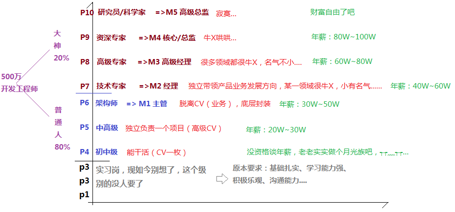

# 01-学习技巧

## 1、王老师讲的Vue？

因为王老师比周老师更熟Vue……

## 2、如何成为一名优秀的前端开发工程师？（给自己一个方向、目标）

> 看到这张图就能明白他人和自己，正处在什么段位了……

## 3、周老师的学习技巧？

- 知其然而知其所以然
  - 熟练扎实的基础知识（思维导图）
  - 了解其底层运行机制
  - 研究源码
  - 尝试自己写开源内容
- 温故而知新可以为师矣
  - 养成写笔记/写博客的习惯
  - 养成项目总结的习惯
  - 常复习和梳理
  - 多看博客等

周老师最近几年都会抽出点时间去看国学：

> 《论语·为政》中孔子对于自己在30岁时所达到人生状态的自我评价。原文是子曰：“吾十有五而志于学，三十而立，四十而不惑，五十而知天命，六十而耳顺，七十而从心所欲，不逾矩。” 虽然不是人人都能做孔圣人，但后人往往把孔子的这些自我评语作为人生不同阶段所应达到的生活理想状态。

老师认为「四十知其然，而五十知其所以然」（其实我认为是三十知其然，而四十则是知其所以然）

1）知其然而知其所以然

我们学一个东西 -> 要做到知其然而知其所以然 -> 那么如何做到「知其然而知其所以然」呢？

1. 对基础知识掌握得非常扎实 -> 何为扎实呢？ -> 简单来说，看看自己能否把知识点合理地串联起来？如箭头函数、响应式数据这两个知识点，你能否合理地把它们穿插到一起？ -> 很多时候来了一个需求，我们用中文来写就能写出来，但用代码，一敲就忘…… -> 你要做到「手要比脑子快」，即潜意识行为或者说是肌肉记忆 -> 如来了一个需求，思路瞬间过去了，思路就有了，然后手就可以开始写了（还能做到边聊天边写代码），而且是把代码整体写完之后，才去看看有无bug…… -> 可见，你脑子里边已经形成了知识体系脉络，对知识点都非常熟悉，能迅速根据问题，定位到需要哪几个知识点就能把这个问题解决，在写代码实现的过程中，能够有机地把这些知识点给串联起来……
2. 了解其底层运行机制 -> 为啥代码这样写，会这样运行呢？ -> 就像一个好奇宝宝问这问那一样 -> 目的同样是有效地把握知识点……
3. 研究源码 -> 如类库、框架、UI组件、UI插件 -> 通过学习大神的东西，来提高自己的技能
4. 准备好以上三点之后 -> 就可以准备自己的开源内容了 -> 开源内容指的是什么呢？ -> 除了给自己用以外，还能给别人用 -> 开源的东西一开始可能只是自己用 -> 之后同事用 -> 越用越好用 -> 小组、团队用 -> 自家公司用 -> 周围的公司用 -> 中国都在用 -> 整个世界都在用 -> 一步一步成长为别人眼中的大神  -> 敢于去尝试写一个开源东西（无关大小），哪怕被人喷…… -> 这就是成长

2）温故而知新可以为师矣

