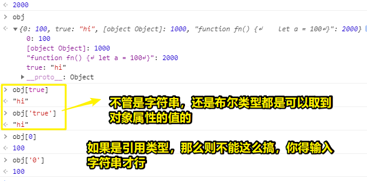
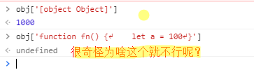
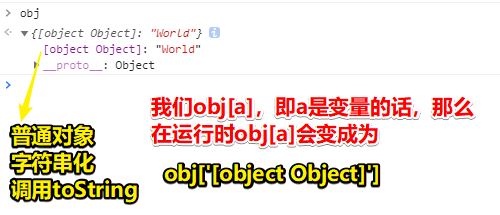
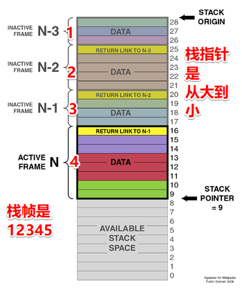
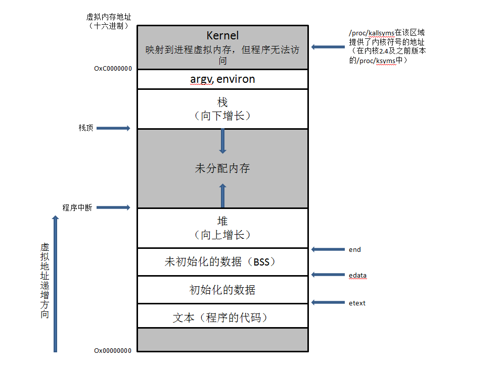

# 02-关于数据类型的一点基础知识

## ★有哪些数据类型？

- 基本数据类型（值类型）
  - Number
  - String
  - Boolean
  - Null
  - Undefined
  - Symbol（唯一值，项目中用得不多）
  - BigInt

> Null 和 Undefined 可以规划为特殊的数据类型​​

- 引用数据类型
  - Object（具体某个「类」的实例）
    - {}
    - []
    - /^$/
    - new Date()
    - Math
    - ……
  - Function（把这个单独拿出来，是因为Function它有很多独有的概念，区别于一般的对象，总之它属于对象，但过于特殊所以就把它提出来细讲一番 -> 函数它扮演着几种角色哈！）

## ★Number

#### 1、哪些值属于Number这个类型的？

- 0、-5、5、0.5、NaN（特殊的值，不是一个有效数字，但它属于Number类型的）
- Infinity、-Infinity -> 项目里边基本没用过

#### 2、检测这个`NaN`值是啥数据类型的方式？

- `typeof NaN` -> 字符串`"number"`

#### 3、检测这个变量值是不是有效数字？

- NaN == NaN 、NaN == false -> false（不能用这种直接比较的方式来检测，因为NaN等于谁都是false）
- isNaN(0)、isNaN('10') -> false（不是有效数字？假的） ，isNaN('A') -> true（不是有效数字？真的），is只是一个用于标识返回值是个布尔值罢了！

#### 4、何时会出现这个NaN?或者说是为何会出现NaN？

- 把其它数据类型转化为Number类型的时候，不能转换那就是NaN
- 而转换的姿势有
  - parseInt/Float、Number()、数学运算、一些其它比较的时候
  - 可见NaN出现的频率还是比较大的，如从服务器拿到数据是一种格式，然后到页面渲染它又是一种格式，我们需要转换它，所以有很大几率会出现NaN

#### 5、isNaN调用的是哪个方法做的隐式转换？

- Number()
  - isNaN('12px') -> true
  - Number('12px') -> NaN
  - isNaN('10') -> false

#### 6、isNaN的读法？

- 是NaN吗？

#### 7、怎么把其它类型转成Number类型？

- 课下自己总结 或者 用到时再去查

## ★Object

### ◇对象的属性名一定是字符串吗？

不一定哈！可以是布尔值、数字，但一定不能是引用类型值，默认会把引用类型值转换为字符串进行处理

``` js
let a = {
    x: 100
}

let b = function fn() {
    let a = 100
}

let obj = {
    0: 100,
    true: 'hi'
}

obj[a] = 1000
obj[b] = 2000
```

结果：



当然，关于引用类型的属性，你用`obj[a]`、`obj[b]`是可以取到值的，但是就是不能写个对象字面量，以及函数字面量



> 对象转化为字符串 -> 调用的是`toString`方法

一道面试题

考察：

1. 对象属性名不能是引用类型值
2. 把对象转换成字符串会变成啥

``` js
let a = {
    x: 100
}
let b = {
    y: 200
}

let obj = {}
obj[a] = 'Hello'

obj[b] = 'World'

// 问 true or false

console.log(obj[a] === obj[b])
```

结果显然是 `true` 呀

为啥会这样呢？

我们：

- `obj[a] = 'Hello'`  <=> `obj['[object Object]'] = 'Hello'`
- `obj[b] = 'World'`  <=> `obj['[object Object]'] = 'World'`



或许你会疑问：

> 0 和 true 是不是也调用了toString？

老师认为这是没有转的（看了大量资料），当然，**不管你按哪个理解，结果都是一样的**，总之，这目前没有一个权威的解释说哪个是对的！

题外话：

- 对象toString是调用Object上的toString
- 数组toString则是Array上的toString

## ★数组

### ◇数组是特殊的对象

怎么个特殊法？

我们知道既然数组是对象，那么它一定有键值对，但它的属性名都是数字呀！

每个数字（也叫索引）代表位置，天生自带一个length属性，代表长度

满足键值对的方式，所以它是一个对象

但是它相对普通对象的特殊性在于：

- 属性名是有规律的，逐级递增的，代表位置的索引 -> 结构具有特殊性

## ★Q&A

### 1、什么是stack？

> 作为抽象数据类型来看的话，stack就是后进先出的，想想你叠了10个菜碟子，拿到的时候肯定是先从上边的拿，而不是从最下边的拿

在计算机里边，stack有多种应用场景。

我想了解基于Stack的内存分配是怎样的：



具体点（进程内存布局）：



➹：[Stack的三种含义 - 阮一峰的网络日志](https://www.ruanyifeng.com/blog/2013/11/stack.html)

➹：[Stack - Wikipedia](https://en.wikipedia.org/wiki/Stack)

➹：[Stack-based memory allocation - Wikipedia](https://en.wikipedia.org/wiki/Stack-based_memory_allocation)

➹：[进程结构和内存布局 - Kjing - 博客园](https://www.cnblogs.com/jingyg/p/5069964.html)

➹：[浅谈程序的内存布局 - 知乎](https://zhuanlan.zhihu.com/p/77122692)

➹：[深入理解JSCore - 美团技术团队](https://tech.meituan.com/2018/08/23/deep-understanding-of-jscore.html)

### 2、在JS里边有哪些数据类型？

➹：[【JS进阶】你真的掌握变量和类型了吗 - 知乎](https://zhuanlan.zhihu.com/p/67243929)

➹：[原始数据 - 术语表 - MDN](https://developer.mozilla.org/zh-CN/docs/Glossary/Primitive)

➹：[基本数据类型和引用类型的区别详解 - SegmentFault 思否](https://segmentfault.com/a/1190000008472264)
### 3、什么叫不可变的原始值？（JS语境下）

所谓的不可变指的是，你搞了一个原始值，你觉得你用了xxx操作改变这个值，但其实你这根本就没有改变：

``` js
// 例子1
var str = "abc";
str[0] = "d";
console.log(str) // abc  

// 例子2
var str2 = "abc";
str2 = "dbc";
console.log(str) // dbc
```

> 赋值开辟了一个新的内存空间，注意，如果你把str2的值赋给str3的值，那么在Chrome里边为了节省内存，它们其实用的是同一个值，即指向的是同一引用！

➹：[js的存储方式杂记 - 知乎](https://zhuanlan.zhihu.com/p/113675221)

➹：[如何理解 String 类型值的不可变？ - 知乎](https://www.zhihu.com/question/20618891)

➹：[如何理解js中基本数据类型的值不可变_javascript_WinstonLau的博客-CSDN博客](https://blog.csdn.net/WinstonLau/article/details/88754704)

➹：[理解JavaScript：不可变的原始值与可变的对象引用](http://laichuanfeng.com/study/javascript-immutable-primitive-values-and-mutable-object-references/)

### 4、JS检测数据类型有4种方式，那么它们各自的优缺点是啥呢？如何封装一套万能的检测数据类型的方法呢？

## 5、有哪些值是属于Number类型的？

➹：[数字类型](https://zh.javascript.info/number)
