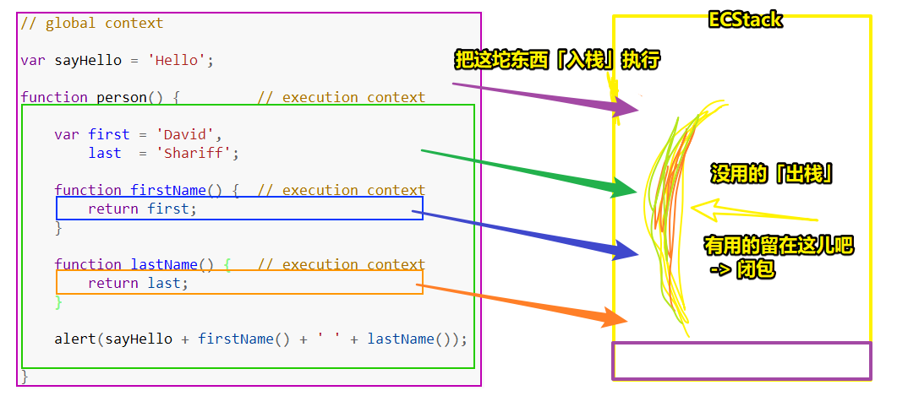
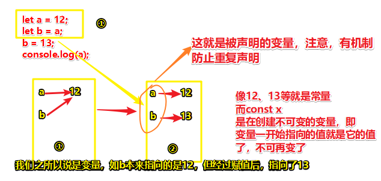
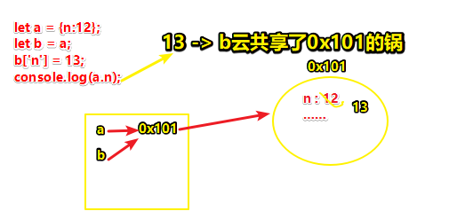
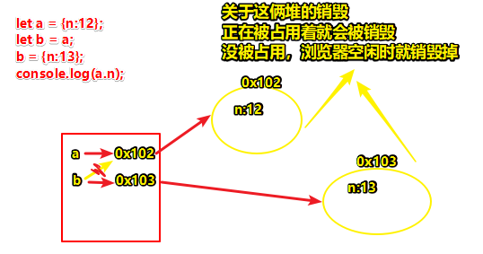

# 03-浏览器中堆栈内存的底层处理

## ★作业

### <mark>1）整理对象和数组相关的方法 -> 如何整理？</mark>

``` js
Object.prototype
console.dir(Object)
Array.prototype
console.dir(Array)
```

> dir -> 查看一个对象的详细信息

API怎么使用 -> MDN -> 看到该API的**语法**，以及**作用**

为什么要整理它们的方法？

因为现在我们用Vue和React都是用数据渲染视图，这意味着我们需要操作数据，而**最常见的数据、最难操作的数据，无外乎就是数组和对象**

所以你必须得把常用操作数据的API都给弄熟了，唯有弄熟了，你才能对服务器传过来的数据，然后想出各种方案去处理它们……不然，你不熟的话，你真的不知道该如何处理这些数据……

如何才算弄熟呢？

一提到数组，你就想到它的CRUD数组元素的方法、遍历迭代数组元素的一些方法、类方法

**对基础知识非常熟 -> 才会有项目经验、编程经验** -> 如果你不熟，你很难想到xxx问题的解决方案，即便想到也要想个半天，你看半天过去了，你的代码一行都还没敲，这哪会有什么经验呀，更别提什么项目经验了 -> 人家3天一个项目，你写个半个月、1个月……

非常熟 -> **潜意识**里看到这个东西就知道用什么API去处理这个数据…… -> 只有把基础知识搞扎实了，才能去搞一些逼格高的项目

> 非常熟 -> 确实，这一点我是没有想过的，我一直以为理解了就算了，但其实这还不够呀 -> 如果你对基础知识不熟，那么你是很难有思路去解决一些问题的……而且这会浪费很多时间……时间浪费了，技术成长就会非常慢……
> 
> 我终于明白为啥之前有个同学背了大量的API，当时的我嗤之以鼻，认为用到了再去查就好了，其实当时我没有意识到「用到了」这三字，如果你不熟悉API的作用，那么你怎样确定你该去查哪个API呢？ -> 总之，**你要背熟API的作用，至于语法什么的，用到了再去查就好了**！

## ★为什么要分为基本数据类型和引用数据类型？

> 可以把一些面试题作为引子，来引出接下来要讲的内容

如这样：

``` js
/*百度面试题*/
let a = 12;
let b = a;
b = 13;
console.log(a);

let a = {n:12};
let b = a;
b['n'] = 13;
console.log(a.n);

let a = {n:12};
let b = a;
b = {n:13};
console.log(a.n);
```

``` js
/*阿里面试题*/
let a = {
    n: 10
};
let b = a;
b.m = b = {
    n: 20
};
console.log(a);
console.log(b);
```

``` js
/*360面试题*/
let x = [12, 23];
function fn(y) {
    y[0] = 100;
    y = [100];
    y[1] = 200;
    console.log(y);
}
fn(x);
console.log(x);
```

## ★一些概念

- 编译器（把代码解析成为浏览器看得懂的结构，一般结构指定是AST这颗树的结构，Babel的底层原理就用到了AST，ES6 -> ES5）
  - 词法解析
  - AST抽象语法树
  - 构建出浏览器能够执行的代码
- 引擎（V8/webkit内核）
  - 变量提升
  - 作用域、闭包
  - 变量对象
  - 堆栈内存
  - GO、VO、AO、EC、ECStack
  - ……

> 白鹭引擎是基于V8引擎的二次开发，即 Egret Engine 是一款使用 TypeScript 编写的 HTML5 游戏引擎，包含渲染、声音、用户交互、资源管理等诸多功能
> 
> 简单来说，我们写的JS代码 -> 词法解析+语法解析+构建AST抽象语法树（想想Schema，我们写的代码，即字符串，需要把其解码成AST） -> 运行时 -> 基本类型+内部类型

简单解释编译器的处理过程：

如：

``` js
var a = 12;
```

xxx拿到这个，按照一定规则，把无用的，有用的，给拎出来，注意有些字符在某种环境下是有用的，而另一种环境下则是无用的……

把有用的拎出来后，就语法解析，构成一个AST树 -> 抽离结构，让浏览器的V8引擎可以识别然后执行

整个系列课程接下来主要讲的是：

JS运行时这部分内容，即引擎这部分内容

JS运行时搞懂了（知其然） -> 编译器（AST） -> C/C++ -> 汇编语言（创造语言） -> 编译器（AST） -> JS运行时（再看JS运行时，知其然知其所以然）

从高级CV -> 到搞点能给人CV的东西……

## ★运行时

### ◇ECStack

浏览器拿到一个可执行的代码结构，有了结构，那么接下来就需要有一个可以执行代码的环境——ECStack

> ECStack：Execution Context Stack 执行环境栈 -> 栈内存

栈内存 -> 内存就是一个地儿的意思 -> 栈内存 -> 目的：提供了一个供代码执行的环境

### ◇EC

> EC：Execution Context 执行环境（执行上下文） -> 注意，这可不是作用域哈！

EC涉及到两个概念：

- 全局EC -> script里边的内容
- 局部EC -> 函数里边的内容

你**把这俩概念具象化成类似盒子之类的东西（都装有代码）**，同样，**你把ECStack也具象化成一个类似盒子之类的东西（提供一个环境用来执行代码的）**

浏览器需要把创建的上下文（盒子）压缩到ECStack这个大盒子里边去执行 -> **进栈** 

执行完：

- 有的上下文就没有了，那么此时就得「**出栈**」
- 有的还有用，那么会把其压缩到栈底，而这也就是所谓的**闭包**



> 如果你在面试的时候，有人问到了底层机制，那么你要说出这些专业术语

### ◇GO

> GO：全局对象(Global Object)

注意，这是在浏览器的GO，而不是Node.js 里边的

浏览器天生自动init一个GO，然后赋值给了window，即`window = {xxx:xxxx……}`

当然，有了这些内置的对象还不够，还要有自定义的，如 `var a = 12;`，那么这个 `a`就在跑到window旗下了

> 一般现在都是用let、const了，因为用let、const声明的全局变量不会污染window对象

题外话：

关于变量赋值这个操作:

变量赋值分三步走：

1. 创建变量 -> 也叫**声明**（declare）变量 -> 在同一个EC里边声明过一次之后，就不会再次声明了
2. 创建值 -> **基本值直接在栈（执行栈）中创建和存储**，对了，变量名也是栈中存储的…… -> 也就是**开辟内存空间**
3. 让变量和值**关联**起来（赋值） -> 也叫所谓的「defined」即定义，我们赋值一个变量，也叫defined了一个变量，如果没有defined，那么这个变量就是undefined状态

所以 `var a = 12;` 的读法是：

> 声明了一个变量`a`，并定义它的状态为`12` -> 这俩操作都会开辟内存

关于常量？

``` js
let a = 12;
let b = a;
b = 13;
console.log(a);
```



> 变量只能指向一个值，这是一夫一妻制
> 
> 关于基本值，你写了一个常量出来，就会在栈开个内存出来存这个值，如你让 `b = 12;`那么，就会多个12的值，而不是都是指向那个a所指向的12

---

为什么叫引用类型？

``` js
let a = {n:12};
let b = a;
b['n'] = 13;
console.log(a.n);
```

在上边的代码里边：

1. 全局声明一个变量 `a`
2. 创建值 -> 这是引用值？ -> 由于引用值是复杂的结构，所以得特殊处理 -> 开辟了一个存储对象中键值对（存储函数代码字符串）的内存空间 -> 即搞个「堆内存」 -> 注意，所有的堆内存都有一个可被后续查找到的16进制地址 -> 后续关联赋值的时候，是把堆内存地址给予变量操作的

a存储的是引用值，所以这a是「引用类型」的变量



--- 

创建出来的堆能销毁吗？



我们释放一个堆内存，可以这样：

``` js
a = 0
// or
a = null
```

不过前者会明显会占用栈内存，而且也不符合情理，即你给了它一个0值，但又用它。因此我们不会选择它，而是选择后者 `null`（告诉后来看代码的人该变量已GG），而这是 `null`的第一个作用

`null`的第二个作用，需要拿 `undefined`来比较

我们仅仅只声明一个变量，那么表示 这个变量有没有值是不确定的，而如果你在声明变量的时候，给它赋了一个 `null` 值，那么这表示之后我们会给这个变量一个值，只是目前我们不确定该给它什么值比较好

说白了：

- undefined -> 意料之外，给或不给值
- null -> 意料之中，一定会给个值，只是目前不给先

> 在其它语言里边可没有 `undefined`，只有 `null` -> 表示空对象指针

---

连等操作的意思

``` js
a = b= 13
```

表示：

1. 创建个13
2. a指向13
3. b指向13


## ★总结

- 什么叫基础扎实？我之前认为对一些基础的东西理解了，就算基础扎实了，其实不然啊！这还有个熟练度的问题，如果你不熟悉，那么理解这些基础的东西是很鸡肋的……我之前在「洋葱学院」看了1年级的数学教学内容，我就觉得启发很大，而这侧面反映出，我的数学基础确实不扎实……而这意味着你以后的数学学习，都是云里雾里的……
- 手中无图，心中有图 -> 关于变量在内存中的描述

## ★Q&A

### 1、变量名是如何存储的？毕竟变量名也是数据吧！而值就不用多说了

对于带 eval 的动态语言来说，变量名是储存的，比如 JS 的每个 Environment Record 就存了所有的局部变量，以及访问链。

> Environment Record -> ECMAScript Specification Types -> 只存在于规范里的抽象类型

而

对于 C/C++ 这种编译成机器代码的语言：

变量名不需要储存，所有的局部变量读写都会变成（栈地址 + 偏移）的形式。

允许子程序嵌套的语言比如 Pascal/ML，读写非局部变量会经由访问链（Access link）去读其他的栈帧，但是变量名也会变成一个索引（整数），不会在内存中出现的。

> 也就是说在JS里边，变量名是占用内存空间的咯！

➹：[变量名储存在哪里，变量的储存机制是什么？ - Belleve的回答 - 知乎](https://www.zhihu.com/question/34266997/answer/60413097)

➹：[如何阅读《深入理解计算机系统》这本书？ - 知乎](https://www.zhihu.com/question/20402534)

### 2、内存地址应该用几位数表示？

只要0x开头，至少有3个数值起步就好了，如`0x101`

一般都是写7位的，如 `0xe60e02f`：


➹：[内存地址是12位16进制数，那么对应的指针需要多少字节？ - 知乎](https://www.zhihu.com/question/27265748)

➹：[深入理解计算机系统（五）：信息的存储和表示 - 知乎](https://zhuanlan.zhihu.com/p/37484000)

➹：[第二篇——信息的存储与表示（1） - 知乎](https://zhuanlan.zhihu.com/p/37870197)

➹：[内存地址空间为何用十六进制表示(pamp分析基础)_c/c++_一叶舟的专栏-CSDN博客](https://blog.csdn.net/wang_cyi6/article/details/21884395)

### 3、null和undefined的区别？

- null 表示一个值被定义了，定义为“空值”；
- undefined 表示根本不存在定义。

所以设置一个值为 `null` 是合理的，如 `objA.valueA = null;`

但设置一个值为 `undefined` 是不合理的

话说null占内存吗？

应该会占用内存，可我们用null并不主要是因为内存的原因：

- 用完的变量设为NULL有助于java的gc更早的将无用的内存收回
- 是个略胜于无的好习惯，更大的作用也许在于，**提醒后来看代码的人此变量已经无效了**


➹：[undefined与null的区别 - 阮一峰的网络日志](https://www.ruanyifeng.com/blog/2014/03/undefined-vs-null.html)

➹：[JavaScript 中 null 和 undefined 的区别？ - 知乎](https://www.zhihu.com/question/56841737)

➹：[java 里对象使用后设置为NULL会减少内存占用吗？ - 知乎](https://www.zhihu.com/question/21356272)

➹：[在Java中，引用数据类型占内存吗？ - 知乎](https://www.zhihu.com/question/21868528)


