# 04-复习上节课的作业题「详细讲解：VO、AO、GO以及一些其它细节知识点」

> 2020年5月21日

## ★作业

### ◇题一

``` js
/*阿里面试题*/
let a = {
    n: 10
};
let b = a;
b.m = b = {
    n: 20
};
console.log(a);
console.log(b);
```

画图得结果：

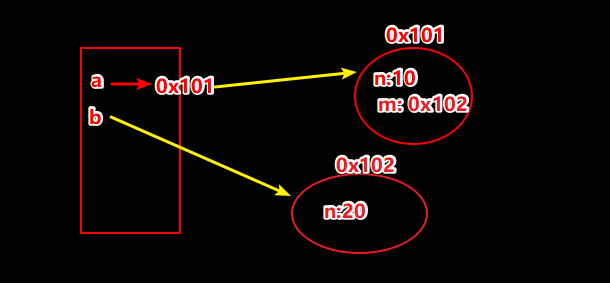

> 关键点，连等操作，右左中……

程序实际执行结果：

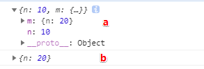

疑问：

> 如果出现多个连续赋值操作呢？那这执行顺序又是咋样的呢？

### ◇题二

``` js
/*360面试题*/
let x = [12, 23];
function fn(y) {
    y[0] = 100;
    y = [100];
    y[1] = 200;
    console.log(y);
}
fn(x);
console.log(x);
```

画图得结果：

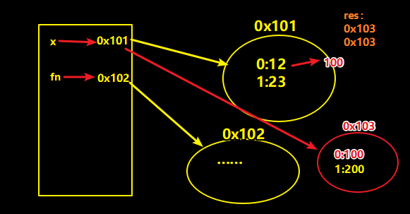

实际结果：

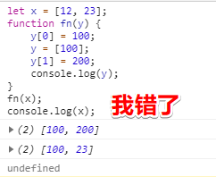

正确分析：

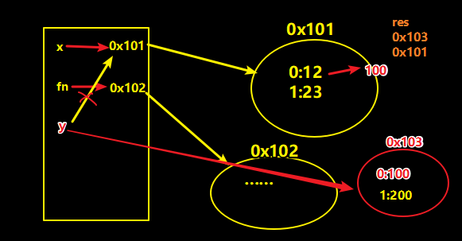

> 你要在栈中搞个局部变量哈！

### ◇老师解析

题一：

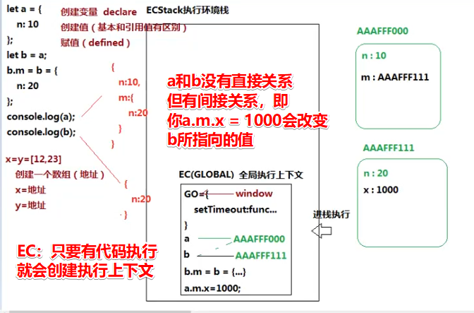

1. 拿到可执行的代码
2. 创建ECStack执行环境栈
3. 要让全局代码执行 -> 需要先创建一个全局执行上下文 -> 为啥要这样做呢？ -> 这是为了防止冲突呀（想象成把一个细胞扔到一个地方去执行）：
   
   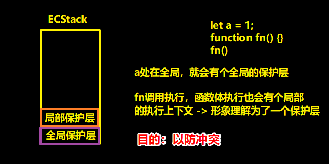
   
4. 创建EC（Global），简写EC（G） -> 入栈执行 -> ECStack
   1. EC（G）下有个GO -> `GO = { setTimeout: ()=>{}……}` -> 有很多内置的对象 -> 我们的window对象就是指向这个GO的 -> 细节：在全局下用let声明的变量，同样是全局变量，只是没有放到GO旗下罢了……

> 只要代码执行就会创建一个执行上下文 -> 这是浏览器V8底层帮我们干的事儿

> 对比自己的认识，我没有意识到是把一个东西扔到ECStack里边去执行

---

题二：

1. ECStack
2. EC（G）
   1. GO
   2. VO -> 变量对象 -> 只有一个作用，那就是存储当前上下文里边的变量

普通对象、数组在堆里存储的是键值对，而函数则是存两个东西：

- 一个是具有函数特点的**代码字符串**，如：
  - `'y[0] = 100';……`
- 一个则是具有对象特点的**键值对**，如：
  - `length:1` -> 这个函数的形参个数为1
  - `name:'fn'`
  - `prototype:0x101` -> 面向对象常用
  - `__proto__:0x102`
  - `……`

> 代码字符串？我们写的整个js文件就是代码字符串，你把函数里边的代码也可以看作是一个小型的js文件

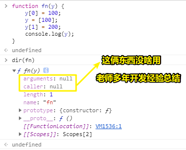

有人问，为啥没有看到代码字符串？

> 那是因为，dir查看一个东西，只是把它当作是对象来查看，而那些代码字符串，在控制台里边是看不到的，而是偷偷地在某个地方自我保存起来了，总之，我们其实是看不到堆里边的内容，但是这控制台做了处理，让我们看到了堆里边的键值对……

还有有caller就代表是函数吗？

> 这个不一定，arguments对象里边也有caller，我们也可以给个普通对象添加个caller属性

话说，函数执行的目的是啥？

> 简单来说，就是把哪些字符串代码给执行一遍

既然执行，就得跑到ECStack里边去执行

而每一个函数的执行都会形成一个全新的执行上下文

> 注意：JS是单线程的，这意味着一次只能执行一个东西，即一段时间内只能处理一件事，不能边吃饭边看电视

回过头来的，我们的代码是这样的：

``` js
/*360面试题*/
let x = [12, 23];
function fn(y) {
    y[0] = 100;
    y = [100];
    y[1] = 200;
    console.log(y);
}
fn(x);
console.log(x);
```

代码在执行到一半的时候，就得跑去执行fn这个函数里边的代码了

此时全局有一个`console.log(x);`还没有执行，而JS是单线程的，不能同时处理函数里边的代码以及全局剩下的 `console.log(x);`，所以这个「全局」上下文就被压缩到ECStack的底部了

总之，ECStack有新的东西进来，那么旧的还有剩余代码未被执行的，就被压缩到了栈的底部

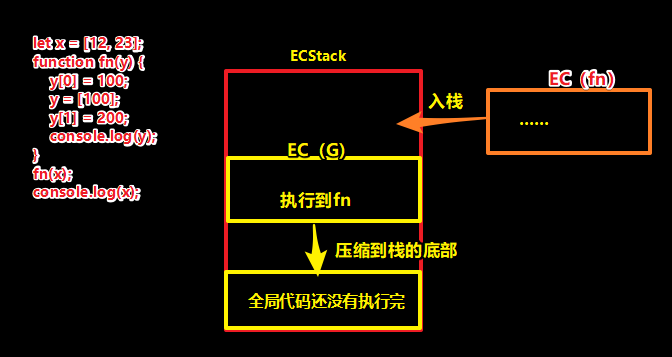

我们知道每个执行上下文里边都有一个存放变量的这么一个对象

在全局上下文里边，我们叫「VO」

但在函数这个执行上下文里边，我们则是叫「AO」（Activation Object） -> 活动对象

那么什么是AO呢？ -> 简单理解函数形成的变量对象就叫「AO」,而全局形成的那个则是「VO」

总之，不管是AO还是VO，它们都是变量对象

回过头来，要执行这个`fn(0x101)`了，在执行它之前，需要init这么几件事（讲几个常用的）：

1. init `arguments` 这个内置的实参集合 -> `arguments:{0:0x101}`
2. 创建形参变量，并给它赋值 -> `y = 0x101` -> 变量提升不需要考虑了，因为ES6的出现已经把它给GG了
3. 代码执行

注意：

> 第一步和第二步，在非严格模式下，会建立映射机制（后边会有题让你了解这一点），而在严格模式下则不会，而且ES6新特性箭头函数中咩有arguments实参集合

映射机制测试：

非严格模式下：

``` js
function fn(x,y) {
  console.log(x,y,arguments);
  arguments[0] = 100;
  y = 200;
  console.log(x,y,arguments);
}
fn(10,20)
```

我的预测结果：

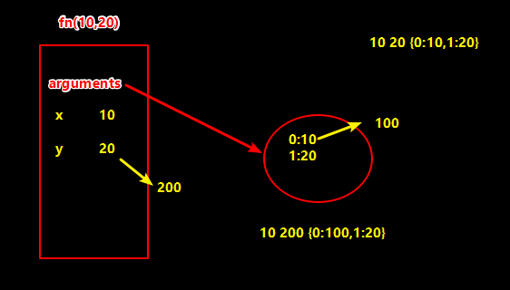

实际结果：

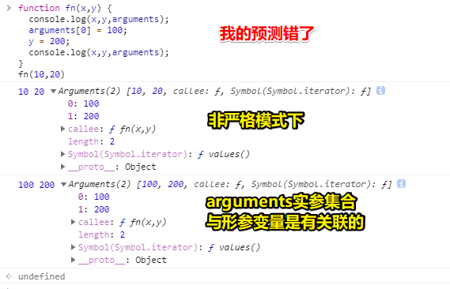

测试：

``` js
function fn(x,y) {
  console.log(x,y,arguments);
  console.log(arguments[0] === x); //true
  console.log(arguments[1] === y); //true 
  arguments[0] = 100;
  y = 200;
  console.log(x,y,arguments);
}
fn(10,20)
```


## ★总结

- 以前很排斥做题，但现在我发现，做题也是一种让你深刻理解知识点的一种有效手段……
- 弄懂某些东西，还是用视频描述比较好，我之前就看过有关「执行上下文」的文章，其中不乏有很多人点赞的，但其实自己看了一遍过后，并咩有理解多少……

## ★Q&A

### <mark>1）连续赋值？</mark>

如：

``` js
a = b = c = [1,2,3]
```

猜测执行顺序：

1. 创建一个数组，给个地址
2. a = 地址
3. b = 地址
4. c = 地址

> 同样等级下，赋值运算的优先级从左到右执行 -> 而且一般都是这样的，除非不同等级，当然，也有从右向左的，如这样 `typeof typeof 'hi'`
>
> 运算符的优先级决定了表达式中运算执行的先后顺序，优先级高的运算符最先被执行。 -> 总之，优先级较高的运算符成为优先级较低的运算符的操作数

我看到MDN是这样描述的：

赋值操作符是右关联的（right-associative），所以你可以写：

``` js
a = b = 5; // same as writing a = (b = 5);
```

所以，难道如果是引用值的话，就是从左到右？毕竟这符合我们所期望的效果呀！

又或者确实如MDN所说：

``` js
a = b = c = [1,2,3] // (a = (b = (c = [1,2,3])))
```

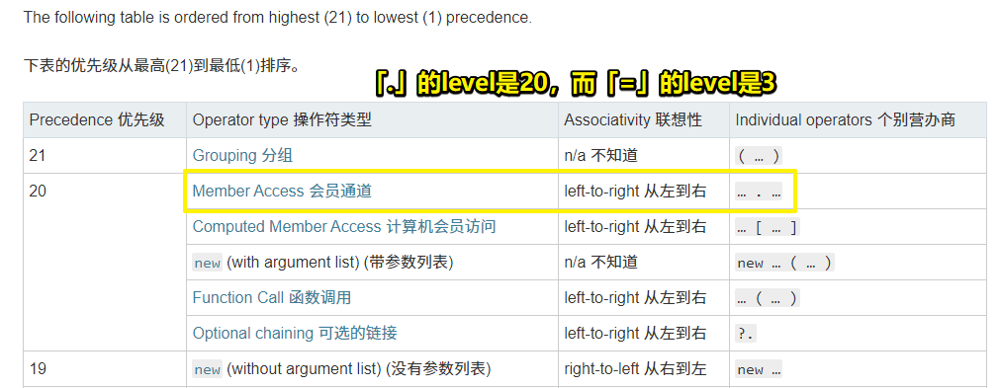

所以 `b.m` 的优先级要高于 `=`：

``` js
let a = {
    n: 10
};
let b = a;
b.m = b = {
    n: 20
};
console.log(a);
console.log(b);
```

因此，正确的执行过程是这样的：

1. `b.m = {n:20}`
2. `b = {n:20}`

那么老师的理解是错的咯！虽然执行过程确是这样，但是这理解是错的，即认为多个连续`=`是从左往右执行的，殊不知是因为 `b.m`的特殊性，即优先级更高

我开始明白为啥王垠大佬说（Schema的语法）：

> 把所有的结构都用括号括起来，轻松地避免了别的语言里面可能发生的“歧义”。程序员不再需要记忆任何“运算符优先级”

➹：[Operator precedence - JavaScript - MDN](https://developer.mozilla.org/en-US/docs/Web/JavaScript/Reference/Operators/Operator_Precedence)

➹：[谈语法](http://www.yinwang.org/blog-cn/2013/03/08/on-syntax)


### <mark>2）ECStack 和 EC 的区别？</mark>

- ECStack -> 执行环境栈 -> 是个内存哈
- EC -> 执行上下文 -> 不能说它不是内存，也不能说它不是栈内存，总之这相当于它是一个东西，我们把这个东西放到ECStack这个环境里边去执行它！

想想图灵机：

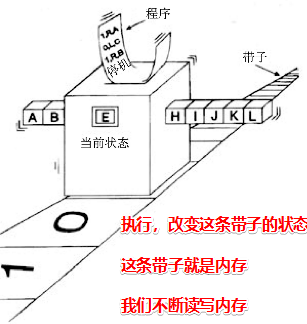

➹：[第 2 章　图灵的计算王国-图灵社区](https://www.ituring.com.cn/book/tupubarticle/7901)

3）关于自执行函数，这种`(()=>{})()`与这种 `~function(){}()`的区别？

前者赋值给一个变量是有返回值的，而后者是会发生奇怪的事儿！

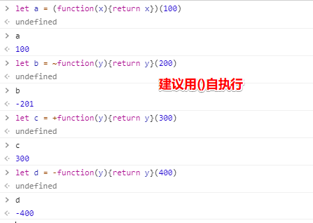

4）函数变量与let、var声明的变量一样吗？

本质是一样的，只是函数变量存储的这个值是个函数类型的值哈！


