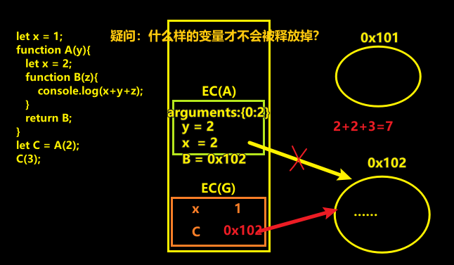

# 05-作用域和作用域链（闭包的形成）

## ★概念

- Scope：作用域，创建的函数的时候就赋予的
- Scope Chain ：作用域链

## ★题目

``` js
let x = 1;
function A(y){
   let x = 2;
   function B(z){
       console.log(x+y+z);
   }
   return B;
}
let C = A(2);
C(3);
```

### ◇自己做一遍



### ◇老师解析

关键点：

- 不管是在全局，还是局部，只要你声明了一个函数，那么除了会创建一个存储函数的堆以及把这个堆的地址赋值给一个变量以外，同时还会给当前的函数声明了一个它所有在的作用域是谁，如 `A`函数的作用域就是 `VO(G)` -> 说白了，函数在哪里声明创建的，那么这个哪里就是它的作用域，如 `A`是在全局创建的，那么`A`的作用域就是全局上下文
- 只有函数执行会产生AO
- 作用域和执行上下文的区别：前者指向了当前EC的变量对象（VO/AO），而后者除了有变量对象以外，还有代码执行……当然，我们也可以傻傻的认为scope和EC是咩有区别的……毕竟，按照这样理解程序并没有出错，只是不太严谨罢了！ -> 有些时候需要咬文嚼字，而有些则不需要
- 全局上下文是一个对象，但不叫对象，而是叫上下文，其中旗下有个GO对象和VO对象 -> 反正一定会有数据结构来描述上下文这种抽象的东西 -> 当然，你也可以认为上下文指的是「活动区域」哈

一个函数从创建到执行的这么一个大概过程：

1. 创建函数的时候
   1. 创建一个heap -> 存储代码字符串+对应的键值对
   2. init 当前函数的作用域 -> `[[scope]] = VO/AO`
2. 函数执行的时候
   1. 创建一个新的EC -> 压缩到ECStack里边执行
   2. init `this` 的指向
   3. init 作用域链 `[[scopeChain]]: AO(A) -> VO(G)`（根据该函数 init 作用域时，确定的 `VO(G)/AO`）
   4. 创建AO用来存储变量
      1. arguments
      2. 形参
      3. 如果有变量，那就提升变量
   5. 代码执行

> 老师的参考来源：官方文档、大神博客、标准、V8源码、还有其它很多很多的素材 -> 有些人讲的可能不一定对，所以需要对比一下看看大家都怎么说 -> 最后得出自己所认为的「知识」 -> 当然，老师说得有些地方也是不太严谨的，但根据老师所看的，基本就是如上边所述的这样……


## ★总结


## ★Q&A

1）执行上下文？

听说：

> 都2020年了 怎么还在说变量对象、活动对象、作用域链这些ES3里过时的概念，ES5之后早就变成词法环境了，文章也要与时俱进啊

> 规范里都删了 VO 和 AO 多久了，现在都是词法环境，环境记录了

不过，这只是术语变了，但本质还是没有变的！

➹：[面试官：说说执行上下文吧 - 掘金](https://juejin.im/post/5ebced85e51d454dc1467664)

➹：[编程中什么是「Context(上下文)」？ - 知乎](https://www.zhihu.com/question/26387327)

➹：[理解JavaScript的执行上下文 - 知乎](https://zhuanlan.zhihu.com/p/72959191)

➹：[（译）理解 JavaScript 中的执行上下文和执行栈 - 掘金](https://juejin.im/post/5ba32171f265da0ab719a6d7)


