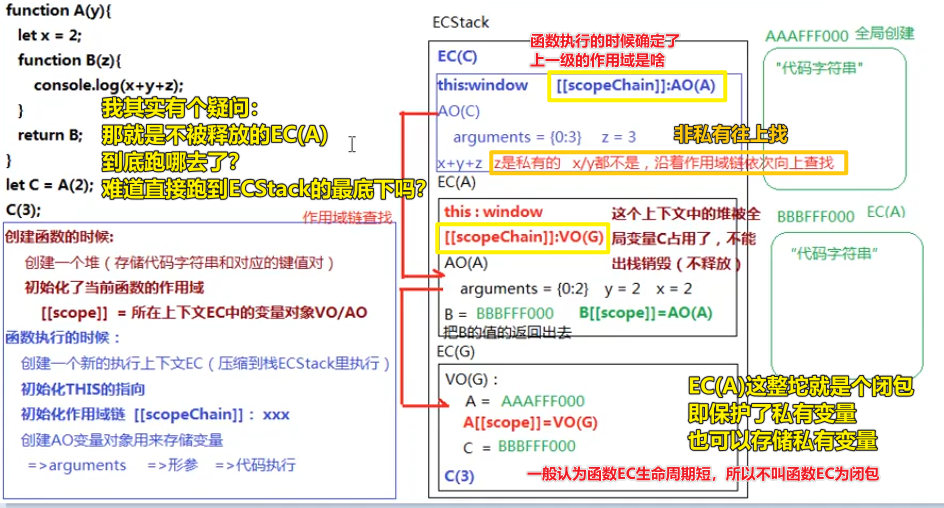

# 05-作用域和作用域链（闭包的形成）

## ★概念

- Scope：作用域，创建的函数的时候就赋予的
- Scope Chain ：作用域链

## ★题目

``` js
let x = 1;
function A(y){
   let x = 2;
   function B(z){
       console.log(x+y+z);
   }
   return B;
}
let C = A(2);
C(3);
```

### ◇自己做一遍


### ◇老师解析



> 认识一个「闭包」概念，需要有ECStack、EC(G)、EC(函数)、VO、GO、AO等这样的概念作为铺垫……

关键点：

- 不管是在全局，还是局部，只要你声明了一个函数，那么除了会创建一个存储函数的堆以及把这个堆的地址赋值给一个变量以外，同时还会给当前的函数声明了一个它所有在的作用域是谁，如 `A`函数的作用域就是 `VO(G)` -> 说白了，函数在哪里声明创建的，那么这个哪里就是它的作用域，如 `A`是在全局创建的，那么`A`的作用域就是全局上下文
- 只有函数执行会产生AO
- 作用域和执行上下文的区别：前者指向了当前EC的变量对象（VO/AO），而后者除了有变量对象以外，还有代码执行……当然，我们也可以傻傻的认为scope和EC是咩有区别的……毕竟，按照这样理解程序并没有出错，只是不太严谨罢了！ -> 有些时候需要咬文嚼字，而有些则不需要
- 全局上下文是一个对象，但不叫对象，而是叫上下文，其中旗下有个GO对象和VO对象 -> 反正一定会有数据结构来描述上下文这种抽象的东西 -> 当然，你也可以认为上下文指的是「活动区域」哈

一个函数从创建到执行的这么一个大概过程：

1. 创建函数的时候
   1. 创建一个heap -> 存储代码字符串+对应的键值对
   2. init 当前函数的作用域 -> `[[scope]] = VO/AO`
2. 函数执行的时候
   1. 创建一个新的EC -> 压缩到ECStack里边执行
   2. init `this` 的指向
   3. init 作用域链 `[[scopeChain]]: AO(A) -> VO(G)`（根据该函数 init 作用域时，确定的 `VO(G)/AO`）
   4. 创建AO用来存储变量
      1. arguments
      2. 形参
      3. 如果有变量，那就提升变量
   5. 代码执行

> 老师的参考来源：官方文档、大神博客、标准、V8源码、还有其它很多很多的素材 -> 有些人讲的可能不一定对，所以需要对比一下看看大家都怎么说 -> 最后得出自己所认为的「知识」 -> 当然，老师说得有些地方也是不太严谨的，但根据老师所看的，基本就是如上边所述的这样……

---

<mark>知识点：</mark>

关于闭包：

函数A入栈的 `EC(A)` 其实就是闭包，只是生命周期太短了，即函数执行完就销毁了，一般我们都认为这不是闭包，但其实这也算是

如果`EC(A)`里边的变量有被上一级作用域引用到，那么这整个EC(A)是不会被销毁的，因为一旦销毁了，那么数据就没了呀！这样上一级作用域就无法读取到了

因此，我们会说这样的 `EC(A)`才是闭包

闭包就两种作用：

- 保护 -> 保护AO里边的东西跟外边没关系，即这是私有的，你们外边的无法访问我AO这里边的东西
- 保存 -> 当前函数EC不销毁，那么这里边存储的所有的东西都会被销毁，这意味着这些东西都保存下来了，那在哪儿保存呢？在ECStack里边找个位置保存下来，即压缩到Stack的底部哈！

当然，这样一说，我们可能还是无法理解的，所以老师会在下一节多讲一些关于闭包的实战应用场景 -> 涉及到JS里边的一些高阶编程技巧

> 关于销毁，在函数里边创建的私有变量，如果函数执行完了，那么这些私有变量都会被GG掉，假如全局作用域的某个变量通过某种途径拿到了私有变量的状态，那么这个函数EC就不会被销毁了

疑问：

1. 是只有全局引用的这个函数的局部变量不会被销毁，还是这个函数里边所有的局部变量都不会被销毁？ -> 如果是后者这样，岂不是内存泄漏了吗？
2. 函数与函数之间也会有闭包吗？如果全局作用域没有引用这些变量是不是意味着这些函数通通被销毁了？如一个函数A嵌套了一个函数B，B嵌套了一个C函数，C把AO旗下的某个变量传给了B，B再把它传给了A，A再把它传给了全局，我们知道C不会被销毁，那 A、B会被销毁吗？
3. 广义上的闭包的出现，是不是说只要全局有引用到局部变量就行了？

---

作用域链查找：

1. 创建函数的时候，init 了一个 `[[scope]]`属性，表明该函数的作用域是谁
2. 函数执行的时候，init 了自己的作用域链 `上一级的AO/VO`，表明如果当前不是函数的私有变量，那么就会往这个指明的 `AO/VO` 上找到该变量的值…… -> 直到全局 -> 全局都没找着，那就会报错！

---

### ◇伪代码描述

``` js
/*第一步：创建全局执行上下文，并将其压入ECStack中*/
ECStack = [
    //=>全局执行上下文
    EC(G) = {
        //=>全局变量对象
        VO(G):{
            ... //=>包含全局对象原有的属性
            x = 1;
            A = function(y){...};
            A[[scope]] = VO(G); //=>创建函数的时候就确定了其作用域
        }
    }
];

/*第二步：执行函数A(2)*/
ECStack = [
    //=>A的执行上下文
    EC(A) = {
        //=>链表初始化为：AO(A)->VO(G)
        [scope]:VO(G)
        scopeChain:<AO(A),A[[scope]]>
        //=>创建函数A的活动对象
        AO(A) : {
            arguments:[0:2],
            y:2,
            x:2,
            B:function(z){...},
            B[[scope]] = AO(A);
            this:window;
        }
    },
    //=>全局执行上下文
    EC(G) = {
        //=>全局变量对象
        VO(G):{
            ... //=>包含全局对象原有的属性
            x = 1;
            A = function(y){...};
            A[[scope]] = VO(G); //=>创建函数的时候就确定了其作用域
        }
    }
];

/*第三步：执行B/C函数 C(3)*/
ECStack = [
    //=>B的执行上下文
    EC(B){
        [scope]:AO(A)
        scopeChain:<AO(B),AO(A),B[[scope]]
        //=>创建函数B的活动对象
        AO(B):{
            arguments:[0:3],
            z:3,
            this:window;
        }
    },
    //=>A的执行上下文
    EC(A) = {
        //=>链表初始化为：AO(A)->VO(G)
        [scope]:VO(G)
        scopeChain:<AO(A),A[[scope]]>
        //=>创建函数A的活动对象
        AO(A) : {
            arguments:[0:2],
            y:2,
            x:2,
            B:function(z){...},
            B[[scope]] = AO(A);
            this:window;
        }
    },
    //=>全局执行上下文
    EC(G) = {
        //=>全局变量对象
        VO(G):{
            ... //=>包含全局对象原有的属性
            x = 1;
            A = function(y){...};
            A[[scope]] = VO(G); //=>创建函数的时候就确定了其作用域
        }
    }
];
```

## ★总结

- 老师的讲课模式（掌握一个东西的姿势）：
  - 讲完 -> 留作业 -> 做完作业 -> 讲作业，往深得挖 -> 讲新东西 -> 讲完 -> 留作业……

## ★Q&A

### <mark>1）执行上下文？</mark>

听说：

> 都2020年了 怎么还在说变量对象、活动对象、作用域链这些ES3里过时的概念，ES5之后早就变成词法环境了，文章也要与时俱进啊

> 规范里都删了 VO 和 AO 多久了，现在都是词法环境，环境记录了

不过，这只是术语变了，但本质还是没有变的！

还有关于context的由来：

> 一般来说是想要有个object来保存状态，想不出好的名字然后就叫context了

题外话（Eval函数也会有EC）：

- `Eval` 函数执行上下文 -> 执行在 `eval` 函数内部的代码也会有它属于自己的执行上下文，但由于 JavaScript 开发者并不经常使用 `eval`，所以在这里我不会讨论它。

➹：[面试官：说说执行上下文吧 - 掘金](https://juejin.im/post/5ebced85e51d454dc1467664)

➹：[编程中什么是「Context(上下文)」？ - 知乎](https://www.zhihu.com/question/26387327)

➹：[理解JavaScript的执行上下文 - 知乎](https://zhuanlan.zhihu.com/p/72959191)

➹：[（译）理解 JavaScript 中的执行上下文和执行栈 - 掘金](https://juejin.im/post/5ba32171f265da0ab719a6d7)

### <mark>2）动态作用域和词法作用域？</mark>

> 词法作用域（静态作用域）是在书写代码或者说定义时确定的，而动态作用域是在运行时确定的。 词法作用域关注函数在何处声明，而动态作用域关注函数从何处调用，其作用域链是基于运行时的调用栈的。

JS是词法作用域的

词法作用域：

``` js
function foo() {
  console.log(a) //2
}

function bar() {
  var a = 3
  foo()
}

var a = 2
bar()
```

分析这个过程：

1. ECStack
   1. VO(G)
      1. foo
         1. heap -> 代码字符串+键值对
         2. init -> `[[scope]] -> VO(G)`
      2. bar
         1. heap -> 代码字符串+键值对
         2. init -> `[[scope]] -> VO(G)`
      3. a -> 2
   2. 代码执行
      1. `bar()`
         1. `EC(bar)`
            1. init -> this
            2. init -> `[[scopeChain]] -> VO(G)`
            3. init -> AO
               1. arguments -> `{}`
               2. 形参
               3. a -> 3
               4. 代码执行
                  1. `foo()`
                     1. 当前`AO`没找到 `foo` 这个变量 -> `VO`找到了`foo`
                     2. 执行
                        1. init -> this
                        2. init -> `[[scopeChain]] -> VO(G)`
                        3. `console.log(a)` -> 是 3 还是 2？ -> foo的`[[scopeChain]]`指向的是`VO(G)` -> 所以是 `2`

动态作用域：

``` js
function foo() {
  print a; // 输出 3 而不是 2
}

function bar() {
  var a = 3
  foo()
}

var a = 2
bar()
```

有人说「两段代码不是一样的么」？

> 代码一样结果却不同，才能**控制变量法**地体现出语言层面上 词法作用域 和 动态作用域 的差别

> 代码是一样的，解释器对代码的解释不一样，一个用词法作用域规则处理的，一个用动态作用域规则处理的

> 要是让我遇上第二种，估计会发疯

➹：[动态作用域和词法域的区别是什么？ - Maples7的回答 - 知乎](https://www.zhihu.com/question/20032419/answer/112564460)


