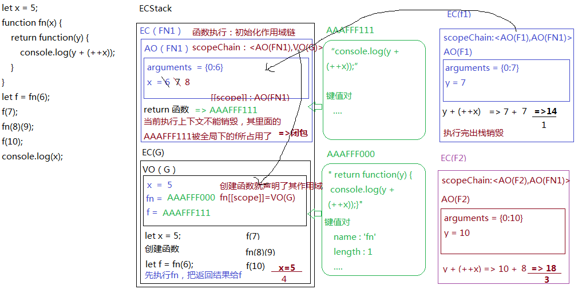
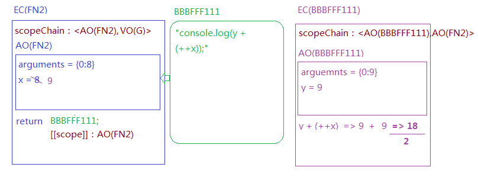
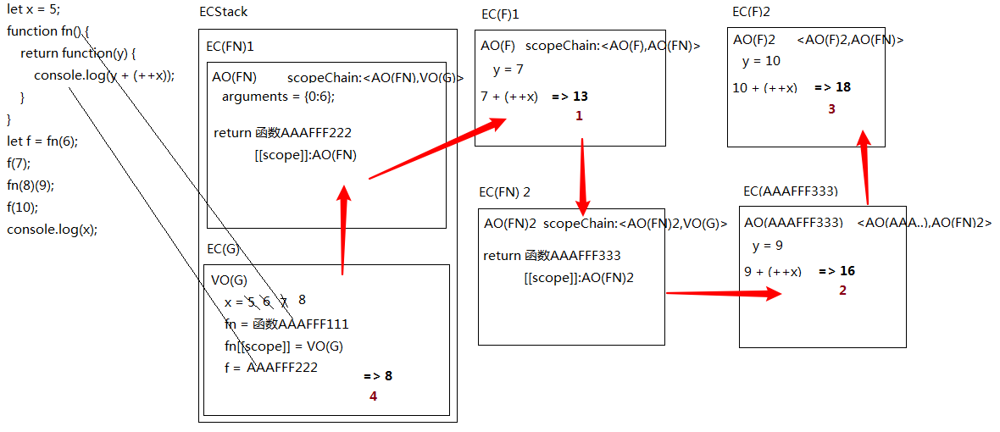

# 06-闭包作业复习1

> 2020年5月23日

## ★作业

### <mark>1）题一</mark>

``` js
let x = 5;
function fn(x) {
    return function(y) {
        console.log(y + (++x));
    }
}
let f = fn(6);
f(7);
fn(8)(9);
f(10);
console.log(x);
```

分析：

1、EC(G)

1. ECStack
   1. VO
      1. x -> 5
      2. fn -> `0x101`
         1. 代码字符串+键值对
         2. init `[[scope]] -> VO(G)` 
      3. f
         1. `fn(6)`执行

2、EC(fn)

1. `fn(6)`
   1. init `[[scopeChain]] -> VO(G)`
   2. init AO
      1. arguments -> `{0:6}`
      2. x -> 6
      3. 代码执行
         1. 返回 `0x102`

3、EC

1. `f(7)` -> scopeChain `AO(fn)` -> 7+6+1 = 14 -> `AO(fn)`(x=7)
2. `fn(8)(9)` -> 9+8+1 = 18 -> `AO(fn)`(x=9)
3. `f(10)` -> 10+7+1 = 18
4. `console.log(x)` -> 5

4、结果：

14、18、18、5

> 测试运行情况：正确

个人认为考察点：

- A和B都闭包同一个上下文，A家的会不会影响B家的！
- `let a = 10;` -> `5 + (++a)` 与 `5 + (a++)`的区别，前者`(++a)`+1完再返回，而后者则是直接返回此刻`a`的值 -> 说白了，一个前置递增（level 16）与一个后置递增（level 17）的pk

### <mark>2）题二</mark>

``` js
let x = 5;
function fn() {
    return function(y) {
        console.log(y + (++x));
    }
}
let f = fn(6);
f(7);
fn(8)(9);
f(10);
console.log(x);
```

分析：

1、EC(G)

- VO
  - x = 5
  - fn = 0x101
  - f = 0x102

- f(7) -> 7+5+1 = 13 -> a = 5+1 = 6
- fn(8)(9) -> 9+6+1 = 16 -> a = 6+1 = 7
- f(10) -> 10+7+1 = 18 -> a = 7+1 = 8

2、EC(fn)

- VO
  - arguments -> `{0:6}`
- `return 0x102`

3、结果

13、16、18、8

> 测试正确

个人认为考察点：

- 共享全局闭包

### <mark>3）题三</mark>

``` js
let a=0,
    b=0;
function A(a){
    A=function(b){
        alert(a+b++);
    };
    alert(a++);
}
A(1);
A(2);
```

分析：

1、EC(G)

- VO
  - a -> 0
  - b -> 0
  - A -> 0x101 -> 0x102（调用自己的时候改变自己？）

2、EC(A)

- AO(A)
  - arguments -> `{0:1}`
  - a -> `1` -> 1+1 = 2
- `alert(a++)` -> 1

3、EC(A)

- `A(2)`
  - arguments -> `{0:2}`
  - b -> `2` -> 2+1 = 3
- `alert(a+b++)` -> `a+(b++)` -> 2+2 = 4

4、结果

1、4

> 测试正确

归纳一下自己如何分析：

1. 直接看`EC(G)`和`EC(函数)`
2. 只写变量的状态以及变量状态变化过程 -> 只分析VO/AO
3. 涉及到函数，就用 `0x101`、`0x102`这样的过程
4. 作用域和作用域链不需要分析，潜意识就应该有了吧

> 我发现做了几道题后，不会写代码了，只会看这些代码……

### <mark>3）题四</mark>

``` js
var x = 3,
    obj = {x: 5};
obj.fn = (function () {
    this.x *= ++x;
    return function (y) {
        this.x *= (++x)+y;
        console.log(x);
    }
})();
var fn = obj.fn;
obj.fn(6);
fn(4);
console.log(obj.x, x);
```

分析：

1、EC(G)

- VO
  - x -> 3 -> 4 -> 12 -> 13 -> 234
  - obj -> 0xJ101（普通对象用`J`作为前缀）`{x:5}` -> `x:95`
  - fn -> undefined -> `0xF101`

- `obj.fn` -> `0xF101`
- `obj.fn(6)`
- `fn(4)`
- `console.log(obj.x, x);` -> 95,234

2、EC(fn)

- this -> window
- `this.x *= ++x` <=> `window.x = (window.x) * (++x)` -> `window.x` = `3 * (3+1) = 12`
- `return 0xF101`

3、EC(0xF101)

- this -> obj(0xJ101)
- arguments -> `{0:6}`
- y -> 6

- `this.x *= (++x)+y;` <=> `this.x = (this.x) * ((++x)+y);` -> `5 * (13+6) = 95`

- `console.log(x);` -> 13

4、EC(0xF101)

- y -> 4
- this -> window

- `this.x *= (++x)+y;` -> `13 * ((13+1) + 4) = 234`

- `console.log(x);` -> 234

5、结果

1. 13
2. 234
3. 95,234

> 测试答案正确

> 在计算的时候，注意`成员访问`（即`.`）的level是19，以及 `A += B + C` 、`A *= B + C` 都是 `A = A+(B+C)`、`A = A*(B+C)`

---

## ★老师的讲解

### ◇我没有留意到的细节点

- 函数执行 init `scopeChain` -> `<AO(FN1),VO(G)>` -> 左边这个值表明了当前作用域，而右边这值表明了上一级作用域是谁 -> `VO(G)`其实应该是函数（假如函数是`fn`）创建时声明的作用域变量`fn[[scope]]`，而在这里我们直接把最终值 `VO(G)`给写上去了
- 有人问到「`AO(fn)`才是`fn`自己的作用域，而不是`VO(G)`」 -> 简单来说，就是函数执行的那个环境才是自己的作用域 -> 虽然这样理解对代码最终的执行结果没错，但真正的作用域是指自己所在创建的那个区域呀！而EC才是函数代码执行的环境 -> 环境和作用域是有区别的…… -> 总之，**想象一下你是个函数，你在家里呆着，整个家的`VO(G)`就是你的作用域，而你自己执行的那个身体环境就是`EC`**
- 周老师认为 -> 函数执行形成的执行上下文就是闭包，因为这包含有保护和保存两种功能 -> 而一般大众认为，函数执行完后EC出栈被销毁了，就没有形成闭包，反之，没被销毁就形成了闭包，不过这仅仅只是说明了保存功能……
- 每一次函数的执行 -> 都是形成全新的EC

### ◇题目讲解

#### 1、题一

- 在函数（`fn1`）里边创建的函数（`fn2`），意味着该`fn2`与`fn1`是有关系的，然后`fn2`被全局某个变量（如`f`）所引用，那么这意味着 `fn2`是有意义的，所以`fn1`执行完毕后这整个`EC(fn1)`是不能被销毁的，而是压缩到`ECStack`的底部……唯有这样，`f`才能正常访问`fn2`所指向的那个heap





#### 2、题二

- 词法作用域，函数在创建的时候，确定了它的上一级作用域是谁，这一点可以通过 `scopeChain` 可以看出 -> 函数在哪里创建，那么这个函数体里边的上一级作用域就是谁，如函数B在函数A的肚子里创建，那么 B在执行时，其`scopeChain -> <AO(B),AO(A)>`




## ★总结

- 以后有人问起闭包，请说一些ECStack、AO、VO等这样的概念，明白的自然就懂……
- 编程就是在读写内存数据 -> 如在上边那四道题里边，你可以看到一个变量的值，随之代码的执行，在反复变化，即变量的状态一直在改变……
- 堆栈内存的运行机制、闭包的运行机制 -> 很底层，非常重要 -> 对后续理解JS高阶编程技巧（如柯里化、惰性函数……）等一些高逼格的东西起到关键性的作用 -> 说白了，这些高逼格的东西都是围绕这些底层机制进一步加深和强化的……

## ★Q&A

### <mark>1）`++x` 与 `x++` 区别？</mark>

同学别费劲了，不同的编译器处理结果不同，谁在实际项目中这样写我要对他竖中指

- ++x先+1再用
- x++先用再+1

翻译成代码：

``` js
x++

var t = x
x = x+1
return t

++x
return (x = x+1)
```

➹：[++x和x++到底有什么区别？ - 知乎](https://www.zhihu.com/question/26561377/answer/33215154)

➹：[为什么在 C 语言中，`i=1;i=(++i)+(++i)+(++i)+(++i)`; 得到 i 的结果是 15 而不是 14 ？ - 知乎](https://www.zhihu.com/question/23180989/answer/23874381)


