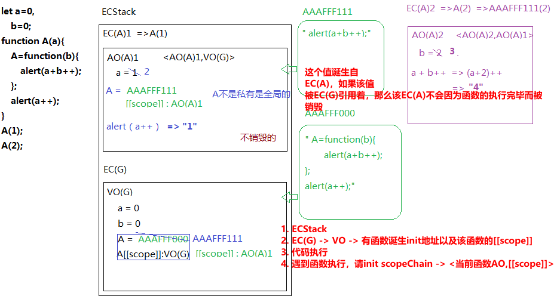
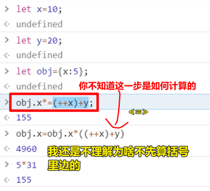
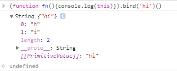
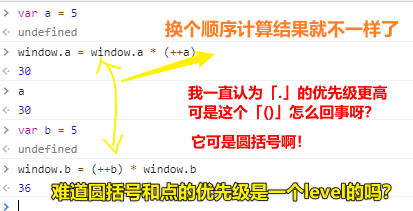
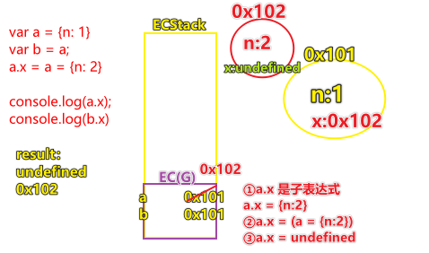
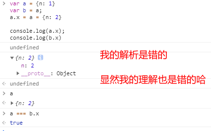
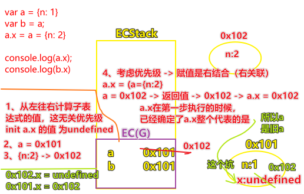
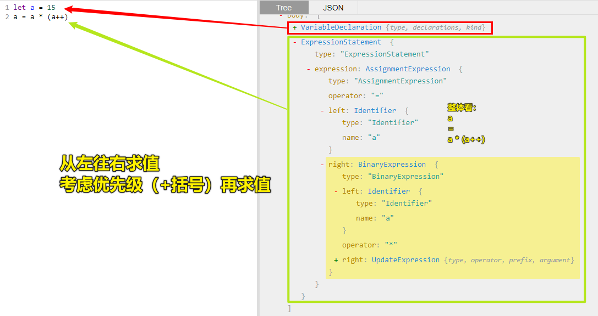
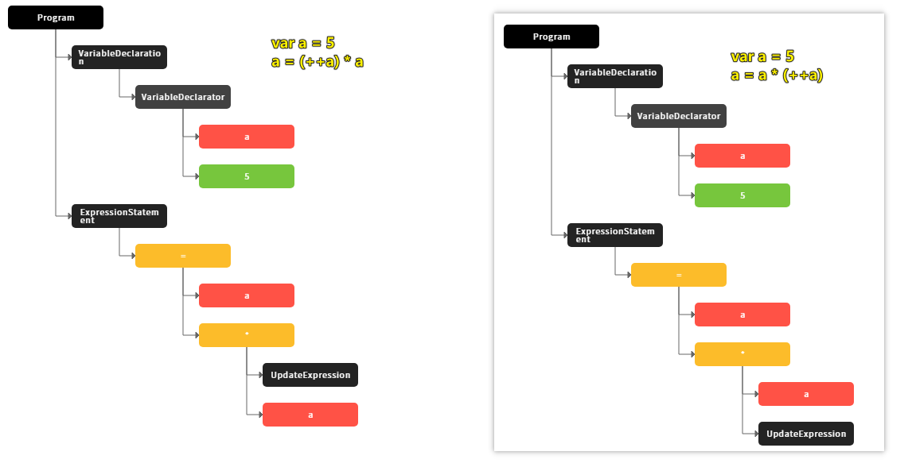

# 07-闭包作业复习2（this的两种情况）

> ✍ 2020年5月24日

## ★老师讲解

### <mark>1）题三</mark>



> 确定那些引用类型的值 -> 是属于哪个EC下的产物…… -> 为啥要确定呢？ -> 因为假如是来自函数执行上下文的产物，那么这函数执行完后，该值很有可能就GG了 -> 我们一般都会返回一个引用类型的值暴露给全局，以此来体现所谓的「闭包」

### <mark>2）题四</mark>

- 自执行函数 -> 先创建堆，然后再执行
- 当你搞不懂计算顺序时，请拿出来模拟一下：
  
  
  
- 


## ★总结

- 作用域 -> 函数诞生所在的地方的那个`VO/AO` -> 似乎我们谈起作用域这概念的时候，就是伴随着函数的诞生/创建 -> 从函数被声明创建的那一刻，它就有一个先天的属性，那就是它的 `[[scope]]` 已经有个确切值，不管整个程序如何运行，该值就是不可变的……
- 我们画内存图是否就是把代码不可见的执行过程，具象成了可以画在纸上的ECStack、EC(G)、EC(FN)……
- 确定那些引用类型的值 -> 是属于哪个EC下的产物……


## ★Q&A

### <mark>1）闭包 -> 内存泄漏？</mark>

> 在我看来闭包是会发生内存泄漏的，因为按照老师的讲解来看，只要全局引用了这个xxx函数里边的私有变量，那么这个xxx函数的EC是不会被释放掉的，可是假如xxx函数有多个私有变量呢？而我们全局只引用了一个私有变量，那么其它没被引用的，难道不会被销毁吗？

关于闭包是否真得会造成内存泄漏？

---

你写的每10句js就有一句是闭包。。。最不济你还有个全局闭包吧。。

另外：
很多人都会把内存使用和内存泄露搞混。**用几个变量不会被回收就内存泄露，你的内存就那么少**。。。所谓内存泄露是上个世纪某些浏览器的bug，跟js本身没有关系。

不可尽信书

PS:在使用局部变量的时候不用手动`=null`来回收局部变量，**在变量不会被引用到的时候，变量自然会被自动回收**。其实最重要的就是理解，什么样的变量是不会被引用到的？理解了这个才是真正理解了闭包。

---

在[这篇文章](https://zhuanlan.zhihu.com/p/22486908)里边我抓到几个关键信息：

- **「函数」和「函数内部能访问到的变量」（也叫环境）的总和，就是一个闭包**。
- **我把我家的钥匙给你了**
- 如果闭包保存了两个变量 但是我代码只使用了一个 那剩下的那个会被回收吗？ -> **应该立刻被回收**
- 闭包函数会携带外部函数的作用域链啊，调用函数执行完毕后，外部函数的活动对象也不会被销毁，只有闭包函数销毁后，外部函数才会销毁啊，这不是占用了过多的内存了吗
  - **你需要用的内存不算是过多的内存**
- 闭包是词法作用域的集中体现，在函数式编程中应用广泛。要确立闭包这个概念，第一步是要有enclosing scope，也就是封闭作用域。 -> 看待问题的高度不同

> 嗯，闭包是啥？我也不知道闭包是啥？反正如果有一个EC不被释放的话，那么我就认为有闭包在搞鬼……但其实，我们写代码的时候不去留意闭包，也会在代码里边体现到「闭包」的存在！

➹：[JavaScript 闭包都会内存泄露吗？ - 知乎](https://www.zhihu.com/question/22806887)

➹：[关于js闭包是否真的会造成内存泄漏？ - 小芋头君的回答 - 知乎](https://www.zhihu.com/question/31078912/answer/50642541)

### <mark>2）自执行函数里边的this一定指向的是window吗？</mark>

不一定，如这样：

``` js
(function fn(){console.log(this)}).bind('hi')()
```



### <mark>3）优先级问题——「对象访问-点（19）」和「圆括号（20）」</mark>



我感觉这有bug啊！

照理说有括号先算括号里边的呀！因此，结果是一样才对的

可现在顺序不一样导致了结果不一样

给自己一个理由：

``` js
window.a = window.a * (++a) 

//  <=> 

window.a = (window.a) * (++a)
```

或者可以这样理解：`A * B` 是 `left-to-right`，不管怎样都是先求left，然后再求right

哎……

总之，我就这样理解好了：

`A *= ++b` <=> `A = (A) * (++b)` -> 毕竟凭啥只有`++b`要加括号！

难道我就这么自欺欺人的认为？

搜索了一些资料，看到了这个回答：

---

> [JavaScript中运算符优先级的问题？ - 冴羽的回答 - 知乎](https://www.zhihu.com/question/52116922/answer/162899297)

其实在《JavaScript权威指南》中有明确的讲解：

运算符的优先级和结合性规定了它们在复杂的表达式中的运算顺序，但**并没有规定子表达式的计算过程中的运算顺序**。

**JavaScript总是严格按照从左到右的顺序来计算表达式**。例如，在表达式`w = x + y * z`，将首先计算子表达式w，然后计算x、y和z，然后，y的值和z的值相乘，再加上x的值。最后将其赋值给表达式w所指代的变量或属性。

给表达式添加圆括号将会改变乘法、加法和赋值运算的关系，但从左到右的顺序时不会改变的

---

所以说：

- `window.a = window.a * (++a)` -> 先计算 `window.a`的值，然后再计算 `++a`的值，当我们换个顺序的时候 `window.a = (++a) * window.a`，是先计算 `++a`这个子表达式，然后再计算 `window.a`这个子表达式

我突然明白之前周老师在说这个 `a.x = a = {n: 2}` 的时候，是先看 `a.x` 了

回顾一下下边这题是怎么算的：

``` js
var a = {n: 1}
var b = a;
a.x = a = {n: 2}

console.log(a.x);
console.log(b.x)
```

解析：



测试运行结果：



看了这个答案：

[一道面试题所引发的运算符的优先级的思考 - 知乎](https://zhuanlan.zhihu.com/p/27131429)

我在想，`a.x`是不是一个子表达式？它目前已经处于不可分割的状态了吗？

还有我在解析的过程中，有三个错误点：

- ①这步凭啥一开始就得到`{n:2}`值？难道可以跳级赋值吗？
- ③这步 -> 赋值表达式的返回值是`a`被赋值过后的这个值，而不是`undefined`哈！
- ③这步 -> `a.x`的是新`a`还是旧`a`

我觉得 `a.x` 是子表达式，因为它是两个 `=` 的这个整体的一份子，所以真正的执行过程应该是这样的：



总结：

- 不需要考虑 `.` 这个运算符的优先级 -> [JavaScript中运算符优先级的问题？ - RednaxelaFX的回答 - 知乎](https://www.zhihu.com/question/52116922/answer/129426603)
- 周老师说的对，因为他在讲上边这道类似的题的时候，就没有说到过 `.` 的优先级，而这意味着 `.` 的优先级与这道题无关 -> 但对于我而言，老师他并没有讲得很清楚
- JavaScript的求值顺序就是从左向右的 -> `a.x` 一开始就从左开始求值了
- 结合性，就是当同类操作相邻出现时…… -> 这是同类操作 -> 第四步的`a.x`已经是个求值完成的结果了，所以`a`是旧的`a`
- **遇到复杂的计算表达式的时候，先从左往右求值，然后根据运算符的优先级加括号** -> 这就是知识 -> 周老师之前讲的大概也是这样……

---

题外话，关于出这样的题的意义：

有人说到「通常来说不应该这么写代码。出这个面试题的人大概是脑子有病。」

但其实在我看来，这样的题对于补全自己的知识体系还是很有帮助的…… -> 所以我觉得可以刷一些有道理的，有考察你某些知识点的前端面试题 -> 目的完善自己的知识体系

---

➹：[有关Javascript中--的计算顺序问题？ - 知乎](https://www.zhihu.com/question/46456007)

➹：[JavaScript 运算符优先级案列 - 知乎](https://zhuanlan.zhihu.com/p/133676749)

### <mark>4）几个可以把你的JS代码搞成是AST的网站？</mark>

AST才是JS执行的代码



---

回顾之前的代码：

> [JointJS - JavaScript diagramming library - Demos.](https://resources.jointjs.com/demos/javascript-ast)




➹：[Esprima: Parser](https://esprima.org/demo/parse.html#)

➹：[AST Visualization on browser — Learn Languages 1.0 documentation](http://nhiro.org/learn_language/AST-Visualization-on-browser.html)

➹：[★AST explorer](https://astexplorer.net/)

➹：[Manipulating AST with JavaScript - Tan Li Hau](https://lihautan.com/manipulating-ast-with-javascript/)

➹：[★AST in Modern JavaScript - 知乎](https://zhuanlan.zhihu.com/p/32189701)

➹：[★Babel AST Explorer](https://lihautan.com/babel-ast-explorer/#?eyJiYWJlbFNldHRpbmdzIjp7InZlcnNpb24iOiI3LjYuMCJ9LCJ0cmVlU2V0dGluZ3MiOnsiaGlkZUVtcHR5Ijp0cnVlLCJoaWRlTG9jYXRpb24iOnRydWUsImhpZGVUeXBlIjp0cnVlLCJoaWRlQ29tbWVudHMiOnRydWV9LCJjb2RlIjoidmFyIGEgPSAxNVxuYSA9IGEgKiAoKythKVxuIn0=)

---

