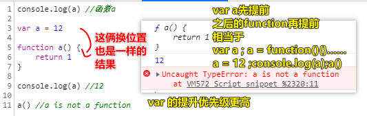
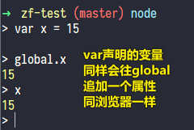
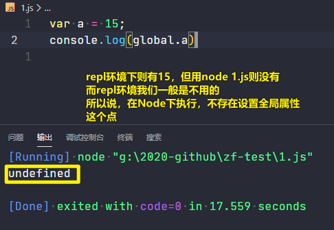
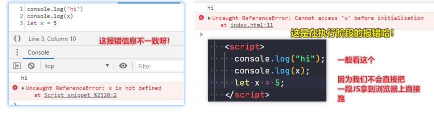
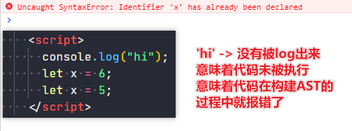
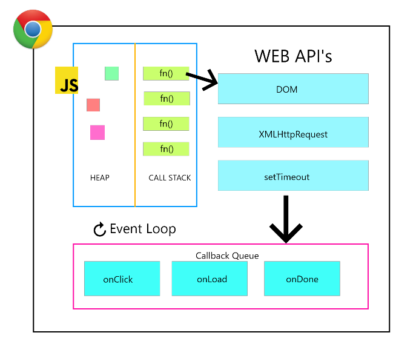
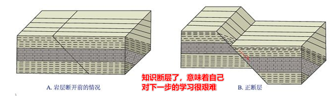

| ✍️ Tangxt | ⏳ 2020-05-25 | 🏷️ ES6  |
| ------ | ---------- | ---- |

# 08-let、var、const的区别

## ★为啥讲这个？

基于前边所讲的内容，还有一些特殊的情况需要处理，如面对用var和直接function声明一个变量的方式，会有提前声明的特殊性。

当然，就平时开发来说，我们很少会用`var`了，而 `function xxx() {}` 倒是经常在用

所以我们一般都不去考虑 `var` 声明的变量会有变量提升这件事儿……

> 既然你var特殊，那我就不用你，这样我就不用去考虑你的特殊性了

## ★变量提升

### ◇是什么？

有这样一段代码：

``` js
console.log(a) //undefined
var a = 12
console.log(a) //12
```

之前我们说到，要执行这代码会走怎么一个流程：

1. ECStack
   1. EC(G)
      1. VO(G)
      2. 执行代码（由于我们都是把变量声明在第一行的，所以在代码执行的时候，我们直接就把变量扔到VO(G)里边前，并没有体现Hoisting的概念）

在当前EC代码执行之前：

1. 把所有带`var`或者`function`关键的声明或定义给提上来（注意：**带var的只是提前声明，而带function的则会提前的声明+定义**）

因此，上边代码的执行流程是这样的：

1. ECStack
2. EC(G)
3. VO(G)
   1. a -> `var a` 提前声明了，但未定义，即为`undefined`值
4. 执行代码
   1. `console.log(a)`-> 看到VO(G)里的a是undefined值
   2. `a = 12`-> 改变VO(G)里的a的状态为`12`
   3. `console.log(a)`-> 12

那`function`呢？-> 它更有特殊性

如：

``` js
console.log(a)
fn()
var a = 12
function fn() {
  console.log('hi')
}
```

执行过程：

1. ECStack
2. EC(G)
3. VO(G)
   1. a -> undefined
   2. fn -> 0x101、`fn[[scope]] = VO(G)`
4. 代码执行
   1. `console.log(a)`
   2. `fn()`
   3. ……

自打ES6出现后，我们都不怎么管变量提升的事儿了……

以下只是测试，平时不会写出现这样的代码：



> 注意，同一个EC上，出现相同的变量，并不会重新声明，但会重新赋值

上图的另一种理解姿势（老师认为的是这种，嗯，我也认同）：

- 谁在前谁先提前，如 `var a` 写在 `function a` 上边，那么就 `var a` 先提前声明，而之后的 `function a`并不是声明而是定义 `a`的值。换个位置来看，`function a`先声明a，之后，`var a`忽视掉，因为不会重新声明，也不会所谓的给个 `undefined`值替换掉
- 所以这种姿势，并咩有所谓的提升优先级的说法哈！

> 这种理解姿势才是有道理的，不然浏览器难道先把所有代码都看一遍，即先把 `var`声明的变量给拎出来，然后再把function声明的变量给拎出来？ -> 还是看一个声明一个比较有道理，遇到已经声明过的，就跳过，但function除了声明还有定义，所以就得重新定义一下声明过的变量

不管哪种姿势理解，对执行结果并没有影响！

弊端：不方便管控，不符合正常逻辑（正常逻辑是，代码一行行的走，而不是让代码插队提前的走）

## ★ES6 -> let、const

### ◇let vs var

#### 1、区别一

``` js
console.log(a)
let a = 12
```

过程：

1. ECStack
2. EC(G)
3. VO(G)
4. 代码执行
   1. `console.log(a)` -> `Uncaught ReferenceError: a is not defined` -> 执行到这儿的时候，看到VO(G)里边咩有`a`
   2. `let a = 12` -> 这时VO(旗下)多了 `a = 12`

可见区别1：`let`声明的变量不存在变量提升

在现在的项目里边，创建函数，一般都是基于函数表达式来实现的，毕竟这可以防止其提前变量提升

如：

``` js
fn() // Uncaught ReferenceError: fn is not defined
let fn = function () {

}
```

一个奇葩的题：

``` js
fn();
function fn(){ console.log(1); }
fn();
function fn(){ console.log(2); }
fn();
var fn = function(){ console.log(3); }
fn();
function fn(){ console.log(4); }
fn();
function fn(){ console.log(5); }
fn();
```

分析：

1. ECStack
2. EC(G)
3. AO(G)
   1. fn -> undefined -> fn() `console.log(5)` -> `console.log(3)`
4. 代码执行
   1. 5
   2. 5
   3. 5
   4. `fn = function(){ console.log(3); }`
   5. 3
   6. 3
   7. 3

测试正确

老师解析：

``` js
/*
* EC(G)
*   VO(G)
*     fn = AAAFFF111
*        = AAAFFF222
*        = AAAFFF444
*        = AAAFFF555 （变量提升阶段完成，fn=AAAFFF555）
* 代码执行
*/
```

> 直接忽视掉 `var fn`的声明

#### 2、区别二

- 全局变量对象VO(G)里边声明的变量（用var声明的），也会给全局对象GO中增加一个对应的属性，而用let声明的变量则不存在这个特点

如：

``` js
var x = 12
console.log(window.x) //12

let y = 12
console.log(window.y) //undefined
```

或许你会疑问，我们在函数里边声明的私有变量，是否也会让函数有个类似 `fn.x`这样的属性？

如：

``` js
function fn() {
  var x = 100
  console.log(fn.x) //undefined
  console.log(window.x) //undefined
}
fn()
```

可见，这是咩有的

所以说，这个给GO添加属性的特点，仅限于在全局用var声明创建的变量，而私有EC里边的私有变量，则没这种「嗜好」

还有一种特殊情况：

``` js
function fn() {
  x = 100
}

// fn里边的x=100，在这里相当于给全局写上 x = 100
```

分析这种情况：

- fn里边的这种没有用 `var/let/const/function` 声明的变量，即 `x = 100` 这样的，并不是 AO(fn)中的私有变量，既然不是，那么就会向上找，即向上找到了全局，而这相当于是给全局VO(G)变量对象中设置了一个`x`的全局变量 -> 也相当于是给全局对象GO设置了一个`x`的属性

当然，这种情况太片门了，我们一般都不会写这样的烂代码，所以理不理解它也没事儿……

> 既然这个设计是烂的，为何要去记住它呢？

题外话：

在Node.js 环境下：

repl下：



`node xx.js`：



> a这个变量是被收纳到 `1.js`这个模块对象旗下了……而不是全局对象旗下

所以，你要注意，同一个代码，你在浏览器执行，和在Node.js 环境下执行，也可能会不一样，尤其是涉及到 `window`这样的全局对象

#### 3、区别三

- 不能重复声明

> var这个语法本身就是不严谨的，在编译阶段，浏览器知道它不严谨，所以在面对 `var x = 12;var x = 13;`的时候，就睁一只眼闭一只眼了。而let声明的变量则不行，一旦重复声明，代码就不会执行了，直接在变编译阶段给报错了！

可以重复声明情况：

``` js
var a = 10
var a = 20
console.log(a)
```

不允许重复声明情况：

``` js
console.log('hi')
let a = 10
console.log(a)
// 你以为执行到这一行才会报错吗？非也……
let a = 20
console.log(a)
```

我们知道浏览器拿到一份JS代码：

1. 编译阶段（编译器）
   1. 词法解析 -> …… -> AST抽象语法树（给浏览器引擎去运行的）
2. 引擎执行阶段
   1. ECStack -> EC(G) -> GO、VO(G)……

在编译阶段，重复用let声明的变量，就直接GG掉 -> 全部代码也不会被执行

总之：

带var的是可以重复声明的（词法解析审核通过），执行阶段遇到已经声明过的变量，则不会再重新声明

> 就像是第二次看到`var a`就说了句「咦，已经声明过了呀！既然如此，那就看下一行代码 或者说 类似点到一样，看到重复的学号就不用再点一次了，因为ta已经在了啊！如果再点一次，岂不是多一次一举？」 -> 其实说白了你TM重复声明就不应该出现，太TM不严谨了 -> 当然，如果你是为了容错率，那当我没说哈……

但是let是不可以这样的，这样的代码在词法解析阶段都过不去，所以也就不存在浏览器引擎去执行代码的阶段了

你可以 [AST](https://lihautan.com/babel-ast-explorer/) 一下，你会看到：

- 重复用let声明的变量在构建AST的过程中就报错了 -> 不符合规则就GG掉 -> 就像是广电总局看到游戏有暴力血腥（就像看到有double let 同一个变量的情况），那这游戏就不过审了
- 重复用var声明的变量则顺利通过AST的构建，而且也没有去掉其中一个多余的var

---

用let体现代码在执行阶段的报错（可否变量提升？）：

``` js
console.log('hi')
console.log(x)
let x = 5
```



> 从这可以侧面看出，变量提升是在代码执行阶段搞的，而不是在构建AST这个过程搞的！

回过头来看，用let体现编译阶段的报错（重复声明）：



---

#### 4、区别四（很重要）

一道很常见的面试题：

``` js
// 10ms后连续输出五个5，10ms是个理论时间，实际上要比10ms要大
for (var i = 0; i < 5; i++) {
  // 定时器是异步操作：不用等定时器到时间，继续开启下一轮循环
  setTimeout(() => {
    console.log(i);
  }, 10);
}
```

> 等EC(G)清空后，才把 callback push 到 ECStack 里边去执行

然而，我们的需求并不是连续输出五个5，而是等循环结束后连续输出0~4

不用 `let` 的情况下，使用闭包来完成这个需求：

``` js
// 连续输出0、1、2、3、4
for (var i = 0; i < 5; i++) {
  !(function (i) {
    // window.setTimeout -> 全局占用了这个 callback heap
    setTimeout(() => {
      console.log(i);
    }, 10);
  })(i);
}
```

为啥会这样呢？

- 每一轮循环都会执行一个自执行函数 -> 形成一个全新的EC
  - 并且，把每一轮循环的全局`i`的值，都当作实参赋值给这个自执行函数的EC里边的私有变量`i`（形参变量）
- 等EC(G)清空后，在回调队列里边的一个个callback，就一个一个push到ECStack里边执行，由于callback的诞生地是来自于自执行函数，这意味着每一次循环所创建的自执行函数的EC(函数)都在某个旮旯里边保存下来了或者说有一个快照，而且这些EC(函数)各自维护着每轮循环所传的 `i` 值 -> 即用到的`i`都是私有EC中保留下来的`i`
  - 这是充分利用了闭包机制（**保护、保存**）来完成的，不过，这样不太好呀！因为循环多少次，就会形成多少个不销毁的EC -> 你要知道栈内存就那么大，占用得越多，那么能执行的事儿就越少了，而且你还得小心栈溢出哈！(栈内存多大？得看自己电脑、还有我们没有办法手动释放……)

为啥自执行的EC不会被销毁？

1. EC(自执行)
2. AO(自执行)
   1. `i = 0~4`
   2. 创建一个匿名函数（callback） -> `()=>{}`（`0x101~0x105`） -> `0x101~0x105[[scope]]:AO(自执行)`
3. 自执行函数代码执行
   1. `window.setTimeout(0x101~0x105,10)` -> 全局API关联了（用到了）callback，而callback隶属于`AO(自执行)` -> 所以自执行EC不会被销毁



EC(G)执行完毕后？

1. 有5个callback排队着在等待入栈执行（哪个callback先到点，哪个就先排队，等`EC(G)`GG后就入栈）
2. callback1入栈
   1. EC(0x101) -> AO(0x101) -> `scopeChain<AO(0x101,AO(自执行1))>` -> `console.log(i)` -> 找到`AO(自执行1)` -> 找到`i`为`0` -> `log 0`
3. 同理，如第二步这样
4. ……

我以前是不理解上边这个代码的，在[这篇文章](https://zhuanlan.zhihu.com/p/22486908)里边，说到：

> 编程界崇尚以简洁优雅为美，很多时候
> 
> **如果你觉得一个概念很复杂，那么很可能是你理解错了。**

具体点，在我看来的话，如果你觉得一个概念很复杂，那么很可能是你**欠缺了很重要的前置知识**……当你补上这些前置知识后，你还得需要一些很好例子，来引导你完成对这个「复杂」概念的理解…… -> 难者不会，会者不难

如：如果没有ECStack、EC(G)、EC(fn)、GO、AO/VO、scope、scopeChain等这样的概念，那么我是真得无法在很大程度上理解闭包这个东西

---


## ★总结


## ★Q&A

### <mark>1）变量的重复声明？</mark>

>  JS的容错率很高，一些其他语言常见的小错误JS都能大度得包容，比如给一个方法传入超出预计的参数、在声明变量之前使用该变量（变量的声明提升解决了这个问题）等等

遇到重复用var声明的变量就跳过之，而遇到函数则定义之

➹：[JS变量重复声明以及忽略var 声明的问题及其背后的原理_javascript_SuperCoooooder的博客-CSDN博客](https://blog.csdn.net/SuperCoooooder/article/details/52765346)

### <mark>2）浏览器端的event loop？</mark>

「event loop」 -> 谷歌图片搜索 -> 看到哪个图片好就点进去，顺藤摸瓜找到图片所在的文章……

➹：[JavaScript Concurrency Model and Event Loop](https://www.freecodecamp.org/news/javascript-concurrency-model-and-event-loop/)

➹：[What is the Event Loop in JavaScript? - JavaScriptBit](https://javascriptbit.com/what-is-the-event-loop-in-javascript/)

➹：[JavaScript Event Loop](https://www.slideshare.net/Designveloper-DSV/javascript-event-loop-64720816)

### <mark>3）知识断层</mark>



知识是具有延续性的，如果出现大的变故，如战争之类的，就有可能造成知识断层，出现知识不延续现象。

对于国家、社会、世界来说，发生战争，就有可能造成知识断层，出现知识不延续现象。

对于个人，从学校毕业之后，如果连续几年不看报纸、杂志、书籍，不听广播、不看电视中的新闻、综艺等节目，就可能出现个人知识断层，跟不上时代。

> 在山里隐居……

两个概念：

1. 知识断层。是指在某一个较长的时间段内，孩子没认真学习，老师讲课，孩子基本不学习，故这段时间老师所讲知识点连续空档。这种断档知识点是连续的，也就是连续知识点整体塌陷。
2. 知识断点。是指孩子在学习中，因为种种原因，偶尔对某几个间断知识点没听懂，这种知识断点是间隔性的、不连续的。

> 一个是连续的一片，一个是间隔的不连续的零碎小点

如何解决？

1. 对断档的知识点产生的影响分析 -> 由于**拉的间隔比较长**很难补上，会在以后的学习中产生**严重影响**，表现在成绩持续低迷。**知识断层就像一段隐藏的鸿沟，无论学生怎么努力，怎样进行学习方法的训练，但是成绩提升却非常缓慢**，因为学生本人根本**看不到这段鸿沟在哪**？但是，**只要找到了这段鸿沟在哪，就有办法填补**。
2. 对断点知识点的产生的影响分析 -> 断点知识点就像一根链条上有几处分散断点，只要把这几处断点接上了，就会形成完整的知识链。很多时候，这种断点是在训练套卷中**无意中补上**的。这种知识断点在通过**系统训练套卷**中会很快弥补上。故仅仅存在知识断点的学生，训练有效的学习方法会提分很快。 -> **我的前端学习应该出现知识断点了，我要通过刷面试题来无意中补上吗？**
3. 对知识断层的对策。因为形成知识断层的原因多数由恋爱、网瘾、生病休假引起的，这是一个比较清楚且持续时间比较长的空档，只要**计算准确这段时间**，可以把这段时间中作业、试卷中的错题集中整理后，请一对一老师快速补上就ok了；或者在一轮复习中注意听课弥补这段知识鸿沟。
4. 对知识断点的对策。多做套卷---**查找漏洞点**---比对答案---复习课本---问老师和同学---重做，经过着呢一个过程，知识断点会很快补上

➹：[对于知识断层和断点的分析判断和对策](https://www.sohu.com/a/44473982_182548)

➹：[「知乎知识库」— 断层 - 知乎](https://zhuanlan.zhihu.com/p/47492278)

➹：[知识断层是什么意思_百度知道](https://zhidao.baidu.com/question/627370347707459484.html)

➹：[是否会有某个时间人类智商出现断层，有某一代很笨，无法理解现代知识，导致当今人类科研被浪费？ - 知乎](https://www.zhihu.com/question/45515645)

➹：[中国人社问题─文化不自信导致的价值体系紊乱和知识断层的后果 - 知乎](https://zhuanlan.zhihu.com/p/73126601)

---

### <mark>4）难者不会，会者不难</mark>

> 做任何事情，都要有方法 -> 害怕难的人学不会，会做的人不感到难

做任何事情，都要有方法。如果你知道做某一件事情的最佳方法。那么，你会觉得很好做，一点也不难。困难的事情对于一般人来说，难以解决是因为不懂，而对于会的人或行家来说，一点不难

做任何事情，都要有方法。如果你知道做某一件事情的最佳方法。那么，你会觉得很好做，一点也不难。这就是「**会者不难**」。同样，如果你不知道做某一件事情的最佳方法，那么，你会觉得很难做。这就是「**难者不会**」。

举例：

1. 比如，学习难吗？掌握了好的学习方法的人，学习将很轻松。而没有掌握好的学习方法的人，学习将很费劲。再比如：炒股难吗？会的人，轻轻松松地赢钱。不会的人，整天疲于奔命地亏钱。为什么？就在于你是否掌握了最佳方法。
2. 比如，刚学算术的时候，加减乘除很难；刚学写字的时候，“大”字都很难，再回头看看，都成为小菜一碟。

出处：

清·王濬卿《冷眼观》第十二回：“这个就叫做难者不会，会者不难了。我如明明的来伙你去骗人，你又怎能知道我伙人来骗你呢？”

意义：

这就告诉我们要学会建立一种积极的心态，认识困难，承认困难，迎战困难，战胜困难，在解决困难的过程中成长并**体验到乐趣与成就感**，体会到什么叫做会者不难，这比单单的学习知识练习技能要关键的多，在不断的克服重重困难的过程中，我们的**经验知识越来越多**，而我们也**会有更多的事情会“会者不难”**


 


