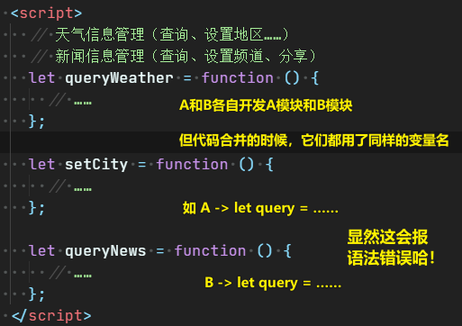
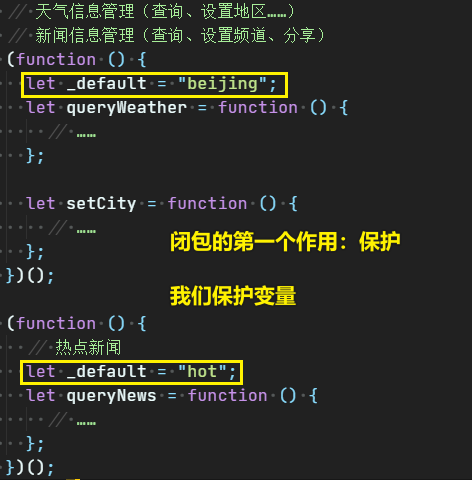
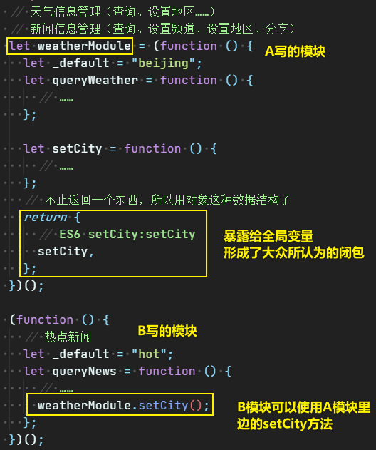
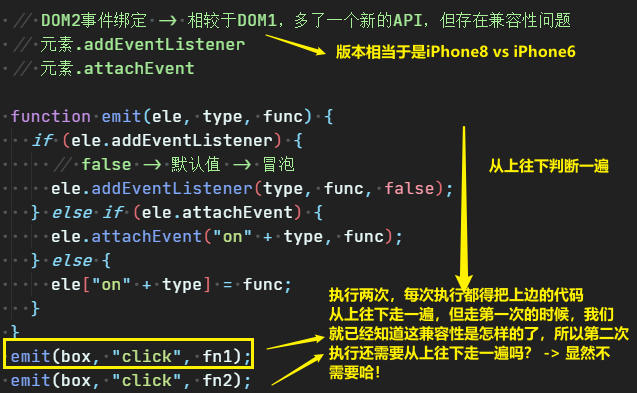
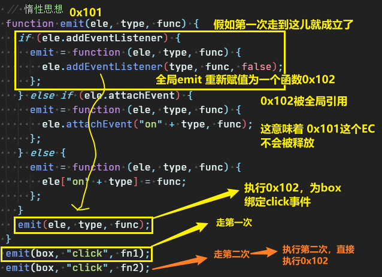

| ✍️ Tangxt | ⏳ 2020-05-27 | 🏷️ JS高阶编程技巧  |

# 09-JS高阶编程技巧（惰性函数和单例设计模式）

## ★为什么讲这个？

我们平时所学的基础知识，其目的是：能够项目当中应用，而前端发展到现在这个阶段，前端应用愈发之复杂，原先只需要具备一些基础知识，就能完成日常工作任务，可如今，你还得学会一些高阶的编程技巧才能胜任之……

## ★惰性函数

> JS堆栈内存处理技巧

### ◇什么是惰性函数？

> 真实项目中的例子，可不是红宝书提到的那个Ajax兼容例子，毕竟该例子在真实项目里边并不实用

简单就是「懒」，可如何才能让代码「懒」起来呢？

#### 例子一

React、Vue等这些框架的存在，让我们做模块化很简单，可没有这些框架之前，我们是如何做模块化开发的呢？

先来说说为何需要模块化开发？



如何做模块化？

使用自执行函数来搞：



> 老师直接把 `(function(){})()`看做是一个闭包，因为变量被保护了……

> 需求：假如一个人需要用到另一个人所写的代码，那该怎么做呢？

如，A写了一个`setCity`方法，而B不打算自己再写一个`setCity`方法，打算用A里边的，所以，这该怎么做呢？

按照上边的代码，B是无法直接访问A里边的`setCity`的，但我们可以把方法给暴露出去：



> 只要是供外边所使用的东西，我们都需要通过`return`给返回出去！

我们利用了「闭包」防止了模块之间的变量污染，而且也顺利完成了模块之间的通信 -> 体现了惰性

如何体现惰性？

不需要写重复代码，如B模块要用A模块的方法，那么直接调用就好了，同理C模块也要用A模块的方法，也是直接调用即可，无须各自都写一个一模一样的方法！

> 函数只是创建一次，就可以让每个模块都用上这个函数了，而无需让每个模块都创建一次一模一样的函数 -> 可谓惰性 -> 可谓「单例」

总结一下：

- 上边的代码其实就用到了「**单例设计模式（最原始的模块化思想）**」 -> 利用闭包机制，把这些变量与方法都给私有化，即「包起来」，保证不与其它模块发生冲突 -> 如果想给其它模块使用的话，直接把相应的东西`return`暴露出去即可
- 如果不需要暴露就直接`return`一个`{}`，并且还得让这个自执行函数赋值给一个变量 -> 简单来说，就是先搭建一个结构出来，至于暴不暴露私有变量，以后再说……反正以后暴露的话，直接在`{}`写即可！

不用Vue、React……的时代，我们都是用「单例设计模式」来搞模块化的！

以上都是通过我们之前所讲的基础知识，来一步一步地往项目里边应用起来的！

话又说回来，为啥这就叫做「高级技巧」呢？ -> 因为此技巧驾驭于闭包这个基础知识之上哈！

---

#### 例子二

体现「惰性思想」的第二个例子：

没有惰性思想：



使用惰性思想（用闭包概念）：

> 走一遍后，下次再执行就不用再走同样的路了……



这相当于我们之前那道作业题：

``` js
let a=0,
    b=0;
function A(a){
    A=function(b){
        alert(a+b++);
    };
    alert(a++);
}
A(1);
A(2);
```

> 作业题？举一反三？ -> 哈哈 -> 我是真得想不到……

话又说回来

这`emit`函数如何体现惰性呢？ -> 做判断这件事儿，只做一次，以后再执行`emit`函数，就不再做了 -> 即让`emit`函数变懒了

虽然用了闭包，但性能上还是有所提高的！

> 惰性思想：有些事儿做一次就够了，以后就不用做了！

在真实项目里边，除了用以上这种惰性思想做兼容判断以外，还有很多事情都可以用惰性思想来玩儿！

如：

``` js
// 通过传递不同的 type 值，让A等于不同的函数，做不同的事情
function A(type) {
  //……
}
```

> 想想 `switch……case` -> TODO List -> CRUD

---

以上体现惰性思想的代码操作，会经常在项目里边遇到，而且你也会发现在一些类库、源码里边也会常常遇到它们……

## ★总结

- 惰性函数 -> 高阶编程技巧 -> 单例设计模式 -> 原理：闭包思想
- 何为惰性？ -> 有些事儿做一次就够了，如自执行函数里边的私有函数只需要创建一个即可（模块之间的通信）、兼容性判断的函数（判断流程只需要走一遍就好）……


