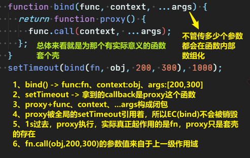
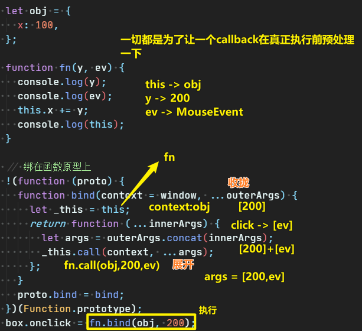
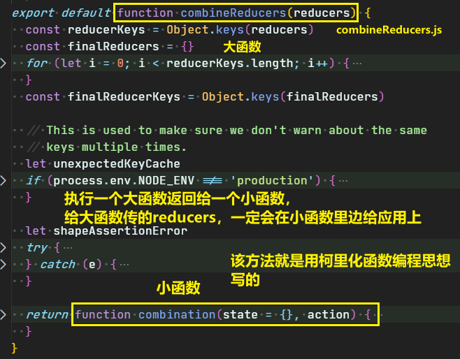
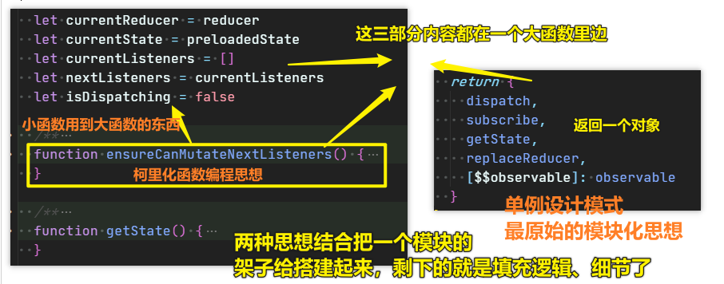
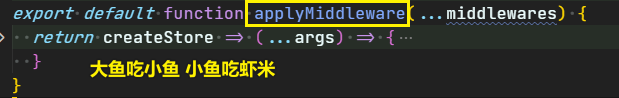

| ✍️ Tangxt | ⏳ 2020-05-28 | 🏷️ JS高阶编程技巧 |

# 10-JS高阶编程技巧（柯理化函数思想）

> 高阶编程技巧还有很多个 -> 有时候我们说这些高阶编程技巧就是一种编程思想，因为这些技巧告诉我们如何写出像模像样的代码

## ★什么是柯里化？

只要

**一个大函数执行 -> 返回一个小函数**

那么就是：柯里化

## ★柯里化对于我们的真实项目意义何在？

没有柯里化：


需求：

> 触发盒子点击事件的时候，把fn执行了，并且让fn中的this指向obj，再给fn传递个200

做法：

``` js
box.onclick = fn.bind(obj, 200);
```

`call/apply` 都会把函数立即执行了（不用点击box，一加载JS就执行），如这样：

``` js
box.onclick = fn.call(obj, 200);
box.onclick = fn.apply(obj, [200]);
```

对于 `bind` 来说，它不会立即执行函数，而是预先存储一些内容！但是，它不兼容IE6、7、8，而 `call` 和 `apply` 都是兼容IE6、7、8

假如我们的需求就是要兼容IE6、7、8，那么现在用 `bind` 这种方式就GG了呀！

所以我们只能用另一种姿势来搞了

### <mark>1）包裹一层匿名函数 + call</mark>

> 点击执行匿名函数 -> 再执行fn

``` js
box.onclick = function() {
  fn.call(obj, 200);
};
```

同理，类似的需求我们都可以这样来搞，如：

我们想要设置一个定时器，如这样：

``` js
setTimeout(fn, 1000)
```

在1s后，再执行fn，同样需要改变this的指向，以及传参，或许你会傻傻地这样做：

``` js
setTimeout(fn.call(obj, 200), 1000);
```

但其实这等价于这样：

``` js
fn.call(obj, 200);
setTimeout(undefined, 1000);
```

回过头来看，我们的需求是1s后执行fn，可不是1s后执行一个 `undefined` ？什么鬼？

而且也不是一加载JS就执行 `fn` 

所以，此时 `call` 和 `apply` 都用不了了，至于 `bind` 由于不兼容IE6、7、8，所以这姿势就放弃了……

所以，凡是「多长时间执行一个fn」，或者「触发事件执行fn」等等这些情况，我们都想要预先把这个fn的this指向以及参数都给指定好再执行fn

而**这种预先性的处理就是柯里化函数思想！ -> 原理是「利用闭包的机制（保存机制），把一些内容事先存储和处理了，等到后期需要的时候拿来用即可」**

而柯里化要解决的问题就是这种「预先处理」

所以，我们的定时器可以写成这样：

``` js
setTimeout(function() {
  fn.call(obj, 200);
}, 1000);
```

这同之前的：

``` js
box.onclick = function() {
  fn.call(obj, 200);
};
```

一模一样（思想是一样的，包裹一层函数就行了）……只是一个是定时自动触发，一个是我们用户交互触发罢了！

所以，这时，有了这样一个需求：

遇到以上所述的情况，我们可以通过一个方法来对这个 `fn` 做预先处理！

如 `bind` 方法就是这么搞的

> 突然觉得周老师讲JS是真得牛逼啊！这真得是在告诉我为啥需要「柯里化函数思想」呀！例子举得很贴近生产项目实战……

## ★柯里化函数

### ◇无扩展到原型的柯里化函数

``` js
/**
 * @description: 预先处理内容
 *  @param
 *   {Function} func 要执行的函数
 *   {Object} context 需要改变的this指向
 *   {Array} args 给函数传递的参数
 *  @return:
 *   返回一个代理函数（匿名函数也行，只是想给有意义的名字，好说明意图罢了）
 */
function bind(func, context, ...args) {
  return function proxy() {
    func.call(context, ...args);
  };
}
setTimeout(bind(fn, obj, 200, 300), 1000);
```

解释一下上边这代码：



> 我们真正要执行的那个函数是 `func` 呀！

### ◇扩展到原型的柯里化函数

``` js
 !(function(proto) {
   function bind(context = window, ...outerArgs) {
     let _this = this;
     return function(...innerArgs) {
       let args = outerArgs.concat(innerArgs);
       _this.call(context, ...args);
     };
   }
   proto.bind = bind;
 })(Function.prototype);
```



之前我们不用 `bind` 是为了兼容性，可现在，上边这代码显然存在兼容性哈，所以我们写了一个兼容所有浏览器的写法：

``` js
!(function(proto) {
  function bind(context) {
    context = context || window;
    var _this = this;
    var outerArgs = Array.prototype.slice.call(arguments, 1);
    return function proxy() {
      var innerArgs = [].slice.call(arguments, 0);
      var args = outerArgs.concat(innerArgs);
      _this.apply(context, args);
    };
  }
  proto.bind = bind;
})(Function.prototype);
```

> 上述方法已经能够解决绝大多数的bind的需求，但是上面没有考虑在对bind之后的函数使用new操作符的情况

话说，上述这俩方法有啥用？

其实没啥用，毕竟日常开发中不需要去兼容`bind`了

老师主要是想要大家明白「柯里化函数编程思想」到底是怎么一回事，怎么来玩儿哈！

### ◇我们需要掌握的

> 上边的两个bind方法，目前不需要理解

柯里化函数编程思想：

``` js
function bind(func, context, ...args) {
  return function proxy() {
    func.call(context, ...args);
  };
}
```

在 redux 源码里边：



还有`createStore.js`模块也是如此：



还有`bindActionCreators.js`：

``` js
function bindActionCreator(actionCreator, dispatch) {
  return function() {
    return dispatch(actionCreator.apply(this, arguments))
  }
}
```

> 返回一个代理函数……

还以柯里化嵌套着柯里化 `applyMiddleware.js`：



可见：

- 柯里化函数编程思想，在真实项目里边贼鸡儿常用
- 我们自己写代码的时候，也经常会搞出大函数返回代理小函数 -> 大函数存储一些值，供以后调用小函数时调取使用 -> 这一过程是利用闭包机制完成的！

## ★作业题

编写一个ADD函数满足如下需求：

``` js
add(1);       //1
add(1)(2);    //3
add(1)(2)(3); //6
add(1)(2,3);  //6
add(1,2)(3);  //6
add(1,2,3);   //6
```

➹：[手写 new, call, apply, bind, reduce, currying， 防抖节流 源码，并配上详细分析 - 掘金](https://juejin.im/post/5eb4c7c96fb9a043807be995#heading-5)

➹：[前端基础进阶（十）：深入详解函数的柯里化 - 简书](https://www.jianshu.com/p/5e1899fe7d6b)

## ★总结

* 当你再次使用bind方法的时候，请想着，就是为这个callback预处理一下，如指定它的 `this` 为开发者所想要的
* 大鱼吃小鱼 小鱼吃虾米

## ★Q&A

### <mark>1）在VS Code里边，如何给函数一个注释？</mark>

参照一些范例，定义代码片段

➹：[Use JSDoc: Index](https://jsdoc.app/)

➹：[能让你开发效率翻倍的 VSCode 插件配置（中） - 掘金](https://juejin.im/post/5ad13d8a6fb9a028ce7c0721)

➹：[编程注释规范 - 简书](https://www.jianshu.com/p/822aa0077595)

### <mark>2） `...args` 语法？</mark>

剩余参数语法允许我们将一个不定数量的参数表示为一个数组

``` js
function max() {
  var values = Array.prototype.slice.call(arguments, 0);
  // ...
}
max(1, 2, 3);
```

等价来看：

``` js
function max(...value) {
  // ...
}
max(1, 2, 3);
```

> 实参展开，形参数组化

➹：[Rest parameters - JavaScript - MDN](https://developer.mozilla.org/en-US/docs/Web/JavaScript/Reference/Functions/rest_parameters)

➹：[javascript - What is the meaning of "...args" (three dots) in a function definition? - Stack Overflow](https://stackoverflow.com/questions/42184674/what-is-the-meaning-of-args-three-dots-in-a-function-definition)
