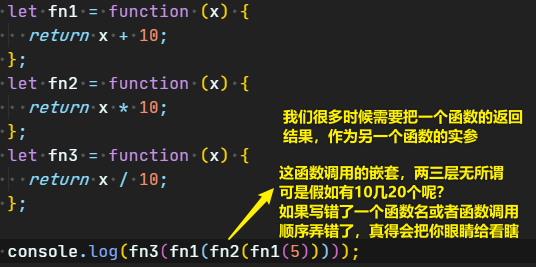
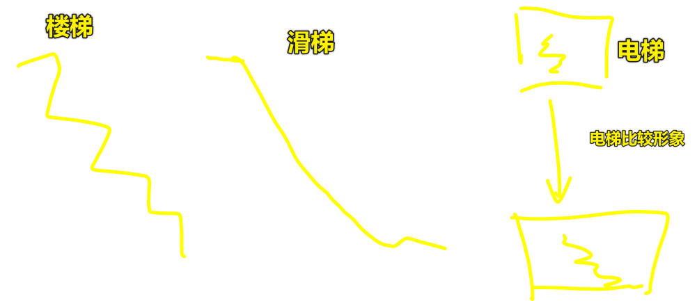
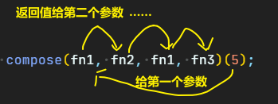
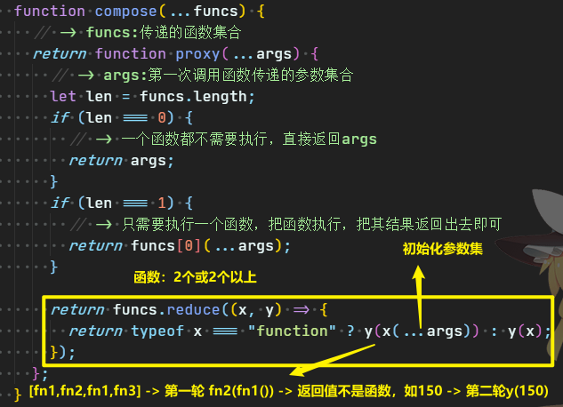

| ✍️ Tangxt | ⏳ 2020-05-29 | 🏷️ JS高阶编程技巧 |

# 11-JS高阶编程技巧（compose函数实现函数调用扁平化）

## ★这东西是个啥？

这东西在项目里边挺常用的！

### ◇为什么需要这个东西？



当然，你也可以这样写：

``` js
let x = fn1(5);
x = fn2(x);
x = fn1(x);
x = fn3(x);
console.log(x); //16
```

虽然看上去比刚才的容易懂了点，但是量多了，这种姿势也就变质了呀！如需要调用30个函数去处理，那么你得需要写30次 `x = fnn(x)` ，而这简直就是体力活呀！ -> **这两种姿势形式上都不好看！**

假如存在一个API，可以这样：

``` js
compose(fn1, fn2, fn1, fn3)(5) //16
```

岂不是让人感到美滋滋？

所以我们该如何实现这个 `compose` 函数呢？

compose -> 函数调用的扁平化 -> 把嵌套调用，变成是一个个同级参数调用

话说，何为扁平化？

``` js
// 层级嵌套
console.log(fn3(fn1(fn2(fn1(5)))));

// 同一级写即为扁平化
compose(fn1, fn2, fn1, fn3)(5)
```

简单来说，本来你是走楼梯下去的，可是你用某种手段居然把楼梯变成了滑梯，你看同样是下去，坐滑梯岂不是更舒服、更轻松？或者你也可以认为楼梯扁平化的结果就是电梯……想象一下，你（是个参数）在楼顶，每走一层楼就相当于嵌套一层调用，当走完十层楼后，你已经气喘嘘嘘了，而你做电梯的话，从楼顶直接坐下来，简直so easy！



> 把一层层楼看成是一个个函数调用

话又说回来， compose 的执行过程是怎样的呢？



## ★如何写这个东西？

一步步来看：

``` js
// 什么都不传，直接返回5
compose()(5); // -> 5

// 传一个函数就执行一个函数
compose(fn1)(5); // -> fn1(5) -> 15

// 传多个就执行多个
compose(fn1, fn2)(5); // -> fn1(5) -> fn2(15) -> 150
compose(fn1, fn2, fn1)(5); // ……
compose(fn1, fn2, fn1, fn3)(5);
```

> `compose` 也是依托于柯里化函数编程思想进一步深造出来的东西

### ◇写这个东西的步骤顺序

#### 1、柯里化函数编程思想

``` js
 function compose(...funcs) {
   return function proxy() {};
 }
```

#### 2、确定参数

``` js
function compose(...funcs) {
  // -> funcs:传递的函数集合
  return function proxy(...args) {
    // -> args:第一次调用函数传递的参数集合
  };
}
```

> 传给第一个函数的参数，可能有多个

#### 3、特殊情况处理：不传函数、只传一个函数

``` js
function compose(...funcs) {
  // -> funcs:传递的函数集合
  return function proxy(...args) {
    // -> args:第一次调用函数传递的参数集合
    let len = funcs.length;
    if (len === 0) {
      // -> 一个函数都不需要执行，直接返回args
      return args;
    }
    if (len === 1) {
      // -> 只需要执行一个函数，把函数执行，把其结果返回出去即可
      return funcs[0](...args);
    }
  };
}
```

#### 4、特殊情况处理：传多个函数呢？即传2个或2个以上的函数该怎么处理？

> 如何实现这种操作： `fn1(...args)` -> 返回值 `xxx` -> `fn2(xxx)` ，而且这种操作要一直下去，直到满足某种条件就结束

利用reduce这个数组方法，我们可以这样：



> 看到reduce咩有传第二个参数，那么第一反应是，callback的x、y分别是`fn1`和`fn2`，直到y为最后一个元素值，结束reduce的处理！ -> 得到我们想要的结果
> 
> 在没有reduce这个API之前，实现函数调用的扁平化需要手撸一个reduce，当然，这不需要100%实现，只要满足上边体现出来的功能即可！

优化一下：

``` js
function compose(...funcs){
    return function(...args){
        let result,
            len=funcs.length;
        if(len===0){
            result=args;
        }else if(len===1){
            result=funcs[0](...args);
        }else{
            result=funcs.reduce((x, y) => {
                return typeof x === 'function' ? y(x(...args)) : y(x);
            }); 
        }
        return result;
    }
}
```

---

compose这东西在我们真实项目里边是很常用的，毕竟我们的项目总会遇到一个函数执行完的结果，作为下一个函数执行的实参，如果函数调用层级比较多的话，我们肯定得用compose这个东西来搞！（不想干苦力活就用compose这个东西吧！）

对了，在redux源码里边也有个`compose.js`模块：

``` js
function compose(...funcs) {
  if (funcs.length === 0) {
    return arg => arg
  }

  if (funcs.length === 1) {
    return funcs[0]
  }

  return funcs.reduce((a, b) => (...args) => a(b(...args)))
}
```

该模块不是直接return一个小函数，而且我用了该模块去测试，发现结果不对，看了注释：

``` js
compose(f, g, h)
// <=> 
(...args) => f(g(h(...args)))
```

也就是说，它是倒过来的 -> 从最后一个开始执行，从右往左嵌套调用执行！

不管怎样，记住老师讲的那个compose就好了！

## ★总结

- 形式上改变这种姿势： `fn(fn1(fn2(fn3('hi'))))` -> `compose(fn3,fn2,fn1,fn)('hi')`

## ★Q&A

### <mark>1）reduce的用法？</mark>

reduce语法：

``` js
arr.reduce(callback(accumulator, currentValue[, index[, array]])[, initialValue])
```

仔细看来：

1. 你使用 `reduce` 这个API

   1. 必须传 `callback` 

      1. 必须传 `acc` 、 `cur` 

   2. 不传 `initialValue` -> Source Array ( `src` )的第一项就是callback的第一个参数 `acc` 的初始值

例子：

``` js
let arr = [10, 16, 30, 66];
arr.reduce((x, y) => {
  console.log(x, y);
  return "@";
});
// 10 16、@ 30、@ 66
```

解析：

在reduce的肚子里边，会有个for循环在执行这个callback，而callback的返回值就是下一轮循环执行callback的第一个参数值

第一轮循环：

如果我们对reduce不传第二个参数，那么x的初始值就是数组第一项的值，每一次callback返回的结果作为下一次x的值，而y则是数组第二项值

如果我们传了第二个参数`5`，那么x的初始值就是`5`，而`10`则是y的值……

所以：

1. `10 16`
2. `@ 30`
3. `@ 66`

y的值始终是数组中的某一项，而x则是callback处理过后的返回值，当然第一次处理比较特殊，这关系到对reduce有咩有传第二个参数！

例子：

``` js
// 对数组每项求和
  let arr = [10, 16, 30, 66];
      let sum = arr.reduce((x, y) => {
        return x + y;
      });
      console.log(sum); // -> 122
```


➹：[Array.prototype.reduce() - JavaScript - MDN](https://developer.mozilla.org/en-US/docs/Web/JavaScript/Reference/Global_Objects/Array/Reduce)

➹：[JS reduce方法源码解析 - 掘金](https://juejin.im/post/5e647b425188252c1f223d61)

➹：[手写 new, call, apply, bind, reduce, currying， 防抖节流 源码，并配上详细分析 - 掘金](https://juejin.im/post/5eb4c7c96fb9a043807be995#heading-4)


