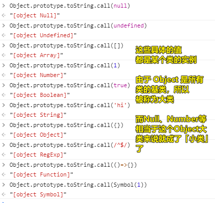
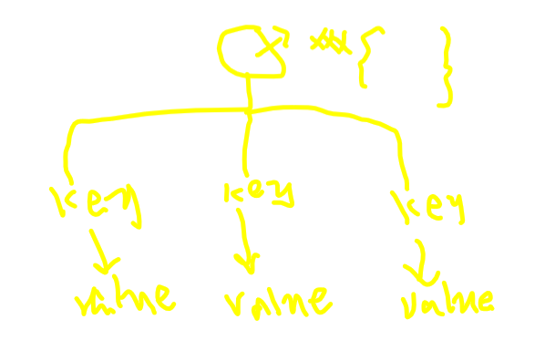

| ✍️ Tangxt | ⏳ 2020-05-30 | 🏷️ JS 面向对象编程 |

# ★12-面向对象编程概述和 NEW 的实现原理

> 有面向对象和面向过程这两种流派，当然还有其它流派，如函数式流派

## ★了解几个概念

- 对象、类、实例

简单来说：

- 对象：万物皆对象 -> 一种泛指大自然当中的所有事情，你在大自然所遇到的真实存在的东西，就是我们要学习和研究的对象 -> 在 JS 中我们所有学习和研究的东西，都统称为对象、事物，注意这可不是指的是那个「对象数据类型」哈！
- 类：对象的细分 -> 在大自然里边根据事物的特点和功能，来对事物进行分类 -> 如动物类、植物类……
- 实例：类中具体的事物 -> 人类（男人、女人）

在 JS 里边，如果我们用面向对象编程的眼光来看的话，那么我们可以这样看一个个字面量（都是某个具体类型的实例，这种实例区别于我们所认为的`{key:value}`这种数据结构）：

``` js
1 -> Number
'A' -> String
true -> Boolean
null -> Null
undefined -> Undefined
[] -> Array
/^$/ -> RegExp
function(){} -> Function
{} -> Object
```



自然界的效果：大类 -> 小类 -> 实例

JS 编程世界的效果：Object -> Number…… -> 1……

对了，你写了这么一个元素：

``` html
<div id="box1" class="box"></div>
```

然后，`dir(box1)`一下：

你可以看到该 box1 DOM 对象的`__proto__`是这样子的：

```
div#box1.box -> HTMLDivElement -> HTMLElement -> Element -> Node（元素节点、文本节点啥的） -> EventTarget（为了能够使用 DOM2 的 API） -> Object
```

可见，每一个元素标签（元素对象）都有一个自己所属的大类，而且这流向的尽头是`Object` -> 每一个实例都可以调用所属类（整条链）中的属性和方法，就像是男人有人类的特征，人类也有动物的特征，所以男人也有动物的特征……

对「万物皆对象」的理解也有这么一种说法：JS 里边所有的东西（数据）最终都会回归到`Object`这个基类上

---

<mark>Q：「子类属于父类的实例吗？」</mark>

> 不属于哈！子类是父类里边派生出来的！实例一定是具体的东西，而类是一个类别的划分，如你不能说男人类是人类的实例，它们都是类，但这只是大和小的区别 -> 简单来说，可以理解成「分支」，大类细分的结果……如对于 div 元素 DOM 对象，Node 细分成了 Element，而不是其它的类

把具体的数据值看成是类似 7 个小矮人这样具体的存在 -> 编程就是在把数据处理成我们想要的

---

<mark>Q：「一种对 JS 的思考姿势？」</mark>

JS 提供了好多内置类，把我们要研究和学习的东西都提供好了，如我们想学习数组，就得拿出`Array`的某个实例，如`[]`来研究

如果把`[]`这个研究明白了，那么学习到的 Array 的其它实例都具备共同的特点 j -> 学习 JS 一种方式

如果我们学完面向对象了，也理解 JS 面向对象了，那么我们的思想不应该是我要学一个方法，然后去看它的 API 咋滴咋滴……当然，这种姿势也没问题，但是我们脑子里边第一个想到的是，`[]`这东西是属于哪个类的实例

我们先去研究这个类上的特点 -> 再研究这个类是基类还是子类 -> 如果是子类，那么就去研究它的父类 -> 研究父父类 -> 直到 Object 类……

当你把这一条链上的东西都研究明白了，再回归到「实例」本身上，然后再去做什么事情

这样学习 JS 才能成系统性，才能成体系化

总之，学习 JS 的时候，**请按照面向对象的思维去思考事情** -> 这是我们学习面向对象的最核心的最根本的要去做的事情

---

<mark>Q：「为啥需要我们自定义类？」</mark>

JS 默认就为我们提供了好多内置类，但是这些内置类真得可以满足我们日常生活的开发需求吗？ -> 肯定不能哈！

所以，还需要我们开发者自己创造一些类来完成自己的开发需求……

---

<mark>Q：「你在看一个普通对象的时候，请看成一棵树」</mark>



## ★如何创建一个自定义类？

我们创建一个函数 fn：

``` js
function fn() {
  let x = 100;
  this.num = x + 100;
}
```

如果当作普通函数来执行：

``` js
fn();
```

那么会：

1. `fn()` 函数执行
2. 形成一个全新的EC
3. init this -> window
4. init AO(fn) -> {arguments:{}、形参赋值、let x(变量提升)}
5. init 作用域链
6. 代码执行

可如果你`new`一下呢？

``` js
let f = new fn();
```

那么则会这样：

1. new 函数执行
2. EC
3. AO
   1. arguments
   2. 形参赋值
   3. 变量提升
4. init 作用域链
5. 「new」默认创建一个对象 -> 该对象就是当前类的实例
6. 「new」声明其this指向，让其指向这个新创建的实例
7. 代码执行
8. 「new」不论其是否写`return`，都会把新创建的实例给返回出去（特殊点）

具体到代码就是这样：

``` js
function fn() {
  // let obj = {}
  // this = obj
  let x = 100;
  this.num = x + 100; // -> 相当于给创建的实例对象新增一个num属 -> obj.num = 200 -> 因为具备普通函数执行的一面，所以只有 this.xxx = xxx 才和创建的实例有关系，对于，此案例里边的x，只是AO中的私有变量……

  // return obj
}
```

这两个过程因为函数的调用方式不同，导致了我们称呼`fn`的方式也会有所不同：

- `fn()` -> 叫fn为Function的实例
- `new fn()` -> 叫fn为类

> new 的操作就是加糖……

---

<mark>Q：「如果我多次`new`这个`fn`呢？」</mark>

``` js
let f2 = new fn()
console.log(f === f2) //false
```

每一次new出来的都是一个新的实例对象，即一个新的堆内存，毕竟，每次执行`fn`的时候，都会创建一个EC……创建一个`{}`……

---

<mark>Q：「如果我主动`return 10`呢？或者主动`return {x: 2000}`呢？」</mark>

用户自己返回内容：

1. 如果返回的是一个**引用类型值**，则会把默认的返回的实例给覆盖掉（此时返回的值就不再是类的实例了）
2. 如果返回的是一个**基本类型值**，则会返回默认返回的实例（此时返回的值依旧是类的实例） -> 简单来说，不影响默认实例的返回

---

<mark>Q：「检查一个实例是不是属于这个类的？」</mark>

``` js
f instanceof fn
```

> 注意这是可以跨级的，如`[]`是Array的实例，也是Object的实例

## ★校验你是否理解了new的执行原理？

面试题：

``` js
function Dog(name) {
  this.name = name;
}
Dog.prototype.bark = function () {
  console.log("wangwang");
};
Dog.prototype.sayName = function () {
  console.log("my name is " + this.name);
};

// let sanmao = new Dog("三毛");
// sanmao.sayName();
// sanmao.bark();

function _new() {
  //=>完成你的代码
}
let sanmao = _new(Dog, "三毛");
sanmao.bark(); //=>"wangwang"
sanmao.sayName(); //=>"my name is 三毛"
console.log(sanmao instanceof Dog); //=>true
```

请完成这个：

``` js
function _new() {
  //=>完成你的代码
}
```

说白了，让你写个`new`方法：

> 思路，找出new的特殊性，找出与普通函数执行调用的共性

``` js
/*
  * 内置NEW的实现原理
  * @params
  *    Func：操作的那个类
  *    ARGS：NEW类的时候传递的实参集合
  * @return
  *    实例或者自己返回的对象
  */
function _new(Func, ...args) {
  //默认创建一个实例对象（而且是属于当前这个类的一个实例）
  // let obj = {};
  // obj.__proto__ = Func.prototype; //=>IE大部分浏览器中不允许我们直接操作__proto__
  let obj = Object.create(Func.prototype);

  //也会把类当做普通函数执行
  //执行的时候要保证函数中的this指向创建的实例
  let result = Func.call(obj, ...args);

  //若客户自己返回引用值，则以自己返回的为主，否则返回创建的实例
  if (
    (result !== null && typeof result === "object") ||
    typeof result === "function"
  ) {
    return result;
  }
  return obj;
}
```

- `Object.create(Func.prototype)` -> 创建一个对象并让这个对象的`__proto__`指向`Func.prototype`
- `typeof null` -> `object`，所以需要判断下！还有`typeof (()=>{})`是`function`结果
- 不会出现类似这样的情况：如果函数返回一个`1`，那么你new一下的话，就会返回一个Number包装后的对象！ -> 如果构造函数返回基本类型值，那么最终返回的是`obj`，而不是构造函数所返回的基本类型值！

## ★了解更多

➹：[JS 的 new 到底是干什么的？ - 知乎](https://zhuanlan.zhihu.com/p/23987456)

## ★总结

- 你看到的一个个具体的数据值，其实就是一种实例……这种实例不同于大众所认为的像`{key:value}`这样的数据结构！


