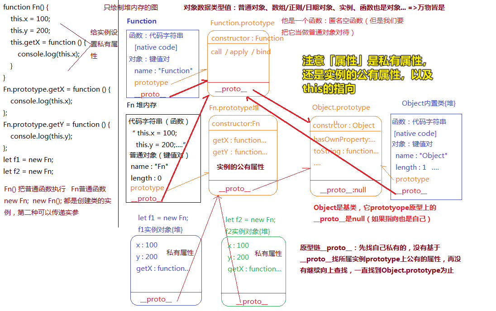
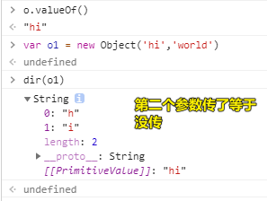
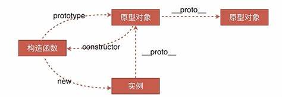
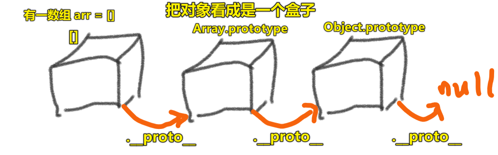

| ✍️ Tangxt | ⏳ 2020-05-30 | 🏷️ JS 面向对象编程 |

# 13-原型和原型链的底层运行机制

## ★什么是原型（`prototype`）？什么是原型链（`__proto__`）？

通过这俩东西可以实现类和实例之间的附属关系和依赖关系

面向对象 -> 要玩的就是类和实例

实例是类的一个具体的事物，每一个实例都能调用所属类上的属性和方法，可为啥这就是能调用的呢？

那是因为「原型」和「原型链」呀！没有这俩东西的存在，你是无法调用的！

想掌握整个 JS 的面向对象机制，其实就是在掌握以下三句话：

- 每一个类（函数）都具备 `prototype`，并且属性值是一个对象
- 对象上天生具备一个属性：`constructor`，指向类本身（作用没有Java里边所描述的那个`constructor`大，毕竟像Java里边的构造器可是可以实现重写和重载的，而JS里边的，则是作为一个路牌用于指路的）
- 每一个对象（普通对象、`prototype`、实例、函数等）都具备：`__proto__`，属性值是当前实例所属类的原型

## ★通过例子理解二者

> 当你面对一些有关原型和原型链的面试题时，请画图 -> 图出答案出

``` js
function Fn() {
    this.x = 100;
    this.y = 200;
    this.getX = function () {
        console.log(this.x);
    }
}
Fn.prototype.getX = function () {
    console.log(this.x);
};
Fn.prototype.getY = function () {
    console.log(this.y);
};
let f1 = new Fn;
let f2 = new Fn;
console.log(f1.getX === f2.getX);
console.log(f1.getY === f2.getY);
console.log(f1.__proto__.getY === Fn.prototype.getY);
console.log(f1.__proto__.getX === f2.getX);
console.log(f1.getX === Fn.prototype.getX);
console.log(f1.constructor);
console.log(Fn.prototype.__proto__.constructor);
f1.getX();
f1.__proto__.getX();
f2.getY();
Fn.prototype.getY();
```

> 只画堆内存，像EC、栈、AO啥的都不画！



---

<mark>Q：`new FN` 和 `new Fn()`的区别？</mark>

基本没区别，都是创建类的实例，如果非得要说一点区别的话，那就是第二种可以传递实参！

> `Fn()`把普通函数执行，`Fn`普通函数，但你加了`new`之后，基本就没啥区别了！

---

<mark>Q：「类似`Fn.prototype`这样的东西，是打哪儿来的？」</mark>

这东西是个实例，既然是实例那么它也是new出来的，可是它是new谁出来的呢？即new哪个类出来的呢？

如果我们都不知道，那么它就是我们new `Object`这个类（函数）的结果！

---

<mark>Q：「`log`一个`Object`，结果是`[native code]`，那么这结果是啥？」</mark>

是用C++写出来的代码，但就是不给我们开发者看，而我们可认为这是一坨「代码字符串」。

---

<mark>Q：「为什么`Object`这个构造函数的length值是1？我dir它看到了很多属性呀！」</mark>

你要知道`length`的值是取决于，该`Object`在定义的时候，定义了多少个形参哈！

如：

``` js
function fn1(x,y) {} // length:2
```

``` js
function fn() {} // length:0
```

所以我们的`Object`构造函数在定义的时候，是有一个「形参」的！只是我们一般就直接 `new Object()` 了，搞得好像`Object`它是不能接收参数一样

当你这样：

``` js
var o = new Object('hi')
dir(o)
```

可以看到`o`是这样一个结构：

``` js
{
  0:'h',
  1:'i',
  length:2
  __proto__:String,
  [[PrimitiveValue]]:"hi"
}
```

当你选择传两个参数的时候：



➹：[Object - JavaScript - MDN](https://developer.mozilla.org/en-US/docs/Web/JavaScript/Reference/Global_Objects/Object)

---

<mark>Q：「万物皆对象？」</mark>

万物皆有`__proto__`

---

<mark>Q：「整个JS面向对象最底层核心，只需要玩会两大点就行了？」</mark>

1. new是怎么来搞的？new搞了哪些事情？ -> 之前重写的那个`_new`
2. 原型和原型链机制是怎么来玩的？ -> 记住那三句话
   1. 构造函数（函数、内置类）都天生具备`prototype`属性，而该属性呢？是个对象哈！
   2. 构造函数的原型（如`Fn.prototype`）都天生自带一个`constructor`属性，该属性指向该原型的所属类，即构造器
   3. 所有对象皆有`__proto__`属性，该属性指向所属类的原型！我们一般都会知道该对象是谁new出来的，那么该`__proto__`就指向谁，如`let o = new Fn()`，那么`o`这对象的`__proto__`指向的就是`Fn.prototype`，同理，`Fn.prototype`这个对象又是来自于谁呢？如果我们知道是谁`new`出来的，那么我们肯定知道`Fn.prototype.__proto__`指向谁，可现在问题是「它是凭空诞生出来的呀！哪知道它是怎么来的」，如果，我们不知道这个对象来自于谁，那么，我们统一把它归属到`Object`作为终止，即`Fn.prototype.__proto__ -> Object.prototype`，说白了，`Fn.prototype`是`new Object()`出来的！

---

<mark>Q：「`Object.prototype`又是谁的实例？」</mark>

不知道，所以是`Object`的实例，所以这样自己指向自己？

``` js
Object.prototype.__proto__ === Object.prototype //？？？
```

由于指向自己是没有意义的，所以，`Object.prototype.__proto__`它指向的是`null`

毕竟，Object它是个基类，意味着终点，结束……

总不能说，撞到南墙之后，还能穿墙吧！

当然，即便可以指向，也是自己哈！但这样有啥意义呢？原地转圈圈吗？

---

<mark>Q：「函数它的`__proto__`指向的又是谁呢？或者说函数它是谁`new`出来的呢？」</mark>

显然是`Function`这个构造器呀！

---

<mark>Q：「实例的公有属性？」</mark>

这是相对于实例来说的，如`f1`和`f2`实例的`__proto__`都指向了`Fn.prototype`，假如`Fn.prototype`旗下有两方法：

1. `getX`
2. `getY`

对于`Fn.prototype`而言这是它的两个私有属性，但对于`f1`和`f2`实例来说，这是「**实例的**公有属性」（不能去掉「实例的」，因为这「公有属性」是相对于实例而言的称呼），即这俩实例都能使用这俩方法！

当你`f1.getX()`和`f2.getY()`时，如果发现自己的私有方法里边没有这俩方法的话，就会通过原型链顺着找上去……即顺着`__proto__`找上去！也就是找到所属类的原型——实例的公有属性

如果一直没找到，那么终点就是基类的原型了，即`Object.prototype` -> 为啥不继续往上找呢？ -> 因为下一步是`null`了

> 如果没有找到，那就是`undefined`值

原型链机制与作用链机制 -> 都是一种惰性寻找机制，即找到了相应的数据，就不会继续往上找了

---

<mark>Q：「`let a = 1`也是new 出来的吗？它是Number的实例吗？」</mark>

它可不是`new`出来的，它属于特殊的一种情况！

---

<mark>Q：「一图胜千言：原型和原型链」</mark>



➹：[前端 JS 中级面试 - 阿闷仔的博客](https://amenzai.me/2018/07/14/interview2/)

---

以上就是面向对象的理论知识，即：

1. new的原理（重写new）
2. 原型和原型链的原理（记住三句话，并且能够通过画图体现出来，遇到考察这个点的面试题，图出答案出）

关于那些考察原型和原型链的面试题：

1. 画图
2. 看图时，确定哪些是私有属性，哪些是「实例的公有属性」
3. 分析函数调用时，确定`this`的指向 -> 大部分都是「点」前边那个东西

## ★了解更多

➹：[「每日一题」什么是 JS 原型链？ - 知乎](https://zhuanlan.zhihu.com/p/23090041?refer=study-fe)

➹：[JavaScript 原型和原型链 - 知乎](https://zhuanlan.zhihu.com/p/39549472)

➹：[prototype 和 __proto__ 的区别 - 方应杭的个人网站](https://fangyinghang.com/prototype-vs-__proto__/)

➹：[JavaScript 世界万物诞生记 - 知乎](https://zhuanlan.zhihu.com/p/22989691)

## ★总结

- 如何写个`new`？
- 理解原型（`prototype`）和原型链（`__proto__`）
- 面对原型和原型链的题，请画图，图完题完
- 原型对象：`Xxx.prototype` -> 实例对象：`new Xxx()` -> 实例的原型指的是原型对象！如 `var x = new Xxx()`，`x`的原型就是`Xxx.prototype`

关于原型链的一种图示理解：



类比CSS里边的盒子概念……一个元素盒子套着另外一个元素盒子……而DOM元素是对象……


