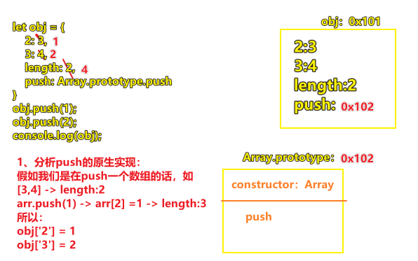
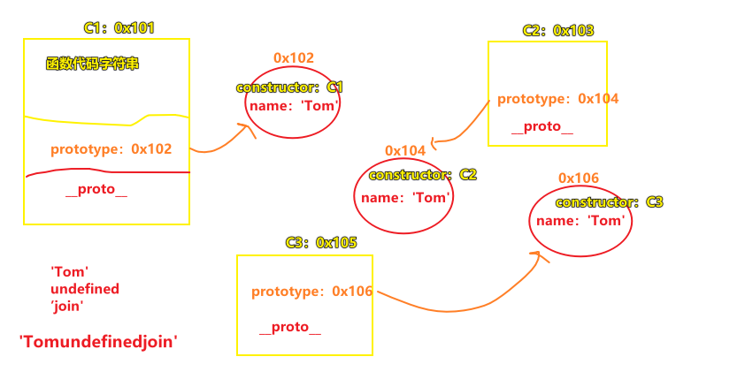
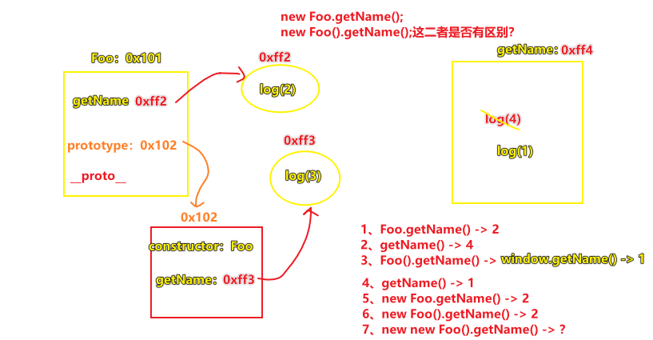
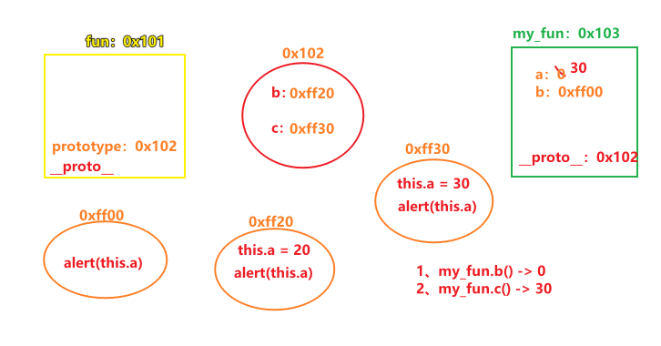

| ✍️ Tangxt | ⏳ 2020-06-01 | 🏷️ 课后作业 |

# 01-课后作业

## 1、 编写一个ADD函数满足如下需求

``` js
add(1);       //1
add(1)(2);    //3
add(1)(2)(3); //6
add(1)(2,3);  //6
add(1,2)(3);  //6
add(1,2,3);   //6
```

不会……

## 2、下面代码输出结果是什么？为啥？

``` js
let obj = {
    2: 3,
    3: 4,
    length: 2,
    push: Array.prototype.push
}
obj.push(1);
obj.push(2);
console.log(obj);
```

分析：



测试正确

## 3、a等于什么值会让下面条件成立

``` js
var a = ?;
if (a == 1 && a == 2 && a == 3) {
    console.log('OK');
}
```

不会……

## 4、写出下面代码执行输出的结果

``` js
function C1(name) {
    if (name) {
        this.name = name;
    }
}
function C2(name) {
    this.name = name;
}
function C3(name) {
    this.name = name || 'join';
}
C1.prototype.name = 'Tom';
C2.prototype.name = 'Tom';
C3.prototype.name = 'Tom';
alert((new C1().name) + (new C2().name) + (new C3().name));
```

解析：



测试正确

## 5、写出下面代码执行输出的结果

``` js
function Foo() {
    getName = function () {
        console.log(1);
    };
    return this;
}
Foo.getName = function () {
    console.log(2);
};
Foo.prototype.getName = function () {
    console.log(3);
};
var getName = function () {
    console.log(4);
};
function getName() {
    console.log(5);
}
Foo.getName();
getName();
Foo().getName();
getName();
new Foo.getName();
new Foo().getName();
new new Foo().getName();
```

分析：



测试，后边俩行代码计算错误 -> 我想这考察的是`new`的优先级吧！

## 6、画图计算下面的结果

``` js
function fun(){
    this.a=0;
    this.b=function(){
        alert(this.a);
    }
}
fun.prototype={
    b:function(){
        this.a=20;
        alert(this.a);
    },
    c:function(){
        this.a=30;
        alert(this.a)
    }
}
var my_fun=new fun();
my_fun.b();
my_fun.c();
```

分析：



测试正确

画图姿势归纳：

1. 一开始就把会出现的引用类型值给画出来
2. 全局声明的函数：用个黄色正方形
3. 属性指定的函数：用橙色椭圆
4. 原型对象：用红色椭圆
5. `prototype`：用橙色文字
6. `__proto__`：用红色文字
7. 实例对象：用个绿色正方形
8. 标明地址
   1. 属性指明的函数用`0xff……`
   2. 函数和实例对象用`0x1……`


## 7、编写plus和minus实现如下需求

``` js
let n = 10;
let m = n.plus(10).minus(5);
console.log(m);//=>15（10+10-5）
```

做法：

``` js
Number.prototype.plus = function plus(n) {
  let num = this.valueOf() + n;
  return new Number(num);
};

Number.prototype.minus = function minus(n) {
  let num = this.valueOf() - n;
  return num;
};
```


