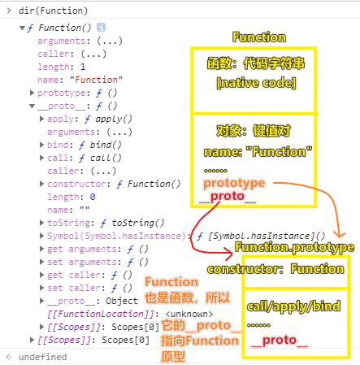
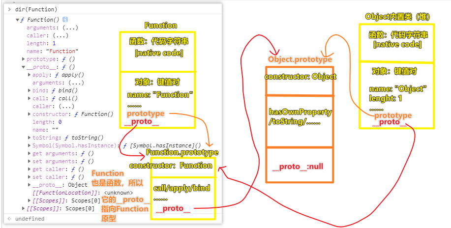
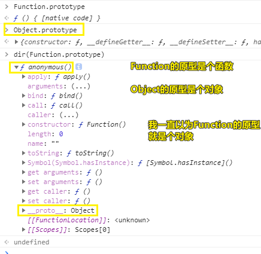
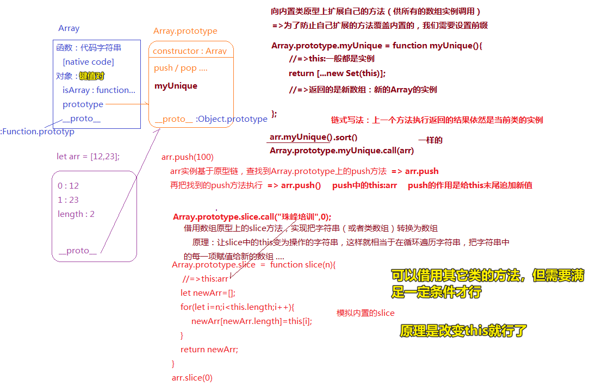

| ✍️ Tangxt | ⏳ 2020-05-31 | 🏷️ JS 面向对象编程 |

# 14-面向对象的深层应用：内置类原型扩展方法和方法借用

> 关于那个画图 -> 以前周老师学习的时候，可是看了很多本书（如红宝书等）才总结出来该如何画那个原型和原型链的图，而现在我们直接就是拿到了周老师所总结出来的知识了！这无疑给我们节省了大量的时间……

## ★函数与对象

我们知道函数也是可以被叫成是对象的，但不管怎样函数终究与普通对象有所不同，对了，还有数组也是如此……

可为啥函数它会与「普通对象」有所不同呢？

我们知道函数是`Function`这个东西的实例，`dir`一下`Function`这东西：



我们知道 `Object`也是个函数，所以它的`__proto__`指向的是函数的原型，即`Function.prototype`

由于我们不知道`Function.prototype`是哪个类搞出来的实例，所以`Function.prototype.__proto__` 指向的就是 `Object`的原型，即`Object.prototype`，用图表示就这样：



---

<mark>Q：「Function 和 Object 哪个牛逼？」</mark>

Function的原型链最终都会流向Object的原型（中间有个Function的原型）

所以说，**Function是Object的实例**

但Object的原型链流向的是Function的原型，所以**Object是Function的实例**

所以哪个牛逼？

不管哪个牛逼，我们就只需要知道（Function和Object都是基类）：

- Function是所有函数的基类
- Object是所有对象的基类

因此，我们就说「类」（如`Function`）是函数，但函数其实也是对象

---

<mark>Q：「一个特殊性，`Function.prototype`它其实是一个函数？」</mark>



Function的原型不是对象，而是函数，当然，这是一个特殊性

这个函数在以前版本叫「empty空函数（好像是noop ）」，而现在版本则是「anonymous匿名空函数」，即这个函数一执行啥都咩有，但它一定是个函数，所以我们就把它当作是个普通对象来对待了！

简单来说，这个匿名空函数跟普通对象没有任何区别，只是它的类型属于函数而已，所以它也是有`__proto__`的

所以，当你看到有人这样写`Function.prototype()`的时候，请不要大惊小怪，如「`Function.prototype`它不是个对象吗？怎么可以执行呢？怎么可以不报错呢？」

不管怎样，Function的原型（`Function.prototype`）是个特殊性，即它是个匿名空函数

> 可以简单理解为标注这是个函数的传参（函数的默认值），有种`null`的调调……

➹：[Function.prototype 居然是一个函数对象 - 知乎](https://zhuanlan.zhihu.com/p/40007030)

➹：[求告知，JavaScript空函数的用途。 - V2EX](https://www.v2ex.com/t/76381)

➹：[空函数 - JavaScript 编码规范](http://itmyhome.com/js/kong_han_shu.html)

➹：[Function - JavaScript - MDN](https://developer.mozilla.org/en-US/docs/Web/JavaScript/Reference/Global_Objects/Function)

---

## ★画个内置类Array的图



> 你画其它Number、String等也是一样的姿势

---

<mark>Q：「`arr.push(100)`的正确读法？（不是简单说「往arr的末尾追加一个元素100」）」</mark>

1. `arr`实例基于原型链，查找到`Array.prototype`上的`push`方法 -> `arr.push`
2. 把找到的`push`方法执行 -> `arr.push()` -> `push`中的`this`指向的是`arr` -> 所以`push`的作用是给`this`末尾追加新值

总之，整个过程是：**先找push方法，然后再执行push方法来实现这个往数组末尾添加元素的功能！（这一点很重要）**

为啥老师要拆成两句话呢？

为了让你能够理解下边这两行代码是一样的：

``` js
arr.push()
Array.prototype.push.call(arr)
```

都是先找到`push`方法，然后再去调用执行。

前者找方法是数组实例通过`__proto__`原型链来找的（**找实例的公有属性**），而后者则直接通过Array的原型来找的（**找自己的私有属性**）！

---

<mark>Q：「arr（`new Array`的结果）的原型，这是在表示啥？」</mark>

表示的是「`Array.prototype`」

---

<mark>Q：「为啥要新增方法？如何新增方法？」</mark>

为啥？

因为Array提供的内置方法不够用呀！所以我们要追加自定义的方法……如数组去重等等

怎么做？

> 向内置类原型上扩展自己的方法 -> 目的：供所有的数组实例调用

规范：

- 为了防止自己扩展的方法覆盖内置的，我们需要设置前缀，如`myXxx`
- 在写自定义方法时，如`Array.prototype.myXxx = function myXxx(){}`，函数表达式一定是具名的，这是官方规定的标准，而这其实是有好处的，那就是在函数体里边可以使用该`myXxx`，这样在递归调用自己的时候就很方便了，而不是使用caller那个方法，毕竟该方法在严格模式下是被禁用的，所以请不要用匿名函数呀！如这样`Array.prototype.myXxx = function(){}` -> 即便是具名的，全局也无法直接访问它！只有该函数体内部才能使用该函数名去做一些事儿……

数组去重：

``` js
Array.prototype.myUnique = function myUnique() {
  // 返回的是新数组 -> 新的Array的实例
  return [...new Set(this)]
}

let arr = [1,1,2,2,3,4,5,5]
arr.myUnique() // [1, 2, 3, 4, 5]
```

> 返回一个新数组实例，是为了**链式写法** -> **上一个方法执行返回的结果依然是当前类的实例**，如`arr.myUnique().sort()`

同理，你可以试着完成这样一个需求：

编写plus和minus实现如下需求：

``` js
let n = 10;
let m = n.plus(10).minus(5);
console.log(m);//=>15（10+10-5）
```

> 体现了如何往内置类的原型上扩展方法，也体现了如何实现链式调用

---

## ★面对一个原生数组方法，为何不去想想它是如何实现的呢？ & 方法借用

如`slice()`

1. 想想平时如何用这个方法，如`arr.slice(0,10)` -> 包前不包后`[0,10)` -> `arr.slice(0)` -> 从0开始截取到末尾
2. ……

简单模拟内置`slice`的实现：

``` js
Array.prototype.slice = function slice(n) {
  let newArr = [];
  for (let i = n; i < this.length; i++) {
    newArr[newArr.length] = this[i];
  }
  return newArr;
};

let arr = [1, 2, 3, 4, 5];
console.log(arr.slice(2)); // [3,4,5]
```

假如让`this`的指向为一个字符串呢？如：

``` js
"我是你大爷".slice(2) //你大爷
Array.prototype.slice.call("我是你大爷", 2) //[ '你', '大', '爷' ]
```

> 字符串实例的原型上也有个`slice`方法，在这里我们不讨论第一行代码，而是第二行代码：字符串借用了数组的`slice`方法

为啥字符串能够借用数组的`slice`方法呢？

我们可以看到，这第二行代码：借用数组原型上的`slice`方法，来实现把字符串（或者类数组）转换为数组

这其中的原理很简单：

让slice中的this变为要操作的字符串就行了，这样就相当于在循环遍历字符串，把字符串中的每一项赋值给了新的数组……

我们用字符串借用了数组的方法，当然，这不是随意就能借用的，你得符合某种数据结构才能借用（有length属性，都能循环遍历等），你想如果你用一个数值去借用岂不是GG了？

> 我们似乎可以把方法看成是一个独立的函数定义，我们在用面向对象那一套姿势调用某个方法的时候，如`xxx.Yyy()`，可以拆开成一个独立的`Yyy()`，`xxx.`这个前缀无非就是方便为`Yyy`这个方法指定了`this`罢了！

## ★了解更多

➹：[数组操作（讲义） - 知乎](https://zhuanlan.zhihu.com/p/34138332)

➹：[数组方法小结](https://mp.weixin.qq.com/s?src=11&timestamp=1591011613&ver=2374&signature=wvsXidbZFGLNoj852wpikNqjheFVztLpYtCvuGz3nXh9visQAqH9*kYhIvZRZZNlXEM0B5NtCbKRJ3WCFdQLlNg*NisKd0zzY9H58rz3lDRf2GGzmDxW3C3H90GJX*mW&new=1)

➹：[通过实现25个数组方法来理解及高效使用数组方法(长文,建议收藏)](https://mp.weixin.qq.com/s?src=11&timestamp=1591011613&ver=2374&signature=x7qLVsfcFr8tp1RpiJk2VV3uem*D0-CBfvjUf9KxG6yWOBfY2-S6A3fADpTdNwfgfPNl2ayMu8TSV8MjBWCA*jZ1a8tk9AouuuSjH*3DwkQcW5cXCXz61M1uI2LJTCSg&new=1)

➹：[JavaScript 常用数组操作方法](https://mp.weixin.qq.com/s?src=11&timestamp=1591011613&ver=2374&signature=QK1RJLIxcCtd93-mhlEHG1tH0LN5ED5CJnScjELqv7XDKNohCuwxXGnqZbmV*-JNA0HbkyK1KXKi-mqGjomKQTEYloGiFDNap*izXuv5INwvCPMuenwi1NOISWZontPc&new=1)

➹：[15个非常著名JavaScript数组方法，每个前端开发人员都应该知道](https://mp.weixin.qq.com/s?src=11&timestamp=1591011613&ver=2374&signature=fh3A1IrkpcmZW3WHtpt5GcAttjBG9oB6S0bsfWEHLY9w0xDuIzatXyRRDYv*e4ShFalDra*fxRtiytTJP1P5RWTgS5IH*5m-a5KpqDOIIdhAA2ZF-iBMHbzIElHKhx79&new=1)

➹：[从Chrome源码看JS Array的实现 - 知乎](https://zhuanlan.zhihu.com/p/26388217)

## ★总结

- 不要认为`Array.prototype.slice`这个`slice`方法是专门用来为数组实例来服务的，你像如字符串、类数组都可以用……只要满足某种数据结构条件就行了!
