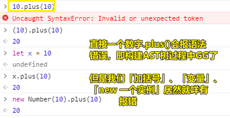
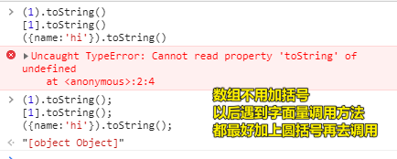
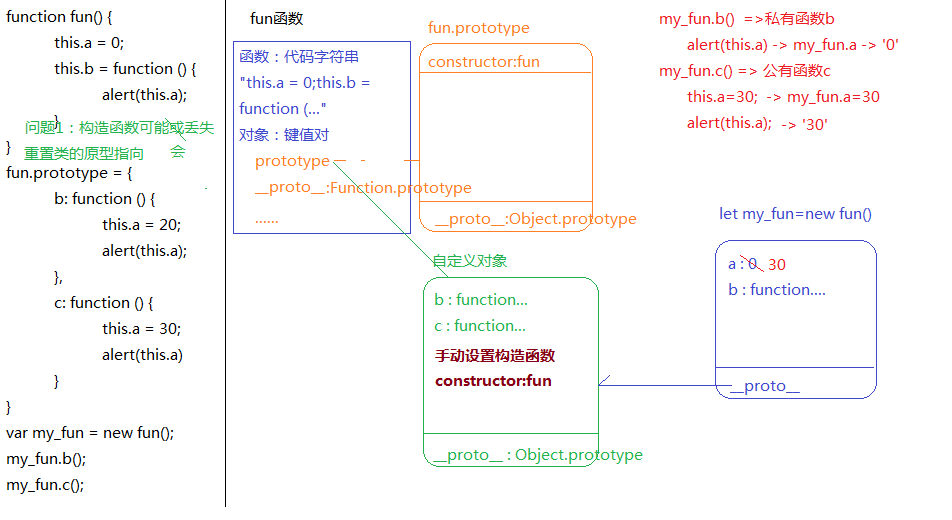
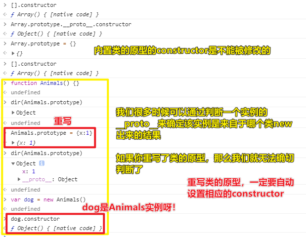
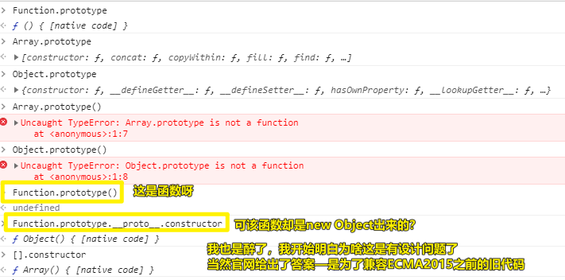

| ✍️ Tangxt | ⏳ 2020-06-01 | 🏷️ JS面试题 |

# 15-综合面试题讲解1：面向对象

> 这些面试题，都来自于大厂的面试题 -> 讲解顺序，由简单到难的！（最难的是那个add函数题）

## ★编写plus和minus实现如下需求

``` js
let n = 10;
let m = n.plus(10).minus(5);
console.log(m);//=>15（10+10-5）
```

分析：

1. 能够让一个数字能调一个方法 -> 这就是面向对象里边提到的**实例可以调取所属类原型上的方法**
2. 实例调方法
   1. 首先看这方法是不是私有的 -> 不是私有的 -> 就找它所属类的那个原型方法 -> 如果原型也没有，那就一直向上找呗！直到找到`Object`这个基类为止
3. 实例能调不知名的方法 -> 意味着 -> 我们需要往实例所属的内置类的原型添加自定义方法
4. 语法合理性、语法规范性 -> 匿名函数改为具名函数，虽然是具名函数，但在全局是不能用的！只能在该具名函数内部有用！ -> 用于递归
5. 考虑容错性
6. `new Number(10) + 10` -> 这是可以直接相加的 -> 20

代码：

``` js
// 函数表达式，不要匿名的，而这是规范
Number.prototype.plus = function plus(num) {
  // this -> 我们要操作的那个数字实例（对象）
  num = Number(num);
  // 容错性处理
  if (isNaN(num)) {
    num = 0;
  }
  // 返回Number类的实例，实现链式写法 -> 不写用new Number(10)这样的姿势
  // 你看我们之前都是一个数字调用一个方法
  return this + num;
};

Number.prototype.minus = function minus(num) {
  num = Number(num);
  if (isNaN(num)) {
    num = 0;
  }
  return this - num;
};

let n = 10;
let m = n.plus(10).minus(5);
console.log(m); //=>15（10+10-5）
console.log(n.plus(20)); //  -> 30
```

对比自己的答案：

- 没有判断传入的参数是否合理
- 返回值其实不用返回一个`new Number()`，直接返回一个数值就可以了
- `new Number(10) + 10` -> 这是可以直接相加的 -> 20，不需要你`valueOf()`一下，再相加！

代码优化：

> 提取重复代码 -> 创建一个函数 -> 一般现在用函数表达式来创建，这是为了防止函数声明提升 -> 保证是真正的先创建再使用，即写在后边的函数，不能提升到前边去！不然这不符合我们的思维习惯！

``` js
!(function anonymous(proto) {
  const checkNum = function checkNum(num) {
    num = Number(num);
    if (isNaN(num)) {
      num = 0;
    }
    return num;
  };

  Number.prototype.plus = function plus(num) {
    return this + checkNum(num);
  };

  Number.prototype.minus = function minus(num) {
    return this - checkNum(num);
  };
})(Number.prototype);
```

知识：

以后我们在实现一个功能的时候：

1. 实现功能 -> 代码可能并不好看
2. 提取冗余代码 -> 如检查参数是否合理
3. 保证私有化（防止与人家的东西冲突） -> 闭包（具名函数，老师认为闭包就是个函数，如自执行函数）包起来 -> 多处用到的变量，如`xxx.prototype`就用个形参提取出来
4. 保证可扩展性 -> 下次追加方法，直接添加即可

---

<mark>Q：「为啥`new Number(10) + 10`返回20？」</mark>

因为Number类型有特殊性：`[[PrimitiveValue]]: 10`

Number类型的值在加一个数值的时候，会调用valueOf方法，即`(new Number(10)).valueOf()` -> 返回10

而数组在加一个10的时候，即`[10]+10`，则会调用`[10].toString()` -> 返回`"1010"`

---

<mark>Q：「为啥`10.plus(10)`会报语法错误？」</mark>



> 因为`10.`的`.`被视为浮点数的点，我们加`()`意味着`.`不是浮点数的点，而是用于对象方法的点运算符，由于需要调用方法，那么就会把`10`包装成`Number`对象，以此来调用它的`toString`方法！

题外话：

创建一个数据类型值（有两种姿势）：

1. 字面量方式
2. 构造函数方式

但不论哪一种方式，**所创建出来的结果都是所属类的实例**

如：

``` js
let x = 10 // -> 字面量方式
let y = new Number(10) // -> 构造函数方式
```

当然，对于基本类型而言，这两种姿势是不一样的：

1. 字面量方式创建出来的是「基本类型值」
2. 构造函数方式创建出来的则是「引用类型值」

这一点，你打log就能看出来了：


当然，不管用哪种姿势创建出来的，它们都是`Number`的实例，都可以调用Number的原型方法，只是一个是基本类型值，一个是引用类型值，说白了，它在内存里边的存储位置是不同的，一个是Stack，一个则是Heap

> 错误认识：能调用方法，可不是得满足像`{}`这样的数据结构才有的能力，我一直以为`(1).toString()`是把`1`对象化了，再去调用，其实不然啊！只要是属于某个类的实例都可以去调用，即便形式上有所不同！而且我们有先入为主的观念，即能调用方法，必须得是`{}`这样的数据结构！
> 
> 正确认识：把基本类型值包装了一下再去调用……

对了，我们这样写：

``` js
y.valueOf() === 10 // -> true
```

其实就是在获取y对象的原始值，即基本类型数字`10`

当我们`y+10`的时候，是先调用`valueOf()`拿到基本类型值（原始值）再去相加！

不过，对于引用类型而言，创建一个数据类型值的两种姿势咩有区别：

``` js
let x = [10]
let y = new Array(10) // -> 创建一个数组长度为10的数组
y = new Array('10') // -> 一个数组元素'10'
y = new Array(10,0) // -> 两个数组元素
```

因为创建出来的都是引用类型值！

关于加圆括号调用方法：

``` js
(1).toString();
[1].toString();
({name:'hi'}).toString();
```

注意加分号，不加分号会报错的：



> 布尔值、字符串值，不用加圆括号！ -> 但建议最好加上，这样就不用记那么多东西了！就像是优先级，你加了圆括号，就不用考虑优先级了！

## ★画图计算下面的结果

``` js
function fun(){
    this.a=0;
    this.b=function(){
        alert(this.a);
    }
}
fun.prototype={
    b:function(){
        this.a=20;
        alert(this.a);
    },
    c:function(){
        this.a=30;
        alert(this.a)
    }
}
var my_fun=new fun();
my_fun.b();
my_fun.c();
```

分析：



---

<mark>Q：「let x = 10的运算顺序？」</mark>

之前老师讲的是：

1. let x
2. 10
3. 关联

现在则是（赋值运算符，右侧先行）：

1. 10
2. let x
3. 关联

当然，不管顺序是咋样的，这都不会影响我们的代码运行！

其实在我看来应该是这样：

1. let x -> 变量提升 -> 声明了但未初始化，如果是`var`声明的，那就是「声明并初始化为`undefined`值」
2. 10 -> 创建一个值（在Stack里边）
3. x = 10 -> 关联，初始化，如果是`var`声明的，那就是「关联，赋值」了

---

<mark>Q：「重置类的原型指向？」</mark>

构造函数可能会丢失（99%的可能）

为了保证原型和原型链机制的完整性，请手动设置一下构造函数

毕竟我们要通过它显示确保一下，这个`fun.prototype`是属于哪个类的原型，而知道了这是哪个类的原型，那么实例就够知道自己的原型链`__proto__`该指向谁了，当然，没有`constructor`也能指向，只是写了会更好，更容易让我们开发者知道这个实例的原型链指向 或者 该实例是谁new出来的！

更何况，`constructor`是一个很有用的东西，尤其是在后台，如Java语言里边，当然，我们之后在搞深拷贝的时候也会用到`constructor`，既然有用到它，可如果你把它给删了，那就不好了！

总之，必须要有`constructor`，不然如果出现要使用`constructor`的场景，那就GG了！

> 一般来说，`constructor`咩啥用 -> 重置类的原型指向，必须要加上`constructor`属性 -> 这并不会影响到这个类的实例，毕竟实例的原型链与`Xxx.prototype`绑定了，即它指向谁，我就指向谁！ -> `xxx.__proto__ === Xxx.prototype`
> 
> 如果你咩有手动设置构造函数，那么如果有人问你「xxx.constructor」是多少的时候，只能一直往原型链找了，而这样就乱套了，比如说：



上一篇的那个问题：「`Function.prototype`是个函数」



➹：[Function.prototype 居然是一个函数对象 - 知乎](https://zhuanlan.zhihu.com/p/40007030)

---

## ★写出下面代码执行输出的结果

``` js
function C1(name) {
    if (name) {
        this.name = name;
    }
}
function C2(name) {
    this.name = name;
}
function C3(name) {
    this.name = name || 'join';
}
C1.prototype.name = 'Tom';
C2.prototype.name = 'Tom';
C3.prototype.name = 'Tom';
alert((new C1().name) + (new C2().name) + (new C3().name));
```

> 确定new的时候，是否添加私有属性，题目里边那个判断就是在考察「私有属性的添加与否」 -> 实例的私有属性咩有，那就会到公有属性上边去找

分析过程：

``` js
function C1(name) {
  //=>name:undefined 没有给实例设置私有的属性name
  if (name) {
    this.name = name;
  }
}

function C2(name) {
  this.name = name;
  //=>给实例设置私有属性name =>this.name=undefined
}

function C3(name) {
  this.name = name || "join";
  //=>给实例设置私有属性name =>this.name=undefined || 'join'
}
C1.prototype.name = "Tom";
C2.prototype.name = "Tom";
C3.prototype.name = "Tom";
alert(new C1().name + new C2().name + new C3().name);
//=> (new C1().name) 找原型上的 'Tom'
//=> (new C2().name) 找私有属性 undefined
//=> (new C3().name) 找私有属性 'join'
//=> 'Tomundefinedjoin'
```

## ★总结

- 如何为一个内置类的原型扩展方法，你要心里有数呀！ -> 这是做法步骤的！
- 一个数值的诞生有两种途径 -> 字面量和`new Xxx()`
- `Function.prototype`是个函数呀！我们可以`Function.prototype()`，但它的`Function.prototype.__proto__.constructor`是`Object` -> 为了兼容之前的 ECMAScript 代码（ES6之前的代码）或者说这个函数是空函数，与普通对象无异，只是它可以调用罢了！
- 再次强调 -> 实例的私有属性、对于实例而言的原型对象的公有属性 -> 确定私有属性在于，构造函数的`this.xxx = 'hi'`
- 属性：字段属性和方法属性 -> 私有找不到都会往原型链上找（不仅仅是方法属性，还有字段属性）
- 我们要确定一个实例是谁`new`出来的 -> 在实例没有`constructor`这个私有属性的前提下，可以直接`xxx.constructor`（注意这不能是原型对象，因为原型对象本身就有一个`constructor`的私有属性），当然，有一个万金油姿势：`xxx.__proto__.constructor`，`Xxx.prototype.__proto__.constructor` -> 注意：重写类的原型，一定要手动添加相应的`constructor`属性，不然这代码在某种场景下会变成bug的诞生地，如我们要通过`constructor`判断一个实例的直接类

## ★Q&A

### <mark>1）`1.toString()`和`(1).toString()`的区别？</mark>

``` js
1toString()    //报错，语法错误
1.toString()   //报错，JS引擎无法确定这里的`.`是什么意思，是点运算符（对象方法）还是浮点数？
1..toString()    //成功，运算结果"1" 解析: 第二个点被视为点运算符，前面的是浮点数。
1.0.toString()   //成功，运算结果"1" 解析: 第二个点被视为点运算符，前面的是浮点数。
1 .toString()    //成功，运算结果"1" 解析: 用空格和后面的.toString()隔开, 把前面的当成运算式处理
1+2.toString() //报错，JS引擎无法确定这里的`.`是什么意思，是点运算符（对象方法）还是浮点数？
1+2 .toString() //成功，运算结果"12" 解析: 用空格和后面的.toString()隔开, 把前面的当成运算式处理
(1+2).toString() //成功，运算结果"3" 解析: 括号内部的先进行算法运算，在进行类型转换
(1)+(2).toString() //运算结果"12" 解析: 括号内部进行类型修改并将数字n转换为字符串“n “，在进行拼接，然后再应用toString方法。
(1)+(2)+0 .toString() //成功，运算结果"30" 解析: 如果有多个`+`号，且不包含中括号与""的情况下，则把最后一个加号之前的进行数学运算(不管他有没有被括号包住)，最后一个加号留作拼接作用。
(1)+(2)+0+(11) .toString() //成功，运算结果"311" 解析: 同上
(1)+(2)+0+12 .toString() //成功，运算结果"312" 解析: 同上
([1]+[2]+[3])+12 .toString() //成功，运算结果"12312" 解析: 如果里面只有方括号(单个数值的数组)，则+起连接作用
((1)+(2)+[3])+12+43 .toString()//成功，运算结果"331243" 解析: 如果里面包含圆括号，则先要进行运算，再把运算的结果与后面的内容拼接起来。
(1)+(2)+6+2+5+"(15)"+1+0+(1) .toString() //成功，运算结果"16(15)101"解析: 如果字符串包裹的前面有多个加号，则把字符串双引号前面的进行运算(不管他有没有被圆括号包住)，得到的数值拼接上字符串包裹的内容再拼接上之后的内容。
```

我们加`()`只是为了不要让JS引擎对`.`产生了歧义，即这是一个浮点数点，还是一个点运算符（对象方法）呢？ -> 有括号，意味着这是一个点运算符，那么JS引擎就会包装它成为一个对象，以此来访问对象方法！

当然，如果你不想用`()`分组，那么你可以这样：

``` js
1 .toString() // -> 空格符，工作原理类似于加()
1..toString() // -> 两个点，其中第二个被视为点运算符，当然这是浮点数了，可不是整数了！
1 //Next Line
.toSring() // '1' -> 换行也行，反正只要让JS引擎知道这个点是点运算符就好了！
```

➹：[What happened inside of (1).toString() and 1.toString() in Javascript - Stack Overflow](https://stackoverflow.com/questions/38968598/what-happened-inside-of-1-tostring-and-1-tostring-in-javascript)

➹：[关于 1toString()、1.toString()、1..toString()、1.0.toString()、(1.).toString()、1 .toSt - 掘金](https://juejin.im/post/5c3ea3bbf265da6163024c50)


