| ✍️ Tangxt | ⏳ 2020-06-02 | 🏷️ JS面试题 |

# 16-综合面试题讲解2：阿里函数多种角色和运算符优先级的面

## ★写出下面代码执行输出的结果

> 搞懂这道题，基本上就把JS的面向对象知识理解得差不多了 -> 换句话说 -> 你必须搞懂这道题

``` js
function Foo() {
    getName = function () {
        console.log(1);
    };
    return this;
}
Foo.getName = function () {
    console.log(2);
};
Foo.prototype.getName = function () {
    console.log(3);
};
var getName = function () {
    console.log(4);
};
function getName() {
    console.log(5);
}
Foo.getName();
getName();
Foo().getName();
getName();
new Foo.getName();
new Foo().getName();
new new Foo().getName();
```

分析：

1. 如果给一个函数添加属性，那么就是在把这个函数当作是对象来看待
2. 这题不会全画heap，还得话stack

画图：

1. ECStack
2. EC(G)
   1. VO(G)
      1. 变量提升 -> 画函数heap+函数的原型（注意，为变量的属性赋值可不能提升，这些赋值，是在代码执行阶段完成的！）

你必须区分，这个`Foo`是当作是普通对象来使用，还是当作函数来使用！

如：

1. `Foo.getName()`
2. `Foo().getName()`

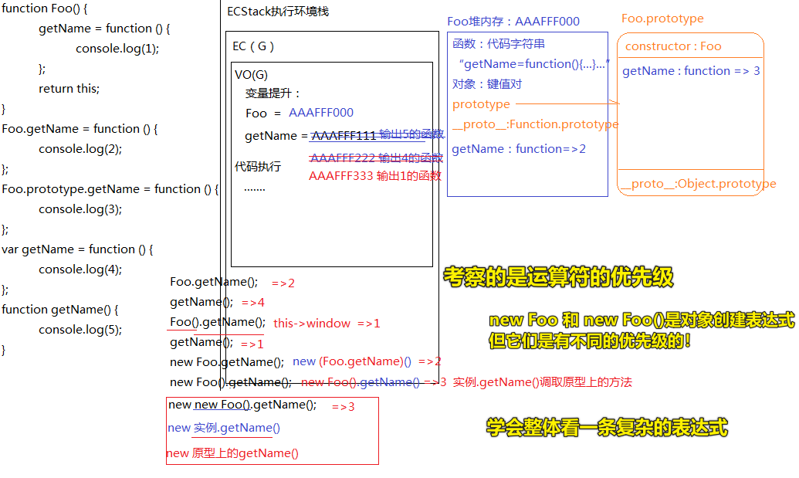

---

<mark>Q：「`new`、`.`的优先级？」</mark>

优先级一样，计算从左到右

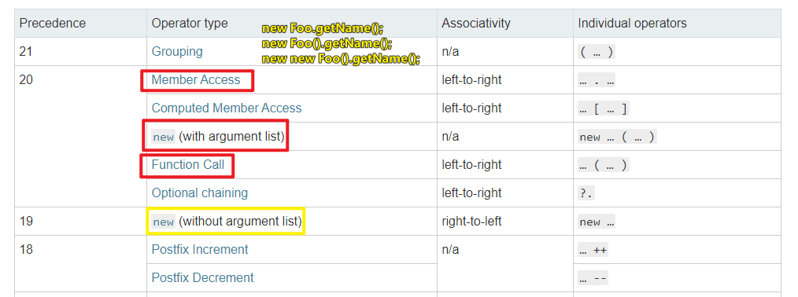

`new Foo.getName()`是怎么算的？

我们知道无参数列表的`new`其优先级是`19`，而有参数的则是`20`

所以当我们`new Foo.getName()`时：

是先`Foo.getName`还是`Foo.getName()`，又或者是`new Xxx()`（假如`Foo.getName`的返回结果是一个`Xxx`函数）？

简单来说，目前可选的答案有：

1. `new`+`(Foo.getName())`
2. `new (Foo.getName)`+`()`

我测试了一下：

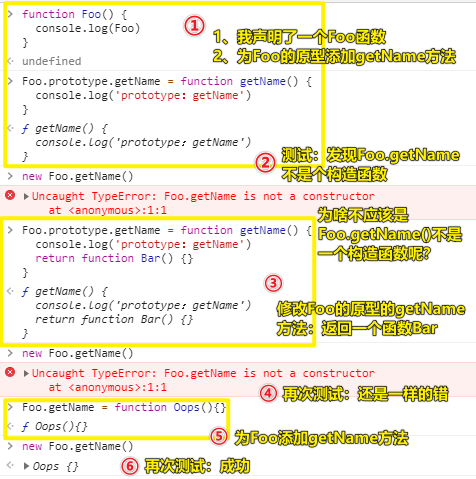

重写一下`Oops`：

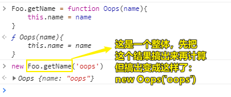

结论：

当你看到`Foo.getName()`的时候，请先这样思考：

1. 找到`Foo.getName`方法
2. 然后再执行方法

这一点跟之前周老师所强调的配对上了！即先找到方法再调用执行，而不是直接就是调用执行，即不要把`Foo.getName()`当作是一个整体来看，而是这样：

假设`Foo.getName`为`Bar`，那么我们看`Foo.getName()`是这样子的`Bar()`，**说白了`Foo.getName`是需要计算返回的**！

同理：

``` js
new Foo().getName();
new new Foo().getName();
```

可看成：

``` js
// 有参数列表的new -> 20
(new Foo()).getName();

// typeof typeof 'hi' -> 从右往左计算

new (new Foo()).getName();
new (Instance.getName)() // Instance -> 实例对象
new Constructor() // Constructors -> 构造函数
```

---

<mark>Q：「优先级里边的`n/a`表示啥意思？是随便的意思吗？即你喜欢左到右，还是右到左都随你吗？」</mark>

在Stack Overflow里边也有人有我这样的疑问：

[Javascript operator precedence (associativity) - Stack Overflow](https://stackoverflow.com/questions/52376308/javascript-operator-precedence-associativity)

从中我看到了一些评论说到：

- 我认为文档在这里是错的，运算符（operators）有相同的优先级（precedence），那么就应该有相同的 associativity
- `new` is a keyword that initiates a procedure. Assigning something to the result of that procedure would be an LTR operation, but not the `new` call itself -> new是个关键字，用于初始化一个过程（为result添加东西），而不是通过`new`来让函数调用自己！ -> 不怎么看懂

偶遇了一个非常nice的[文章](https://www.cnblogs.com/starof/p/6370906.html)，它加深了我对`new Foo.getName()`的认识：

1. `Foo.getName`是「属性访问表达式」 -> 既然是表达式，那么就会有返回结果，在这里假设为`Bar`函数
2. `Bar()`是「函数调用表达式」
3. `new Bar()`是「对象创建表达式」

但是，文章的后边写到了：

``` js
new new Foo().getName();    //相当于new ((new (Foo()).getName)()
```

我很好奇为啥要把`Foo()`括起来了呢？

文章里边解释到：

`new Foo()`可以理解为两种运算:

1. new 带参数，即`new Foo()`
2. 函数调用先`Foo()`取值后再`new`

我认为这很不合理呀！

理由：

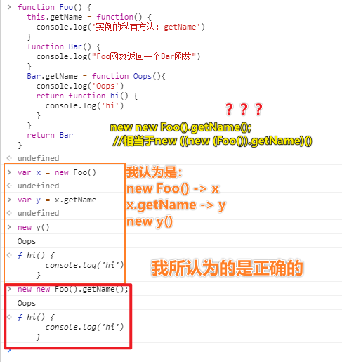

> 有个叫intermediate的错误，表示中间生成的代码报错了，如在对表达式的过程中，得到的是个普通对象还是其它的非函数值，然后你调用它就会报错！

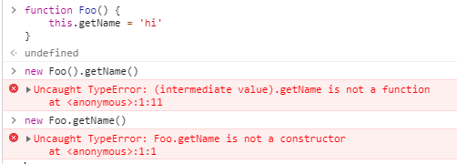

按照文章作者的理解：

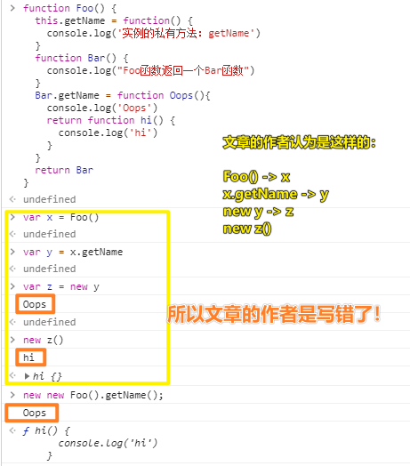

小结：

当我们看到`new new Foo().getName();`时，可看成是：

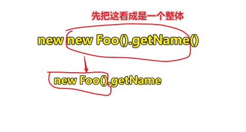

---

## ★总结

- 怎样就算一个表达式了？运算符之间的优先级是怎样的？如`new xxx.getName()`，`new xxx`这一坨表达式的以`new`为代表的优先级高，还是`xxx.getName`这一坨表达式以`.`为代表的优先级高？显然是后者牛逼！谁牛逼，就谁先运算！同样牛逼，就从左往右！
- 为啥说new是运算符呢？因为它操作了构造函数
- 表达式 -> 一种JS短语 -> JS解释器解释它会产生一个值！


## ★Q&A

### <mark>1）长成啥样就可以说是一个表达式？</mark>

表达式是**一种JS短语**，可使JS解释器用来产生一个**值**。

表达式分类：

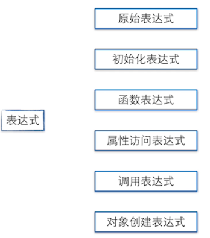

#### 1、原始表达式

- 常量、直接量 （3.14,"test"）;
- 关键字 (null,this,true)；
- 变量（i,k,j）；

都属于原始表达式。

原始表达式和原始表达式可以复合成复合表达式，比如`10*20`;

#### 2、初始化表达式

数组、对象的初始化表达式

比如`[1,2]` 相当于`new Array(1,2)`;

`[1,,,4]` 相当于`[1,undefined,undefined,4]`

`{x:1,y:2}`相当于`var o=new Object();o.x=1;o.y=2;`

> 这其实就是字面量……为啥不归为原始表达式呢？难道是这很复杂吗？需要准备很多东西？

#### 3、函数表达式

把函数赋值给一个变量：`var fe=function(){};`

把函数括起来直接调用：`(function(){console.log('hello world');})();`

> `()`也是一个运算符，运算符加函数值，就构成了函数表达式！话说，函数声明是函数表达式吗？不是，它们是有区别的，不过这区别对于「函数运行时」和「词法作用域」来说，是没有区别的 -> 函数声明会提升，而函数表达式的写法更能体现函数式语言的特点：函数可以作为数据 -> 自打ES6出来之后，有了块级作用域的概念，用函数表达式姿势可以减少变量提升带来的理解成本 -> 匿名函数不能出现语句的开头，表达式除外，箭头函数除外
> 
> 关于函数表达式的name属性，如果是「**匿名函数表达式**」，那么name值是第一次赋给变量的那个变量名，而这是**隐式名称**，如果是「**具名函数表达式**」，那么name值就是个「具名」，而这是 **显示名称**，具名的函数表达式，注意，**具名函数表达式的名字只能用在该函数体里边**（scope），如你全局声明了一个具名的函数表达式，如`let xx = function fn(){}`，对于变量名`xx`你是可以全局访问的，但`fn`只能在函数体内使用，当然，这是有好处的，那就是可以避免使用非标准的 `arguments.callee` 属性

#### 4、属性访问表达式

`var o={x:1};`

`o.x`或者`o['x']`访问对象的属性叫属性访问表达式

> 这个在面向对象编程里边经常会用到！

#### 5、调用表达式

函数名加上括号`func()`就是调用表达式

#### 6、对象创建表达式

`new Func(1,2);`

没有参数可以把括号直接省略`new Object`，表示创建一个空对象

➹：[javascript 表达式和运算符 （二） - starof - 博客园](https://www.cnblogs.com/starof/p/6370906.html)

➹：[JavaScript函数声明和函数表达式，到底该用哪一个？ - 知乎](https://www.zhihu.com/question/47629500)

➹：[JavaScript—— 函数声明和函数表达式有什么不同吗？ - 学习JavaScript及相应框架、库 - SegmentFault 思否](https://segmentfault.com/a/1190000009438280)

➹：[Function expression - JavaScript - MDN](https://developer.mozilla.org/en-US/docs/Web/JavaScript/Reference/Operators/function)

### <mark>2）运算符</mark>

分类，按照操作数个数分类：

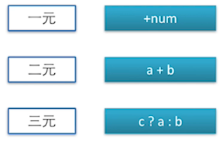

按功能分类：

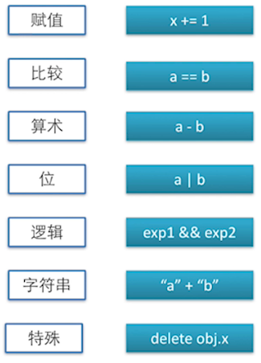

展开介绍特殊运算符：

1. 条件运算符：`var val=true?1:2;     //val值为1`
2. 逗号运算符：`var val=(1,2,3);    //val值为3` -> 少见 -> 逗号表达式会**从左到右依次计算**表达式的值，最后会**取最右边的值**。 -> 用逗号隔开表示**每个表达式都会被计算**，最终**整个表达式的结果**会**取最右边的**。
3. delete运算符：用来删除对象上的属性，比如`delete obj.x;` -> 从**IE9开始**有一个`Object.defineProperty()`方法可以设置一个`configurable`标签，并不是对象上的所有属性都可以被成功delete掉，`configurable`为`true`才能正常被delete
   1. delete运算符不能删的：变量、参数、`configurable`为false的对象属性
   2. 特殊点：用`var` 声明的变量，挂在变量对象上，不能用`delete`删除，但隐式声明的变量，相当于是Global对象的属性，可以用`delete` 删除
4. in运算符：判断对象里是否有key -> 规则：in运算符要求**第1个（左边的）操作数**必须是**字符串类型或可以转换为字符串类型的其他类型**，而**第2个（右边的）操作数**必须是**数组或普通对象或函数对象**
5. instanceof，typeof 运算符：
   1. instanceof基于原型链**判断对象的类型** -> 可跨级
   2. typeof返回字符串，用于原始类型或者函数
6. new运算符：new创建构造器的一个**实例** -> `fn.hasOwnProperty('6')`该api可以判断该属性是否是私有的，虽然，你可以用该属性，但不表达这就是你的，毕竟通过原型链，你也可以用所谓的「**公有属性**」
7. this运算符：this在不同情况有不同值 -> 没想到`this`也是个运算符 -> **我其实觉得这不算吧，它是关键字呀！**
8. void运算符：void是一元运算符，不管后面操作数是多少都会返回undefined -> `void(0)`点击时没有反应

➹：[Expressions and operators - JavaScript - MDN](https://developer.mozilla.org/en-US/docs/Web/JavaScript/Guide/Expressions_and_Operators)

➹：[运算符](https://zh.javascript.info/operators)

### <mark>3）运算符的优先级</mark>

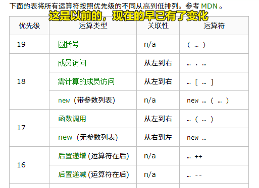

➹：[Operator precedence - JavaScript - MDN](https://developer.mozilla.org/en-US/docs/Web/JavaScript/Reference/Operators/Operator_Precedence)


