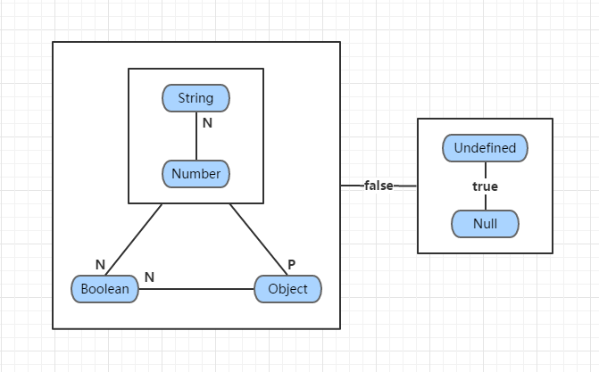
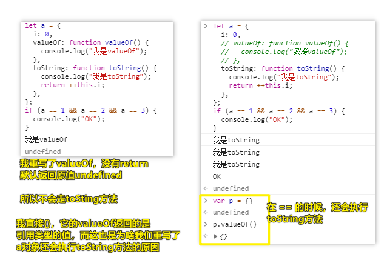
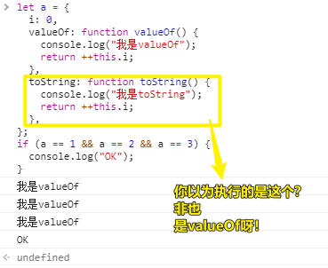
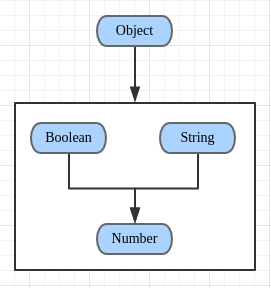
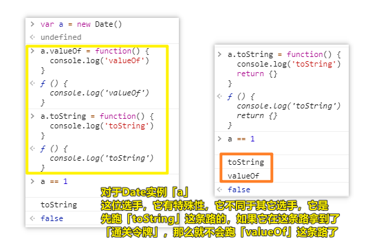
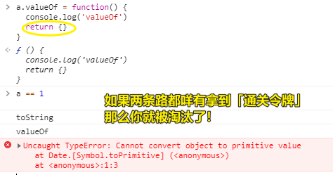
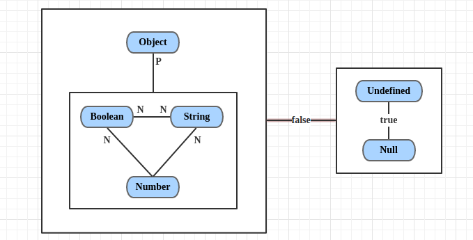
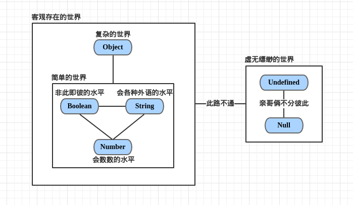

| ✍️ Tangxt | ⏳ 2020-06-04 | 🏷️ JS 面试题 |

# 17-综合面试题讲解 3：面向对象的新玩法

## ★a 等于什么值会让下面条件成立

``` js
var a = ?;
if (a == 1 && a == 2 && a == 3) {
    console.log('OK');
}
```

> 该题非常考验了你的 JS 基础知识以及 JS 底层知识

分析：

如何让 a 既等于 1，又等于 2，还等于 3？

### <mark>1）姿势一</mark>

让`a`是个对象 -> 思路：

「对象与数字比较，对象的转换过程是：`toString()` -> `Number()`」

重写`toString`方法 -> 调用自己私有的`toString`方法，而不是公有的`toString`方法

``` js
var a = {
  i: 0,
  toString: function toString() {
    return ++this.i;
  },
};
if (a == 1 && a == 2 && a == 3) {
  console.log("OK");
}
```

### <mark>2）姿势二</mark>

> 同「姿势一」是一个原理 -> 还有很多形式不同但原理一样的姿势！ -> 换汤不换药

原理：利用数组的shift方法 -> 每次返回移除的那个排头的数组元素

``` js
var a = {
  arr: [1, 2, 3],
  toString: function toString() {
    return this.arr.shift();
  },
};
if (a == 1 && a == 2 && a == 3) {
  console.log("OK");
}

// or

var a = [1, 2, 3];
a.toString = a.shift;
if (a == 1 && a == 2 && a == 3) {
  console.log("OK");
}
```

### <mark>3）姿势三</mark>

原理：

var声明的全局变量，也是给window设置一个全局属性

ES5 提供了 `Object.defineProperty` 方法（兼容IE9及以上），该方法可以劫持对象中某个属性的操作，如读操作和写操作

``` js
var i = 0;
Object.defineProperty(window, "a", {
  get() {
    //  -> 获取window.a的时候触发
    return ++i;
  },
  set() {
    //  -> 给window.a设置属性值的时候触发
  },
});

if (a == 1 && a == 2 && a == 3) {
  console.log("OK");
}
```

这种姿势的思路（数据拦截），不同于toString！

整体思路就两大姿势，但代码实现千变万化！

> Vue的双向数据绑定，数据驱动就是用数据拦截这思路搞的！

---

<mark>Q：`==`（相等）和`===`（绝对相等）的区别？</mark>

默认机制：

如果左右数据值类型不同：

- 两个等号（`==`）会**默认先转换为一致的数据类型再比较**
- 三个等号（`===`）**不能转换数据类型**，只要类型不一致，就直接GG，即直接返回`false`

在俩等号的情况下，既然左右两边不一样，那这该怎么转呢？总不能随意转吧？总得有规矩吧！

俩等号左右比较的规矩如下：

1. `NaN == NaN -> false`：**NaN和谁都不相等（包括自己）** -> NaN表示不是一个数，那么啥叫不是一个数呢？那就是除了不是数字以外，可以表示任何一个东西，所以左右比较起来，你是**无法确定知道各自都代表什么的**，如左是「苹果」，那么右可能是「桃子」、「李子」……
2. `null == undefined -> true`：**俩等为true，三等则false** -> 而且它们和其它任何值都不相等 -> 关于`null == 0 -> false`，`null`表示一个空对象指针，stack内存里边不会为它分配任何空间来存储它，而`0`则是数字0，stack内存里边会为它分配一小空间来存储它，所以它们俩是不一样的，同样`undefined == 0 -> false`也是如此，但`null == undefined -> true`就有点奇葩了，当然，你可以这样强制理解它们：它们都是用于初始化的！如你打算让一个变量被赋值为简单类型值，但你不知道给啥？那就先给个`undefined`初始化一下吧，同样，你打算赋值为引用类型值，也不知道给啥具体的值，那就给个`null`吧！（**猜测像`undefined`和`null`这样的值应该很省内存资源，可能做了某种优化处理……**）
3. `Object == String`：把对象转换为字符串（`Object.toString()`） -> `String`也会转，它们最终都会转化成`Number`在进行比较……如`new Number(1) == ' 01 ' -> true` -> **这条规矩，我是有疑问的，老师只说到对象和字符串比的时候，只有对象转换为字符串，然后再进行比较，我在想这对象是不是特指{}、[]、function这样的对象？而不是有原始值的对象，如用Number、String、Boolean……new出来的对象……，不然这条规矩可以归纳到第四条了**
4. 剩余的情况都是转换为数字，如「布尔 vs 字符串」，双方都转成数字再来，而对象转数字则是：`Number(对象.toString())`

简单来说，就两条规矩：

> 同类型比较，直接比就好了……当然，这会有特殊情况，如`NaN == NaN -> false`
> 
> 不同类型比较会一同转为`Number`类型这个基准点然后再比较，当然，这也会有特殊情况，如`undefined == null -> true`（`Number(undefined) -> NaN`、`Number(null) -> 0`），而`null == false -> false`（`Number(false) -> 0`）

---

<mark>Q：关于truthy值？（为了让自己区分上边的场景）</mark>

在遇到需要**Boolean类型值这个上下文**时，如`if(true)`这个`()`里边的表达式，能够把里边的表达式所返回的值强制转换为`true`的值，对比着来看，我们只需要记忆falsy值即可：

``` js
false 0 -0 0n "" '' null undefined NaN
```

> `==`这个上下文会转成`Number`，而`if()`、`while()`、`||、&&`这个上下文则会转换成`Boolean`

题外话：

`falsy` 有时写作 `falsey`、`falsely`。

在英语中，通常在将一个单词转换为形容词时，都会去掉末尾的字母`e`，然后再添加字母`y`。

如：

1. noise -> noisy
2. ice -> icy
3. shine -> shiny
4. ……

➹：[Truthy - MDN Web Docs Glossary: Definitions of Web-related terms - MDN](https://developer.mozilla.org/en-US/docs/Glossary/Truthy)

➹：[如何理解JS内的Truthy值和Falsy值_weixin_30414635的博客-CSDN博客](https://blog.csdn.net/weixin_30414635/article/details/95199456)


## ★下面代码输出结果是什么？为啥？

``` js
let obj = {
    2: 3,
    3: 4,
    length: 2,
    push: Array.prototype.push
}
obj.push(1);
obj.push(2);
console.log(obj);
```

分析：

Array的原型上的push方法是如何实现的？或者说如果让你实现一个push方法，那么你该怎么做呢？

- push -> 数组末尾追加一个元素
  - `this` -> 数组对象本身
  - `this[arr.length] = 'hi'` -> `arr.length++`

内置的push只干两件事：

1. 拿到length，添加元素
2. 添加一个元素就让length的长度自动加1

**不需要知道push具体怎么实现，只需要知道它具体干这两件事就行了！**

``` js
Array.prototype.push = function push(num) {
  //=>this:arr
  //this.length=this.length||0;
  //=>拿原有length作为新增项的索引
  this[this.length] = num;
  //=>length的长度会自动跟着累加1
};
let arr = [10, 20]; //=>{0:10,1:20,length:2}
arr.push(30);

let obj = {
  2: 3,
  3: 4,
  length: 2,
  push: Array.prototype.push,
};
obj.push(1); //=>obj[2]=1  obj.length=3
obj.push(2); //=>obj[3]=2  obj.length=4
console.log(obj); //=>{2:1,3:2,length:4...}
```

同理，如果用的是`shift`方法呢？（现在一些大厂的题不会出原题，而是原题的变种） -> 同样的思路，想想`shift`是怎么实现的？

题外话：

如果咩有`length`属性呢？

push内部会做个校验：`this.length = this.length || 0` -> 如果咩有length，那么意味着`obj.length`为`undefined`，所以`obj.length`的最终值为`0`

``` js
let obj = {
  1: 10,
  push: Array.prototype.push,
};
obj.push(20); //=>obj[obj.length]=20   obj[0]=20
console.log(obj);
```

> 这些题都是围绕面向对象的那些事儿 -> 实例调方法、怎么调？、怎么改？、怎么重写等等

## ★了解更多

➹：[「每日一题」为什么推荐使用 === 不推荐 == - 知乎](https://zhuanlan.zhihu.com/p/22745278)

## ★总结

- 知道 `x == y` 时，左右两边的运算规则是怎样的！
- 知道数组方法的关键点实现是什么！
- JS引擎内部的三种抽象操作：`{}+[] -> 0`（`{}`是一个空的代码块，`+[] -> [] -> valueOf -> toString -> '' -> Number('')`）、`[]+{} -> [].toString -> '' -> ({}).toString() -> "[object Object]"`
  1. `ToPrimitive()`将值转换为原始值
  2. 通过`ToNumber()`将值转换为数字
  3. 通过`ToString()`将值转换为字符串
- `Object.defineProperty`的使用场景 -> 让一个变量有规律的连续变化……

## ★Q&A

### <mark>1）JS 里边的`==`运算？</mark>

运算规则：



规范 -> [Annotated ES5](http://es5.github.io/#x11.9.3) -> 描述复杂 -> 看完脑子晕 -> 无法立马拿它来指导实践

规范毕竟是给JavaScript运行环境的开发人员看的（比如V8引擎的开发人员们），而**不是给语言的使用者看的**。而**上图正是将规范中复杂的描述翻译成了更容易看懂的形式**。

JS中关于类型的知识：

1. JS中的值有两种类型：原始类型(Primitive)、对象类型(Object)
2. 原始类型包括：Undefined、Null、Boolean、Number和String等五种
3. Undefined类型和Null类型的都只有一个值，即undefined和null；Boolean类型有两个值：true和false；Number类型的值有很多很多；String类型的值理论上有无数个
4. 所有对象都有valueOf()和toString()方法，它们继承自Object，当然也可能被子类重写

有一表达式：

``` js
x == y
```

其中x和y是上述六种类型中某一种类型的值

当x和y的**类型相同**时，`x == y`可以转化为`x === y`，而后者是很简单的（唯一需要注意的可能是NaN）。

图中的两个符号：大写字母N和P。

这两个符号并不是PN结中正和负的意思。而是：

- N表示ToNumber操作，即将操作数转为数字。它是规范中的抽象操作（**「仅供内部使用的操作」的高大尚说法**），但我们可以用JS中的Number()函数来等价替代。
- P表示ToPrimitive操作，即将操作数转为原始类型的值。它也是规范中的抽象操作，同样也可以翻译成等价的JS代码。不过稍微复杂一些，简单说来，对于一个对象obj：

> ToPrimitive(obj)等价于：先计算obj.valueOf()，**如果结果为原始值，则返回此结果**；否则，计算obj.toString()，如果结果是原始值，则返回此结果；否则，抛出异常。

注：此处有个例外，即Date类型的对象，它会先调用toString()方法，后调用valueOf()方法。

图中，标有N或P的线表示：当它连接的两种类型的数据做`==`运算时，标有N或P的那一边的操作数要先执行ToNumber或ToPrimitive变换。


> 跟老师讲的冲突了，我测试了一下，确实是先计算valueOf



所以，那道面试题还可以这样做：



> 这给我的感觉也像是一种数据拦截的姿势！说白了，这TM内部有抽象操作啊！

---

**字符串转化为数字的规则：**

规范中描述得很复杂，但是大致说来，就是**把字符串两边的空白字符去掉，然后把两边的引号去掉，看它能否组成一个合法的数字**。如果是，转化结果就是这个数字；否则，结果是NaN。例如：

``` js
Number('123') // 结果123
Number('1.2e3') // 结果1200
Number('123abc') // 结果NaN
Number('\r\n\t123\v\f') // 结果123
```

当然也有例外，比如空白字符串转化为数字的结果是0。即

``` js
Number('') // 结果0
Number('\r\n\t \v\f') // 结果0
```

所以，`'' == 0 -> true`、`"" == 0 -> true`

---

**为啥需要复杂类型？或者说为啥我们只关注「valueOf」和「toString」这俩方法？**

原始类型是一种单纯的类型，它们直接了当、容易理解。然而缺点是表达能力有限，难以扩展，所以就有了对象。对象是属性的集合，而属性本身又可以是对象。所以对象可以被构造得任意复杂，足以表示**各种各样**的事物。

但是，**有时候事情复杂了也不是好事**。比如一篇冗长的论文，并不是每个人都有时间、有耐心或有必要从头到尾读一遍，通常只了解其**中心思想**就够了。于是论文就有了**关键字、概述**。JavaScript中的对象也一样，我们需要有一种手段了解它的**主要特征**，于是对象就有了toString()和valueOf()方法。

> toString()方法用来得到**对象的一段文字描述**；而valueOf()方法用来**得到对象的特征值**。

顾名思义，toString()方法**倾向于返回一个字符串**。那么valueOf()方法呢？根据[规范中的描述](http://es5.github.io/#x9.1)，它**倾向于返回一个数字**——尽管**内置类型中，valueOf()方法返回数字的只有Number和Date**。

`==`是不严格的相等比较，我们只需要取出**对象的主要特征**来参与运算，次要特征放在一边就行

> valueOf是主要特征，如果主要特征返回的不是原始值，那么就会走次要特征toString，如果次要特征返回的也不是原始值，那么就会报错！

---

万物皆数（不考虑undefined和null）

> 在`==`运算过程中，所有类型的值都有一种向数字类型转化的趋势（左右两边类型不同的情况）



> 对象即为物，在 `==` 的环境下，朝着「数」的方向进化，其中，进化过程分为俩部分：valueOf和toString，toString这一段路是否要走，得看valuOf这一段路是否拿到了「通关令牌」（原始类型的值），如果还没拿到，那么就还得走toString这段路，如果这段路，还是没有拿到「通关令牌」，那么比赛结束（报错）!当然，有些参赛选手，是先走toString这段路的……



两条路，都没拿到「通过令牌」：



---

对最开始的那张图变形

原因：因为对象与字符串/数字比较时都由对象来转型，但是与同样是原始类型的布尔类型比较时却需要布尔类型转型。实际上，只要稍稍分析一下，全部让对象来转为原始类型也是等价的。所以我们得到了最终的更加完美的图形：



有一个地方可能让你疑惑：为什么Boolean与String之间标了两个N？虽然按照规则应该是由Boolean转为数字，但是下一步String就要转为数字了，所以干脆不如两边同时转成数字

---

具象化 ：



> 图中，我们把String和Number类型分成了一组。为什么呢？在六种类型中，String和Number都是**字符的序列**(至少在字面上如此)。字符串是所有合法的字符的序列，而数字可以看成是**符合特定条件的字符的序列**。所以，**数字可以看成字符串的一个子集**。

➹：[一张图彻底搞懂JavaScript的==运算 - 知乎](https://zhuanlan.zhihu.com/p/21650547)

➹：[Javascript 中 == 和 === 区别是什么？ - 知乎](https://www.zhihu.com/question/31442029)

➹：[数据结构的抽象操作的定义与具体实现有关()__牛客网](https://www.nowcoder.com/questionTerminal/4190dc21f1e64f5ba13293aa5dfef1f7)

➹：[第四章：强制转换 - 抽象值操作 - 《你不懂JS：类型与文法（You Dont Know JS）（第一版）》 - 书栈网 · BookStack](https://www.bookstack.cn/read/You-Dont-Know-JS-types-grammar/ch4.2.md)

➹：[Javascript引擎内部的三种抽象操作 - 知乎](https://zhuanlan.zhihu.com/p/27544886)

➹：[PN结 - 维基百科，自由的百科全书](https://zh.wikipedia.org/wiki/PN%E7%BB%93)

➹：[二极管为什么只能单向导电？二极管的单向导通原理，一直搞不懂？ - 知乎](https://zhuanlan.zhihu.com/p/37346683)


### <mark>2）换汤不换药？</mark>

- 比喻形式变了，内容没变（含贬义）
- 比喻名称和外形、画面虽然改变了，但实际内容还是老一套

出处：马南邨《燕山夜话·文章长短不拘》：“把一大篇改成几小篇，表面看去，文章似乎很短，但在实际上不过是为短而短，内容仍旧换汤不换药。” 

近义词： 万变不离其宗，改头换面

> 煎药的水换了，但是药方却没有变。比喻名称或形式虽然改变了，内容还是老一套。

> 关于市面上的课程，很多都是换汤不换药的！你知道药是怎样的了，就不用重复去购买各形式不一样，但是内容却大同小异的课程，如前端培训课程，很多机构都各自出一套前端课程！

➹：[换汤不换药_百度百科](https://baike.baidu.com/item/%E6%8D%A2%E6%B1%A4%E4%B8%8D%E6%8D%A2%E8%8D%AF)