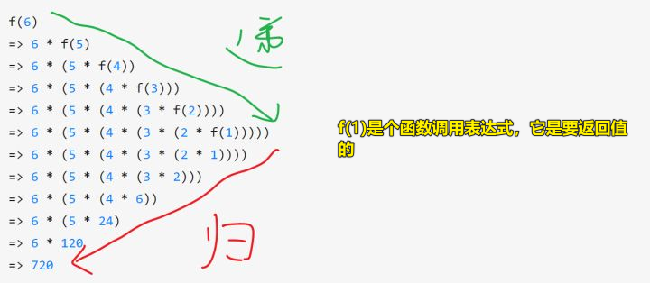

| ✍️ Tangxt | ⏳ 2020-06-05 | 🏷️ JS面试题 |

# 18-综合面试题讲解4：JS高阶技巧之currying函数


## ★总结

- 你在听老师讲的时候，你发现听不懂了，你遇到了一个老师认为你知道的东西，于是你就去搜索有关这个东西的资料，你找到一个非常nice的资料，但是你发现这个资料里边又有一些名词你是不懂的，于是你就这样「递归」的找下去，直到你可以完全读懂这句话，然后你再一层层的返回上去，最后解决你在课上听不懂的这个东西 -> 如「我不懂递归」 -> 搜索「递归」 -> 找到一篇nice的文章 -> 在阅读文章的过程中，我发现我不懂「数学归纳法」与「数学建模」 -> 于是分开两个点进一步去搜索它们然后理解它们 -> 如此反复 -> 直到我可以理解一篇文章我需要用到的信息（base case） -> 最后开始返回，解决一个个子问题，最终，解决了原始问题……（整个过程的进行就是参数变了，如「我不懂的那些名词」，但处理逻辑是一模一样的姿势，如「不知道就去搜索」……当然，还有个终结点「可以解决的base case」，毕竟，总不能无穷的搜索下去吧……）

## ★Q&A

### <mark>1）递归</mark>

数学归纳法：

如何理解它？

类比多米诺骨牌，要产生多米诺骨牌效应，需要两步走：

1. 第一块被我们推倒了 -> `n=1`成立
2. 第二块会因为第一块倒了，而随着被推到了，同理，第三块会因为第二块的倒而倒……第n+1块会因为第n块倒而倒 -> 传递性 -> 若`n=k`倒了，能推出 `n=k+1` 也是一样的倒，那么就会产生多米诺骨牌效应……

注意：`n=k`是个条件呀！就像是真实存在的一样……你无须管它是凭空出现的……证明`n=k+1`必须要用到这个凭空出现的金手指条件！ -> 其实这给的感觉就像是在用反证法一样，假设第xxx块牌倒了，那么xxx+1块牌会不会倒呢？如果倒了，那么则说明产生了传递性，如果没倒，那就说明没有产生传递性……

归纳法的现实应用：

上李永乐老师的课 -> 学知识 -> 考个好大学 -> 找个好工作 -> 赚很多钱 -> 娶个老婆 -> 生个孩子

不上李永乐老师的课就生不了孩子……

---

> 程序调用自身的编程技巧称为递归（ recursion）

回到递归这个话题，通过上边的内容，我大概了解了「传递性」的意思！这一点跟递归一样，我们具象到call stack，注意，我们return一个函数调用，是在return一个函数调用表达式，既然是表达式，那么这就意味着它是有值的！



> 图片来源：[对于递归有没有什么好的理解方法？ - 方应杭的回答 - 知乎](https://www.zhihu.com/question/31412436/answer/738989709)

联想到传递性，`f(1)`就是我们倒下的第一块牌！

其它有关递归的图片：


> 图片来源：[Recursion is not hard: a step-by-step walkthrough of this useful programming technique](https://www.freecodecamp.org/news/recursion-is-not-hard-858a48830d83/)


> stack frames created by generateFinacci when limit is 4
> 
> 图片来源：[Understanding Tail Recursion - Parthipan Natkunam - Medium](https://medium.com/@parthipannatkunam/understanding-tail-recursion-7975af331296)


> 图片来源：[Recursion - Learn You a Haskell for Great Good!](http://learnyouahaskell.com/recursion)


> 图片来源：[★COMP1006/1406 Notes 5 - Recursion](http://cglab.ca/~mathieu/COMP1006/notes/COMP1406_5/1406Notes5.html)


> [Understanding Recursion](https://oschvr.com/posts/understanding-recursion/)
> 
> 有点像洋葱模型

---

什么是递归？

计算机科学中最常用的技巧之一就是“分而治之”（divide and conquer）。 这种技巧（手法）代表了一种将复杂问题分解为更小、更容易解决的**子问题**的策略。 现实世界中有很多例子可以说明我们是如何将问题分解成更小的问题来解决它们的：

①Jigsaw puzzles are solved in "steps": border, interesting portion, grass, sky, etc..


> 先拼哪一个有趣的部分……渐渐地……完整的图就拼好了

②Math problems are broken down into smaller/simpler problems


> 这个表达式很复杂？那就拆解它，直到拆成是四则运算

③Even climbing stairs eventually breaks down to climbing one step at a time.


> 你要到天台？那么你每次就走一个阶梯吧，走着走着你也就到天台了……总不能一步登天吧！

那么这和递归有什么关系呢？ -> 递归就使用了「分而治之」的策略

Recursion 这词实际上来源于一个拉丁词，意思是「a running back」，而这是有道理的，因为递归实际上是一个“离开”（going off，经过）的过程，它将一个问题分解成小块，然后将这些小块的解重新组合在一起，形成完整的解

以下是一些你需要记住的要点：

- 递归将一个复杂的问题**分解**成**更小的子问题**
- 子问题是**同一类型**问题的**更小的**实例。

这听起来有点儿抽象……为啥我们要说这些要点呢？

- 有些问题是**天生的（naturally）**递归
  - 如：尤其是数学问题/函数，如阶乘（factorial）
- 更简单，**更优雅的解决方案**往往会被得到
- **easier to understand** completed solutions
- 可能是解决看似**难以解决的问题**的**唯一方法**

我们真的需要递归吗?当然，任何用递归方式解决的问题也可以不用递归方式解决，但通常解决方案更复杂，很难考虑所有的特殊情况

所以递归就是：

1. 弄清楚（想办法）如何把问题分解成更小的子问题
2. 处理较小的子问题
3. 找出如何合并较小子问题的结果来回答最初的问题

事实上，它实际比这听起来更容易。大多数时候，我们只是简单地解决最初的问题，然后打断/咬掉（break/bite）一小块我们可以处理的东西。我们只是不停地啃掉问题的小部分，解决它们，然后合并这些结果。

就像是我们该想想如何吃掉这块巧克力一样：


> 关于子问题，重要的是，你得记住以下非常重要的事实：
> 
> must be an instance of the **same kind** of problem
> 
> must be **smaller** than the original problem

那么我们要咬掉多少个小块呢？换言之，我们什么时候知道何时停止？

这很简单。当没有更多的碎片时我们就停止…或者当剩下的部分非常简单，不需要进一步分解就能很容易地解决。在这个“最低层次”上，我们把这个**最简单的问题**称为“**base case**”或“**basis case**”。

事实上，在编写代码时，我们通常从 base cases 开始，因为它们是我们知道该如何处理的案例。 例如，如果我们考虑一下前面提到的“真实世界”的例子，而这下面的是base cases：

1. 对于拼图游戏，我们将这些块分割开来，直到我们只有几个（也许5到10个）块形成我们图片中有趣的部分。我们在那时就停止划分了，然后简单地（通过组合）解决这个小的子图的简单的base case问题。所以，base case 就是这样一个问题「如何把几个块匹配到一起？」
2. 对于数学问题，我们只是简单地将问题分解，直到：
   1. a) 剩下一个简单的表达式(例如，2 + 3)或
   2. b)，直到我们得到一个没有任何操作的数字(例如，7)。 
   
   这些都是简单的base cases，其中要么有一个操作，要么没有。

3. 对于爬楼梯的问题，我们的base case是最简单的case。当只有一个台阶的时候。我们只需爬上那一个台阶就行了。


> 找到你觉得可以拼的一部分，而这一部分就是你可以解决的贼鸡儿简单的 base case

---

设计递归方法的技巧（Tips）：

1. 确定方法的名称及其**参数**（parameters ）应该是什么，对于非递归（ non-recursive）方法也必须这样做。
2. 在你开始实现这个方法之前，你必须**相信这个方法它会起作用**;这一点是很重要的。没有它，你就不会有信心去用这个方法来解决一个简单的问题，尤其是如果这个方法还没有完成的话。
3. 你必须确定 **simple cases** 可以轻松地实现（the basis cases），然后编写代码。
4. 确定一种技术，将更复杂的情况分解为更简单的部分，其中一些可以通过使用具有更简单参数的 original method 来完成。这通常是比较困难的部分。**不要考虑递归**。只要考虑一下如何用较小的解来表示原来的问题。

在尝试编写了几个递归方法之后，最好再次阅读上面的Tips。

---

例子：

非递归定义：

``` js
1                                             if N = 1
N! = N x (N-1) x (N-2) x ... 3 x 2 x 1        if N > 1
```

``` JAVA
// A non-recursive method for computing the factorial
public static int factorial(int num) {
    int  result = 1;
    for (int i=2; i<=num; i++)
        result *= i;
    return result;
}
```

递归定义：

``` js
1                    if N = 1
N! = N x (N-1)!      if N > 1
```


``` JAVA
public static int factorial(int n) {
  if (n == 1)  // BASE CASE
      return 1;
  return n * factorial(n - 1);   // RECURSIVE STEP
}
```

---

➹：[什么是数学归纳法和模糊数学？李永乐老师讲秃子悖论_哔哩哔哩 (゜-゜)つロ 干杯~-bilibili](https://www.bilibili.com/video/av28193025/)

➹：[高中数学 数学归纳法，真的不容易！ 看完这个，离学霸更近一步！_哔哩哔哩 (゜-゜)つロ 干杯~-bilibili](https://www.bilibili.com/video/BV1mx411Y7fw?p=1)

➹：[Recursion - Wikipedia](https://en.wikipedia.org/wiki/Recursion)

➹：[Recursion and stack](https://javascript.info/recursion)

➹：[递归：梦中梦 - 众成翻译](https://www.zcfy.cc/article/recursion-dream-within-a-dream)

➹：[拼图有什么技巧？ - 知乎](https://www.zhihu.com/question/20820550)

➹：[为什么你学不会递归？告别递归，谈谈我的一些经验 - 知乎](https://zhuanlan.zhihu.com/p/59389994)

➹：[如何学习递归呢？ - 知乎](https://www.zhihu.com/question/20096035)

➹：[漫谈递归：递归的思想 -- 简明现代魔法](http://www.nowamagic.net/librarys/veda/detail/2314)

➹：[递归算法详解 - ShinChan's Blog](http://chenqx.github.io/2014/09/29/Algorithm-Recursive-Programming/)

### <mark>2）数学建模？编程建模？</mark>

所谓模型：

回答一：

> 人们想要精细化地研究某种现实现象就必须要借用数学方法来研究，而为了达到用数学手段研究该现象的目标，就必须要给此现象构造一个有效的数学模型（数学手段只能用来处理数学对象，无法直接用来研究现实的东西）.比如说，如果不给“无限趋近”的现象建立一个严密的数学模型（这个模型就是魏尔斯特拉斯建立的极限的定义），人们就无法用严谨的数学方法来研究极限.
>
>
>
> 定义：设Y是某种现实现象，称X是Y的数学模型，若X满足以下条件
>
> 1，X是一种能够进行数据输入，并能够相应地输出对应数据的逻辑机器（比如函数，图表，算法，方程）.
>
> 2，X由严密的数学语言描述，并且可以用数学手段对X进行处理.
>
> 3，X的构造动机是为了用数学语言模拟现象Y.

回答二：

> 1.数学模型是使用数学的概念和语言对一个系统的描述。
>
> 2.数学建模就是创建数学模型的过程（即用数学的语言描述系统的过程称之为数学建模）
>
> 注：一般数学模型由关系和变量组成。

回答三：

> 当一个数学结构作为某种形式语言(即包括常用符号、函数符号、谓词符号等符号集合)解释时，这个数学结构就称为**数学模型**。
> 
> 也就是说，数学模型可以描述为：**对于现实世界的一个特定对象，为了一个特定目的，根据特有的内在规律，做出一定的必要假设，然后运用恰当的数学工具得到的一个数学结构**。
> 
> 这样，在一定抽象并且简化的基础之上得到的一个数学结构，也就是数学模型，可以**帮助人们更加深刻地认识所研究的对象**。
> 
> 比方说，我们所研究的物理学，尤其是应用在工程上面的物理学，比如电路，理论力学，材料力学这些，就是对数学建模的一个很好直观的例子。

回答四：

> 建模就是小学应用题列方程 /公式的过程，把物理客观抽象为符号表述。
> 
> 数学建模竞赛可以理解为小学数学应用题的imba版本，条件变模糊，用的方法发散一些，无法靠手算求解而是需要借助计算机程序。

---

所以，所谓编程建模，就是把现实的问题，抽象成一个可计算的程序结构？也就是函数咯？

---

话说有哪些数学模型？

- 常规优化模型：
  - 线性规划，非线性规划，整数规划，多目标规划，动态规划
- 评价模型：
  - 层次分析法，模糊综合评价，熵值法，TOPSIS法，数据包络分析，秩和比法，灰色关联分析
- 预测模型：
  - 回归拟合，灰色预测，马尔可夫预测，时间序列分析
- 动态模型：
  - 微分方程模型，差分方程模型，元胞自动机，排队论，蒙特卡罗随机模拟
- 图论模型：
  - 最短路径，最小生成树，最小费用最大流，指派问题，旅行商问题
- 统计分析模型：
  - 分布检验，均值T检验，方差分析，协方差分析，相关分析，卡方检验，秩和检验，回归分析，Logistic回归，聚类分析，判别分析，关联分析
- 现代智能算法：
  - 模拟退火，神经网络，遗传算法，蚁群算法，粒子群算法，支持向量机，决策树，随机森林

---

➹：[数学建模的模型指的是什么？ - 知乎](https://www.zhihu.com/question/57617846)

➹：[国防科技大学公开课：数学建模——从自然走向理性之路](http://open.163.com/newview/movie/courseintro?newurl=%2Fspecial%2Fcuvocw%2Fshuxuejianmo.html)

➹：[数学建模有哪些模型？ - 知乎](https://www.zhihu.com/question/59626072/answer/167151864)

➹：[数学建模与数学实验 - 知乎](https://zhuanlan.zhihu.com/ZhangJingxin?utm_source=qq&utm_medium=social)

➹：[很多数学模型中有「平滑的曲线」，这个「平滑」是什么概念？ - 知乎](https://www.zhihu.com/question/37897157)

➹：[学习数学建模是先将matlab系统性的学一遍再学建模，还是？ - 知乎](https://www.zhihu.com/question/372355316)

➹：[五步法辨析数学模型，资源汇总及建模方法指南 - 知乎](https://zhuanlan.zhihu.com/p/111325307)

➹：[什么是数学模型?2 - williamwang](https://sites.google.com/site/williamwang/%E4%BB%80%E4%B9%88%E6%98%AF%E6%95%B0%E5%AD%A6%E6%A8%A1%E5%9E%8B%3F2)


### <mark>3）数学和编程？</mark>

> 有时数学不好也能完成一些编程工作，但有可能限制了工作的品质。如果数学更好一些，可以把一些问题分析得更透彻，写出更快、更精确、更稳定的计算代码。所以近年我也在自修一些数学科目，希望能对工作有帮助。不要惧怕数学，它有时候可以成为你的朋友，迎接更多挑战。

数学不好，当你遇到一个编程难题的时候，你是真得不会知道这其实是一个数学问题……

➹：[怎么看待数学和编程的关系？ - 知乎](https://www.zhihu.com/question/26737331)

### <mark>4）我此刻正打算看懂课上给出的那两段代码？可是我如何才能自己写出类似的代码呢？</mark>

绝大多数人在编程学习过程中，都要经历这样一个过程：

1. 学习基本语法
2. 能看懂和调试别人的代码
3. 自己写代码（这一步是你真正打开编程之门后的结果）

前两步没有任何难度，谁都可以做到。从第2步到第3步是一个“**坎**”，很多人困惑于此而无法真正进入编程之门。网上也有很多讲到如何跨越这步的文章和说法，但基本都是脱离实际操作的空谈，比如多敲书上的代码之类，治标不治本（只能提升编程基本知识）。本篇我来根据我自己的经验，借助实例来谈一谈如何**可实际操作**地跨越它。

---

原理（步骤）：

1. 将大问题分解为小问题
2. 用计算机的思维（+编程语言语法）去思考每步小问题
3. 借助类比的简单实例推演出详细算法步骤（代码片段）
4. 将算法步骤用编程语法翻译成代码

> 思考过程：每一步都不是空想出来，而都是“基于当前已知的条件，用基本逻辑推理，往这一步想要到达的结果”去思考

为什么大家普遍自己写代码解决具体问题时感觉无从下手呢？

这是因为**你总想一步就从“问题”到“代码”，没有中间的过程，即使编程高手也做不到**。当然，编程高手可能能缩减这个过程，但不能省略这个过程。其实你平时看编程书是被欺骗了：编程书上只写问题（或者有简单分析）紧接着就是代码，给人的感觉就是应该从问题直接到代码，大家都是这么写出来的。其实不然。

所以，改变**从“问题”直接到“代码”**思维故式，按我上面说的步骤去操作，每一步是不是都不难解决？那么，自然就从「无从下手」到「能锻炼自己写代码」了。

--- 

操作实例（文中的例子我没有看懂）：

[编程学习，如何跨越“能看懂别人的代码”到”自己写代码”的鸿沟 - 知乎](https://zhuanlan.zhihu.com/p/41694350)

---

总结：

> 自己编写代码并不难，只是你一直忽视中间过程，没有习惯静下心来按“**分解问题、梳理清楚算法、翻译成代码**”的正确方法去做而已。一旦你**坚持这样做**了，跨越“能看懂别人的代码”到”自己写代码”的鸿沟，就是**自然而然**的事。

---

Q：能看懂别人写得代码 -> 能看懂自己写的代码 -> 写别人能看懂的代码

> 自己在写每一句代码之前，都得先清楚它的**意图**是什么，执行完想到达什么**结果**，然后再写出来的代码，才能叫自己写代码。只要是按要语法规则写的代码（再加上适当的注释），别人怎么会看不懂。

Q：你好，我现在很大一个问题，我看你说的主要是“过程”，我理解成是思维，我数学基础不太好， 但我现在也在努力学数学，个人发现自己现在只能左网页的开发，且我自己觉得影响我的最大因素是思维， 自己觉得数学思维的问题，我不知道你怎么看待我的想法，且也有一点是我对语法不是很熟练，且就是对语法的理解不行，即使看了别人实现的代码和文档，，在理解上就相当于只理解了50%，好心塞，如果你看到了，我希望能够和你交流交流！谢谢

> 对，思维在这个过程中确实起着重要作用。我想表达的意思是，从已知条件到最终结果，中间过程一步一步脚踏实地的思考过来，是相对来说最容易实现的方式。一旦有思维间断肯定更不容易想出来。
>
> 所以，这是解决一个**粗看没思路问题**的可行的办法。这种思维方式（解决问题的过程）需要锻炼，**越锻炼解决问题的能力会越强**。
>
> 现在很多大学生学习高等数学就知道刷题，这是没有用处的，应该锻炼用“**定义+基本逻辑推理**”解决一道题。再到用数学建模的思维一步一步解决实际问题，也不局限于编程问题。这样去做下去慢慢思维就会有质的提升。
>
> 关于对数学中定义（编程中的定义也一样道理）的理解，你可以看看我在“高等数学学习”专栏里的几篇文章。

--- 

在我看来，输入 -> 「思维处理」（不同的人有不同的姿势，我觉得作者给的那个姿势是很可行的，很科学的） -> 输出

### <mark>5）从语言中，发现这个人是咋样的？</mark>

为什么最近提到这么多“自然语言”的问题呢？一会是英语，一会是中文。因为自然语言是与编程语言相通的。

一个程序员用什么样的语言，使用什么样的语言成分，如何组织他的程序，决定了他是什么样的程序员。

一个人用什么样的语言，什么样的词汇，用什么样的语调说话，也能决定他是什么样的人。

微妙的用词特征就能告诉你这是什么样的人，就像很小的程序细节就能告诉你这是什么样的程序员。

很多程序员看见什么“新式写法”就学什么，这跟很多人看到别人用什么词就用什么一样。结果就被传染了各种「语言的病毒」，**逐渐迷失了自己**。

➹：[为什么最近提到这么多自然语言的问题呢？... 来自无垠王垠 - 微博](https://weibo.com/6347862377/J4WoI5joV?type=repost)

### <mark>6）归纳法？演绎法？</mark>

话说，逻辑学是在告诉我们如何推理吗？


**必然性，就是穷尽一切可能**。数学归纳法是完全归纳推理，穷尽一切可能。一些个案实验显然没有穷尽一切可能。

用实验来证明全称命题是**不完全归纳**，科学归纳法是不完全归纳，也**没有穷尽一切可能**，但穆勒五法的求异法（对照实验），近乎穷尽一切可能，科学归纳法可靠性高。实验要控制所有的因素（做不到），但对照实验，只改变一个因素，相当于控制了所有因素。浅显的道理。

穆勒五法是求同法，求异法，求同求异并用法，共变法，剩余法。

---

偶然看到这篇文章：[165 - 几乎所有的知识，都始于归纳法 · 5min-business-notes](https://wizardforcel.gitbooks.io/5min-business-notes/docs/166.html)

文章中提到：

> 逻辑学，和经济学、管理学、心理学等等不同。那些都是“认知”。而**逻辑学，是获得这些“认知”的方法**。逻辑学比所有这些学科都要底层，是一门硬知识。所以，你发现没有，智商测试，不会考你的经济学、管理学、心理学知识，但它会考你的逻辑思维能力。

如果说一个人的智商是未经打磨的钻石，那么**逻辑思维训练**，就是打磨、切割这颗钻胚，让其最终成为一枚锋利无比、璀璨夺目的**金刚钻**，再来切割经济学、管理学、心理学等等一切坚硬的认知。

说到逻辑，就会谈到「归纳法」

那么什么是归纳呢？

> 归纳法是从特殊，推出一般的方法。中国的天鹅是白色的，美国的天鹅是白色的，我见过的天鹅全是白色的，所以，所有的天鹅都是白色的。

给人的感觉「不一定对」……所以：

**归纳法的输出，不是“定律”，而是“猜想”**。你可以说：我猜想，所有的天鹅都是白色的。

如著名的“哥德巴赫猜想”。哥德巴赫从无数的实例中“归纳”出一个猜想：**任一大于2的偶数都可写成两个质数之和**。将近300年后的今天，据说计算机已经验证了4x10^30以内的所有偶数，都符合猜想，但因未经“演绎法”证明，所以它还是猜想。

与之相对应的是演绎法：

说到演绎法，就不得不提「三段论」了，三段论是“演绎法”的最基本形式。演绎法，是**从一般，推出特殊的方法**。所有的猫都喜欢吃鱼，你家养的是猫，所以它也喜欢吃鱼。

给人的感觉：「嗯，有道理。无可辩驳」

**归纳法从现象提炼出猜想，演绎法把猜想证明为定律**。

如果归纳法只能得出不确定的猜想，而不是确定的定律，那它是不是没有什么用呢？恰恰相反，**归纳法的作用超乎想象**。

牛顿，从无数次试验中，归纳出了“牛顿三大定律”；经济学家们，从人们的交易现象中，归纳出了“供需理论”。我们几乎所有的知识，都始于用归纳法建立的猜想，和再用“演绎法”严谨的证明。可以说，**没有归纳法，就没有演绎法；没有猜想，就没有证明**。

---

如何训练自己“归纳法”的能力呢？ -> 归纳逻辑“穆勒五法”

第一、求同法。

某农场10万只火鸡吃发霉花生，得癌症死亡。吃这种花生的羊、猫、鸽子、大白鼠、鱼和雪貂，后来都得癌症死了。于是人们通过求同法归纳：吃了发霉的花生，可能是癌症的原因。

后来，化验证明，发霉花生含有黄曲霉素，而黄曲霉素是致癌物质。科学家通过演绎法，证明了这个猜想。

这就是“求同法”。

第二、求异法。

5个中国人和外国人远洋航行。途中，外国人全得了坏血病，奄奄一息，就中国人没事。大家用求异法发现，和外国人不同，中国人喜欢喝茶，于是归纳出了“喝茶抵御坏血病”的猜想。

这就是“求异法”。

第三，并用法。

某些地方高发甲状腺病。医疗队去了几个病区，用“求同法”发现，虽然各地情况大不相同，但有一点是相同的：居民食物和水中缺碘。他们又去了不流行甲状腺病的地区，发现他们不缺碘。医疗队用求同法、求异法，归纳出一个猜想：缺碘是甲状腺病的病因。

这就是“并用法”。

第四，共变法。

你夜观天象，发现产品越稀缺（也就是供小于求），价格越高；产品越充沛（也就是供大于求），价格越低。他们之间，共同变化。于是经济学家归纳出了“供需关系”的理论猜想。

这就是“共变法”。

第五、剩余法。

简孙和罗克耶尔研究太阳光谱时发现一条红线、青绿线、蓝线和黄线，前三者是氢的光谱，第四种未知。于是他们用剩余法归纳：一定存在一种新物质。后来证实，这种新物质叫氦。

这就是剩余法。

> 剩余法的本质是：当我们从一个现象中减去一个部分，并且我们已经知道这部分该怎么解释，那么该现象的剩余部分就应该由剩余的原因来解释 -> 有种找到个例的调调……

> 看了这五种方法，我感受到了这是在找一种因果关系，如看到了xxx现象，用「穆勒五法」找到原因……

---

小结：

归纳法是一种从特殊，推出一般的方法。归纳法从现象提炼出猜想，演绎法把猜想证明为定律。我们几乎所有的知识，都始于归纳法。但是，我们必须对猜想之外的可能性，也就是黑天鹅，永远心怀敬畏。

那怎样训练归纳法思维呢？穆勒五法：求同法、求异法、并用法、共变法、和剩余法。

---

关于穆勒生平：

逻辑学的创始人之一，出生于贵族家庭，父亲是东印度公司教育和总裁。

15岁时穆勒他已经可以独立写学术文章

在穆勒20岁的时候他却得了抑郁症，做事都没有使命感幸福感了，后来他发现自己是受极端的理性主义教育所致，**缺少浪漫主义色彩**，后来他加入了诗人的行列才使得他重新走上了幸福的人生，而**不像是理性思考的机器**。

感情方面二十四岁时，穆勒遇到了哈丽特，他一生矢志不渝的至爱。可惜后者已经结婚了，连孩子都有2个了。直到后者的丈夫去世，他才能和哈丽特结婚。中间一直是婚外恋的关系……

他在《逻辑学体系》里面介绍到了五种**科学的归纳方法**，即「求同法、求异法、并用法、共变法、剩余法」

---

黑天鹅：

黑天鹅事件（英文："Black swan" incidents)指非常难以预测，且不寻常的事件，通常会引起市场连锁负面反应甚至颠覆。

一般来说，“黑天鹅”事件是指满足以下三个特点的事件：它具有意外性；它产生重大影响；虽然它具有意外性，但人的本性促使我们在事后为它的发生编造理由，并且或多或少认为它是可解释和可预测的。

黑天鹅存在于各个领域，无论金融市场、商业、经济还是个人生活，都逃不过它的控制。“灰犀牛”是与“黑天鹅”相互补足的概念，“灰犀牛事件”是太过于常见以至于人们习以为常的风险，“黑天鹅事件”则是极其罕见的、出乎人们意料的风险。

话说，这次「新冠疫情」是「黑天鹅事件」吗？

我认为是的，在这篇文章 [新冠之疫是“黑天鹅”还是“灰犀牛”？](http://m.news.cctv.com/2020/03/24/ARTIwQTAzROGKvFz2DXn8fni200324.shtml) 里边提到：

> 习近平总书记把警惕“黑天鹅”与防范“灰犀牛”放在一起讲，其深意，就是提醒我们——“黑天鹅”与“灰犀牛”，可能是**一体两面**。“黑天鹅”之所以是“黑天鹅”，就在于其不可预见。但是，努力防范“灰犀牛”，着力发现可能被忽视的风险，能减少“黑天鹅”暴发的几率

新冠肺炎疫情的骤然暴发，是一场典型的“**黑天鹅**”事件，无数国家和地区被迫对经济社会生活按下暂停键……

然而，这场疫情似乎**又具有“灰犀牛”的特征**。比如，从眼前说，中国的抗疫斗争在1月即全面展开，中国一发现病毒苗头就迅速从1月3日起向美国等通报相关情况，甚至还采取了关闭一个千万人口级大城市对外通道的超常规动作。这既是给全球防疫赢得了时间，也等于先于疫魔的脚步，向很多国家发出了预警。

然而，包括美国在内的一些国家，对预警不在意，对防疫不上心，对一头正在慢慢起身、向其靠近的“灰犀牛”毫不在意。非得到庞然大物已撞进家门，才仓促迎战。

所以说：如果你明知道这事儿可能会大概率发生，但你存有侥幸心理，不去防备，那么你很有可能会遭受到伤害，如你明知道熬夜不好，但熬夜过于习以为常，于是你忽视熬夜对身体所带来的风险……

➹：[科学网—只要 不懂科学归纳法，就 不要在科学网发文章 - 黄荣彬的博文](http://blog.sciencenet.cn/blog-626289-952597.html)

➹：[何謂歸納法(Induction Approach) @ 張承管理學 :: 痞客邦 ::](https://tkbpeter.pixnet.net/blog/post/8952086)

➹：[024-如何发现现象之间的因果关系——穆勒五法（1） - 知乎](https://zhuanlan.zhihu.com/p/24671166)

➹：[025-如何发现现象之间的因果关系——穆勒五法（2） - 知乎](https://zhuanlan.zhihu.com/p/36802106)

➹：[穆勒《逻辑体系》笔记和小结03-归纳推理之“穆勒五法” - 知乎](https://zhuanlan.zhihu.com/p/129957041)

➹：[穆勒生平介绍与五种科学的归纳方法 - 知乎](https://zhuanlan.zhihu.com/p/48703490)

➹：[黑天鹅事件_百度百科](https://baike.baidu.com/item/%E9%BB%91%E5%A4%A9%E9%B9%85%E4%BA%8B%E4%BB%B6)

### <mark>7）有哪些数学证明方法？</mark>

①关系运算证明方法；

②三段论证明方法；

③数学归纳法；

④反证法；

⑤构造性证明方法；

⑥同态证明方法；

⑦解释性证明方法；

⑧系统化证明方法；

⑨截消证明方法；

⑩归结证明方法；

⑪自动化证明方法（其中，截消证明方法是系统化证明方法的特例；解释性证明方法是同态证明方法的特例）

➹：[数学高级教师：吃透这21个解题方法，高中数学必考140！ - 知乎](https://zhuanlan.zhihu.com/p/79663038)

➹：[高中数学之基本解题方法（3） - 知乎](https://zhuanlan.zhihu.com/p/30125479)

➹：[★科学网—数学证明方法有多少种？ - 张寅生的博文](http://blog.sciencenet.cn/blog-320682-969157.html)

➹：[MIT计算机科学的数学-反证法、数学归纳法_Czre的小站～-CSDN博客_mit中心格子l型瓷砖问题](https://blog.csdn.net/qq_34775595/article/details/103163360)

➹：[《什么是数学》读书笔记（一）：反证法、数学归纳法与唯一分解定理 - Matrix67: The Aha Moments](http://www.matrix67.com/blog/archives/495)

### <mark>8）代入法？</mark>

代入法的全称是代入消元法

为何我们要使用代入消元法呢？ -> 因为我们想要求得二元一次方程组的解

做法：

1. 求出一个未知数的式子，如 `y=2x`
2. 把第一步的结果代入到`x+2y = 6`这个方程的`y`未知数，这样一来，`y`就GG了 -> 求得x的值，就能求得y的值 -> 最后可以求出同时满足这两条方程的解！

「代入」的中文意思：

代入 -> 代替某个进入或放入

如把自己代入的故事中的人物，让自己成为这个人物，一般演戏的人，都是如此……还有配音也是如此 -> 都是让自己成为故事中的人物，让自己感受到这个人物的状态！

对了，还有一个「带入」与其读音一样，它表示「携带某人进入」

➹：[代入法是什么意思_百度知道](https://zhidao.baidu.com/question/1771093419908126860.html)

➹：[代入法是怎么做的（用字母表式）_百度知道](https://zhidao.baidu.com/question/131119509.html?qbl=relate_question_5)

➹：[代入和带入的区别_百度知道](https://zhidao.baidu.com/question/104415359.html?qbl=relate_question_4)