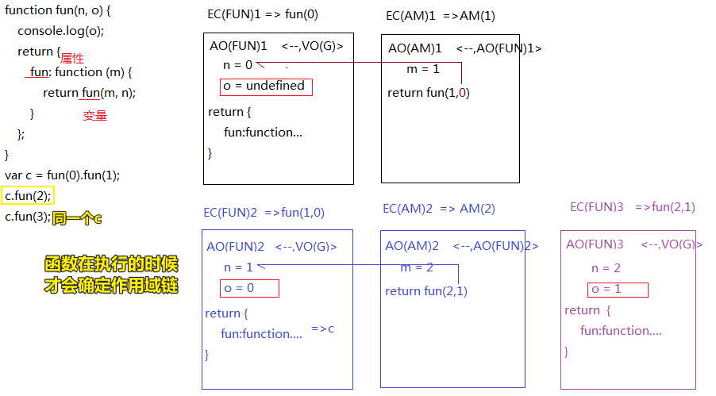

| ✍️ Tangxt | ⏳ 2020-06-10 | 🏷️ JS面试题 |

# 19-关于闭包堆栈的一道开胃题（有难度）

## ★开胃题

``` js
function fun(n, o) {
    console.log(o);
    return {
        fun: function (m) {
            return fun(m, n);
        }
    };
}
var c = fun(0).fun(1);
c.fun(2);
c.fun(3);
```

分析：

- VO
  - fun -> 0x101
  - c -> 0x102 -> 0x103
- `fun(0)`
  - AO
    - n -> 0、o -> undefined
  - return
    - {} -> 0x102
- `0x102.fun(1)`
  - AO
    - m -> 1
  - return
    - `fun(m,n)` -> 0x101(m,n)
      - AO
        - n -> 1，o -> 0
      - return
        - {} -> 0x103
- `c.fun(2)` -> `0x103.fun(2)`
  - AO
    - m -> 2
  - return
    - `fun(m,n)`
      - AO
        - n -> 2，o -> 1
      - return
        - {} -> 0x104
- `c.fun(3)` -> log出来的o值就是上一次调用fun所传的参数`2`

> 我觉得老师出的这个题肯定会在生产环境里边用得上！

输出结果：

1. undefined
2. 0
3. 1
4. 2

规律？ -> 调用`fun`能够拿到上一次调用`fun`的传参？

测试自己是否正确？

undefined -> 0 -> 1 -> 1 -> 结果我错了……

为啥错了？因为自己误认为 `c.fun(3)`是`0x104`调用的！`c`还是原来那个`0x103`

考察点：**作用域链**



定义函数的时候如果是嵌套着的，那么在内存里边可不是嵌套着的，而是扁平的……说白了，都是独立的……

我们定义的时候嵌套着，意味函数执行的时候，那么其作用域链就会指向该函数定义时所在的那个作用域，即那个`VO/AO`

## ★总结

- 请把函数的执行当作是个独立体来看，至于它执行的时候，预设的this、arguments、scopeChain、形参等值是咋样的，你简单分析一下就出来了（这一点就看函数是在哪儿定义的就得了）


