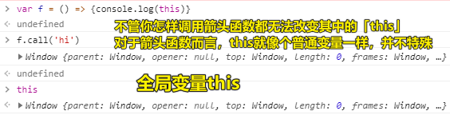
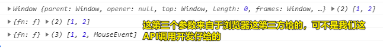
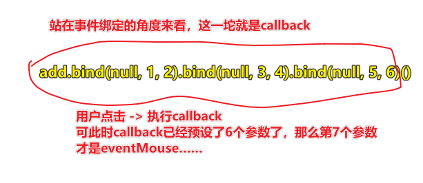

| ✍️ Tangxt | ⏳ 2020-06-12 | 🏷️ JS 专题 |

# 21-综合专题之THIS的五种情况2（重写内置的CALL、APPLY、BIND）

## ★前言

箭头函数是无法通过call等方法来指定其里边所谓的 `this` 的，毕竟箭头函数不存在 `this` ……

简单来说，你这样做：

``` js
var f = () => {
  console.log(this)
}
f.call('hi') // -> this -> window

// 全局this变量
this // -> window
```



题外话：

箭头函数是 `Function` 的实例，所以箭头函数也是可以使用 `call` 、 `apply` 等这样的方法的，只是我们无法像new一个普通函数那样，new一个箭头函数罢了，简单来说，箭头函数就是无法成为一个实例的类！它只能被当作跑一段代码的过程封装！

---

## ★ 情况五：call/apply/bind 改变 this 指向

规律：

> THIS5：基于 `call/apply/bind` 可以改变函数中this的指向（强行改变），当然，箭头函数除外！

---

Q：ES6写一个方法？

``` js
let obj = {
  fn: function() {}
}

let obj1 = {
  fn() {}
}
```

这两种写法是等价的，都是普通函数方法，注意这后者可不是箭头函数哈！

---

### ◇ `call/apply` 

相同点：

* 第一个参数就是改变的THIS指向，写谁就是谁（特殊：非严格模式下，传递「null/undefined」或「不传第一个参数」指向的也是window -> 在严格模式下，这种特殊就不存在了）

唯一区别：

执行函数，传递的参数方式有区别，call是一个个的传递，而apply则是把需要传递的参数放到数组中整体传递，如这样：

``` 
func.call([context],10,20)
func.apply([context],[10,20])
```

形式上来看，apply只管俩参数，而call则可以管很多个参数，但它们俩的代码执行效果是一样的！

如：

``` js
function func(x, y) {
  console.log(this, x, y);
}

func.call("call: ", 1, 2); // -> String {"call: "} 1 2

// func.apply("apply: ", 1,2); // -> 如果你这样传，会报「Uncaught TypeError: CreateListFromArrayLike called on non-object」这样的错误

func.apply("apply: ", [1, 2]); // -> String {"apply: "} 1 2
```

### ◇bind

> `call/apply` 都是改变this的同时直接把函数执行了，而bind不是立即执行函数，属于预先改变this和传递一些内容 -> "柯理化"（大函数里边返回小函数，该小函数供外边使用）

为什么需要bind？

有这么一段代码：

``` js
let obj = {
  fn(x, y) {
    console.log(this, x, y);
  },
};
setTimeout(obj.fn, 1000, 1, 2);
```

我们要确定 `obj.fn` 的 `this` 指向为 `obj` ，而不是 `window` 

那么我们就不能用 `call` 和 `apply` 了，毕竟它们俩是立即执行的，所以这个时候我们就得用上 `bind` 了，而且也不需要为定时器追加参数了……

因此，可有：

``` js
setTimeout(obj.fn.bind(obj, 1, 2), 1000);
```

---

Q：重写bind？

``` js
~(function anonymous(proto) {
  function bind(context) {
    // context may be null or undefined
    // 为啥不这样写 context = context || window？ -> 如果传的是''和0等这样的falsy值呢？
    if (context == undefined) {
      context = window;
    }
    // 获取传递的实参集合
    // 这算是一个小技巧吧，可谓方法借用……当然这可不是随意借用的，你这arguments可符合某种数据结构才行，如可遍历的……
    var args = [].slice.call(arguments, 1);
    // 需要最终执行的函数 -> 那个callback
    var _this = this;
    return function anonymous() {
      // 为啥要有这行代码呢？ -> 因为返回的这个函数有可能被传入参数，如事件对象：
      // document.body.onclick = obj.fn.bind(window, 10, 20)
      // document.body.onclick = anonymous -> 浏览器会传个事件对象给这个anonymous，所以你得找个容器接收一下
      var amArg = [].slice.call(arguments, 0);

      // 为啥要用apply？ -> 因为args是个数组哈！一般都会把像ev这样的内置参数扔到数组的最后，真正的bind源码也是这样写的……
      _this.apply(context, args.concat(amArg));
    };
  }
  proto.bind = bind;
})(Function.prototype);
```

> 如果你不考虑内部传参的话，其实这bind的写法还可以更简单……即小函数不用搞个 `amArg` 哈！

代码测试：

``` js
let obj = {
  fn(...args) {
    console.log(this, args);
  },
};
setTimeout(obj.fn, 1000, 1, 2);
setTimeout(obj.fn.bind(obj, 1, 2), 1000);
document.body.onclick = obj.fn.bind(obj, 1, 2);
```

结果：



用ES6姿势重写一下？

``` js
!(function(proto) {
  //经过一些大佬们的测试：apply的性能不如call，<= 3 个参数用call，否则考虑用apply
  function bind(context = window, ...args) {
    return (...amArg) => this.call(context, ...args.concat(amArg));
  }
  proto.bind = bind;
})(Function.prototype);
```

> 一个bind一行代码就完事了（不考虑new的情况，毕竟从返回箭头函数这个侧面就可以看出了）……

代码测试：

``` js
let obj = {
  fn(...args) {
    console.log(this, args);
  },
};
setTimeout(obj.fn, 1000, 1, 2); // -> window、[1,2]
setTimeout(obj.fn.bind(obj, 1, 2), 1000); // -> obj、[1,2]
document.body.onclick = obj.fn.bind(obj, 1, 2); // -> obj、[1, 2, MouseEvent]
```

这次测试让我回忆起，连续bind的那种情况，讲真，我是无法理解为啥连续bind之后，最终callback的执行，会把所有的预设的参数都给拿到！

> 把`obj.fn`当作是一个普通对象过来看待，即便它本质上是一个函数！但我们这样`obj.fn.bind()`使用它，那么就可以把其当作是普通对象来看，而不是一个函数，不然，会有种奇怪的感觉！ -> 一个对象调用它的`bind`方法，返回了一个函数 -> 你看是不是很符合直觉？ -> 如果你这样：「一个函数调用了它的`bind`方法，返回了一个函数」 -> 是不是感到很奇怪？

``` js
function add(...args) {
  console.log(args);
  return args.reduce((x, y) => {
    return x + y;
  });
}
let res = add.bind(null, 1, 2).bind(null, 3, 4).bind(null, 5, 6)(); // -> [1, 2, 3, 4, 5, 6]
console.log(res); // -> 21
```



> 如果我不用去管bind的内部实现原理，单纯从使用上看的话，那么我不需要考虑连续bind会出现递归的效果，我只管最后执行的callback，我们对其传了6个参数，如果是事件触发执行的callback，那么还会有一个「事件对象参数」 -> 这就类似于`add.bind(null,1,2,3,4,5,6)` or `add.bind(null,...[1,2,3,4,5,6])` -> 我不知道是否可以把其理解为无中生有的递归现象！

题外话：

关于展开运算符的使用：


``` js
function fn(...args) {
  console.log(args)
}

let a = [1,2,3]
let b = [4,5,6]

// 展开运算符，把数组展开成一个个参数 -> 优先级level1
// API调用仔不想一个个传，于是用一个数组，然后展开之，这其实和形参是一一对应的
fn(...a.concat(b)) // -> [1, 2, 3, 4, 5, 6]
```

> 形参：`...args` -> 实参：`...a.concat(b)` -> `args`：`[1, 2, 3, 4, 5, 6]`

---

## ★重写 call 和 apply


## ★总结

## ★Q&A

1）call 和 apply 的性能？

> 参数是数组（`[]`）还是散列（普通对象结构`{}`）？

apply用的call可不是原生的call方法，而是apply自己内部重写的call方法！

在参数为3个（包含3）以内时，优先使用 call 方法进行事件的处理。而当参数过多（多于3个）时，才考虑使用 apply 方法。

题外话，关于API的选择问题：

[js call和apply的性能有差别吗？ - 贺师俊的回答 - 知乎](https://www.zhihu.com/question/61088667/answer/184598599)：

**既然有两个完成相同事情的操作，但却长得不同的api，就是为不同的需求准备的**。

所以请按照你的需求使用，而不是为了所谓性能强行转换成另一种。

要知道如果你自己可以通过转换获得性能提升，没有理由引擎不能做这种优化，只是早晚的事情。

最后，在最新的引擎上两者性能是基本一样的。

---

➹：[为什么 call 比 apply 快？ - 掘金](https://juejin.im/post/59c0e13b5188257e7a428a83)

➹：[call 和 apply 的区别是什么，哪个性能更好一些？ - 掘金](https://juejin.im/post/5dcd2566e51d4508050cb435)

➹：[jsPerf: JavaScript performance playground](https://jsperf.com/)

➹：[js call和apply的性能有差别吗？ - 知乎](https://www.zhihu.com/question/61088667)
