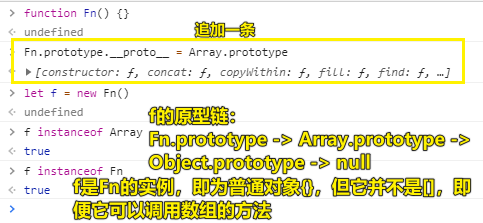
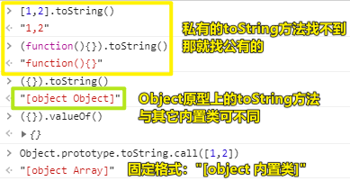
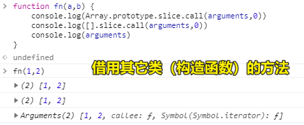
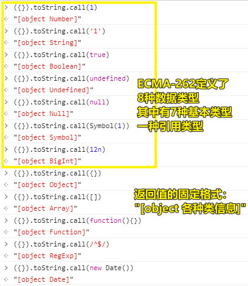
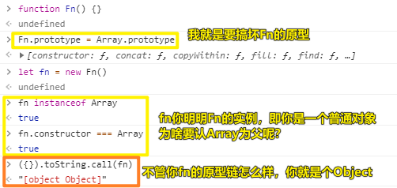
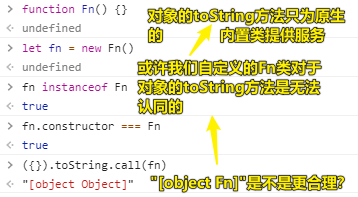

| ✍️ Tangxt | ⏳ 2020-06-15 | 🏷️ JS 专题 |

# 22-综合专题之检测数据类型的四种方案1

## ★概述

* typeof
* instanceof
* constructor
* Object.prototype.toString.call

## ★第一种数据类型检测方式——typeof

* 返回的结果都是字符串：
  + 字符串中包含了对应的数据类型  "number"/"string"/"boolean"/"undefined"/"symbol"/"object"/"function"
* 局限性：
  + `typeof null` -> `"object"` -> null不是对象，它是空对象指针，一般我们用完了一个对象变量，就会把该对象赋值为 `null` ，就目前的Chrome浏览器而言，它时不时就会去回收咩有被占用的堆内存，如本来一个 `obj` 变量，占用了 `{name:'frank'}` 这个堆内存，我们用完了这个堆内存，我们就 `obj = null` ，这样一来 `{name:'frank'}` 就咩有被 `obj` 占用了，没有被占用，那么就会被Chrome浏览器的辣鸡回收机制给回收掉！ -> IE的辣鸡回收机制与chrome不同
  + 检测数组或者正则等特殊的对象，返回结果都是"object"，所以无法基于typeof判断这变量的值是数组还是正则
* 何时用？
  + 检测基本的数据类型可以用一下，但对于检测细分过后的对象值，就无能无力了！ -> 所以这就是为啥还有其它数据类型检测方式的原因所在了，不然如果你 `typeof` 很强大的话，就不需考虑其它检测方式了

面试的坑（也不算是坑）：

``` js
console.log(typeof []); // => "object"
console.log(typeof typeof []); // => "string"
```

> 运算规则是：从右往左！

## ★第二种和第三种数据类型检测方式——`instanceof`/`constructor`

### ◇instanceof

* 检测某个实例是否属于这个类
* 它检测的底层机制：所有出现在其原型链上的类，检测结果都是TRUE
* 局限性：
  + 由于可以基于 `__proto__` 或者 `prototype` 改动原型链的动向，所以基于 `instanceof` 检测出来的结果并不一定是准确的
  + 基本数据类型的值，连对象都不是，更没有 `__proto__` ，虽说也是所属类的实例，在JS中也可以调取所属类原型上的方法，但是instanceof是不认的

测试：

``` js
console.log(12 instanceof Number); // => false
console.log(new Number(12) instanceof Number); // => true
console.log([] instanceof Array); // => true
console.log([] instanceof Object); // => true
```

> 关于浏览器的隐式转换： `(12).__proto__` <=> `new Number(12).__proto__` 

可以看到 `12` 明明是Number的实例，但是 `instanceof` 就是不认

搞坏 `instanceof` 的测试：

``` js
let arr = []

function fn() {}
arr.__proto__ = fn.prototype
arr instanceof Array // -> false
```



可以看到，通过JS，原型链基于 `__proto__` 或者 `prototype` 是可以随意改动的，因此， `instanceof` 检测出来的结果并不一定准确！ -> 所以 `instanceof` 只能用作于一个简单的参考姿势！

小结：

* 无法用 `instanceof` 检测基本类型，而 `typeof` 则可以 -> `instanceof` 检测引用类型值要比 `typeof` 准确点！如 `/^$/ instanceof RegExp -> true` 

### ◇constructor

同 `instanceof` 基本一样

``` js
// 私有constructor属性找不到就找公有的
console.log([].constructor === Array) // -> true -> 表示 [] 为数组
console.log([].constructor === Object) // -> false -> 不可跨级
console.log(({}).constructor === Array) // -> false
console.log((12).constructor === Number) // -> true
```

`constructor` 这个值也是可以随便改的，而且比 `instanceof` 还要更恶心！如：

``` js
let arr = []
Array.prototype.constructor = null
arr.constructor === Array // -> false
```

凡是可以随便改的，都是不严谨的，或多或少会出现潜在的bug，不过一般来说，我们基本都不会去动 `constructor` 的指向，或者是原型链的指向……

总之，对于基本类型而言，我们也是可以用 `constructor` 来搞的！ -> 简单参考用 `constructor` 和 `instanceof` 这两个东西吧！

---

就上边我们所看到的那样，不管是 `typeof` 、 `instanceof` ，还是 `constructor` ，都有自己很多的局限性

那么是否存在一种没有局限性的方案呢？

有的，那就是 `Object.prototype.toString` 方法啦！ -> 注意，这是Object原型上的 `toString` 方法！可不是其它类（如Array等）上的 `toString` 方法！

## ★第四种数据类型检测方式——`Object.prototype.toString.call`

> 没有局限性的方案！

### ◇概述

* Number/String/Boolean/Symbol它们的原型上都有：
  + toString：转化为字符串
  + valueOf：返回原始值（也就是所谓的基本类型值）
* Array/RegExp/Function等内置类的原型上都有
  + toString：转化为字符串
* Object的原型上
  + toString：**返回当前实例所属类的信息**
  + valueOf：返回原始值

注意，也是有 `Null` 和 `Undefined` 这两个内置类的，只是我们开发者无法使用罢了 -> 你一使用就会报错！

敲黑板：

> Object原型上的 `toString` 方法可**不是用来转换为字符串的，而是返回当前实例所属类的信息**



### ◇使用

写法（本质上是其它类型数据的方法借用，就像是伪数组，如arguments借用数组的slice方法变为真正的数组）：

``` js
Object.prototype.toString.call([value])

// or

({}).toString.call([value])
```

返回值的格式：

``` js
"[object 所属类信息]"
```

可能有的结果：

``` js
"[object Object/Array/RegExp/Date/Function/Null/Undefined/Number/String/Boolean/Symbol...]"
```

原理：



> 数组字面量不需要这样 `([])` ，而普通对象是需要的 -> `({})` ，因为 `{}` 在JS中有太多含义了，如代码块，对象字面量等等，所以如果你这样 `{}.toString()` ，那么就会报语法错误！

测试（检测各种值的数据类型）：



即便你更改原型或原型链：



也不会影响 `({}).toString.call()` 的判断！

所以：

> 这种方式基本上没有什么局限性，是检测数据类型最准确的方式

但在我看来，这还是有弊端的：



---

## ★总结

* JS检测数据类型的四种方式，都有各自的优缺点和各自的局限性
* 在真实项目里边，如果我们想要自己来检测数据类型，那么我们一般的姿势是这样的：
  + 基本数据类型检测 -> 基本上用 `typeof` -> 为啥用这个？ -> 因为简单呀！没必要搞那些复杂的姿势
  + 对于引用类型的检测，如我们要检测一下这个引用类型值是不是数组，好区分它不是一个 `{}` ：
    - 不严谨情况下：「一个 `instanceof` 就搞定，如 `xxx instanceof Array` 」，或者另一种姿势： `xxx.constructor === Array` 
    - 严谨情况下：就用 `({}).toString.call(xxx)` 这种姿势来搞！
* 加深了我对数据是有类型之分的认识，如我看到一个数字 `1` ，那么它就是 `Number` 类型的 -> 我看到 `/^$/` 这种结构的数据，那么它就是 `RegExp` 类型的 -> 我看到 `[]` 这种结构的数据，那么它就是 `Array` 类型的 -> 我看到 `{}` 这种结构的数据，那么它就是 `Object` 类型的 -> 我看到 `function(){}` 这种结构的数据，那么它就是 `Function` 类型的 -> ……

## ★Q&A

1）BigInt？

➹：[JS最新基本数据类型：BigInt - 掘金](https://juejin.im/post/5d3f8402f265da039e129574#heading-5)
