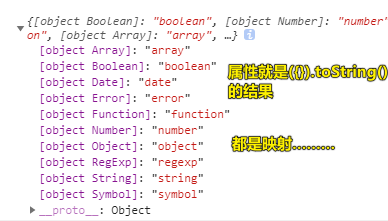
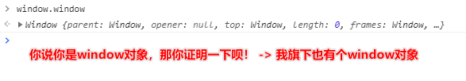
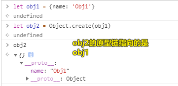
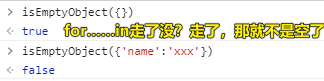
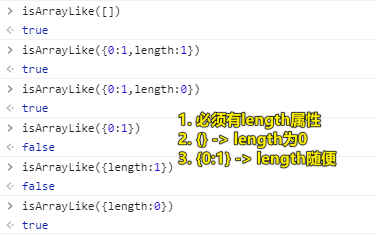
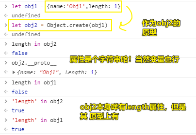

| ✍️ Tangxt | ⏳ 2020-06-17 | 🏷️ JS 专题 |

# 23-综合专题之检测数据类型的四种方案2（剖析JQ源码，研究其数据检测的方法）

## ★前言

给一段jQuery3版本的代码让你研究一下 -> 这段代码是关于数据类型检测公共方法封装的源码

以后你想封装一段代码，那么你就参照一下这个jQuery源码封装示例来搞一波！

## ★效果展示

安装：

``` bash
yarn add jquery
```

版本是： `query@3.5.1` 

测试：

``` html
<script src="./node_modules/jquery/dist/jquery.min.js">
  console.log($.type([])) // -> array
  function Fn() {}
  let f = new Fn()
  console.log($.type(f)) // -> object
</script>
```

## ★jQuery数据类型检测源码

``` js
var class2type = {};
var toString = class2type.toString; //=>Object.prototype.toString
var hasOwn = class2type.hasOwnProperty; //=>Object.prototype.hasOwnProperty
var fnToString = hasOwn.toString; //=>Function.prototype.toString
var ObjectFunctionString = fnToString.call(Object); //=>Object.toString() =>"function Object() { [native code] }"

"Boolean Number String Function Array Date RegExp Object Error Symbol"
.split(" ")
  .forEach(function anonymous(item) {
    class2type["[object " + item + "]"] = item.toLowerCase();
  });
console.log(class2type);

function toType(obj) {
  //=>obj may be null / undefined
  //=>return "null"/"undefined"
  if (obj == null) {
    return obj + "";
  }

  return typeof obj === "object" || typeof obj === "function" ?
    class2type[toString.call(obj)] || "object" :
    typeof obj;
}
// jQuery.type = toType;
```

原理：

* 如果是基本类型值：
  + 如果这值是 `null` or `undefined` ，直接用这个 `==` 和 `+` 的技巧就好了
  + 如果这值不是 `null` or `undefined` ，那就用 `typeof` 
* 如果是引用类型值：
  + 那就用 `({}).toString(xxx)` 

为啥会返回小写的类型呢？（class2type的结果）



> 对象的属性名不一定是字符串，可以是布尔值，也可以是数字 -> 一定不能是引用类型值

老师是如何分析源码的？

> 代入法

面试官问你「JS数据类型检测方式」？

1. 先说原生的4种姿势
2. 然后说jQuery源码里边的 `type` 方法是如何封装的！
3. 最后可以说一下从这个 `type` 方法源码里边学到了哪些技巧，如「如何处理值是null或undefined这种情况？」等等

---

jQuery除了提供以上这个万能的 `type` 方法用来检测数据类型以外，还提供了一些很快捷的方法！

## ★jQuery里边检测数据类型的快捷姿势

### ◇ `isFunction` 

``` js
//=>是否为函数
var isFunction = function isFunction(obj) {
  return typeof obj === "function" && typeof obj.nodeType !== "number";
};
```

`typeof obj.nodeType !== "number"` 这个是用于兼容老版本浏览器的，不过目前的现代浏览器并不需要用到了，只需要 `typeof obj === "function"` 这个就行了！

> 在很老很老的浏览器里边 -> `document.body.childNodes` 返回的结果也是个函数，而 `nodeType` 则是 `number` -> 而这些鬼东西**不属于标准的函数**，所以得要排除

### ◇ `isWindow` 

``` js
//=>检测是否为window对象
// window.window===window -> 意味着这个obj确实是window，因为window旗下必然有window
var isWindow = function isWindow(obj) {
  return obj != null && obj === obj.window;
};
```



`obj != null` -> 意味着 -> obj如果是 `null` or `undefined` 都会 `== null` ，所以 `!=` 就返回 `false` 咯！

### ◇ `isPlainObject` 

纯粹的对象指的是，这个对象的原型链只指向 `Object.prototype` -> 我们自定义一个构造函数 `Xxx` ，然后 `new Xxx()` 得到的实例可不是存粹的对象！

``` js
//=>是否为纯粹的对象{}（数组和正则等都不是纯粹的对象）
var isPlainObject = function isPlainObject(obj) {
  var proto, Ctor;
  if (!obj || toString.call(obj) !== "[object Object]") {
    return false;
  }

  // 以下过滤我们搞的自定义类！

  //=>getPrototypeOf获取当前对象的原型
  proto = Object.getPrototypeOf(obj);
  // Objects with no prototype ( `Object.create( null )` )
  // 如果咩有原型，那就直接返回true
  if (!proto) {
    return true;
  }
  // Objects with prototype are plain iff they were constructed by a global Object function
  // prot.hasOwn("constructor") -> 原型上有个constructor方法吗？有那就返回它值，没有那就是false
  Ctor = hasOwn.call(proto, "constructor") && proto.constructor;
  // 有constructor并且constructor是个Object
  return (
    typeof Ctor === "function" &&
    fnToString.call(Ctor) === ObjectFunctionString
  );
};
```

如何分析这个源码？

> 还是用代入法！

注意点：

1. `Object.create(proto)` 这个方法是干嘛用的，你得知道哈！



> 该方法并不常用！

### ◇ `isEmptyObject` 

``` js
//=>是否为空对象
var isEmptyObject = function isEmptyObject(obj) {
  var name;
  for (name in obj) {
    return false;
  }
  return true;
};
```

原理：

> `obj` 不能循环那就是空的，能那就不是！



该方法在项目里边是很常用的！

### ◇ `isArrayLike` 

``` js
//=>是否为数组或者类数组
var isArrayLike = function isArrayLike(obj) {
  // 你传了东西，而且不是null or undefined这些破玩意儿
  // 
  var length = !!obj && "length" in obj && obj.length,
    type = toType(obj);

  // 函数有length -> 表示你传的参数个个数；window也有length -> 表示返回当前window里边的frame数量（frame元素、iframe元素）
  // 如果是函数或者是window那就直接返回false
  if (isFunction(obj) || isWindow(obj)) {
    return false;
  }
  return (
    type === "array" ||
    length === 0 ||
    (typeof length === "number" && length > 0 && length - 1 in obj)
  );
};
```

测试：



---

<mark>Q：「`in`这个运算符？」</mark>

- 语法：`prop in object`
- 作用：如果指定的属性在指定的对象或其原型链中，则`in` 运算符返回`true`

测试：



## ★总结

- 为啥要看一些库、框架的源码？ -> 因为我们可以从中学到一些技巧性东西，以及加深我们对JS某块知识点的理解与认识！
- 需要封装的方法：
  - `type`
  - `isPlainObject`
  - `isEmptyObject`
  - `isArrayLike`
- 不需要封装的方法：
  - `isFunction`
  - `isWindow`

