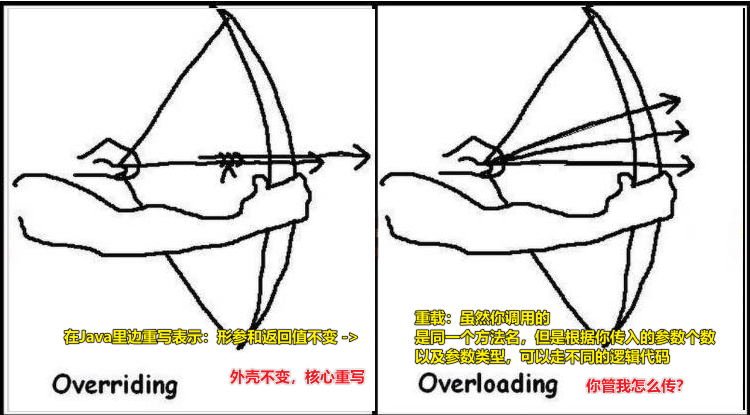
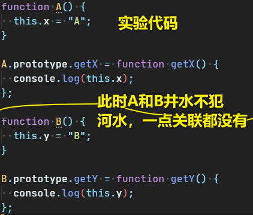
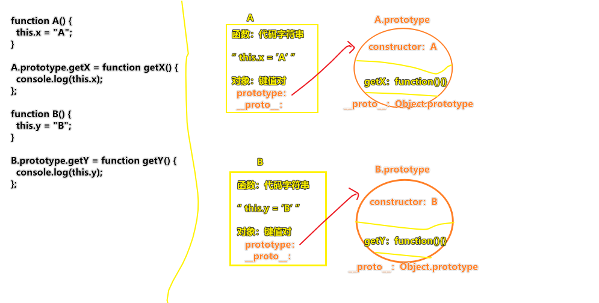
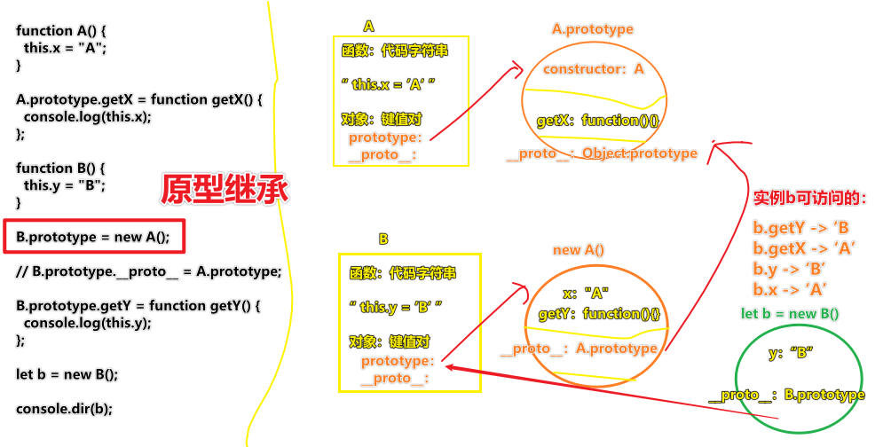

| ✍️ Tangxt | ⏳ 2020-06-17 | 🏷️ JS 专题 |

# 24-综合专题之JS中的四大继承方案

## ★概述

在JS里边继承方式有很多种，但在真实项目里边，最常用的继承姿势就是这以下四种姿势：

* 原型继承
* call继承
* 寄生组合继承
* class实现继承
* ……

应用场景：

* 封装插件或者类库（或者REACT中）……

我们需要关注的：

* 用「继承」的目的是啥
* 「继承」这东西在哪儿可以被用到……

## ★回顾之前的认识

* JS中的面向对象是咋样的？ -> 构造函数 + `new` 
* 实例为啥可以调用原型链上的方法？ -> 因为实例的 `__proto__` 指向了该实例的构造器的 `prototype` 
* 我们掌握类，需要掌握三个概念 -> 封装、继承、多态
  + 封装 -> 把要实现这个功能的代码封装到一个函数里边去，最后能实现这个功能的复用性
  + ……

## ★类的多态

正常一个类的多态就分为「重载」和「重写」



重载（**一个东西：在一个类里边**）：

在Java中：

* 重载就是 -> 函数名相同，但是传参类型或者数量不同或者返回值不一样，这相当与把一个函数重载了 

在JS中：

- JS中没有类似于后台语言中的重载机制：JS中的重载只的是同一个方法，根据传参不同，实现不同的业务逻辑

但对于运算符`+`是有所谓的「重载」现象的，如：

重载（运算子的不同，导致了不同的语法的行为）

``` js
'3' + 4 + 5  //  得到"345"
3 + 4 + '5'  //  得到'75'
```

而减法、乘法、除法运算符一律都是数值做相应的数学运算，不会发生重载：

``` js
1-2    // 得到-1
1-'2'  //得到-1
1*4    // 得到4
1*'4'  //得到4
1/2    // 得到0.5
1/'2'  //得到0.5
```

---

重写：子类重写父类上的方法（**两个东西：子类 & 父类**） -> 涉及到子类继承父类的属性和方法！ -> 引出我们要讲的「继承」话题

### ◇代码测试（重载）

Java重载代码：

``` JAVA
public String fn(int n,int m) {}
public String fn(int n) {}
public String fn(int n,double m) {}

fn(10,20) // -> 走第一个
fn(10) // -> 走第二个
fn(10,20.86) // -> 走第三个

// 后台语言是很严谨的，是啥就是啥，如你值传一个1值，那么即便你想走第一个，也无法走……
```

可以看到，方法名相同，但参数的个数不同或者类型不同或者返回值不同，就会发生重载 -> 也就是说调用同一个方法，但给定了不同的参数个数或者参数类型，就会走不同的逻辑 -> 注意：这并不会发生方法覆盖（对于JS来说是会发生覆盖的……但对于Java来说则不会）

---

Q：为啥后台语言要把一个方法拆成好多个方法？然后通过传参做不同的事儿呢？

主要原因：

- 本地客户端，就只有用户一个人访问
- 服务端，有几百号人访问，甚至是成千上万的人访问 -> 如果要提高服务器的并发量，假如说一个方法里边做了大量的逻辑判断，如a这种情况需要走这个方法，b这种情况也要走这个方法，c这种情况也要走这种方法……那么你会发现这个方法的并发量特别大，所以我们就得把这个方法拆成三个方法，如a就走a方法，b就走b方法，c就走c方法…… -> 这叫做「减轻每一个方法的并发量」 -> 所以后台里边必须要有「重载」这么一个机制来搞这么一件事……

---

JS重载代码？

``` js
function fn(n,m) {}
function fn(n) {}

fn(10,20) // -> 都走后边那个
fn(10) // -> 同上
```

JS可不管你传多少个参数，`fn`是谁就调谁！ -> 不严谨

总之，后来的fn会覆盖前边的fn

当然，JS也是可以用重载的（**不是严格意义上的重载**），只是这重载只针对同一个方法呀：

``` js
function fn(n,m) {
  // 如果API调用仔没有传第二个参数，那就走xxx逻辑
  // 如果传了，那就走yyy逻辑
  if(!m) {
    // ……
  }
}

fn(10,20)
fn(10)
```

> JS是咩有重载的，上边的代码并不是严格意义上的重载！

## ★继承

### ◇什么是继承？

> 子类继承父类中的属性和方法（JS中的继承机制和其它后台语言是不一样的，有自己的独特处理方式）

---

一个笑话：

有俩程序员 -> A和B

B不舒服，去医院检查，医生诊断说「你有类风湿性关节炎」

B一回来，A就问「有啥事没？」 -> B回答「我太难了，我这病我儿子也会有」

B为啥会这样说呢？

因为程序员眼中的「类」就是可以被继承的，所以跟「类」相关的词都应该可以被后一代所继承……

> B的孩子 -> B -> 类风湿性关节炎

---

现实中的继承：

你继承了你爸的基因，相当于你爸的基因被**克隆**了一份到你身上去，而你也有特属于你自己的基因

我们经常在生活里边会听到，不要吃转基因食品，就是怕这些食品会改变我们的基因 -> 假如作为儿子的我们吃了转基因食品，因此改变了继承自父亲而来的基因，那么我们**是否会因此而改变父亲的基因呢？** -> 显然是**不可能**的呀！从你出生的那一刻起，你与父亲就是两个独立的个体了……

---

后台语言的继承：

子类继承父类，把父类的属性和方法拷贝一份 -> 子类可以重写继承过来的属性和方法，不会影响父类的属性和方法

JS的继承：

子类可以影响父类的属性和方法……

### ◇测试代码



画图之：



### ◇原型继承

需求：让A和B这两个类有关联 -> 如让B作为A的子类 -> B（子类）、A（父类）

实现：

``` js
function A() {
  this.x = "A";
}

A.prototype.getX = function getX() {
  console.log(this.x);
};

function B() {
  this.y = "B";
}

B.prototype = new A();

// B.prototype.__proto__ = A.prototype;

B.prototype.getY = function getY() {
  console.log(this.y);
};

let b = new B();

console.dir(b);

```

画图解释：



原型继承的效果：

- 并不会把父类中的方法克隆一份给子类，而是建立了子类和父类之间的**原型链查找机制** -> 正常的继承应该是父类把东西克隆一份给儿子，但JS的「原型继承」并不是这样的，只是「原型链查找机制」罢了 -> 类似于「我爹要遗传基因给我，但是这遗传姿势是这样的：不把基因clone一份给我，基因还在我爹身上，而我身上有个**标识**，当我需要用到我爹的基因的时候，我可以通过这个标识找到我爹的基因」 -> 可见，真实生活不是这样的，但JS就是这么玩的……

原型继承的不好之处：

1. 重定向（重置）子类的原型后，默认丢失了原本的`constructor`属性（或者原本在`prototype`上设置的属性和方法） -> `b.constructor -> function A(){}` or 在使用「原型继承」之前你这样了`B.prototype.sum = function sum(){}`，那么「原型继承」之后，`sum`方法就GG了
2. 子类或者子类的实例，可以基于原型链「肆意」修改父类上的属性和方法，对父类造成一些「不必要的破坏」 -> 如你这样：「`b.__proto__.xx = 'hi'`」(其它B的实例会受到影响，毕竟其它B的实例也可以访问这个`xx`属性)、「`b.__proto__.proto__.getX = null`（其它A的实例会受到影响，毕竟它们发现自己无法访问`getX`方法了）」 -> 可以看到：「**一个小小的`b`实例居然有那么大的能耐……把A这个父类生成的实例搞得乌烟瘴气，甚至对自己的同僚，如B的其它实例，也搞得乌烟瘴气……**」
3. 会把「父类中私有的属性和方法」作为「子类的公有的属性和方法」继承过来（简而言之，父类中不管是公有的还是私有的，最后都会变为子类公有的）

可见，我们明白「原型继承」的底层机制是怎么一回事儿之后，你会发现「原型继承」存在很多不合理性、很多不好的地方，但这就是整个JS的继承机制 ，即通过原型链来搞，况且，JS的面向对象机制都是基于原型链来搞的，所以JS的继承也是基于原型链来搞的 -> 这也就是为什么IE浏览器把`__proto__`给禁用的原因所在了，即**一个子类实例可以肆意修改父类的东西**

---

Q：`B.prototype.__proto__`指向`A.prototype`不也是一样的吗？

IE不支持`__proto__`，而且即便支持了，如你这样 `B.prototype.__proto__ = A.prototype;`，那么你在`b.getX()`的时候是拿不到`x`属性的值的！

而我们用`B.prototype = new A();`则是可以拿到的！

---

除了原型继承以外，还有call继承……

### ◇call继承


