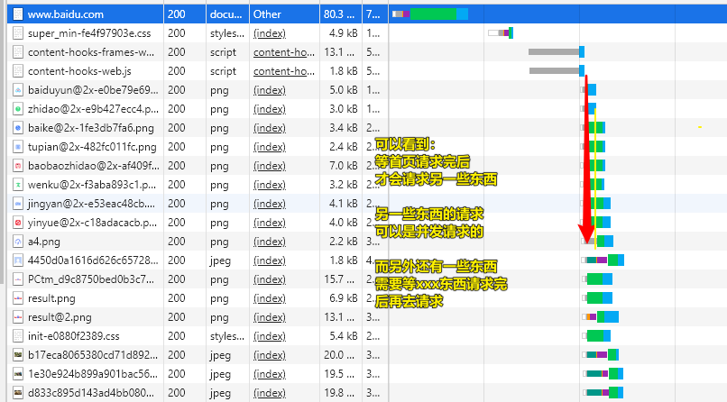
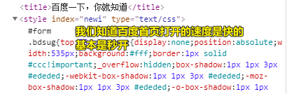
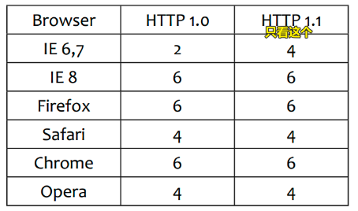
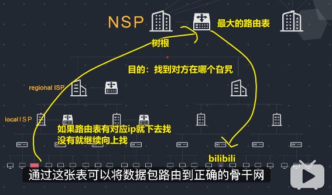
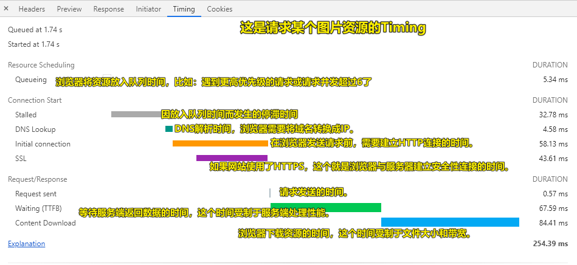

| ✍️ Tangxt | ⏳ 2020-06-21 | 🏷️ 浏览器底层渲染机制 |

# 25-浏览器底层渲染机制1：有关样式的处理

## ★引子

不了解浏览器渲染原理的前端开发工程师就是个假前端或者说是伪前端

了解了「浏览器的渲染原理」才算迈入了「前端开发」这个大门，才算懂得了一些前端是怎么来搞一些事情……

总之，「浏览器的渲染原理」很重要 -> 但其内容也是非常多的！可我们并不需要了解那么深，当然，如果了解得过浅也不行，所以就得让周老师给我们讲讲……

这次课的目的：

> 了解浏览器渲染原理以及相关的知识体系 -> 不多讲，不少讲

## ★进程和线程

- 进程 -> 餐馆
- 线程 -> 餐厅里边的服务人员

浏览器在执行JS和渲染页面的时候，只是分配了一个线程来做这件事

如你写了一个定时器，那么JS线程执行到这个定时器的时候会把计时任务交给另外一个线程B来做这件事，让B去数数计时

所以，JS线程就不用去等这个定时器的结果了，然后继续往下执行！

## ★你请求一个首页页面的时间轴

拿到HTML页面源码后，浏览器就会自上而上，从左到右一步一步解析页面……

## ★渲染页面的大致过程

1. 主线程解析HTML -> 遇到请求CSS资源的link标签，派一个小线程去处理这个资源的请求与响应接收（不会阻塞主线程去解析HTMl） -> DOM树构建完毕（可以想想程序的本质其是一棵有结构的树）
2. 主线程得到通知说「请求的CSS资源已经准备好了」 -> 处理CSS片段 -> 构建CSSOM
3. DOM+CSSOM -> 生成渲染树（Render Tree）
4. 计算每个DOM元素的在设备视口（viewport）内的确切位置和大小，生成布局树（layout Tree） -> 回流阶段（Layout）
5. 根据Layout Tree，得到节点的绝对像素 -> 重绘阶段（Painting）
6. Display：把像素发送给GPU，展示在页面上！

---

<mark>Q：link处理css、style标签处理css、@import 导入样式……这三者有啥区别吗？</mark>

- link是异步的，即不会阻塞接下来的HTML解析
- style标签和`@import`都是同步的，即你不完成CSS的解析，就不让你继续解析接下来的HTML

可以看到，link会让我们最终页面呈现出来的速度更快一些……毕竟，同时干，要比一件一件的干要快，如你煮碗面，是先把水煮开了，再去准备一些西红柿、丝瓜、鸡蛋啥的，还是在煮水的过程中，就去准备呢？显然是在煮水的过程中准备，毕竟这样一来，你吃到第一口面的时间就要快很多了！

所以，我们在真实项目中都是使用`link`来搞CSS的，而`@import`一般都是在有先后加载CSS顺序这样的需求时才会使用的！

> 周老师在项目开发里边，基本就没有用过`@import` -> 注意，这不同于sass、less等里边的`@import`，因为这里边的`@import`编译完后，是没有`@import`的，即这些样式都压缩合在一起了……

<mark>Q：所有的渲染都是从拉完HTML页面开始的？</mark>

如果你的HTML页面文件太大了，那么用户就会一直看到白屏

所以，如果样式文件很多，如一百几十行，那就用`link`吧！

而如果样式就几十行，那就用`style`标签吧！毕竟请求也是耗资源、耗时间的 -> 你看一下百度首页就知道它有部分样式写在`style`标签里边的：

对于一些不需要立刻渲染的样式，会用`link`标签来搞

至于`@import`就不用考虑了！

注意，像你用vue的单文件组件还是jsx啥的，所写的那些css和js最终都会被webpack编译成一个单独css文件和js文件……即都是外链请求资源的……

对了，我们移动端用`style`标签就是为了让页面加载更快一点，当然这只是页面优化的一小部分而已……

很多时候，我们渲染首屏：

1. 只把首屏样式用`style`标签处理，以及写上一些简单的HTML
2. 剩余的其它屏都通过JS动态生成HTML以及CSS

而这是骨架屏技术方案的一种实现……

<mark>Q：网络资源请求或者HTTP请求的最大并发数？如果一个页面有10几20个link标签，那么每个用户请求一个页面岂不是都得发送十几个HTTP请求？那么这服务器岂不是GG了？</mark>

大部分浏览器都维持在6个左右的最大并发数

像IE9可以有10个……

假如，有一份600M大小的资源，我们是分成6个100M去请求资源，还是分成12个50M去请求资源呢？

显然是6个

为啥这样说呢？

因为为了避免并发的上限，导致某些资源要延迟加载，毕竟资源延迟加载了，意味着页面渲染速度变慢了，所以我们应该要近可能减少HTTP的请求数量！不然，超过6个，就得等着排队了……而这排队就得又花时间了……这样算下来，那得白费多少时间呀！

形象点来说：

你要把仓库里边的12袋谷子搬到王二狗家里边去，假如一个人最大可以搬两袋谷子，搬一袋谷子需要支付50元，你最多能雇6个人

搬一袋谷子需要10分钟，两袋就是20分钟，回去一趟5分钟……

那么问题来了，如何在最快的时间内把谷子送到王二狗家中去？

每个人一次性搬两袋，这样一次就搬完了，只要了120分钟

如果每个人只搬一袋，那么每个人在搬第二袋的时候，走回仓库需要花5分钟的时间，那么加起来，最后总搬运时间就是150分钟了

可见王二狗要不耐烦了……

## ★了解更多

➹：[浅谈浏览器架构、单线程js、事件循环、消息队列、宏任务和微任务 · Issue #228 · FrankKai/FrankKai.github.io](https://github.com/FrankKai/FrankKai.github.io/issues/228)

## ★总结

- 为啥学习浏览器底层渲染机制，以及网络层面的HTTP机制等？ -> 一个是了为了网络性能优化，另一个是为了让你在写代码的时候能写出性能更好的代码，以及理解一些web apis运行机制是咋样的，好让你知道为啥要这样写代码！
- 性能优化技巧：
  - 样式多（100多行），用`link`（异步）；样式少（几十行），用`style`（同步），可加快首屏的渲染速度……
  - 尽可能减少发HTTP请求的数量，因为如果资源被排队等待了，那么页面的加载就很慢了……

## ★Q&A

### <mark>1）互联网是如何运作的？</mark>

简单了解一下：

我们在浏览器的地址栏敲入一个域名，拿到了来自服务端发送过来的数据

如我需要bilibili的首页，那么拿到就是一个首页 -> 客户端与服务端的通信就是手递手把数据交给对方 -> 就像是服务端把一个页面拷给了你一样

那么这是如何拿到的呢？

把整个网络体系想象成一棵树

你这台电脑就是一个子节点，服务器那台电脑就是另外一个子节点：

➹：[【干货】10分钟带你了解互联网是如何运作的！_哔哩哔哩 (゜-゜)つロ 干杯~-bilibili](https://www.bilibili.com/video/BV1Rz4y197Jd?t=8)

### <mark>2）浏览器是如何渲染拿到的页面的？</mark>

我一直有个疑问，那就是「浏览器是把所有的HTML文件数据都拿到后再去解析，还是拿到一点就去解析一点」

我想了想，不管是哪种情况都不会影响我们的开发！ -> 所以我其实并不需要去关心这个过程，当然，我可以简单理解为「拿到所有HTML数据后再去解析」，因为这样对于我们后续理解是如何渲染页面的是有极大的简便之处的……

➹：[【干货】浏览器是如何运作的？_哔哩哔哩 (゜-゜)つロ 干杯~-bilibili](https://www.bilibili.com/video/BV1x54y1B7RE)

### <mark>3）为什么要分析某个资源的Timing？</mark>

当需要调试网页或分析网站性能时，我们往往会F12打开浏览器控制台，查看网络请求，看网页加载了哪些资源，以及对应的请求方式（Method）、状态码（Status）、资源类型（Type）、大小（Size）、耗费的时间（Time）等。

如果某个资源耗费的时间比较长，我们需要深入分析时，则需要看另一个项目：瀑布流（Waterfall），在Waterfall中我们可以看出时间具体花在了哪些部分。

瀑布流中各项指标含义如下：

补充一个：

- Proxy negotiation：与代理服务器协商时间。

> 出现的垂直紫色线条：紫色线条前是HTML请求的资源，紫色线条之后是JS请求的资源

可以看到总时间为 **254.39** ms

我们可以发分为3部分来看（只需要看「**Request/Response**」）：

1. 第1部分是**客户端发送请求前的准备工作**，包括资源调度，代理转发等等时间，此时是在为发送http请求做准备工作（**准备工作做好后，正式发起一个http请求**）
2. 第2部分，也就是其中最重要的**等待中时间**，它代表的是从请求资源到第一个字节下载完成的时间，即获取在接收到响应的首字节前花费的毫秒数（**绿色部分，拿到第一个字节用了67.59ms**）
3. 第3部分，表示**传输时间**（下载第一个和最后一个字节之间的时间）(**蓝色部分，拿完剩余字节要了84.41ms**)

> 准备动手 -> 我动手了 -> 对方打我第一下 -> 对方打我结束

可以看出，就是将一次HTTP请求所花的时间做了拆解，从而有助于分析和定位问题所在。

**那么该如何减少资源耗时或者提高网页打开速度呢？我想有以下几个方向可以考虑：**

1. 优化资源顺序，减少首屏打开时间。
2. 合理收敛和发散网站的域名，域名太多导致更多的HTTP连接无法复用，域名太少导致超过浏览器限制并等待。
3. 减少HTTP请求数，如合理利用客户端缓存，现在前端也有些工具可以合并JS/CSS资源等。

➹：[分析Chrome的瀑布流（Waterfall）_张振伟的博客-CSDN博客_chrome waterfall](https://blog.csdn.net/zhang_zhenwei/article/details/90717954)

➹：[简单前端性能优化之Waterfall - 简书](https://www.jianshu.com/p/c7e0dad634db)

➹：[前端性能之Chrome的Waterfall_carian_violet的博客-CSDN博客_chrome waterfall](https://blog.csdn.net/carian_violet/article/details/84954360)

### <mark>4）浏览器是把一个HTML文件下载完后再去解析？还是边下载边解析呢？</mark>

下载、解析、渲染（在cssom构建完成的情况下）是并行的，但是并行有一定粒度，即当**解析的字节数到达一个临界值时**，就开始渲染，以达到**渐进式渲染效果**

> 当有 flush，内容 chunked 输出时，浏览器会下载一块后就立刻解析这一块。当 flush 的间隔时间合理时，可以达到渐进式渲染的效果
> 
> 反之，服务器没 flush，即没有 trunked 时，整个 html 是连续从服务器输出到浏览器端的，这时从瀑布图等上看，浏览器是等到都下载完成了才开始解析。

gzip是流式的压缩格式，可以做到边下载边解压。

有个概念的问题，不是说html是gzip压缩后的格式，而是HTTP协议可以**使用gzip压缩的方式来传输html文件**。

➹：[浏览器解析Html一般是边下载边渲染么？如果是边下载边渲染的话，Html又使用GZIP格式传输，如何能够做到没有完全下载就可以渲染的呢？ - 知乎](https://www.zhihu.com/question/19645229/answers/updated)

