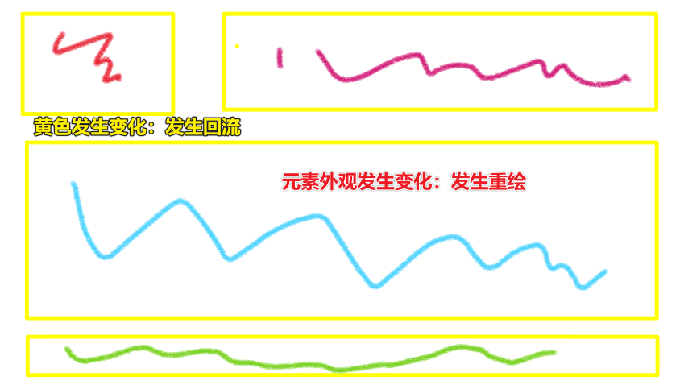
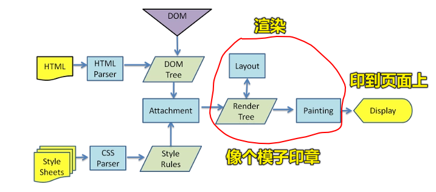

| ✍️ Tangxt | ⏳ 2020-06-25 | 🏷️ 浏览器底层渲染机制 |

# 27-浏览器底层渲染机制 3：DOM 回流和重绘

## ★概念

* 回流（reflow）：你想想假如现在页面已经渲染好了，但是你通过某种手段改变了元素的大小，以及元素的位置，那么是不是应该「回流」到 Render Tree，再重新锻造一番呢？ -> **大体画了一个架子**
* 重绘（repaint）：同样，你想想假如现在页面已经渲染好了，但是你通过某种手段只改变了元素的外观，风格，而不会影响元素的布局、大小等，比如 `background-color` ，那么就会发生「重绘」 -> **上色**



为啥要讲这俩东西？

因为我们写的 JS 代码，很有可能会导致回流多次，重绘多次

而回流和重绘这俩东西特别费时间，而这意味着页面效果就不好了 -> 所以我们要**尽可能的避免回流和重绘**

## ★回流一定会触发重绘，而重绘不一定会回流

### ◇何时发生「回流」？

> 元素的大小或者位置发生了变化（当页面布局和几何信息发生变化的时候），触发了重新布局，导致渲染树重新计算布局和渲染

如：

1. 添加或删除可见的 DOM 元素 ; 
2. 元素的位置发生变化；
3. 元素的尺寸发生变化；
4. 内容发生变化（比如文本变化或图片被另一个不同尺寸的图片所替代）;  
5. 页面一开始渲染的时候（这个无法避免）;  
6. 因为回流是根据视口的大小来计算元素的位置和大小的，所以浏览器的窗口尺寸变化也会引发回流。...

### ◇何时发生「重绘」？

> 元素样式的改变（但宽高、大小、位置等不变）

如：

1. `outline` 
2. `visibility` 
3. `color` 
4. `background-color` 
5. ……

## ★前端性能优化之：避免 DOM 的回流

### ◇放弃传统操作 dom 的时代，基于 vue/react 开始数据影响视图模式

我们是如何用 jQuery 或者原生 JS 操作 DOM？

很简单，获取元素 -> CRUD DOM 元素

可假如我们一个大页面有 3 个板块——A、B、C，我们需要改 A、B、C 这 3 个板块，我们在写代码的时候，为了板块分离，所以把板块 A 写在一个闭包里边，板块 B 写在另外一个闭包里边……

当我们操作 DOM 的时候，每个板块都会被操作一次，这样就得操作 3 次了……

而现在我们基于 Vue/React 这种数据渲染式，只要一次即可搞定

数据渲染时代，代码也是分模块开发的，但是它们渲染的时候，是拿到最新数据，重新生成虚拟 DOM，然后拿新的虚拟 DOM 跟之前旧的统一对比一下，这样一来哪个版块改了，哪个没改，就统一渲染一次就好了！

由于有虚拟 DOM、DOM diff 机制，是数据驱动视图的，所以我们不需要操作 DOM

所以一定可以避免我们回流的次数，即旧姿势需要多次回流才能处理完成，而新姿势，统一一次回流就能处理完成了

总之，新姿势引发回流的次数一定要比我们使用 jQuery、原生 JS 要少得多，毕竟新姿势是统一处理的！而不是 A 板块处理后，视图更新一次，然后 B 板块处理，视图再更新一次……

### ◇分离读写操作 （现代的浏览器都有渲染队列的机制）

当然，如果我们自己就是想操作 DOM 呢？就是想用 jQuery 和原生 JS 来操作 DOM 呢？

那么我们最好就是**读写分离**！

话说，啥是「读写分离」呢？

如果你这样写：

``` js
let btn = document.getElementById("btn");

btn.style.width = "100px";
btn.style.height = "200px";
```

那么在老的浏览器里边会触发两次，但是现代浏览器的渲染队列机制，会检测下一行代码是否也是「回流或重绘」操作，如果是，那就先不渲染，先排队先，直到不是了，才会去渲染

所以这会引发一次回流

可如果你这样呢？

``` js
let btn = document.getElementById("btn");

btn.style.width = "100px";
console.log(btn.clientWidth)
btn.style.height = "200px";
```

那就会触发两次了，因为 `btn.clientWidth` 是个读操作，所以它得读 `btn` 最新的 `clientWidth` 值，因此， `btn.style.width = "100px"` 执行了就会去渲染，然后读一次，然后 `btn.style.height = "200px"` 又会去渲染一次……

所以我们得这样写：

``` js
let btn = document.getElementById("btn");

btn.style.width = "100px";
btn.style.height = "200px";
console.log(btn.clientWidth)
```

这中写法就是「读写分离」了  -> 最终只会引发一次回流

那么有哪些属性属于读操作呢？（这些属性都会让浏览器立即渲染，毕竟都是要获取最新样式的）

- `offsetTop`、`offsetLeft`、`offsetWidth`、`offsetHeight`
- `clientTop`、`clientLeft`、`clientWidth`、`clientHeight`
- `scrollTop`、`scrollLeft`、`scrollWidth`、`scrollHeight`、
- `getComputedStyle`、`currentStyle`
- ……

如果出现以上这些属性的**读操作**都会 **刷新渲染队列**，即都会引发浏览器立即重新渲染

### ◇样式集中改变

我们改某个元素的样式时，一般不会只改一个，所以我们可以统一集中处理一下：

``` js
div.style.cssText = 'width:20px;height:20px;'
div.className = 'box';
```

因此，不用写成这个样子：

``` js
btn.style.width = "100px";
btn.style.height = "200px";
```

### ◇缓存布局信息

如果你这样写：

``` js
div.style.left = div.offsetLeft + 1 + 'px';
div.style.top = div.offsetTop + 1 + 'px';
```

即，读写都在一起了，上边的代码会产生**两次回流**

但如果你改成这样：

``` js
var curLeft = div.offsetLeft;
var curTop = div.offsetTop;
div.style.left = curLeft + 1 + 'px';
div.style.top = curTop + 1 + 'px';
```

即，把获取的值用个变量存起来，3、4 行代码在获取值的时候拿到的都是存储的那个变量值，那么在渲染时，它们都是排在渲染队列里边，然后再一起渲染！

这样只会产生**一次回流**

其原理还是「读写分离」

### ◇元素批量修改

- 文档碎片：createDocumentFragment
-  模板字符串拼接

假如你有这样一个需求，那就是需要往某个元素里边添加 10 个`span`元素，如果你这样做：

``` js
for (let i = 0; i < 10; i++) {
  let span = document.createElement("span");
  navBox.appendChild(span);
}
```

那么会产生 **10 次回流**

可如果你这样做：

``` js
let frag = document.createDocumentFragment();
for (let i = 0; i < 10; i++) {
  let span = document.createElement("span");
  frag.appendChild(span);
}
navBox.appendChild(frag);
```

那么只会产生**一次回流**

而产生**一次回流**的姿势，还有这种字符串拼接姿势：

``` js
let str = ``;
for (let i = 0; i < 10; i++) {
  str += `<span></span>`;
}
navBox.innerHTML = str;
```

### ◇动画效果应用到 position 属性为 absolute 或 fixed 的元素上（脱离文档流）

元素脱离文档流，意味着脱离了一个二维平面，但还是会触发回流，只是这种回流计算要比那种非脱离的要简单得多！

如你的动画改了元素的 margin 属性，元素是脱离的性能要比非脱离的好！

### ◇CSS3 硬件加速（GPU 加速）

比起考虑如何减少回流重绘，我们更期望的是，根本不要回流重绘；

transform、opacity、filters……等这些属性会触发硬件加速，不会引发回流和重绘……

但这可能会引发的坑有：过多使用会占用大量内存，性能消耗严重、有时候会导致字体模糊等

毕竟这是用机器性能来提供能量呀，即通过烧钱来换取性能呀！

### ◇牺牲平滑度换取速度

每次 1 像素移动一个动画，但是如果此动画使用了 100%的 CPU，动画就会看上去是跳动的，因为浏览器正在与更新回流做斗争。每次移动 3 像素可能看起来平滑度低了，但它不会导致 CPU 在较慢的机器中抖动

举例来说：

你要从 1px 移动到 100px，如果 1px、1px 这样移动的话，显然效果感人，但是会回流 100 次，但如果你 10px 移动一次呢？只需要回流 10 次，但这样一来，动画效果就不好看了

所以我们一般在做动画的时候，都是用「CSS3 动画+`transform`」来搞的！而不是用 JS 来搞动画！如果这动画非得用 JS 才能实现的话，那么你可以用`requestAnimationFrame`来搞！

### ◇避免 table 布局和使用 css 的 javascript 表达式

这个不怎么用了！

## ★了解更多

➹：[网页性能管理详解 - 阮一峰的网络日志](http://www.ruanyifeng.com/blog/2015/09/web-page-performance-in-depth.html)

➹：[什么是回流，什么是重绘，有什么区别？ - 简书](https://www.jianshu.com/p/e081f9aa03fb)

➹：[页面重排与重绘（Reflow & Repaint) - 知乎](https://zhuanlan.zhihu.com/p/35184404)

➹：[大龄电力汪前端学习路（页面渲染篇） - 知乎](https://zhuanlan.zhihu.com/p/33790840)

➹：[Web 性能优化-页面重绘和回流（重排） - lizhen's blog](https://lz5z.com/Web%E6%80%A7%E8%83%BD%E4%BC%98%E5%8C%96-%E9%A1%B5%E9%9D%A2%E9%87%8D%E7%BB%98%E5%92%8C%E5%9B%9E%E6%B5%81/)

➹：[浏览器渲染页面过程与页面优化 - 前端小事 - SegmentFault 思否](https://segmentfault.com/a/1190000010298038)

## ★总结

- 浏览器在处理重排时，会**递归处理DOM节点**，所以导致重排的成本高于重绘
- 能用 CSS3 动画就不要用 JS 动画，CSS3 里边能用`transform`改的，那就不用其它方式
- 读写分离、批量更改 CSS
- 使用 Vue/React 等这样的框架
- 渲染 = "生成布局"（flow）+ "绘制"（paint） -> 这相当于是在生成一个模板；最后一步，Display -> 相当于是把模板印到页面上！。形象点来说，就是一个枚印章，沾了点墨水，然后印到纸张上！
   
   
   
- 一个页面可以简单看成由两个部分组成：
  - DOM节点：描述页面的结构
  - DOM节点的属性：描述DOM节点如何呈现
- `display:none` 会触发 reflow，而 `visibility:hidden` 只会触发 repaint，因为没有发生位置变化。
