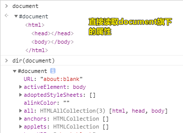

| ✍️ Tangxt | ⏳ 2020-06-27 | 🏷️ DOM 操作 |

# 28-DOM 操作-常用操作元素的属性和方法

> JS 中的 DOM 操作：盒子模型属性

## ★DOM 是什么？

文档对象模型 (Document Object Model)，提供系列的属性和方法，让我们能在 JS 中操作页面中的元素

> 属性 -> 特指不是方法的属性，即不是函数值的属性！总之，属性不加小括号执行，而方法则需要加上！

## ★我们操作页面中的元素，会用到哪些属性和方法？

### ◇获取元素的属性和方法

#### <mark>1、方法</mark>

``` js
document.getElementById([ID])
[context].getElementsByTagName([TAG-NAME])

// 在 IE6~8 中不兼容，即 IE6~8 里边咩有这样的方法
[context].getElementsByClassName([CLASS-NAME]) 

// 在 IE 浏览器中只对表单元素的 NAME 有作用
document.getElementsByName([NAME]) 

// 在 IE6~8 中不兼容
[context].querySelector([SELECTOR])
[context].querySelectorAll([SELECTOR])
```

`context`表示可以选择一个区域来获取元素！

#### <mark>2、属性</mark>

``` js
// 直接获取某个属性：document、html、head、body
document
document.documentElement  
document.head
document.body
```



``` js
// 已知某个节点，可以通过该节点的属性，拿到其它节点 -> 考量节点与节点之间的关系

childNodes 所有子节点

//=>IE6~8 中会把注释节点当做元素节点获取到
children 所有元素子节点

parentNode

//=>所有带 Element 的，在 IE6~8 中不兼容
firstChild / firstElementChild
lastChild / lastElementChild
previousSibling / previousElementSibling
nextSibling / nextElementSibling
```

---

可以看到，如果不去兼容 IE 的话，一个页面中的元素我们都可以很方便的获取到！

话说，我们获取到这些元素有啥用呢？

**对获取到这些元素进行「增删改」以及修改它们的样式或获得它们的样式**

### ◇DOM 的增删改操作

#### <mark>1、创建</mark>

``` js
document.createElement([TAG-NAME])
document.createTextNode([TEXT CONTENT])
//字符串拼接（模板字符串），基于innerHTML/innerText存放到容器中

// 不传参是浅clone，只clone节点的标签、样式、属性，但标签里边的子元素，以及被clone的这个节点的事件处理方法是咩有被clone的，所以这叫浅clone
// 深clone：会递归复制被clone的这个节点的所有子孙节点；对了，绑定的事件也不会被clone！
// 返回一个节点副本 -> 一般我们会把它增加到页面上！
[ELEMENT].cloneNode([TRUE/FALSE])
```

> 有四种姿势

#### <mark>2、增加</mark>

``` js
// 在儿子末尾增加一个
[PARENT].appendChild([NEW-ELEMENT])

// 在旧元素前边增加一个
[PARENT].insertBefore([NEW-ELEMENT],[ELEMENT])
```

> 小括号里边放`[]`表示词法单元符，描述它是啥意思，应该放哪些参数 -> 用于占位的方式
> 
> `[ELEMENT]`是旧元素

#### <mark>3、删除</mark>

``` js
[PARENT].removeChild([ELEMENT])
```

#### <mark>4、改</mark>

``` js
// 设置自定义属性

// 追加属性
[ELEMENT].xxx=xxx;
console.log([ELEMENT].xxx);
// 删除属性
delete [ELEMENT].xxx;

// 在元素结构上设置
[ELEMENT].setAttribute('xxx',xxx);
console.log([ELEMENT].getAttribute('xxx'));
[ELEMENT].removeAttribute('xxx');
```

### ◇获取元素样式和操作样式

#### <mark>1、修改元素样式</mark>

``` js
// JS常用这种 style.xxx 姿势
[ELEMENT].style.xxx=xxx;  //=>修改和设置它的行内样式
[ELEMENT].className=xxx;  //=>设置样式类
```

#### <mark>2、获取元素样式</mark>

``` js
console.log([ELEMENT].style.xxx); //=>获取的是当前元素写在行内上的样式（HTML结构上的样式），如果有这个样式，但是没有写在行内上，则获取不到
```

这种姿势很鸡肋，因为我们一般都不会在HTML结构上写样式，所以这种「获取元素样式」姿势我们是很少会用到的！

因此，这就引出了我们的下一个内容「**JS盒子模型属性**」，它同样是我们「获取元素样式」的一种手段，但更为强大，而且我们操作DOM也是为了动态修改元素的样式，所以它是贼鸡儿重要的内容！

## ★JS盒子模型属性

### ◇是什么？

基于一些属性和方法，让我们能够**获取到当前元素的样式信息**，而我们需要记住的属性有：`clientWidth` 、`offsetWidth`等

具体要记住一下这13个属性：

- client
  - width / height
  - top / left
- offset
  - width / height
  - top / left
  - parent
- scroll
  - width / height
  - top / left

> 3大类 -> 再分（xX格式的组合） -> 如clientHeight、offsetHeight、scrollHeight……

以上就是JS盒子模型里边要获取的样式属性！（**只有13个**）

还有，记住以下这两个方法：

- `window.getComputedStyle([ELEMENT],[伪类])`
- `[ELEMENT].currentStyle`

通过这两个方法，我们也可以获得元素的样式！

---

至此，我们就知道了JS盒子模型属性到底是干啥的了 -> 只有一个作用，那就是获取元素的样式信息哈！

## ★了解更多

➹：[Javascript中DOM常见API - 知乎](https://zhuanlan.zhihu.com/p/48983351)

➹：[DOM API - 知乎](https://zhuanlan.zhihu.com/p/39732959)

## ★总结

- 对元素的操作：
  - 获取元素、增删改查元素
  - 设置或管控自定义属性
  - 获取元素的样式信息、操作元素的样式
  - DOM事件绑定
- 有了对元素操作的基本认识，再去了解DOM性能优化、一些核心技巧，那么对DOM这块知识的认识也就差不多了！

## ★Q&A

### <mark>1）cloneNode()？</mark>

➹：[HTML DOM cloneNode 方法 - 菜鸟教程](https://www.runoob.com/jsref/met-node-clonenode.html)

➹：[学习一下DOM中的cloneNode（）与cloneNode（true）的基础知识 - 木人子韦一日尘 - 博客园](https://www.cnblogs.com/murenziwei/p/8935037.html)


