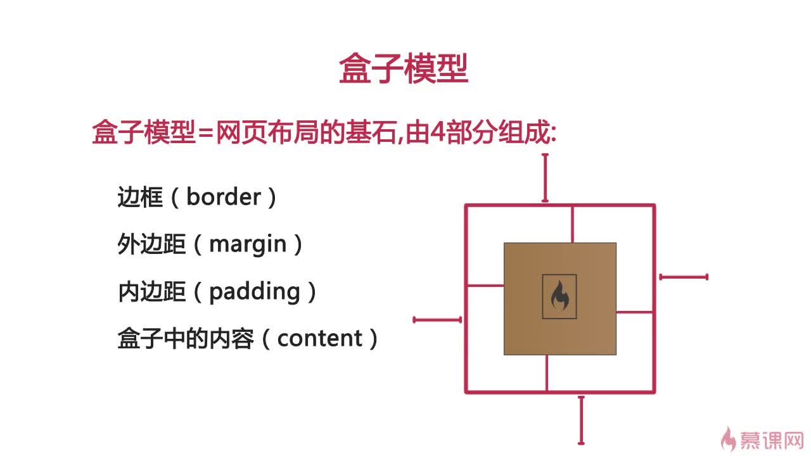
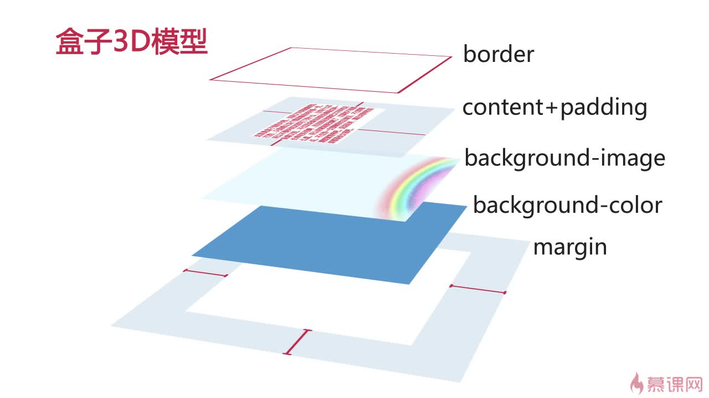

| ✍️ Tangxt | ⏳ 2020-06-27 | 🏷️ DOM 操作 |

# 29-DOM操作-复习CSS中盒子模型属性

## ★前言

了解一下：

哪一个属性获得的是**元素的哪一部分样式信息** -> 这些盒子模型属性都代表什么？

> 这些属性和方法，在jQuery里边都有封装到！

## ★`client`

### ◇获取盒子可视区域的宽高

``` JS
let box = document.getElementById('box');

// 内容宽度+左右padding
box.clientWidth
// 内容高度+上下padding
box.clientHeight
```

要了解这俩属性，先来看看CSS的盒子模型！

#### <mark>1、传统的盒子模型属性（content-box，默认值）</mark>



- content：width、height
- padding：top、right、bottom、left
- border：width style color
- margin：top、right、bottom、left

```
盒子的宽度 = width + 左右padding + 左右border
```

如果左右padding为0，左右border也为0，那么`width`值就可以看成是盒子的宽度啦！

需求：

> 搞个300*300的盒子出来

这样写？

``` css
.box {
  width: 300px;
  height: 300px;
  padding: 10px;  
  border: 2px solid yellow;
  margin: 10px;
}
```

可以看到，盒子的实际大小是：`324*324`，而我们要的是`300*300`，所以我们改一下盒子的`width`和`height`值：

``` css
.box {
  width: 276px;
  height: 276px;
}
```

假如有一天设计稿变了，觉得这`padding`太大了，于是，修改该盒子的`padding`为`5px`

这样一来，盒子大小又变了，为了保证盒子是`300*300`的大小，于是我们又修改了盒子的`width`和`height`值……

同理，`border`如果有一天变化了也是如此，当然，你也可以通过修改`padding`值，来维持`300*300`的大小！

所以，CSS3里边就给我们提供了新的盒子模型属性！即`border-box`

题外话：



#### <mark>2、新盒子模型（border-box）</mark>

我们设置`box-sizing`的值为`border-box`

那么我们写的`width`和`height`值不再是content的宽高，而是盒子的最后大小

如这样：

``` css
.box {
  box-sizing: border-box;
  width: 300px;
  height: 300px;
  padding: 10px;  
  border: 2px solid yellow;
  margin: 10px;
}
```

那么这个盒子始终会保持 `300*300` 的大小，无论你如何修改`padding` 或 `border` 的值，**content都会自动跟着收缩**，让盒子大小始终保持不变！

我们一般在写CSS的时候，都会让盒子变为 `border-box` 这种模型，因为这方便我们写完`width`和`height`之后，就不用再因为`padding` 、`border`的变化而手动计算宽高了！

## ★了解更多

➹：[怪异盒模型、弹性盒模型、多列布局 - 大贾 - 博客园](https://www.cnblogs.com/dajia0809/p/12699378.html)

➹：[多列布局和弹性盒模型详解 - 溢流谦 - 博客园](https://www.cnblogs.com/yan--li/p/7327652.html)

➹：[css3 弹性布局和多列布局 - 热爱前端知识 - 博客园](https://www.cnblogs.com/10manongit/p/13022430.html)

## ★总结

- CSS 盒子模型 与 JS 盒子模型是有关联的！
- 新盒子模型 -> 一旦固定了盒子的宽高，那么动态变化`padding`、`border`的值时，那么`content`就会被随着收缩或放大！
- 除了CSS3这种新盒子模型以外，还有flex盒子模型、多列布局（用于新闻排版）


