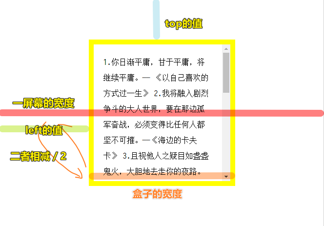

| ✍️ Tangxt | ⏳ 2020-06-29 | 🏷️ DOM 操作 |

# 30-DOM操作-client系列（实现居中的多种办法）

## ★前言

看看JS盒子模型属性都是些啥值？

## ★Client

### ◇ `clientWidth` & `clientHeight` 

#### <mark>1、内容溢出与否对它无影响</mark>


具体点：

``` css
.box {
  width: 300px;
  height: 300px;
  padding: 20px;
  border: 10px solid yellow;
  margin: 20px auto;
  line-height: 32px;
}
```


``` 
clientWidth = 300 + 20 * 2 = 340
clientHeight = 300 + 20 * 2 = 340
```

如果盒子模型是 `border-box` ，如：

``` css
.box {
  box-sizing: border-box;
  width: 300px;
  height: 300px;
  padding: 20px;
  border: 10px solid yellow;
  margin: 20px auto;
  line-height: 32px;
}
```

那么：

``` 
clientWidth = 300 - 10 * 2 = 280
clientHeight = 300 - 10 * 2 = 280
```

所以，都是看盒子可视区域的宽高！即求出「padding+content」的值！

#### <mark>2、获取的结果是没有单位的（其余的盒模型属性也是）</mark>

总共有13个，其中 `offset` 有个 `parent` ，它获取的是某个元素，即它不是具体的数值！

所以凡是： `xxxWidth` 、 `xxxHeight` 、 `xxxTop` 、 `xxxLeft` 这样的值，都是咩有单位滴！


#### <mark>3、获取的结果是整数，它会自己进行四舍五入（其余的盒模型属性也是）</mark>


为啥 `clientWidth` 就不是 `341` 呢？

难道这是随缘的？不过我们一般写CSS都不会出现这样的浮点数值 `300.5px` 吧……

### ◇获取当前页面一屏幕（可视化）区域的宽高

我们可以获取**一个盒子**的可视区域的宽高，那么**一个页面**的可视区域的宽高我们能否获取呢？

我们知道一个页面内容特别多的时候，就会出现滚动条，如你打开 <https://www.bilibili.com/>，可以看到页面右侧有个滚动条

我们想要获取页面一屏幕的宽高，所谓的一屏幕，就是你不滚动滚动条，所看到的结果，你滚动了滚动条，就相当于是在查看溢出的内容！ -> 这是站在「一屏幕」这个度量来看的，如果页面内容很多，即页面行长，那么就可以说成是「有几个屏的长度」……

总之，超出一屏幕的内容，就是溢出的内容！ -> 滚动滚动条就是在查看溢出的内容

那么我们如何获取「一屏幕」的宽高呢？

有两种姿势：

1. 获取整个html的可视区区域的宽高
2. 获取整个body的可视区区域的宽高

所以可有：

``` js
let winW = document.documentElement.clientWidth || document.body.clientWidth;
let winH = document.documentElement.clientHeight || document.body.clientHeight;
```

`document.documentElement.clientWidth` 在低版本浏览器不支持，所以用 `document.body.clientWidth` 作为兜底值！

我们获取一屏幕的宽高的本质是，**获取 `html` 元素，或 `body` 元素的可视化区域的宽高**！

---

<mark>Q：垂直滚动条的出现算不算可视化区域的宽？</mark>


如果是 `border-box` ：


削掉滚动条的宽+border的宽……

### ◇我们学以上这些内容有啥用？或者说我们拿到元素的clientWidth和clientHeight可以干什么？

需求：

> 我们想要让一个盒子在整个页面里边绝对居中（水平和垂直都居中）

盒子目前是这样的：

``` css
 body {
   margin: 0;
   padding: 0;
 }

 .box {
   box-sizing: border-box;
   width: 300px;
   height: 300px;
   padding: 20px;
   border: 10px solid yellow;
   line-height: 32px;
   overflow: auto;
 }
```

``` html
<div class="box" id="box">
  1.你日渐平庸，甘于平庸，将继续平庸。—— 《以自己喜欢的方式过一生》
  2.我将融入剧烈争斗的大人世界，要在那边孤军奋战，必须变得比任何人都坚不可摧。——《海边的卡夫卡》
</div>
```

#### <mark>1、CSS做法</mark>

姿势1：

``` css
.box {
  position: absolute;
  top: 50%;
  left: 50%;
  margin-left: -150px;
  margin-top: -150px;
}
```

不好之处：我们必须知道盒子的固定宽高，不然，你如何确定 `margin-left/top` 的值？

姿势2：

基于CSS3变形属性中的位移，在不知道宽高的情况下也能实现效果

``` css
.box {
  position: absolute;
  top: 50%;
  left: 50%;
  transform: translate(-50%, -50%);
}
```

基于盒子自身位移一半！

姿势3：

这种姿势的兼容性不是特比好

``` css
.box {
  position: absolute;
  top: 0;
  left: 0;
  bottom: 0;
  right: 0;
  margin: auto;
}
```

姿势4：

``` css
html,
body {
  height: 100%;
}

body {
  display: flex;
  /* 主轴对齐姿势 */
  justify-content: center;
  /* 交叉轴对齐姿势 */
  align-items: center;
}
```

flex容器，即 `body` 元素，得撑满整个屏幕的高度！

所以还有一种简单姿势：

``` css
body {
  height: 100vh;
  display: flex;
  justify-content: center;
  align-items: center;
```

flex布局这种姿势很简单，所以现在在项目里边一般都用这个来让盒子绝对居中！

#### <mark>2、JS做法</mark>

思路：



在日常生活中，你也可以用这种姿势来居中一个东西，如你面前有个键盘，你手上拿着手机，那么你如何才能让手机居中与键盘呢？ -> 如果你的笔记本是被个支架支起来的，那么如果你居中了手机，同样，支架也可以对称起来！

1. 视觉感知
2. **left = (笔记本键盘宽度-手机宽度) / 2**

做法：

``` js
// JS实现居中：(一屏幕的宽度-盒子的宽度)/2 === LEFT
let winW = document.documentElement.clientWidth,
  winH = document.documentElement.clientHeight,
  box = document.getElementById("box");
box.style.position = "absolute";
box.style.left = (winW - 300) / 2 + "px";
box.style.top = (winH - 300) / 2 + "px";
```

性能咩有CSS那么好，但是很方便！不过，如果屏幕变化了，这居中就GG了，因为我们这JS只执行一次！

所以，我简单封装了一下：

``` js
function boxCenter(parent, sonId) {
  // JS实现居中：(一屏幕的宽度-盒子的宽度)/2 === LEFT
  let winW = parent.clientWidth,
    winH = parent.clientHeight,
    box = document.getElementById(sonId);
  box.style.position = "absolute";
  box.style.left = (winW - 300) / 2 + "px";
  box.style.top = (winH - 300) / 2 + "px";
}

boxCenter(document.documentElement, "box");

window.onresize = function() {
  boxCenter(document.documentElement, "box");
};
```

### ◇获取盒子左边框和上边框的大小

``` js
// border-left-width
box.clientLeft

// border-top-width
box.clientTop
```

只能获取左和上的大小，而右和下的是无法获取的，因为咩有 `clientRight` 、 `clientBottom` 这样的属性……

### ◇clientX 和 clientY

> 鼠标距离可视区域左上角的距离（用于事件）

``` js
box.onclick = function(e) {
  console.log(e.clientX);
  console.log(e.clientY);
};
```


## ★了解更多

➹：[js盒子模型常用属性_sushans的博客-CSDN博客_js盒子模型](https://blog.csdn.net/sushans/article/details/51697844)

➹：[JS-盒子模型_繁花落幕的博客-CSDN博客_js中盒子模型的组成部分](https://blog.csdn.net/yjl15517377095/article/details/99444735)

➹：[Flex 布局教程：语法篇 - 阮一峰的网络日志](http://www.ruanyifeng.com/blog/2015/07/flex-grammar.html)

## ★总结

* 让一个盒子绝对居中，有两大类姿势
  + CSS姿势
  + JS姿势
* 我们拿到的 `clientWidth` 和 `clientHeight` ，是某个盒子的 `content+padding` 的结果（不同的盒子模型，对应的计算过程是不一致的），注意「滚动条」不是 `client` 的一部分，而且点击滚动条不会触发click事件，但点击 `border` 则会触发click事件！

滚动条会削掉 `content` 的大小，一个滚动条的大小是 `17*17` ，假如一个盒子大小是 `1366*768` ，那么 `clientX/Y` 就是 `1349*768` -> 只有垂直滚动条才会削去盒子 `content` 的 `width` -> 削去 `17px` ，而水平滚动条则不会！

``` html
<style>
  body {
    margin: 0;
    padding: 0;
    height: 768px;
    width: 100%;
    border: 20px solid yellow;
  }
</style>
</head>

<body>
  我是body
</body>
```


