| ✍️ Tangxt | ⏳ 2020-06-29 | 🏷️ DOM 操作 |

# 31-DOM 操作-scroll 系列（回到顶部案例）

## ★offsetWidth & offsetHeight

``` js
//  -> 在 CLIENT 的基础上加上 BORDER == 盒子本身的宽高
box.offsetWidth
box.offsetHeight
```

``` css
.box {
  width: 300px;
  height: 300px;
  padding: 20px;
  border: 10px solid yellow;
  line-height: 32px;
}
```

如果盒子模型是 `border-box` ，那么 `width` 值是多少， `offsetWidth` 值也是多少，同理 `offsetHeight` 也是如此！如盒子是 `300*300` ，那么 `offsetWidth` 是 `300` ， `offsetHeight` 也是 `300`
如果盒子模型是 `content-box` ，那么 `offsetWidth` 就是 `360 = 300 + 20 * 2 + 10 * 2` ， `offsetHeight` 也是 `360`
一些特点：

1. 同 `client` 一样，内容溢出咩影响，毕竟这是基于 `client` 的
2. 同 `client` 一样，也是 `Number` 类型的整数值
3. 同 `client` 一样，也会四拾伍入

## ★scrollWidth & scrollHeight

### ◇在没有内容溢出的情况下，获取的结果和 CLIENT 是一样的

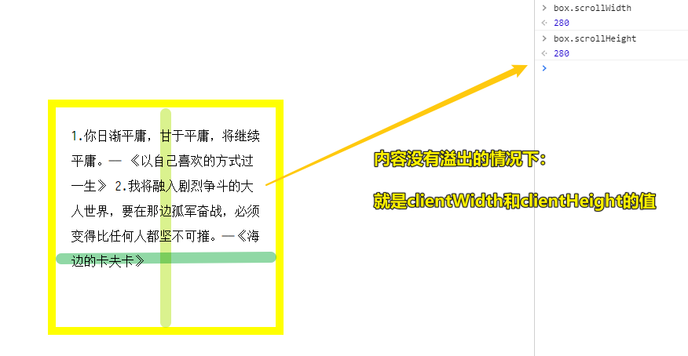

``` js
box.scrollWidth
box.scrollHeight
```

> 图中的盒子模型是 `border-box`
`scroll` 有 滚动的意思，所以测试一下：「内容溢出」+「添加滚动条」

### ◇在有内容溢出的情况下，获取的结果约等于真实内容的宽高（上/左 PADDING + 真实内容的高度/宽度）

为什么说「约等于」呢？

1. 不同浏览器获取的结果不尽相同 -> 浏览器之间存在各自的默认样式 -> 所以可能会有几像素的误差
2. 设置 `overflow` 属性值对最后的结果也会产生一定的影响

测试：

``` css
.box {
  box-sizing: border-box;
  width: 300px;
  height: 300px;
  padding: 20px;
  border: 10px solid yellow;
  /* 两种情况下：决定有无溢出 -> 注释掉无溢出，没有注释掉有溢出 */
  line-height: 64px;
  /* 三种情况：不写 overflow 属性、scroll、auto */
  overflow: auto;
}
```

#### <mark>1、内容只有溢出，没有设置 `overflow` 属性</mark>

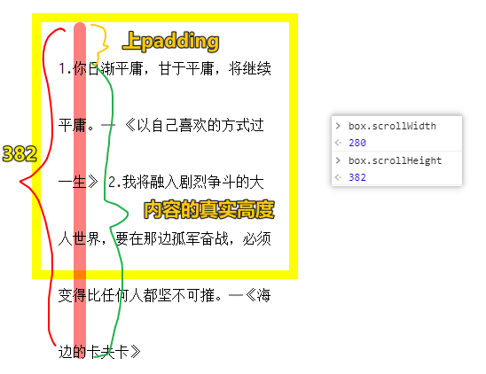

---

这一坨内容是基于后边的理解才写下来的（从上到下阅读时，请忽略这段，看完后边的内容才看这段，不然，你是不知道在下文的几点里边，我为何会产生一些「不知道如何计算」的疑问）：

> ps：上 padding 非 padding 值！只是简单理解成「文字高度+空白高度」
>  
> 我设置了行高是 `64px` ，总共有 `6` 行，得到 `384px` ，末尾一行去掉 `(64-16)/2 = 24px` （溢出的缘故，不溢出不用削掉），所以文字高度是 `384-24=360` ，而 `padding-top` 是 `20px` ，所以最终结果是 `380px` ，然而 `scrollHeight` 是 `382` ，根据不同字体存在先天性的「字体度量」，所以文字内容的实际高度是 `362px` ，而不是 `360px`
关于字体度量可以看一下这个：

➹：[深入理解 CSS：字体度量、line-height 和 vertical-align - 知乎](https://zhuanlan.zhihu.com/p/25808995)

---

#### <mark>2、内容有溢出，而且设置了 `overflow:hidden`</mark>

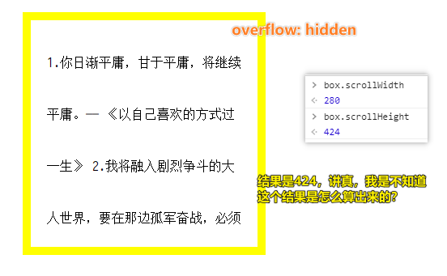

#### <mark>3、内容有溢出，而且设置了 `overflow:scroll`</mark>

`overflow: scroll` 这个属性，不怎么常用，因为内容如果是没有溢出的，它也会加上滚动条，如这样：

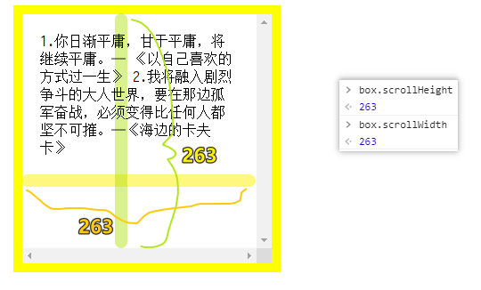

> 滚动条不是内容的一部分

如果有溢出呢？

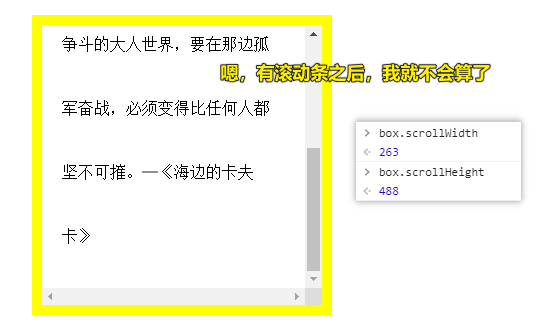

#### <mark>4、内容有溢出，而且设置了 `overflow:auto`</mark>

一般我们在实际开发中用的是 `auto` ，而不是 `scroll` ，因为后者即便内容没有溢出，也会叫滚动条，而前者只有在内容溢出的时候才会加！

内容无溢出（有无 `overflow:auto` 都一样）：

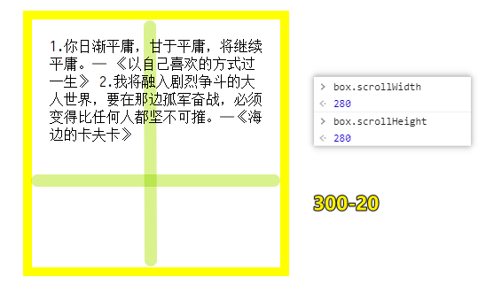

内容有溢出：

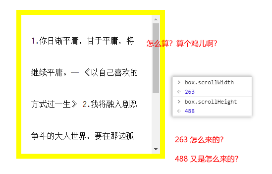

我似乎知道这个 `488` 是怎么来的了 -> 由于多了一个垂直滚动条，这意味着一行的文字数变少了，本来在咩有这个滚动条的时候，一行有 15 个，可现在只有 13 个，而这意味着，内容的高度增大了！ -> 本来是 6 行，现在是 7 行

经过我粗略计算，488 是这么来的：

文字内容高度+上下 padding：

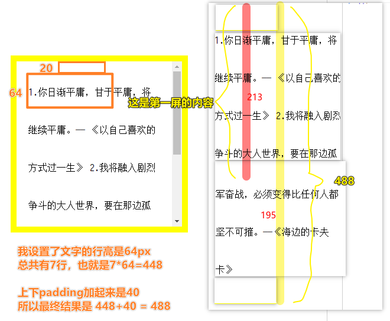

形象点来说：

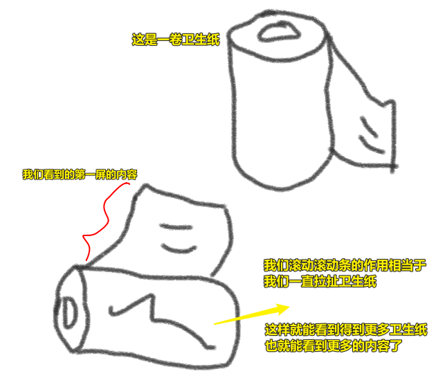

我把 `content` 看成是「卫生纸」，或者你也可以把 `scrollHeight` 看成是「卫生纸」

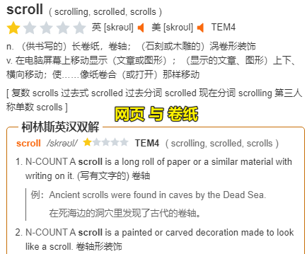

> 对词源发散一下去理解一些东西……

### ◇了解这俩属性有啥用？

#### <mark>1、如何获取一个页面的真实的高度？</mark>

我们通过 `clientHeight` ，可以获得一屏的高度，但溢出的内容（相对于一屏幕的溢出），那我们该如何获取呢？

也就是说，如何获取「一屏高度+溢出内容高度 = 页面的真实高度」？


灰常简单：

``` js
//获取整个页面真实的高度
document.documentElement.scrollHeight || document.body.scrollHeight
```

## ★scrollTop & scrollLeft

### ◇概述

``` js
// 竖向滚动条卷去的高度
box.scrollTop

// 横向滚动条卷去的宽度
box.scrollLeft
```

测试：

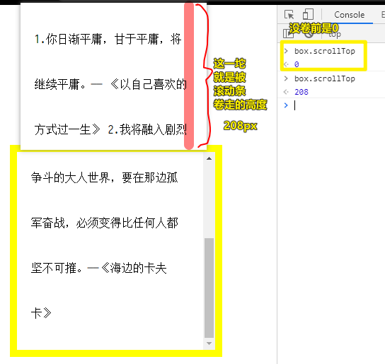

> 就像是一页纸的顶部，被切掉多少一样，或者被卷走了多少一样 -> 也可以把盒子当作是一个井盖，页面就是流动的河流……

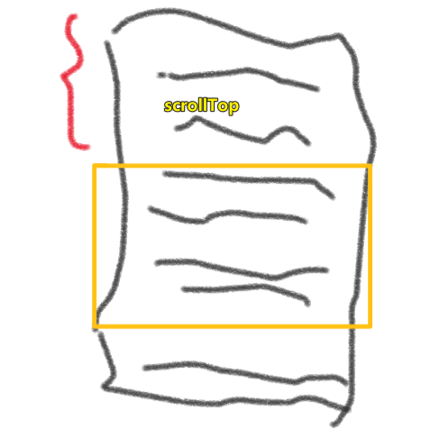

---

#### <mark>Q：话说，scrollTop 的值是否有边界？即它是否有最小值和最大值？</mark>

* 边界值：
  + `Min = 0`
  + `Max = 整个的高度 scrollHeight - 一屏幕高度 clientHeight` -> 回到底部

``` js
// box.scrollTop = box.scrollHeight - box.clientHeight
208 = 488 - 280
```

为啥最大值的计算会这样呢？

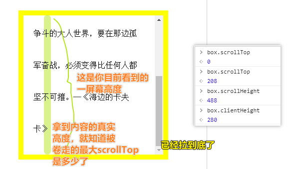

---

这两个属性的特别之处：

> 13 个盒子模型属性，只有这两个是“**可读写**”的属性（既可以获取也可以设置对应的值），其余的都是“只读”属性（不能设置值，只能获取）

如：

``` js
box.scrollTop = 0;
```

> 这说白了，通过JS，更改 `scrollTop` 的值，可以让页面自己滚动到相应的位置去！ -> 很多博客文章都会有很多级标题的，如果你做了一个有关标题的目录树，那么你可以通过点击目录树到底任何一个标题 -> 这似乎是使用a标签的 `#xxx` 实现的…… -> 如果用 `scrollTop` 的话，应该是那些 `返回顶部` 的小按钮吧！

不管怎样，可以简单理解成这样：你的面前有一幢88层楼的高楼大厦，你进入电梯，你想到66层楼，你只需要点一下「66」这个按钮，就会把你送到66层楼 -> 把一幢楼看成是一张网页，把每一层楼看成是一个个标志……

简单用途：

* `scrollTop` 的最小值：回到顶部
* `scrollTop` 的最大值：来到底部

### ◇实现一个回到顶部的功能

需求：

> 滚动页面到一定程度的时候，就会出现一个「回到顶部」的按钮，点击该按钮，就可「回到顶部」

#### <mark>1、咩有动画的简易版回到顶部</mark>

代码：

``` html
<!DOCTYPE html>
<html>

<head>
  <meta charset="UTF-8" />
  <title>回到顶部</title>
  <style>

    - {

      margin: 0;
      padding: 0;
    }

    html,
    body {
      height: 1000%;
      /* CSS3中的背景颜色线性渐变 */
      background: -webkit-linear-gradient(top left,
          lightblue,
          lightpink,
          lightyellow);
    }

    .link {
      display: none;
      position: fixed;
      right: 30px;
      bottom: 230px;
      box-sizing: border-box;
      width: 100px;
      height: 100px;
      background: lightcoral;
      font-size: 16px;
      color: #000;
      text-decoration: none;
      text-align: center;
      line-height: 100px;
    }
  </style>
</head>

<body>
  <a href="javascript:;" id="link" class="link">backTop</a>

  <script>
    let HTML = document.documentElement,
      LINK = document.getElementById("link");

    // 1.当浏览器滚动条滚动的时候，我们进行验证：卷去的高度超过两屏，我们让#LINK显示
    function check() {
      //winH:一屏幕高度  scrollT:卷去的高度
      let winH = HTML.clientHeight,
        scrollT = HTML.scrollTop;
      LINK.style.display = scrollT >= winH * 2 ? "block" : "none";
    }
    // window.onscroll = check;

    window.addEventListener("scroll", throttle(check));

    // 2.点击回到顶部
    LINK.onclick = function() {
      HTML.scrollTop = 0;
    };
  </script>
</body>

</html>
```

---

#### <mark>Q：如何出现十屏？</mark>

``` css
html,
body {
  height: 1000%;
}
```

一屏 `100%` ，十屏就是 `1000%`
如果你还添加渐变色，你会看到一些还不错的效果 -> 图解CSS一书可以去看看！

#### <mark>Q：如何让按钮固定漂浮在某个位置？</mark>

固定定位

#### <mark>Q：超过几屏就出现「按钮」？</mark>

一般是2屏，当然，你需求是咋滴，就咋搞吧！

按钮在一屏的时候是 `display:none` 的，超过2屏之后，就 `display:block`

#### <mark>Q：滚动姿势有？</mark>

1. 鼠标滑轮滚动
2. 摁住滚动条往下拖滚动
3. 按下方向键滚动
4. 按空格键滚动

#### <mark>Q：我们在滚动滚动条的时候，会频繁触发 `scroll` 事件，而这很咩有意义，如果 `callback` 的执行时间很长的话，会造成页面渲染卡顿的，所以我想让 `callback` 的执行节制一下，即在xxx时间内，即便触发了 `scroll` 事件， `callback` 也不会执行，黄色点来说就是「3s后冷却24小时」，在冷却的这段时间内，不管你怎么撩我，弟弟就是硬不起来……3s就是你能坚持的时间，也就是 `callback` 的执行时间……（请原谅我，讲了黄色，但这一切都是为了好记忆，手动狗头）</mark>

``` js
/**
 *
 * @param {Function} callback 回调函数
 * @param {Number} wait       间隔时间
 *
 * @return {Function} 节流函数
 */
function throttle(callback, wait = 3000) {
  let timer = null;
  let startTime;
  return function() {
    const ctx = this;
    const args = arguments;
    const now = +new Date();
    if (startTime && now < startTime + wait) {
      clearTimeout(timer);
      timer = setTimeout(function() {
        startTime = now;
        callback.apply(ctx, args);
      }, wait);
    } else {
      startTime = now;
      callback.apply(ctx, args);
    }
  };
}
```

一些疑问：

1. 在冷却这短时间内，触发了事件是否会延迟冷却时间？ -> 如设冷却时间为 `10s` ，在 `5s` 的时候触发了事件， `callback` 没有执行，但是否会让冷却时间重置？也就是又重新开始冷却 `10s` 了 -> **不会，因为如果真这样的，那么我在快速滚动的时间内，那就会一直重置咯，这样 `callback` 一直都不会执行……**
2. 在冷却的这段时间内（ `10s` 冷却时间），在 `5s` 的时候触发了事件， `callback` 不会执行，那么冷却结束后，这个 `callback` 还会执行吗？ -> 简单来说，我在玩LOL，我放了一次大招冷却了60s，我在冷却的时间内，摁了一次大招键，冷却结束后，这个大招是否会被释放？ -> 在LOL里边显然不是，而函数节流是会的，也就是说冷却的这段时间内，如果触发了事件，会把这个事件的 `callback` 暂存起来，等到冷却结束后执行！ -> **如果在冷却的时间内，多次触发事件，那么冷却结束后，只会执行最后一次 `callback` **

#### <mark>Q： `HTML.scrollTop = 0` 是异步执行的吗？我想让回去</mark>

假如有这样的代码：

``` js
LINK.onclick = function() {
  LINK.style.display = "none";
  window.onscroll = null;
  HTML.scrollTop = 0;
  console.log(1);
  window.onscroll = throttle(check);
  console.log(2);
};
```

那么，是滚动条会到顶部之后，才会执行 `log 1` ，还是 `log 2` 执行结束后，才会执行滚动条回到顶部？

测试：

``` js
LINK.onclick = function() {
  LINK.style.display = "none";
  window.onscroll = null;
  HTML.scrollTop = 0;
  console.log(1);
  // window.onscroll = throttle(check);
  for (var i = 0; i < 1000; i++) {
    console.log("hi");
  }
  console.log(2);
};
```

测试得知 `HTML.scrollTop = 0` 不会立刻执行，执行 `log1` ，循环 `200` 多次之后，滚动条才出发回到顶部，之后继续循环，直到执行完 `log 2`
所以，我在一个 `callback` 内同时写：

``` js
window.onscroll = null;
window.onscroll = throttle(check);
```

是无效的，因为并不会等 `HTML.scrollTop = 0` 真正执行后，才会走 `window.onscroll = throttle(check)`
所以我可以搞个 `1s` or `0` 的定时器……

``` js
LINK.onclick = function() {
  LINK.style.display = "none";
  window.onscroll = null;
  HTML.scrollTop = 0;
  setTimeout(() => {
    window.onscroll = throttle(check);
  }, 0);
};
```

再次测试一下，我发现这是多余的行为 -> 我为啥要取消 `scroll` 事件绑定呢？因为在回去的途中，也是会触发 `scroll` 事件的，这样一来就得触发很多次 `scroll` 事件了

其实，我是想太多了， `scrollTop` 为 `0` 意味着只会触发一次 `callback` 执行，而callback的执行时机时，到顶部了，就会执行 -> 我们平时用滑轮滚动，滚一下其实就是在设置一次 `scrollTop` 的值，而每次设置都会触发一次事件……

所以「backTop」的 `callback` ，直接这样写就好了：

``` js
LINK.onclick = function() {
  LINK.style.display = "none";
  HTML.scrollTop = 0;
}
```

无须写上这句： `window.onscroll = null` ，既然不用写这句，那也不用写 `window.onscroll = throttle(check)` 这句了

---

#### <mark>2、有动画的回到顶部</mark>

什么叫有动画？就是「回到顶部」不是瞬间完成的，而是有某种舒适的速度才回到的顶部！

1. b站没有做动画
2. 京东、淘宝等有做动画

如何做动画？

1. 有固定步长的动画，即1s走xx米，不确定多少时间能走完
2. 在某个时间内走完的动画，即在10s内完成，不管你其中的速度是忽快忽慢，还是匀速，还是其它的速度曲线

总之，就是一一点走，至于这一点点是怎样的粒度，由你自己决定……

> 就像是你从1楼走到10层楼上的天台一样，你可以瞬移，瞬间到天台，而这是没有动画的 -> 你可以1步一个台阶，不确定多少时间能走到天台 -> 你可以前5层很慢的走，后5层极快的走，总之得在5min这一时刻刚好走上天台

代码：

``` js
// 2.点击回到顶部
LINK.onclick = function() {
  /* 让按钮隐藏 */
  LINK.style.display = "none";
  //先禁止滚动事件触发（因为在回到顶部的运动过程中，如果事件一直在，会计算按钮显示隐藏的样式，无法让按钮隐藏）
  window.onscroll = null;

  /* 实现动画 */
  let step = 1000;
  let n = 0;
  let timer = setInterval(() => {
    //每一次获取最新的SCROLL-TOP值，在现有的基础上减去步长，让其走一步
    let curT = HTML.scrollTop;
    if (curT === 0) {
      //边界判断：已经回到顶部后，我们清除定时器
      clearInterval(timer);
      //恢复滚动条滚动的监听事件
      window.onscroll = throttle(check);
      return;
    }
    curT -= step;
    HTML.scrollTop = curT;
    // log一下要走多少步才到Top，如果卷走了 「55233」，那么会走「56」步，而不是「55.233」的四拾伍入「55」
    console.log(++n);
  }, 17);
};
```

简单分析一下这个动画：

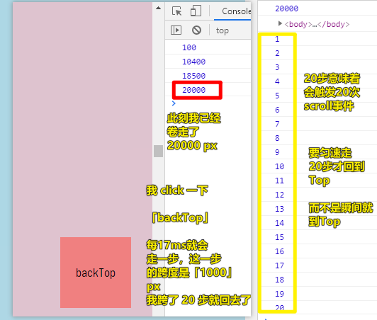

---

#### <mark>Q：关于setInterval，应该设置多少ms执行一次函数呢？</mark>

经过测试， `17ms` 是性能最好的，一些动画库也是用 `17` ，总之你可以选择 `13~17`
SET-INTERVAL：设置一个定时器（TIMER代表这个定时器），每间隔INTERVAL这么久，就会把FUNCTUION执行一次... 一直到手动清除定时器为止

``` js
let timer = setInterval([FUNCTUION], [INTERVAL]);
clearInterval(timer);
```

#### <mark>Q：一个你不知道的点？</mark>

我们知道 `scrollTop` 的最小值是 `0` ，这意味着滚动条处于没有被滚动过的状态，当你设置 `-1` 、 `-1000` 等这些比 `0` 还小的值的时候，滚动条的状态同 `0` 值的状态是一样的！

#### <mark>Q：一些交互性问题？</mark>

「backTop」按钮被点后，就立刻隐藏它！但在滚回去的途中会触发 `scroll` ，所以还得让 `scroll` 事件为 `null` -> 但动画结束了，让 `scroll` 事件的 `callback` 回来！

#### <mark>Q：为啥是 `window.onscroll = xxx` ，而不是 `window.onscroll = function() {}` 呢？</mark>

因为可以在设置为 `null` 后，还能复用 `xxx` 。总之，这是方便重新绑定事件！

不然，你又得写一次 `window.onscroll = function() {}` ，而这未免也忒麻烦了吧！

---

## ★了解更多

➹：[Element.scrollHeight - Web APIs - MDN](https://developer.mozilla.org/en-US/docs/Web/API/Element/scrollHeight)

➹：[图解scrollHeight, clientHeight, offsetHeight, scrollTop以及获取方法 - 简书](https://www.jianshu.com/p/d267456ebc0d)

➹：[js的offset、client、scroll使用方法 - 简书](https://www.jianshu.com/p/0264c5c439d8)

➹：[Js——ScrollTop、ScrollHeight、ClientHeight、OffsetHeight汇总_CaseyWei-CSDN博客_js scrolltop](https://blog.csdn.net/caseywei/article/details/92644503)

➹：[Javascript 函数节流 - 掘金](https://juejin.im/post/5d8b1afbe51d45780a05d325)

➹：[JS函数节流和函数防抖 - 掘金](https://juejin.im/post/5c00f7fe51882516be2ee2fc)


## ★总结

* 滚动的本质是，每次滚动都是为 `scrollTop` 设置一次值，设置一次值，就是在触发一次 `scroll` 事件！ -> **函数节流可以让我们连续的滚动操作模拟成一次滚动操作的效果**！
* JS引擎执行到 `document.documentElement.scrollTop = 0` 这句，不会让滚动条立刻回到 `Top` ，还会继续走后边的代码，所以 `scrollTop` 是异步的，如果这句后边的代码是很耗时的，大概要执行 `10s` 的话，也不会影响滚动条回到顶部！可能执行了5s后，滚动条就自动回到顶部了（**体验不好，要等很久，才会到顶部**） -> 我在想在滚动条回到顶部的过程中，JS引擎是否暂停了后边耗时代码的执行？ -> 应该是暂停了（我不太确定，也许没有，也许渲染和JS引擎是同时进行的） -> 我觉得「渲染」和「stack中还有代码」是互斥的，但浏览器可以有某种机制，即是「stack中还有代码」也不会阻塞浏览器去「渲染」页面，可能会等个临界值时间，就会打断JS引擎的执行，然后执行渲染，渲染完后，又回过头来执行 -> 总之，**有渲染操作的callback，请不要出现很耗时操作的代码**！
* 对动画有了一些基本的认识，如「固定步长，走到终点 -> 不确定要走多久，匀速」、「固定时间，不固定步长，走到终点 -> 确定要走多久，但不确定速度是怎样的」 -> 固定步长和固定时间可谓「互斥」，因为我们无法确定到终点的距离是多少…… -> `路程 = 速度 * 时间`
* 对节流函数有了一个新的认识，即便自己还是无法手撸一个节流函数！
