| ✍️ Tangxt | ⏳ 2020-07-01 | 🏷️ DOM 操作 |

# 32-DOM操作-offset系列（获取元素的偏移值）

## ★前言

回顾一下之前了解到的东西：

``` js
// 获取盒子可视区域的宽高（内容宽度+左右PADDING）
box.clientWidth
box.clientHeight

// 获取盒子左边框和上边框的大小
box.clientLeft
box.clientTop

// 在CLIENT的基础上加上BORDER == 盒子本身的宽高
box.offsetWidth
box.offsetHeight

// 在没有内容溢出的情况下，获取的结果和CLIENT是一样的
// 在有内容溢出的情况下，获取的结果约等于真实内容的宽高（上/左PADDING + 真实内容的高度/宽度）
box.scrollWidth
box.scrollHeight

// 竖向滚动条卷去的高度 -> 在13个属性中，只有该属性可读写，其余的只能读，不能写……
// 横向滚动条卷去的宽度
box.scrollTop
box.scrollLeft
```

## ★offsetParent & offsetTop & offsetLeft

``` js
box.offsetParent
box.offsetTop
box.offsetLeft
```

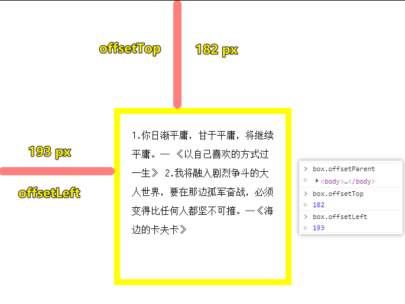

* `offsetParent` ：获取它的父参照物（不一定是父元素）
  + 父参照物和它的父元素没有必然的联系，父参照物查找：同一个平面中，**最**外层元素是**所有后代元素**的父参照物，而基于 `position:relative/absolute/fixed` 可以让元素脱离文档流（一个新的平面），从而改变元素的父参照物
* `offsetTop` ：距离其父参照物的上偏移
* `offsetLeft` ：距离其父参照物的左偏移（当前元素的外边框到父参照物的里边框）

---

<mark>Q：参照物？</mark>

JS里边的参照物概念，与CSS里边用于定位的参照物概念是一致的！

在物理里边，我们知道运动是相对，如你在路边看到一辆巴士经过，那么巴士里边的人动了吗？

对于你而言，是动了

对于巴士里边的人来说，是静止的

在研究机械运动时，人们事先选定的、假设不动的，作为基准的物体叫做**参照物**。

注意：一般**不以研究对象为参照物**，选择不同的参照物来描述**同一个物体的运动状态**，可能得出不同结论，所以运动和静止都是相对的

如我们想要确定巴士里边的人的运动状态：

* 相较于路人而言，是运动的
* 相较于座位而言，是静止的

所以，在CSS的定位里边：

* 我们确定了研究对象 -> 要定位的盒子 -> 小盒子（ `box` ）
* 确定了参照物是谁 -> 静止的容器盒子 -> 大盒子（ `container` ）

``` 
body > container > box
```

默认所有的小盒子的参照物都是 `body` 元素，就像是我们通常以地面为参照物一样，即便参照物是可以任意选定的！

如果小盒子设置了绝对定位，那么默认情况下是相对于body元素定位的 -> 小盒子脱离文档流 -> 小盒子的外边框（左上角）会被吸附到body的内边框（左上角）

<mark>Q：如果父参照物有border呢？如有10px的边框，那么 `box` 的 `offsetLeft` 和 `offsetTop` 实际是多少？</mark>

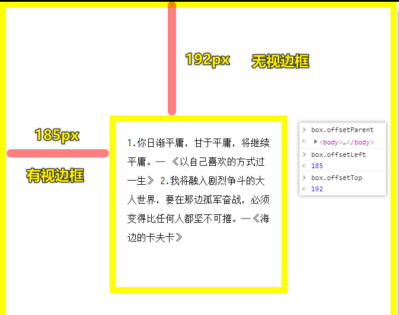

<mark>Q：如果盒子绝对定位，脱离文档流，打算改变默认的父参照物，那么 `offsetLeft/Top` 的值是不是因此而改变呢？</mark>

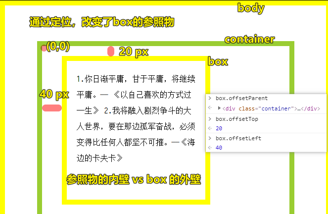

``` css
.container {
  position: relative;
  width: 500px;
  height: 500px;
  border: 10px solid yellowgreen;

}

.box {
  /* or relative */
  position: absolute;
  top: 20px;
  left: 20px;
  margin-left: 20px;
  /* 默认的content-box也是如此 */
  box-sizing: border-box;
  width: 300px;
  height: 300px;
  padding: 20px;
  border: 10px solid yellow;
  line-height: 32px;
  overflow: auto;
}
```

`box` 绝对定位了，我们让父参照物为 `container` ，然而 ** `offsetTop` 的计算规则发生了变化，即是 `container` 的内壁到 `box` 的外壁**，而 `offsetLeft` 依旧一样，即还是 `container` 的内壁到 `box` 的外壁

> 双重 `relative` 也是可以改变父参照物的，我一直以为只有「子绝父相」才会改变子的父参照物，没想到「子相父相」也行

<mark>Q：我们知道同一平面中，所有后代元素的父参照物是 `body` 元素，那么 `body` 元素的父参照物是谁？</mark>

``` js
document.body.offsetParent === null;
```

是 `null` 值啦！即「没有」……可以说 `body` 元素就是参照物的终点！

## ★如何获取元素的偏移值？（存在很多级嵌套，body元素不一定是xxx元素的父参照物）

### ◇思路

1. 求出 `xxx` 元素的 `offsetLeft`
2. 求出 `xxx` 元素的父级参照物 `ppp` 的 `border+offsetLeft`
3. 循环第二步，直到父级参照物是 `body`

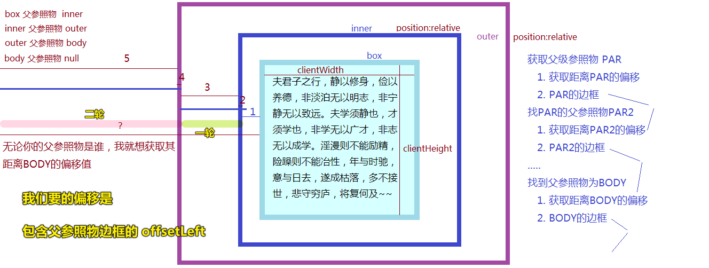

### ◇代码

``` js
/*
 * offset：获取当前元素距离BODY的左/上偏移（不论其父参照物是谁）
 *   @params
 *      curEle:current element当前要操作的元素
 *   @return
 *      [object]包含上/左偏移的信息  => {top:xxx,left:xxx}
 * by zhufengpeixun on 2019/08/14
 */
function offset(curEle) {
  var par = curEle.offsetParent,
    l = curEle.offsetLeft,
    t = curEle.offsetTop;
  //存在父参照物，而且还没有找到BODY
  while (par && par.tagName !== "BODY") {
    //在原有偏移的基础上累加：父参照物的边框、父参照物的偏移
    if (!/MSIE 8\.0/.test(navigator.userAgent)) {
      //IE8中偏移值自已就算了边框了，不需要我们在加边框的值 navigator.userAgent获取当前浏览器的版本信息
      l += par.clientLeft;
      t += par.clientTop;
    }
    l += par.offsetLeft;
    t += par.offsetTop;
    //继续获取上级参照物
    par = par.offsetParent;
  }
  return {
    top: t,
    left: l,
  };
}
```

> 用循环的姿势来迭代得到结果……（while用在我们不知道循环多少次……） -> 兼容性处理，可以用惰性思想……

`offset(box)` 的执行结果是：

* `Top` ： `box` 以 `body` 为父参照物的 `offsetTop`
* `Left` ： `box` 以 `body` 为父参照物的 `offsetLeft` -> 不知道怎么回事， `offsetLeft` 的值居然是父参照物的外壁到 `box` 的外壁……

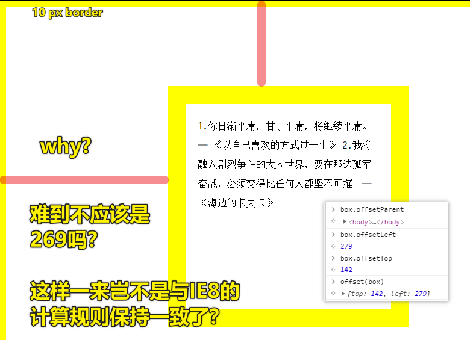

测试如果父参照物不是body：

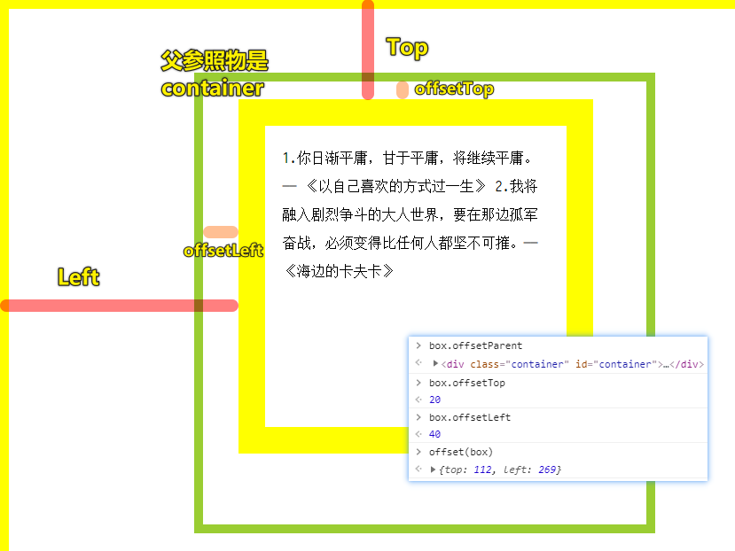

IE8下的测试结果：

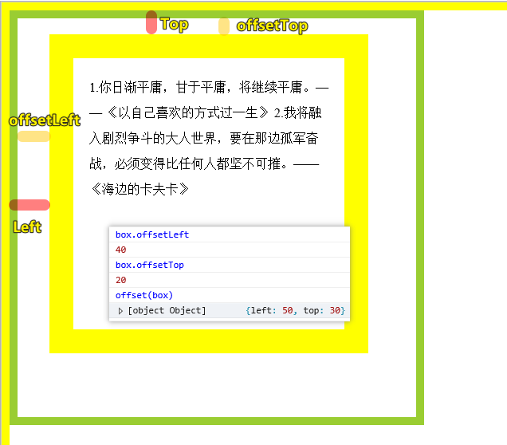

---

<mark>Q：IE8在计算 `offsetLeft` 的时候，是父参照物外壁到box的外壁，那么我们该如何确定当前浏览器是IE8呢？</mark>

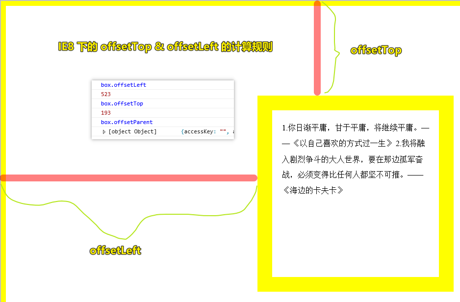

> IE8 不支持flex，不支持 `let` ，不支持 `vh` ……谁叫我去兼容IE8谁就是我的敌人……

获取浏览器版本信息：

``` js
window.navigator.userAgent

// Chrome
"Mozilla/5.0 (Windows NT 10.0; Win64; x64) AppleWebKit/537.36 (KHTML, like Gecko) Chrome/83.0.4103.116 Safari/537.36"

// Edge
"Mozilla/5.0 (Windows NT 10.0; Win64; x64) AppleWebKit/537.36 (KHTML, like Gecko) Chrome/83.0.4103.116 Safari/537.36 Edg/83.0.478.58"

// IE8
"Mozilla/4.0 (compatible; MSIE 8.0; Windows NT 10.0; WOW64; Trident/7.0; .NET4.0C; .NET4.0E; .NET CLR 2.0.50727; .NET CLR 3.0.30729; .NET CLR 3.5.30729)"
```

## ★了解更多

➹：[什么是参照物?参照物到底怎么判断，人与人是否也需要找对参照物！ - 知乎](https://zhuanlan.zhihu.com/p/125216956)

➹：[position - CSS: Cascading Style Sheets - MDN](https://developer.mozilla.org/en-US/docs/Web/CSS/position)

## ★总结

- `offsetLeft/offsetTop`：是父参照物外壁到box的外壁 -> `offsetLeft`之前测试的时候是父参照物的内壁到box的外壁 -> 难道浏览器有问题？
- `offsetXxx`都是相对于`offsetParent`来计算求值的！ -> 我再次测试了，也包括父参照物的`margin-left`
- 「获取元素相对于`body`元素的偏移值」并不需要去兼容 IE8，因为我测试发现，`offsetLeft` 和 `offsetTop` 的计算规则是一样的！

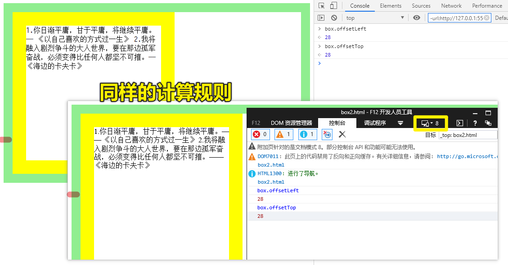

## ★Q&A

### <mark>1）怎样才算脱离文档流？</mark>

有人说 `relative` 的元素没有脱离文档流，而有些人如周老师认为它是脱离文档流的！

➹：[css脱离文档流到底是什么意思，脱离文档流就不占据空间了吗？脱离文档流是不是指该元素从dom树中脱离？ - 知乎](https://www.zhihu.com/question/24529373)

### <mark>2） `offsetLeft` 与 `offsetTop` 的计算规则统一了？即都是父参照物的外壁到 `box` 的外壁（box `relative/absolute/fixed` 定位了，是父参照物内壁到 `box` 外壁）</mark>

``` html
<!DOCTYPE html>
<html lang="en">

<head>
  <meta charset="UTF-8" />
  <meta name="viewport" content="width=device-width, initial-scale=1.0" />
  <title>Document</title>
  <style>
    * {
      margin: 0;
      padding: 0;
    }

    body,
    html {
      height: 100%;
    }

    body {
      display: flex;
      justify-content: center;
      align-items: center;
      border: 20px solid lightgreen;
    }

    .box {
      width: 300px;
      height: 300px;
      border: 30px solid yellow;
    }
  </style>
</head>

<body>
  <div class="box" id="box">
    1.你日渐平庸，甘于平庸，将继续平庸。—— 《以自己喜欢的方式过一生》
    2.我将融入剧烈争斗的大人世界，要在那边孤军奋战，必须变得比任何人都坚不可摧。——《海边的卡夫卡》
  </div>
  <script>
    let box = document.getElementById("box");
  </script>
</body>

</html>
```

效果：

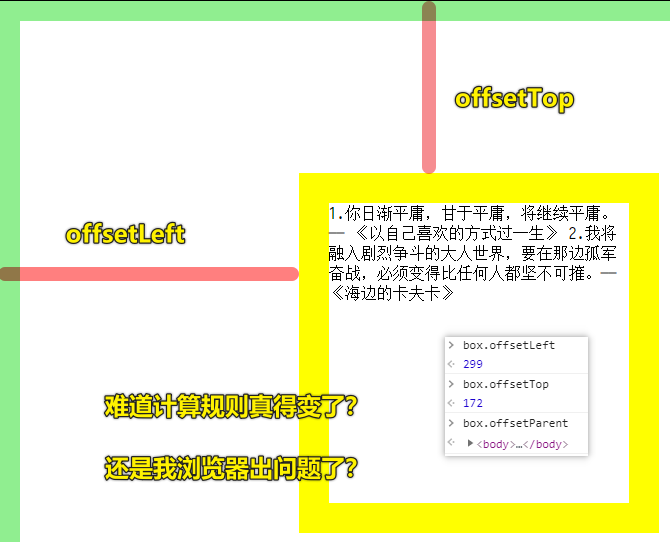

我猜是不是 `display: flex;` 的问题？

结果测试一下，发现这并不是呀！

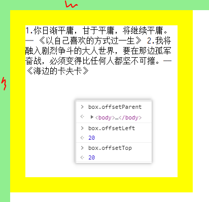

我看了一下这个网站的介绍：

> [HTML DOM offsetLeft Property](https://www.w3schools.com/jsref/prop_element_offsetleft.asp)

The offsetLeft property returns the left position (in pixels) relative to the left side the offsetParent element.

The returned value includes:

- the left position, and margin of the element -> box元素的`margin-left`、`left`（你绝对定位时可以设置`left`样式值）
- the left padding, scrollbar and border of the offsetParent element -> 父参照物的`padding-left`、`scrollbar-width(17px)`、`border-left`（我其实还认为有`margin-left`，因为我测试发现就是有呀！）

> 总体上看，`offsetLeft`的值就是一个`box`元素到父参照物如`body`元素的`margin-left`的距离！

**Note:** The offsetParent element is the nearest ancestor that has a position other than static.

**Tip:** To return the top position of an element, use the offsetTop property.

可以看到，这是有包括`border`的！

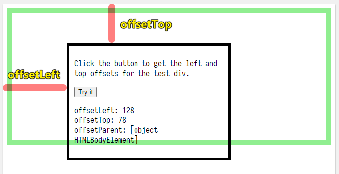

margin也包括呀！

代码：<https://www.w3schools.com/code/tryit.asp?filename=GGE63HT01282>

➹：[html - what is the difference between `offsetLeft` and 'clientLeft' in javascript - Stack Overflow](https://stackoverflow.com/questions/27199247/what-is-the-difference-between-offsetleft-and-clientleft-in-javascript)

➹：[offsetWidth与offsetLeft_willard_cui的博客-CSDN博客_offsetleft](https://blog.csdn.net/willard_cui/article/details/81712989)