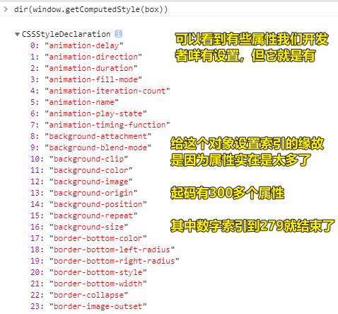
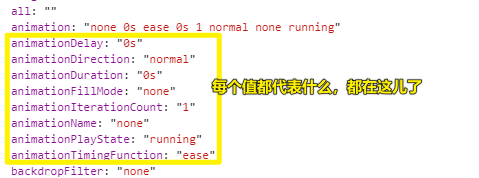
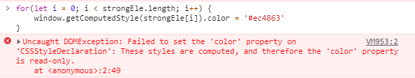

| ✍️ Tangxt | ⏳ 2020-07-03 | 🏷️ DOM 操作 |

# 33-DOM操作-获取元素的样式（getComputedStyle）

## ★前言

我们知道，在了解这13个属性之前，我们的目的是为了「**获取到当前元素的样式信息**」，毕竟 `[ELEMENT].style.xxx` 只能拿到写在元素身上的样式！

我们以为了解了这13个属性就能达到我们的目的，然而，通过这13个属性，我们大多拿到的都是「**组合值**」，即如 `clientWidth = contentWidth + paddingLeft/Right` ，而这并不符合我们的目的，即「**我们想要的是元素的具体的某个样式值**」

那么是否存在某种姿势可以拿到具体的某个样式值呢？如我想拿到 `xxx` 元素的 `border` 值，我想拿到 `xxx` 元素的 `width` 值……

> 有的，那就是通过 `getComputedStyle` 这个方法来真正获取元素样式……

## ★ `getComputedStyle`

### ◇概述

#### <mark>1、是什么？</mark>

`getComputedStyle` 是获取当前元素所有经过浏览器计算过的样式 -> `Computed` （被计算过的）

#### <mark>2、有啥特征？</mark>

* 只要元素在页面中呈现出来，那么**所有的样式都是经过浏览器计算的** -> 你所看到的页面样式都是经过浏览器计算出来的，而计算出来的样式，很有可能没有对应上我们开发者所写的样式……
* 哪怕你没有设置、没有见过的样式也都计算了 -> 浏览器内置的样式也能获取到
* 不管你写或者不写，也不论写在哪，样式都在这，可以直接获取 -> 不管你写在元素上？写在 `style` 标签里边？写在 `css` 文件里边？都能获取

> 这个方法给人的感觉 -> 很强大！

#### <mark>3、兼容性？</mark>

在IE6~8浏览器中不兼容，需要基于 `currentStyle` 来获取

> IE你自尽吧！都2020年，我们还要考虑兼容你？ -> 不不，错的不是IE，错的是那些杵在IE时代的古老项目…… -> 这些项目坏了，还要我们新时代的开发者用古老的零件去修，真是醉了……

#### <mark>4、语法？</mark>

``` js
// 第一个参数是操作的元素  第二个参数是元素的伪类:after/:before，假如伪元素是 ::after ，样式写的是 h3::after，那么第二个参数就得是伪类 :after 这种写法
var style = window.getComputedStyle(element[, pseudoElt]);
```

`element` 是个DOM元素对象哈！ -> 第二个参数不写或写 `null` 或写像 `:after` 这样的伪类

返回值是一个 `CSSStyleDeclaration` 实例 -> 你可以看到该实例的 `__proto__` 指向的就是 `CSSStyleDeclaration.prototype` ，即：

``` js
window.getComputedStyle(box).__proto__ === CSSStyleDeclaration.prototype // -> true
```

测试：



在 `getComputedStyle(box)` 的返回值里边，有哪些信息会给予我们一些启示呢？

如：

`animation: "none 0s ease 0s 1 normal none running"` -> 动画属性的默认值，可以看到是非匀速的，即是 `ease` 的！



总之：

`window.getComputedStyle(box)` 拿到的结果是 `CSSStyleDeclaration` 这个类的实例（对象） -> **包含了当前元素所有的样式信息**

#### <mark>5、使用</mark>

``` js
let styleObj = window.getComputedStyle(box);
styleObj["width"] // -> "300px"
styleObj["height"] // -> "300px"
styleObj["backgroundColor"] // -> "rgba(0, 0, 0, 0)"
styleObj.display // -> "block"

// IE6~8 -> 兼容性处理
// styleObj = [element].currentStyle;
styleObj = box.currentStyle;
```

以上就是获取元素样式的最优方案了

## ★了解更多

➹：[Window.getComputedStyle() - Web APIs - MDN](https://developer.mozilla.org/en-US/docs/Web/API/Window/getComputedStyle)

➹：[-webkit-animation - CtripUED Webkit CSS Library](http://ic4.github.io/webkitcss/prop/animation.html)

## ★总结

* JS DOM 操作 -> 记下以下这些内容，对JS的DOM操作的认识也就差不多了……
  + 获取DOM元素的那几种姿势
  + 对DOM元素动态的增删改、自定义DOM元素的属性（添加 or 移除）
  + 获取或更改元素的样式
    - `xxx.style.width`
    - 适用于特殊场景下的13个JS盒子模型属性
    - 一网打尽的 `getComputedStyle(box)`
* 在真实项目里边，我们使用 `Vue` 、 `React` 等这些框架，弱化了我们DOM操作这个环节，所以就没有讲一些封装DOM操作的方法 -> 不管怎样，DOM操作的基础知识，我们还是需要去了解的
* 在DOM里边，我们得知道哪个属性哪个方法的兼容性是怎样的，毕竟DOM是存在兼容性的！

## ★Q&A

### <mark>1）我修改github issues 里边的样式，发现用 `getComputedStyle` 去设置样式报错了？</mark>



You aren't allowed to write to the styles returned by getComputedStyle if they were computed by the browser (ie not set by JavaScript already or by a CSS file).

Instead of `list.setProperty('opacity', '0')` , use `scrollList.style.opacity = "0"` or add an opacity rule to the `.list` selector in your CSS.

简单来说，不是行内、内部、外部所设置的样式，我们都无法通过 `getComputedStyle` 来改！

所以我测试一下看看用 `xxx.style.color` 来改行不行？结果发现这是可以的！

最终结果：

``` js
const style = {
  color: '#ec4863',
  fontSize: '20px'
}
// 把style搞成是 'width:18px;height:48px;'这样的格式'
// 不需要提取引号里边的内容，如'hi' -> hi，字符串在内存里边的表示就是 'hi'

let styleText = ''

for (var k in style) {
  styleText += `${k}:${style[k]};`
}

console.log(styleText)

let strongEle = document.querySelectorAll('p > strong');
for (let i = 0; i < strongEle.length; i++) {
  for (let k in style) {
    strongEle[i].style[k] = style[k]
  }
}
```

> `cssText` 很鸡肋呀！

➹：[javascript - Failed to execute 'setProperty' on 'CSSStyleDeclaration': These styles are computed, and therefore the 'opacity' property is read-only - Stack Overflow](https://stackoverflow.com/questions/60510438/failed-to-execute-setproperty-on-cssstyledeclaration-these-styles-are-compu)
