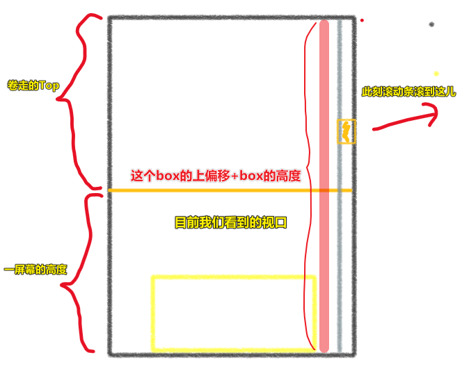
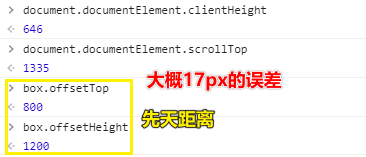
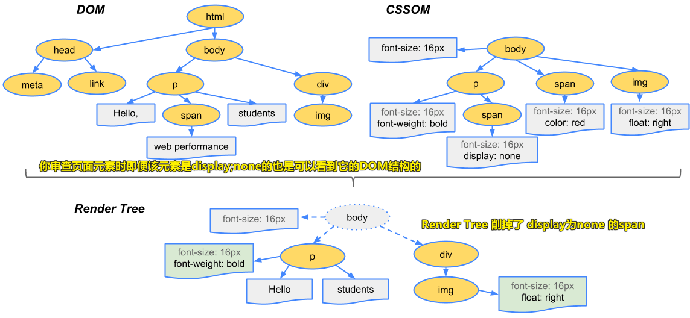
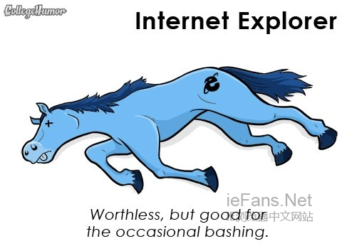
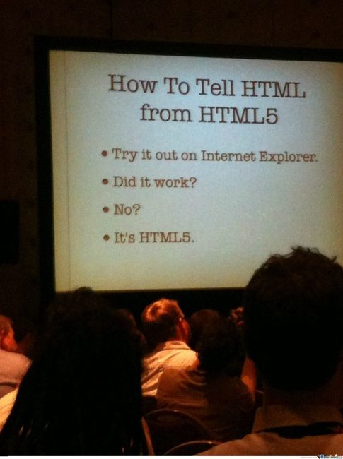
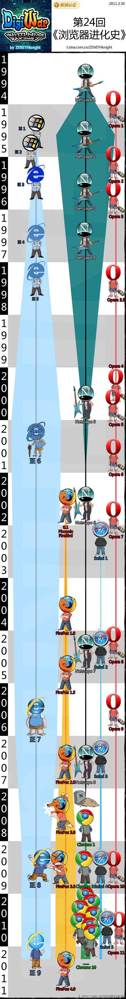

| ✍️ Tangxt | ⏳ 2020-07-05 | 🏷️ DOM 操作 |

# 34-DOM操作-单张图片延迟加载

## ★前言

关于DOM操作，有好多好玩的属性和方法，但IE就是不支持，所以遇到要求你兼容IE的公司，那就走吧！

IE趣事：

> 连IE都有勇气问你是否要将它设成预设浏览器，你他妈却跟我说你没勇气跟喜欢的人表白

but，IE说「我爹是微软」


## ★单张图片延迟加载（一个性能优化技巧）

> 也叫图片的懒加载

### ◇为什么？

像你打开[淘宝](https://www.taobao.com/)这样的网站，里边都会有很多图片，而这些图片都设有延迟加载，当然，如果你的网速贼快，可能没有明显的看到效果

一个网页如果图片过多，一次性加载完的话，那么页面的渲染就贼鸡儿慢了，即你会一直看到地专栏旁边的按钮在「转圈圈」

图片懒加载的效果是这样的（个人猜测）：

* 第一屏：不需要懒加载
* 第二屏：可能也不需要
* 滚动滚动条超过两屏，就得用到图片懒加载了……

一些使用场景：

* 瀑布流……

### ◇思路

图片延迟加载（也叫图片懒加载）：

1. 结构中，我们用一个盒子包裹着图片（在图片不展示的时候，可以占据着这个位置，并且设置默认的背景图或者背景颜色）
2. 最开始，IMG的SRC中不设置任何的图片地址，把图片的真实地址设置给自定义属性DATA-SRC/TRUE-IMG（最开始不展示图片:可以让图片隐藏）
3. 当浏览器窗口完全展示到图片位置的时候，我们再去加载真实图片，并且让其显示出来（第一屏幕中的图片一般都会延迟加载，来等待其它资源先加载完）

> 没想到第一屏也得延迟加载 -> 淘宝也是这样做的（有加载的图标），之后其它屏，就用骨架屏替代之了……即咩有图标了……

### ◇实现

> 不用具体图片，用盒子替代之……

#### <mark>1、HTML</mark>

``` html
<div class="imgBox" id="box">
  
</div>
```

#### <mark>2、CSS</mark>

``` css

* {
  margin: 0;
  padding: 0;
}

img {
  /* 样式兼容性处理，一些浏览器对图片有默认的border */
  border: none;
}

/* 隐藏图片 -> 父容器撑不起来了 */
img[src=""] {
  display: none;
}

.imgBox {
  box-sizing: border-box;
  /* 让盒子杵在第二屏 */
  margin: 800px auto;
  /* 让盒子撑起来 -> 大小与图片尺寸对应 */
  width: 1013px;
  height: 1200px;
  /* 给个灰色显示地表示在占位 -> 用于放图片 */
  background: #ccc;
}

.imgBox img {
  /* 图片出现了还得给个样式 */
  width: 100%;
  height: 100%;
  /* 图片一开始默认就是隐藏的，相当于咩有写img元素一样 */
  /* 这行会引起重绘吗？图片算是imgBox的内容吗？渲染树发生变化是否会引发重排呢？ */
  display: none;
}
```

#### <mark>3、JS</mark>

``` js
/*
 * offset：获取当前元素距离BODY的左/上偏移（不论其父参照物是谁）
 *   @params
 *      curEle:current element当前要操作的元素
 *   @return
 *      [object]包含上/左偏移的信息  => {top:xxx,left:xxx}
 * by zhufengpeixun on 2019/08/14
 */
function offset(curEle) {
  let par = curEle.offsetParent,
    l = curEle.offsetLeft,
    t = curEle.offsetTop;
  while (par && par.tagName !== "BODY") {
    if (!/MSIE 8\.0/.test(navigator.userAgent)) {
      l += par.clientLeft;
      t += par.clientTop;
    }
    l += par.offsetLeft;
    t += par.offsetTop;
    par = par.offsetParent;
  }
  return {
    top: t,
    left: l,
  };
}

/*
 * 图片完全显示出来的条件
 *   A:盒子底边距离BODY（页面最顶端）的距离：盒子的高度+盒子距BODY的上偏移
 *   B:浏览器底边距离BODY的距离：一屏幕的高度 + 卷去的高度
 *   A<=B：盒子就完全出现在用户的视野中
 * 让图片显示
 *   获取图片TRUE-IMG属性的值，赋值给SRC属性，当图片能正常加载出来后，让图片显示即可
 */
let imgBox = document.querySelector(".imgBox"),
  _img = imgBox.querySelector("img");

//=>显示图片
//curImg:要显示的图片
function lazyImg(curImg) {
  //给SRC赋值真实的图片地址
  let trueImg = curImg.getAttribute("trueImg");
  curImg.src = trueImg;
  //校验图片是否能够正常加载出来：IMG.ONLOAD事件用来监听图片是否能加载
  curImg.onload = function() {
    curImg.style.display = "block";
  };
  //=>设置自定义属性:isLoad存储当前图片已经加载过了
  curImg.isLoad = true;
}

function whenLazyImg() {
  //=>已经加载过就不要在重复加载了
  if (_img.isLoad) return;

  let HTML = document.documentElement,
    B = HTML.clientHeight + HTML.scrollTop,
    A = imgBox.offsetHeight + offset(imgBox).top; //=>当前案例中，获取距离BODY的上偏移完全可以imgBox.offsetTop，因为父参照物就是BODY
  if (A <= B) {
    //=>符合图片显示的条件了
    lazyImg(_img);
  }
}

//=>监听页面滚动事件（不论基于什么方式，只要页面滚动了，则触发事件）
window.onscroll = throttle(whenLazyImg);
```

滚动到盒子完全显示的时候再去加载图片，而不是出来一个小边边就去加载显示，如：


所以，我们需要判断图片**刚好或者超出**完全出现在viewport时，需要 do something…… -> JS 出马

判断思路：

图片刚好完全出现在viewport： `卷去的高度+一屏的高度`



> 用程序模拟我们的肉眼…… -> 一切皆数据

注意：如果出现水平滚动条，计算规则就不准确了，如，一屏的高度得削掉 `17px` ，盒子刚好完全出现又得多滚动 `17px`



> PC端页面一般不会出现横滚动条 -> 代码测试后，发现并不需要更改计算规则…… `17px` 的误差是可以接受的！

还有， `box` 的父级参照物不一定是默认的 `body` 元素！所以还得用之前写的 `offset` 方法来得到 `box` 距离 `body` 的上偏移值！

最终代码演示效果：[图片延迟加载](https://ppambler.github.io/zf-fe-demo/2020-06-26/lazy-img.html)

---

<mark>Q：如何获取写在结构上的自定义属性？</mark>

只能通过 `getAttribute([自定义属性名])` 这个方法来获取！

如： `curImg.getAttribute("trueImg")`

<mark>Q： `querySelector()` ？</mark>

从选中的一个或多个元素里边，只获取第一个！

<mark>Q：如果给的图片地址错了？</mark>

需要监听一下图片的 `onload` 事件，只有加载成功了，才去显示图片

而且即便图片地址错了，即咩有加载成功，也是要走`isLoad = true` 这个逻辑，而不是说，再重新加载一下，毕竟这是图片地址错了，可不是网络错误呀！当然，如果是网络错误，那就得「重新发请求去加载」了

<mark>Q：图片懒加载成功后，还需要监听 `scroll` 吗？</mark>

为 `img` DOM 对象 设置一个自定义属性，如 `isLoad` ，如果 `isLoad` 为 `true` 意味着图片已经被加载过了！这样一来 `lazyImg` 方法就执行一次了……不然，该方法会在来回的滚动中多次执行没有必要执行的 `lazyImg` 方法……

<mark>Q：瀑布流怎么做？</mark>

把单张图片的操作重复 N 次！ -> 那就是多张了……也就是所谓的「瀑布流」

瀑布流效果：[勒布朗_花瓣_采集](https://huaban.com/search/?q=%E5%8B%92%E5%B8%83%E6%9C%97)

<mark>Q： `display:none` ？</mark>



题外话： `display:none` 和 `visibility:hidden` 的区别？

1. ` display:none` 的子孙节点消失，这是由于元素从渲染树中消失造成， `visibility:hidden` 会子孙节点消失是由于继承性，可以设置 `visibility:visible` 让子孙节点显示
2. `display:none` 不占据任何空间； `visibility:hidden` 仍占据空间
3. `display:none` 会引起回流和重绘（元素位置发生变化，或者说需要重新构建渲染树）， `visibility:hidden` 会引起重绘（元素位置没变化）
4. 读屏器不会读取 `display:none` 的元素内容，而会读取 `visibility:hidden` 的元素内容

这俩东西都让我们看不见，前者是真得消失了(相当于没写这个HTML元素一样)，而后者就像是个隐身的透明人

➹：[渲染树构建、布局及绘制  -  Web  -  Google Developers](https://developers.google.com/web/fundamentals/performance/critical-rendering-path/render-tree-construction)

➹：[display:none和visibility:hidden__牛客网](https://www.nowcoder.com/questionTerminal/dce13fd5b59c41be80a22b38c5a32dc1)

---

## ★总结

- 如果要兼容IE，IE8就是兼容的底线
- 如何实现单张图片的懒加载？
  1. DOM结构：一个盒子容器包裹一张图片 -> 该`img`标签的`src`属性为空值 -> 有个自定义属性存储着图片的真实地址，如`trueImg='./xxx.jpg'`
  2. CSS样式：`src`为空值的`img`为`display:none`、盒子容器的大小 -> 图片的大小、有背景颜色、所有`img`一开始都是`display:none`，大小都是`w/h:100%`（给个默认值，图片显示了，还得给个宽高，这样浏览器就不用自己去计算了，而且如果盒子容器宽高都写大了，也会有个自适应填充）
  3. JS行为：用代码描述「我们的眼睛刚好看到盒子容器完全出现」这种交互，一旦满足这种交互，那就`lazyImg`呗！

## ★Q&A

### <mark>1）为什么不用IE？</mark>

在玩和平精英的时候，请你选一把武器：


IE的勇气：


你唯一的价值就是被我们骂：



How to tell html from html5？（如何区分 html 和 html5？）



IE过于特立独行 -> 人人喊打 -> 又菜又要装逼……

要兼容IE6/7吗？ -> 不用了

兼容的边界的是IE8，再兼容下去的话，就亏本了：

> 这张图详细说明了主流浏览器大战的始末（数据截止2010年底）



**微软将 Internet Explorer 称为「兼容性解决方案」，而不是浏览器**

> 如果你想磨炼你的兼容性能力，那就去兼容IE吧！

> 鹅厂出来的程序员都讨厌QQ浏览器（比IE还讨厌），因为一个页面写出来，首先要测试的就是QQ浏览器，而QQ浏览器的兼容性也很糟糕，当然，现在2020年，应该好很多了！

➹：[请具体、有深度地讨论IE6浏览器为什么过时了？ - 知乎](http://www2.zhihu.com/question/21808177/answer/19379678)

➹：[​IE 浏览器为什么不招人待见？ - 极客公园](https://www.geekpark.net/news/238042)

➹：[“浏览器大战”小观 - 极客公园](https://www.geekpark.net/news/155758)

➹：[就是要不一样的电脑桌面！看到IE惊吓成这样是哪招_搞笑_黑白漫话](https://heibaimanhua.com/gaoxiao/145630.html)
