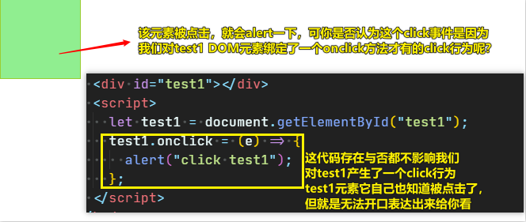
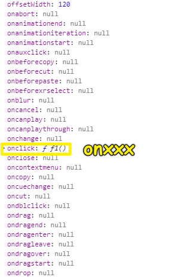
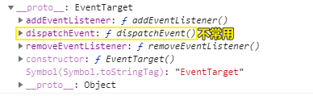
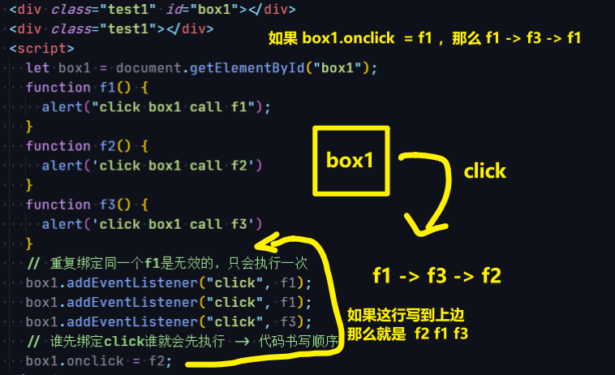
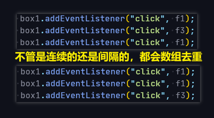
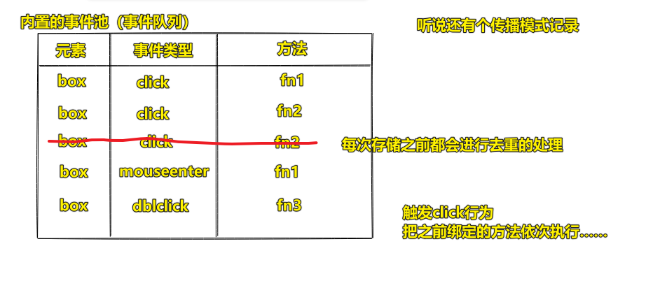

| ✍️ Tangxt | ⏳ 2020-06-25 | 🏷️ DOM 事件 |

# 35-DOM 事件的核心基础知识

## ★前言

我们知道 DOM 有这样一些知识：

- 获取元素的知识
- 对 DOM 增删改查的知识
- 节点与节点之间的关系，以及节点之间处理的知识
- DOM 盒子模型的知识

以上这些知识都是 DOM 的基础知识，它们大部分无外乎就是一些常用方法，以及相关方法和相关属性的应用而已

以上这些知识的学习：

1. 预习课
2. 看文档
3. 看原型上的方法

会讲什么？

1. DOM 里边相对来说比较重要，而且不好理解，需要重点去强调的东西
2. DOM 在实战中具体应用的东西

而这些东西，就属于「DOM 事件」里边的内容！

总之：

围绕 DOM 事件，以及事件的传播机制、事件池相关机制、一些经典思想，如事件代理和事件委托等，再如发布订阅设计模式，还有在常规案例中，我们如何利用 DOM 事件去做一些相关处理

## ★什么是事件？

事件是浏览器**天生就具备的行为**，无论我们是否基于 JS 代码绑定相关方法，只要相关的行为触发了，那么则一定会触发相关的事件！



> 事件是 V8 引擎封装好的……我们只是通过一些 DOM 接口，拿到了用户的行为，反馈给了我们的事件处理函数……

> 类 或对象可以通过事件向其他类或对象通知发生的相关事情。 发送（或引发）事件的类称为“**发布者**”，接收（或处理）事件的类称为“**订阅者**”。

话说，我的鼠标指针移入上图里边这个「绿色小块」会有哪些行为被触发了呢？

## ★有哪些事件？

### <mark>1）常见的鼠标事件行为</mark>

``` code
mouseover 鼠标经过
mouseout 鼠标离开
mouseenter 鼠标进入
mouseleave 鼠标离开
mousemove 鼠标移动
mousedown 鼠标按下
mouseup 鼠标抬起
click 单击（点几次触发几次）
dblclick 双击（在 300ms 内连续触发两次点击，则认为是一次双击）
mousewheel 鼠标滚轮滚动
contextmenu 鼠标右键点击
……
```

> `[dbl]click`指的是鼠标左键点击，可不是右键点击哈！
> 
> 关于`click`：当用户的焦点在按钮上并按了 `Enter` 键时，同样会触发这个事件

只要我们对页面里边的某个元素用鼠标发生了以上行为，那么就会触发事件，虽然我们看不到肉眼可见的效果，但是它确确实实就是发生了

### <mark>2）键盘事件</mark>

```
keydown 按键按下
keyup 按键抬起
keypress 按键长按
input 文本框内容输入中（改变中）
……
```

### <mark>3）其它事件</mark>

```
change 内容改变，下拉菜单改变
blur 文本框失去焦点
focus 文本框获取焦点
scroll 滚动条滚动事件
submit 表单提交中的提交事件
resize 大小改变
load 加载（加载完成）事件
error 加载失败事件
DOMContentLoaded DOM 结构加载完成
drag/dragstart/dragend…… H5 中新增的拖拽的相关事件
……
```

### <mark>4）移动端事件</mark>

```
[touch 单手指操作模型]

touchstart 手指按下
touchmove 手指移动
touchend 手指离开
touchcancel 因为意外情况导致操作结束

[gesture（手势）多手指操作模型]

gesturestart/gestureend/gesturechange……
```

### <mark>5）小结</mark>

- 了解更多：[英文](https://developer.mozilla.org/en-US/docs/Web/Events)、[中文](https://developer.mozilla.org/zh-CN/docs/Web/Events)
- 谁会触发事件：
  - 通过**用户操作**触发，如鼠标或键盘事件
  - 通过 **APIS** 生成来表示异步任务的进度，如指示动画已经完成运行的事件，视频已被暂停等等
  - 通过**编程方式**触发，比如调用元素的 `HTMLElement.click()`方法，或者定义事件，然后使用 `EventTarget.dispatchEvent()`将其发送到指定的目标。
- 为啥要触发事件？
  - 事件触发，就得通知目标执行一些有趣的操作 -> 用户交互
- 事件有两部分
  - 事件本身（事件类型）
  - 事件绑定

### <mark>6）Q&A</mark>

<mark>Q：`box.onclick = function(){}`的读法？</mark>

常见的错误读法：

> 给盒子绑定个点击事件

`box`它天生自带 `click` 事件，需要你去绑么？

正确的读法是：

> 给盒子的点击事件行为绑定方法

概念：

事件绑定：给元素的某个事件行为**绑定方法**，这样**事件行为触发**的时候，对应绑定的方法就会**执行**，完成一些需要完成的功能！

> 事件绑定可不是为元素绑定事件呀！而是绑定方法呀！

## ★事件绑定

### <mark>1）概述</mark>

事件绑定可分为：

- DOM0 级事件绑定：`ele.onxxx = function(){}`
- DOM2 级事件绑定：
  - 标准浏览器：`ele.addEventListener('eventType',function(){},false)`
  - IE6~8：`ele.attachEvent('onxxx',function(){})` -> 基本不用

话说，为啥没有 DOM1 级 事件绑定呢？

因为 API 没啥变化，而 DOM2 级的事件绑定 API 发生了巨大的变化！

反正，升级过程，就是 API 的变化过程……

> DOM0 级可以认为`onclick`是`btn`的**一个属性**，DOM2 级则将属性升级为**队列**

### <mark>2）两种事件绑定的区别（DOM0 vs DOM2）</mark>

#### <mark>1、DOM0 事件绑定</mark>

> 事件绑定的原理就是给当前元素对象的某些私有属性（隶属于事件的属性，形式如`onxxx`）赋值为一个函数，当事件行为触发，浏览器就会**帮助**把绑定的方法给执行了……



如：

``` js
// 事件绑定
box.onclick = function () {}

// 移除事件绑定
box.onclick = null
```

特点：

- 只能给当前元素的某个事件行为**绑定一个方法**（绑定多个方法会把之前绑定的给替代掉！）
- 如果元素的私有属性中不具备某个事件的私有属性（如：`ontransitionend`/`onDOMContentLoaded`……）则无法给这些事件绑定方法 -> 你天生不具备这些属性，意味着你不需要这些事件绑定……（你自己手动写上去是无效的，浏览器可不会傻傻的去执行这些手动绑定的方法）

#### <mark>2、DOM2 事件绑定</mark>

- 基于元素的原型链找到 `EventTarget.prototype`，使用内置的 `addEventListener` 或者 `removeEventListener` 进行事件绑定和移除事件绑定
- 底层原理是**基于浏览器内置的事件池机制**完成事件监听和方法绑定的！ -> 可以给当前元素的某个事件类型绑定多个不同的方法，事件触发会按照绑定的顺序把方法依次执行 -> **所有浏览器支持的事件类型都可以做事件绑定**（如：`box.addEventListener('ontransitionend',callback)`）



注意：

> DOM2 事件绑定的时候，我们一般不绑定匿名方法（以方便后期的移除） -> 毕竟移除的时候需要根据事件和方法去移除

代码：



> 第三个参数，默认是 `false`

这给我的感觉是：

1. `onclick` 、`addEventListener('click')`，谁先执行，那么 `click` 事件绑定的方法就谁先执行
2. 使用`addEventListener('click')`重复绑定一个方法，那么是会剔除的，相当于是数组去重一样



DOM0 VS DOM2 性能：

> DOM0 要好那么一丢丢，可忽略不计，总体上来说 DOM2 要强大多！

#### <mark>3、事件池机制原理？</mark>

> 也会记录传播模式，在这里先不涉及先！



#### <mark>4、DOM0 和 DOM2 可以共存吗？</mark>

在真实开发过程中，DOM0 和 DOM2 是可以共存的，它们不会冲突，因为它们用的机制是不一样的 -> 一般来说，以用 DOM2 偏多一些，因为其机制相对比较完善，而且类似于 JQ 这种类库或者一些常用的插件，基本上也是基于 DOM2 事件绑定封装事件处理方法的

如 JQ 中事件绑定的方法：`on/off` -> 最底层也是基于 DOM2 完成的 -> 而`bind/unbind/delgate/click/mouseover……`最后都是基于 `on/off`完成的

### <mark>3）经典面试题</mark>

> `window.onload` 和 `document.ready`（指的是 JQ：`$(document).ready`）的区别？

分三个点来说：

1. `window.onload`是**等待所有资源都加载完成**才会触发执行，而我之前研究过部分 JQ 源码，发现`$(document).ready()`底层用的是`DOMContentLoaded`事件，而该事件本身是 DOM 结构加载完成就会触发执行，所以`$(document).ready()`要优先于`window.onload`触发
2. `window.onload`是基于 DOM0 事件绑定的，所以它只能绑定一个方法，即在页面里边，即一次事件的触发，只能执行一个绑定的方法；而 JQ 中的事件绑定都是基于 DOM2 完成的，所以可以在同一个页面里边绑定多个不同的方法，说白了，一次事件触发，可以执行很多个不同的`callback`。我之前在使用 JQ 的开发里边，经常把编写好的模块代码放到`$(function(){})`（实质是`$(document).ready()`）这里，而这样做既能形成闭包，又能保证 DOM 结构加载完才会执行
3. 不论哪一种办法都是为了**保证 DOM 结构加载完**再执行的，而这一切都是为了能让`callback`一定能够获取到 DOM 元素，以防把 JS 放到 DOM 之前加载，导致元素无法获取的问题（引申出来的问题：JS/CSS/IMG/结构加载的顺序和机制 -> 浏览器渲染机制）

## ★了解更多

➹：[事件 - C# 编程指南](https://docs.microsoft.com/zh-cn/dotnet/csharp/programming-guide/events/)

➹：[JS 鼠标事件（非常详细）](http://c.biancheng.net/view/5944.html)

➹：[鼠标事件 - 简书](https://www.jianshu.com/p/2eba45ae5fda)

➹：[DOM0、DOM1、DOM2 级事件 - 简书](https://www.jianshu.com/p/01c2688db289)

➹：[JavaScript 和 DOM 的产生与发展 - IT 笔录](https://itbilu.com/javascript/js/Vyxodm_1g.html)

➹：[DOM2 级事件 - 简书](https://www.jianshu.com/p/2656511e9a6d)

➹：[事件池 dom0 dom2 - 简书](https://www.jianshu.com/p/bfb2d9db613f)

➹：[理解：javascript 中 DOM0,DOM2,DOM3 级事件模型 - 掘金](https://juejin.im/post/6844903853956022285)

➹：[DOM 事件模型（DOM0,1,2 Event Model） - 知乎](https://zhuanlan.zhihu.com/p/65752499)

➹：[onclick 与 addEventListener 区别 - 知乎](https://zhuanlan.zhihu.com/p/37268369)

➹：[jQuery 系列（四） -- 事件 - 知乎](https://zhuanlan.zhihu.com/p/32897701)

## ★Q&A

### <mark>1）interface 是什么？</mark>

名词：

- a point where two systems, subjects, organizations, etc. meet and interact.
  - the interface between accountancy and the law
- computing：a device or program enabling a user to communicate with a computer.
  - a graphical user interface

在计算机里边，我们要与计算机通信，需要用到硬件设备或程序，而用到的这些东西就是「接口」

我们的鼠标要与浏览器通信，就得通过 Event Interface 来搞！

其它的含义：

- 同一计算机不同功能层之间的通信规则称为接口
- 接口是一种约束形式，其中只包括成员定义，不包含成员实现的内容
- ……

➹：[Event - Web APIs - MDN](https://developer.mozilla.org/en-US/docs/Web/API/Event)

➹：[Interface - Definition of Interface by Merriam-Webster](https://www.merriam-webster.com/dictionary/interface)

➹：[interface_百度百科](https://baike.baidu.com/item/interface/6070217)
