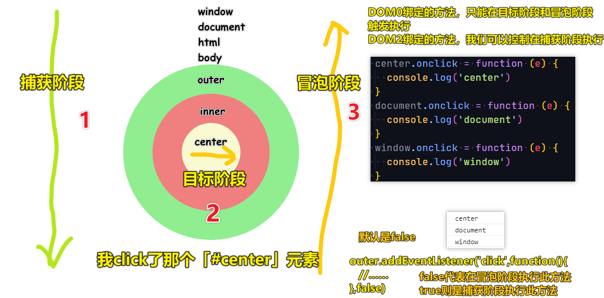

| ✍️ Tangxt | ⏳ 2020-08-01 | 🏷️ DOM 事件 |

# 36-事件对象和事件的传播机制

## ★事件对象

### <mark>1）为事件绑定监听函数</mark>

我们知道浏览器的事件模型，就是通过监听函数（listener）对事件做出反应。事件发生后，浏览器监听到了这个事件，就会执行对应的监听函数。而这是事件驱动编程模式（event-driven）的主要编程方式。

在 JS 里边，有三种方法，可以为事件绑定监听函数：

#### <mark>1、HTML 的 `on-` 属性</mark>

``` html
<body onload="doSomething()"></body>
<div onclick="console.log('触发事件')"></div>

<!-- 错误 -->

<body onload="doSomething"></body>
```

元素的**事件监听属性**，都是 `on` 加上事件名，比如 `onload` 就是 `on + load` ，表示 `load` 事件的监听代码。

注意，这些**属性的值是将会执行的代码**，而不是一个函数

``` js
el.setAttribute('onclick', 'doSomething()');
// 等同于
// <Element onclick="doSomething()">
```

#### <mark>2、元素节点的事件属性</mark>

元素节点对象的事件属性，同样可以指定监听函数。

``` js
window.onload = doSomething;

div.onclick = function(event) {
  console.log('触发事件');
};
```


#### <mark>3、EventTarget.addEventListener()</mark>

所有 DOM 节点实例都有 `addEventListener` 方法，用来为该节点定义事件的监听函数。

``` js
window.addEventListener('load', doSomething, false);
```

#### <mark>4、小结</mark>

* HTML 的 `on-` 属性：违反了 HTML 与 JavaScript 代码相分离的原则，将两者写在一起，不利于代码分工 -> 不推荐使用
* 元素节点的事件属性：同一个事件只能定义一个监听函数，也就是说，如果定义两次 `onclick` 属性，后一次定义会覆盖前一次 -> 不推荐使用
* `EventTarget.addEventListener` 是推荐的指定监听函数的方法，优点如下：
  + **同一个事件**可以添加**多个**监听函数
  + 能够**指定在哪个阶段**（捕获阶段还是冒泡阶段）触发监听函数
  + 除了 DOM 节点，其他对象（比如 `window` 、 `XMLHttpRequest` 等）也有这个接口，它等于是**整个 JavaScript 统一的监听函数接口**

### <mark>2）事件对象是怎么产生的？</mark>

**事件发生**以后，会产生一个**事件对象**，**作为参数传给监听函数**。浏览器原生提供一个 `Event` 对象，所有的事件都是这个对象的实例，或者说继承了 `Event.prototype` 对象。

如我们 `click` 一个 DOM 节点，触发它的监听函数：

拿到的事件对象就是：


`MouseEvent` 的「继承」关系：

``` 
MouseEvent -> UIEvent -> Event -> Object
```

具体点来说：

> 当前元素的某个事件行为被触发，不仅会把绑定的方法执行，还会给绑定的方法**传递一个实参**，这个实参就是**事件对象**；
>  
> 事件对象就是用来**存储当前行为操作相关信息**的对象；（MosueEvent/KeyboardEvent/Event/TouchEvent...） -> 事件对象和在哪个方法中拿到的没关系，它记录的是当前操作的信息

### <mark>3） `MouseEvent` 对象中常用的属性：</mark>

自有的属性：

* cancelBubble
* **target**（事件源 触发的元素） & srcElement（兼容 IE6~8 的写法，一般不考虑）
* **type**（事件类型 `'click'` ）
* code & key
* keyCode & which
* which / keyCode
* **clientX / clientY**（当前鼠标触发点距离当前**窗口左上角**的 X/Y 轴坐标，**无视第一屏、第二屏……**）
* **pageX / pageY**（当前鼠标触发点距离当前**页面 Body 左上角**的 X/Y 轴坐标，**出现在第二屏那么就得这样算了「 `clientY` +卷去的高度」**，不兼容 IE 低版本浏览器）
* path

公有的属性（来自 `Event` ）：

* **preventDefault**（阻止默认行为 `ev.preventDefaul` ，兼容处理 `ev.returnValue = false` ）
* **stopPropagation**（阻止它的冒泡传播 `ev.stopPropagation` ，兼容处理 `ev.cancelBubble = true` )

> 红色高亮的属性是常用的！

### <mark>4）键盘事件对象</mark>

> KeyboardEvent -> UIEvent -> Event -> Object

``` js
document.onkeydown = function(e) {
  console.log(e)
}
```

键盘事件是不用知道你在哪个位置按下的，不像鼠标事件那样，得要知道在哪个位置 `click` 一样……


> [UI Events KeyboardEvent code Values](https://www.w3.org/TR/uievents-code/)

常用的属性：

* keyCode/which（获取键盘码，如 `code: "KeyD"、key: "D"、keyCode: 68、which: 68` ）
* 空格键（32）
* Enter（13） -> 表单回车提交
* BackSpace（8）
* Del（46）
* Shift（16）、Ctrl（17）、Alt（18）
* 四个方向键（左 37、上 38、右 39、下 40）
* 组合键（假如你按下 `D` 键，键盘事件对象的 altKey、ctrlKey、shiftKey 都为 `true` 的话，那么这就意味着按 `D` 键前， `Ctrl+Shift+Alt` 是没有松手的）
* 其它同鼠标事件对象一样

其它键对应的键盘码：

* [JavaScript Event KeyCodes](https://keycode.info/)
* [KeyboardEvent Value (keyCodes, metaKey, etc)](https://css-tricks.com/snippets/javascript/javascript-keycodes/)


### <mark>5）普通事件对象（ `Event` ）</mark>

``` js
window.onload = function(e) {
  console.log(e)
}
```


### <mark>6）移动端的手指事件对象</mark>

> PC浏览器访问 -> 切换到手机模拟器

``` js
box.ontouchstart = function(ev) {
  console.log(ev)
  // 获取第一个手指信息 -> 存储了clientX等基本信息
  let point = ev.changedTouches[0]
}
```


* touchs：只能获取手指在屏幕上的时候的信息，如果手指离开了，信息就没了
* changedTouches：相对于 `touchs` 来讲可以获取到手指离开前的信息 -> 所以项目中用 `changedTouches` 最多

形象点来说：


➹：[TouchEvent里的targetTouches、touches、changedTouches的区别的具体体现是？](https://segmentfault.com/q/1010000002870710)

➹：[移动端的touch事件（三） - 前端学习](http://www.zhangyunling.com/235.html)

## ★事件的默认行为 & 事件传播

### <mark>1）事件的默认行为</mark>

默认行为：**很多元素天生具备一些默认的行为** -> 也就是说事件触发了就会有天生的肉眼可见的效果出现，就像是蜜蜂采蜜、蚂蚁筑巢等这样的先天性行为（生来就有的本能行为）

映射到页面就是：

1. 点击 `a` 标签时居然会实现页面的跳装 -> 如果你写锚点 `#xxx` ，那么也会有默认的锚点定位行为
2. 当我们 `focus` 一个文本输入框时居然可以输入内容
3. 在部分情况下，文本框居然会存在输入记忆
4. 鼠标按右键居然会出现右键菜单
5. ……

阻止事件的默认行为：

如

阻止右键菜单：

``` js
window.oncontextmenu = function(e) {
  e.preventDefault()
  // 接下来自己构建一个属于自己的右键菜单 -> 搞个div -> 监听鼠标点击的位置……
}
```

阻止超链接跳转或者说阻止页面刷新或者说阻止url尾巴出现 `#xxx` ：

``` html
<a href="#box">百度一下</a>
<a href="https://www.baidu.com" id="link">百度一下</a>
```

``` js
link.onclick = function(e) {
  // 点击 a 标签时都是先触发 click 然后再去跳转的
  // 在此处阻止默认行为它也就不跳转了！ -> 而且如果href是 `#xxx` 的话，点击跳到某个锚点也被阻止了，即url最后边不会加上#xxx
  e.preventDefault()
}
```

关于阻止超链接跳转，还有一种阻止默认行为的方式：

``` html
<a href="javascript:;">百度一下</a>
```

题外话：

* 点击文本输入框是先聚焦 `focus()` ，然后 `click()` -> 如果你用 `tab` 键聚焦到文本输入框的话，那么是不会触发 `click` 事件的 -> 总之，我们能输入文本是 `focus` 事件触发的先天行为…… -> 类似于那个 `contenteditable` 属性一样

### <mark>2）事件的传播机制</mark>

#### <mark>1、概述？</mark>

事件的传播机制，分成这么几个阶段：


* AT_TARGET: 2 -> 目标阶段
* BUBBLING_PHASE: 3 -> 冒泡阶段
* CAPTURING_PHASE: 1 -> 捕获阶段
* NONE: 0

#### <mark>2、这几个阶段都是怎么一回事呢？</mark>

当元素的某个事件行为被触发，那么一定会经历三个阶段：

捕获阶段：

> 从最外层容器一直向里层查找，直到找到当前触发的事件源为止 -> 查找的目的是建立起当前元素未来冒泡传播的传播路线


DOM的层次结构：

``` 
Window -> document -> html -> body -> outer -> inner -> center
```

目标阶段：

> 把当前元素的相关事件行为触发（如果绑定了方法，则把方法执行）

冒泡阶段：

> 不仅当前元素的相关事件行为被触发，而且在捕获阶段获取的传播路径中的每一个元素的相关事件行为都会被触发 -> 或者说是当前元素其父级所有元素的相关事件行为也会被触发 -> 触发顺序是从内到外的！ -> 如果绑定了方法，那么方法也会被触发执行！



* DOM0 事件绑定：绑定的方法都是控制在目标或者冒泡阶段执行
* DOM2 事件绑定：可以控制在捕获阶段执行（ `xxx.addEventListener('click',callback,true)` ） -> 最后那个参数 `true` 就是控制在捕获阶段执行元素所绑定的方法，不过一般都不用，周老师写JS代码那么多年来，就从未遇到过，有什么场景是需要在捕获阶段触发元素所绑定的方法的！

> 其实事件的传播，可以理解为信号的传播 -> 就像是狼烟起，把这个信号一层层向内上

报给大王，大王发出指令，一层层向外传递


---

<mark>Q：我就点击了一次 `center` ，就执行了3个方法，每个方法中都有 `e` 事件对象，话说，这3个 `e` 是同一个对象吗？</mark>


经过测试，确实是同一个：

> 事件对象和在哪个方法中出现没啥关系，事件对象是用来记录当前操作的相关信息的，也就是操作一次记录一次，此时不论在哪获取的 `e` 都是记录本次操作的信息，除非重新操作，那么上一次的信息就咩有了 -> 总之， `e` 存储的是最新的操作信息！

而这意味着我们可以在 `inner/outer/body/html/document/window` 所绑定的方法里拿到触发事件的元素，也就是 `target` ，也就是第一次发出信号的目标对象！


> 图中的「流浪对象 `e` 」是我个人取的无厘头的名字…… -> 为了自己好理解，所以就造了这么个名字……
>  
> 其实，我感觉事件的冒泡阶段传播，就是在遍历 `e.path` ，然后对其中的每个数组元素都 `ele.callback(e)` -> 这个 `e` 是每个数组元素公用的 `e`
对了，让我感到好奇的是，每个 `e.currentTarget` 的值都是当前所绑定方法的DOM对象，但是浏览器的控制台显示的却都是 `null`

### <mark>3）阻止事件的传播机制</mark>

``` js
center.onclick = function(e) {
  console.log('center')
  // 阻止信号的冒泡传播
  e.stopPropagation()
}
```

## ★ `mouseover` vs `mouseenter`

> 区分一下这俩事件，毕竟它们很像

### <mark>1）mouseover & mouseout</mark>

``` js
outer.onmouseover = (e) => {
  console.log('outer:over')
}
outer.onmouseout = (e) => {
  console.log('outer:out')
}
inner.onmouseover = (e) => {
  console.log('inner:over')
}
inner.onmouseout = (e) => {
  console.log('inner:out')
}
```


mouseover & mouseout：

* 存在冒泡传播机制
* 鼠标在盒子上属于 `over` ，不在就是 `out` -> 把盒子看成是日常生活中的一个快递盒，你俯视着看它，你用一把剪刀 `over` 在快递盒的上边，剪刀移开就是 `out` 了

为啥 `callback` 的执行顺序是这样子的呢？


> 感觉有了冒泡机制，信号的传播反馈到callback的执行顺序，给人感觉是不直观的……

如果你要做这么一个需求——鼠标划过大盒子做些啥事，如果大盒子里边嵌套了很多层小盒子，你会发现这信号的传播特别的乱（大盒子频繁的触发callback）

所以，**在一般真实项目里边，如果你用到了 `mouseover & mouseout` ，那么这个盒子就不要嵌套其它小盒子了！**

补充一点：


对于 `mouseover`：

- `event.target` —— 是鼠标移过的那个元素。
- `event.relatedTarget` —— 是鼠标来自的那个元素（`relatedTarget` → `target`）。

`mouseout` 则与之相反：

- `event.target` —— 是鼠标离开的元素。
- `event.relatedTarget` —— 是鼠标移动到的，当前指针位置下的元素（`target` → `relatedTarget`）。

### <mark>2）mouseenter & mouseleave</mark>

``` js
outer.onmouseenter = (e) => {
  console.log('outer:enter')
}
outer.onmouseleave = (e) => {
  console.log('outer:leave')
}
inner.onmouseenter = (e) => {
  console.log('inner:enter')
}
inner.onmouseleave = (e) => {
  console.log('inner:leave')
}
```


mouseenter & mouseleave：

- 它们俩默认都阻止了冒泡传播机制
- enter是进入，leave是离开：从大盒子进入到小盒子，不会触发大盒子的leave，从小盒子重新进入到大盒子，也不会触发大盒子的enter，因为这不属于重新进入 -> 类比一层房子，只有中间有个双向门的卧室，其余都是空白的


可以看到这种信号的传播，要相对来说**要干脆、干净一点** -> 在真实项目开发里边，大盒子包含小盒子，进来时干啥，离开时干啥，用的是 `mouseenter & mouseleave`，而不是 信号传播很复杂的`mouseover & mouseout`

## ★了解更多

➹：[浏览器事件简介](https://zh.javascript.info/introduction-browser-events)

➹：[鼠标事件](https://zh.javascript.info/mouse-events-basics)

➹：[移动鼠标：mouseover/out，mouseenter/leave](https://zh.javascript.info/mousemove-mouseover-mouseout-mouseenter-mouseleave)

## ★总结

- 事件是某事发生的信号，`click`事件发生了，就像是放狼烟一样…… -> 信号来了，就得干点什么……`click`事件来了，我就得`alert`一下！ -> 而我们写的监听事件函数就是在「监听信号来了，我们该做点什么」 -> 有些元素DOM节点，天生面对某种信号就有某种行为，如`input`（文本框），看到`focus`信号来了，就可以让用户往这元素身上输入文本内容……再比如，点击某个超链接，`a`看到`click`信号了，就自发地跳转页面了…… -> 形象点来说，睡觉前你（是个DOM元素节点）要刷牙、闹钟响你要起床……睡觉前、闹钟都是信号……
- 一个DOM元素身上，请不要同时绑定了 `mouseenter & mouseleave` & `mouseover & mouseout`，不然，你`callback`的执行顺序会让你GG……总之，要么选择 `mouseenter & mouseleave`这组（没有冒泡，元素之间可以嵌套），要么选择 `mouseover & mouseout`这组（有冒泡，元素最好没嵌套）

## ★Q&A

### <mark>1）介词？</mark>


over -> 越多 -> 伞越过你的头

off -> 从外表脱离

其实介词给我的感觉就是形容一个东西与另一个东西的关系，或者衔接两个东西，具有某种味道的东西！

回到 `mouseover`，你把元素立体起来，鼠标指针是不是over在元素上？ -> 同理，hover也是这个意思！

➹：[英语写作时总是用错介词是什么原因? - 知乎](https://www.zhihu.com/question/319247897)