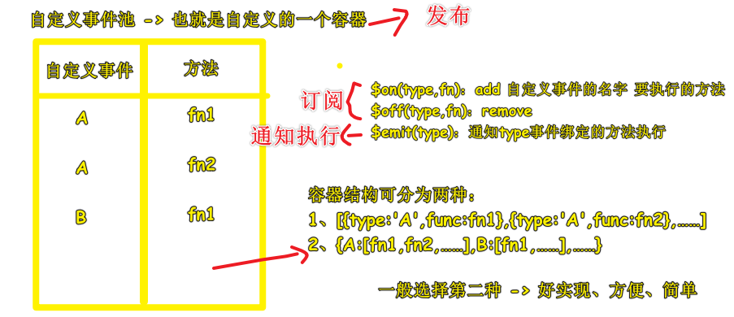
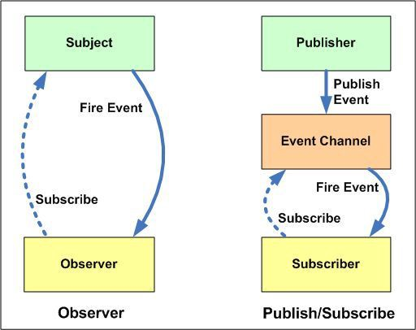
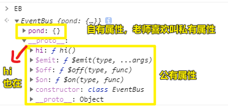
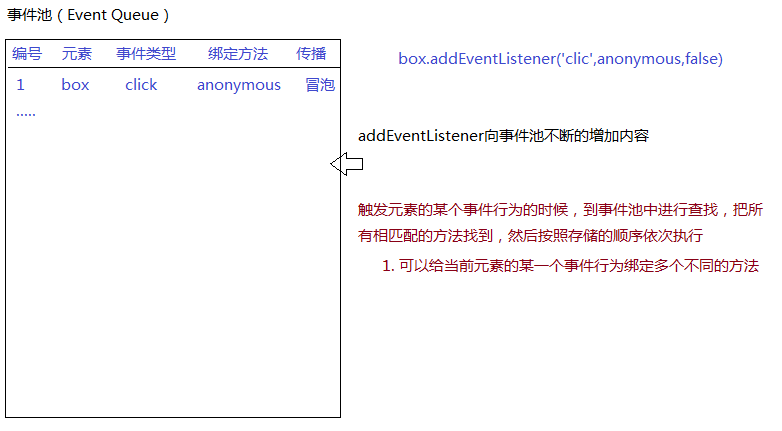

| ✍️ Tangxt | ⏳ 2020-08-05 | 🏷️ 设计模式 |

# 37-发布订阅设计模式

## ★前言

从服务器获取数据：

1. 数据分析
2. 数据绑定
3. DOM 元素的相关操作
4. ……

元素监听用户行为：

1. 接收到了信号
2. 信号分析
3. 执行 callback
4. 数据绑定
5. DOM 元素的相关操作
6. ……

## ★是什么？

### <mark>1）概述</mark>

> 透过事件池机制，来让你了解什么是「发布订阅设计模式」

我们使用 jQuery 的 ajax 方法，来发送 ajax 请求：

``` js
$.ajax({
  url: '/api/v1/userlist',
  success: function(result) {
    fn1(result)
    fn2(result)
    fn3(result)
  }
})

function fn1() {}

function fn2() {}

function fn3() {}
```

也可以使用 axios：

``` js
axios.get('/api/v1/userlist')
.then(res => {})
.catch((err) => {})
```

也可以使用发布订阅设计模式：

先规划好拿到数据之后，应该要做什么：

把 callback 扔到一个容器里边去 -> `$on(fn1)`、`$on(fn2)` -> 也可以移除 callback（`$off`）

数据拿到之后，直接就这样：

``` js
$.ajax({
  url: '/api/v1/userlist',
  success: function(result) {
    // 依次执行容器里的方法
    $emit(result)
  }
})
```

这种姿势比传统的`$.ajax()`要好！

---

发布订阅设计模式的思想是：

> 事先把要干的事给计划好（把`callback`扔到一个池子里去），当到达指定条件的时候（`ajax`请求成功，响应回来数据）或者说某种信号来了，就依次执行容器里的方法！



这同事件池机制一样，监听事件，信号来了，依次执行事件池里的`callback`

补充：

观察者模式 vs 发布订阅模式：



有人这样理解它们二者的区别：

1. 发布-订阅模式就好像报社， 邮局和个人的关系，报纸的订阅和分发是由邮局来完成的。报社只负责将报纸发送给邮局。
2. 观察者模式就好像 个体奶农和个人的关系。奶农负责统计有多少人订了产品，所以个人都会有一个相同拿牛奶的方法。奶农有新奶了就负责调用这个方法。

在我看来：

> 双向绑定的效果可以理解成观察者模式，单向数据流的效果可以理解成发布订阅模式

其实发布者就是资源的生产者，而订阅者就是需要资源的人（也就是消费者），我们是线下面对面交易？还是网上交易？

### <mark>2）是什么</mark>

认识它，你得知道这么几个概念：

1. 发布者 -> 生产者（生产的是`callback`） -> 自定义事件池（`$pond`） -> 也就是自定义的一个容器 -> 注意这可不是浏览器内置的事件哈！
2. 订阅者 -> 买家（监听某个信号`$on()`），买家还可以退货（移除某个信号的`callback`，`$off()`）
3. 中介 -> 网店，通知买家收费（发布某个信号，`$emit()/fire()`，为何发布？因为「发布者」把东西生产出来了）

> jQuery 是`on/off/fire`

## ★写一个

### <mark>1）为啥要用面向对象姿势封装插件？</mark>

在真实项目里边的封装（类库、插件、组件）基本上都是基于面向对象的思想

1. 创建类和类的实例，每一个实例之间是相互独立的，都有自己自有的属性和方法，而且还能拥有公共的属性方法
2. 只有保证方法中的`this`是实例，那么这样各个方法中就可以实现信息的通信了！

### <mark>2）ES6 的 class 语法、装饰器</mark>

1. 定义自有属性
2. 定义原型方法

> 注意 ES7 提供了不用在`constructor`里写自有属性的姿势，还有透过装饰器，把一些工具方法注入到`class`的原型里边去，以此来实现方法的复用

一个我不知道的点，可以直接这样添加原型方法：

``` js
(function(){
  class EventBus(){
    constructor(){
      this.pond()
    }
    $on(type,func){}
    $off(type,func){}
    $emit(type,...args){}
  }
  // 可以这样添加原型方法，就像是构造函数一样……
  EventBus.prototype.hi = function hi() {
    console.log('hi')
  }
  window.EB = new EventBus();
})()
```



### <mark>3）写一个体现发布订阅设计模式思想的代码</mark>

> 老师并没有弄三个 class 出来，直接就是用三个 API 来代表三种操作！

1. 自执行函数
2. 创建 `Sub` -> 定义原型方法，也就是定义「API 接口」 -> `$pond、$on、$off、$emit` -> 这些 API 的设计是仿照 Vue 的 eventBus
3. `new Sub` -> 使用

> 注意，`splice`会导致数组塌陷的问题，这一点在定义 `$off` 尤其需要注意！

代码的结构：

``` js
class Sub {
  // 创建一个事件池
  $pond = {}

  // 向事件池中追加方法
  $on(type,func) {}

  // 从事件池中移除方法
  $off(type,func){}

  // 通知事件池中的方法执行
  $emit(type,...params){}
}
```

> 去重的操作是在「向事件池中追加方法」时做的！

暴露给全局用的 API，有两种姿势：

第一种：暴露实例

``` js
window.subscribe = function subscribe() {
  return new Sub
}
```

使用：

``` js
let sub = subscribe()
sub.$on('A',fn1)
sub.$on('A',fn2)
sub.$emit('A',1,2)
sub.$off('A',fn2)
```

第二种：暴露方法 API

``` js
let sub = new Sub
['$on','$off','$emit'].forEach(item => {
  windowp[item] = function anonymous(...params) {
    sub[item](...params)
  }
});
```

使用：

``` js
$on('A',fn1)
$on('A',fn2)
$emit('A',1,2)
$off('A',fn2)
```

### <mark>4）整体代码</mark>

> 有很多种姿势可以实现 eventBus -> 你要关注的是其中的思想！

``` js
(function () {
  class EventBus {
    constructor() {
      // 创建一个事件池 {xxx:[],...}
      this.pond = {};
    }
    // 向事件池中追加方法
    $on(type, func) {
      // 每一次加方法的时候，首先看看事件池中是否存在这个类型，不存在就创建
      let pond = this.pond;
      !(type in pond) ? pond[type] = [] : null;

      // 增加方法（去重）
      let pondT = pond[type];
      !pondT.includes(func) ? pondT.push(func) : null;
    }
    // 从事件池中移除方法
    $off(type, func) {
      let pondT = this.pond[type];
      if (!pondT) return;
      for (let i = 0; i < pondT.length; i++) {
        let item = pondT[i];
        if (item === func) {
          // 移除掉（因为追加的时候去重了，所以删除一次就够了，不需要在向后找了）；为了方式数组塌陷，我们此处不使用 pondT.splice(i, 1) 删除，我们先给其赋值为 null 即可
          pondT[i] = null;
          return;
        }
      }
    }
    // 通知事件池中某个类型对应的方法依次执行
    $emit(type, ...args) {
      let pondT = this.pond[type] || [];
      for (let i = 0; i < pondT.length; i++) {
        let func = pondT[i];
        // 如果不是函数，在容器中移除掉
        if (typeof func !== "function") {
          pondT.splice(i, 1);
          // 保证从 0 开始
          i--;
          continue;
        }
        func.apply(this, args);
      }
    }
  }
  window.EB = new EventBus();
})();
```

## ★了解更多

➹：[第 23 题：介绍下观察者模式和订阅-发布模式的区别，各自适用于什么场景 · Issue #25 · Advanced-Frontend/Daily-Interview-Question](https://github.com/Advanced-Frontend/Daily-Interview-Question/issues/25)

➹：[观察者模式 vs 发布-订阅模式 - 掘金](https://juejin.im/post/6844903513009422343)

➹：[Observer vs Pub-Sub pattern - Hacker Noon](https://hackernoon.com/observer-vs-pub-sub-pattern-50d3b27f838c)

➹：[面试题， 实现一个 Event 类（发布订阅模式） - 知乎](https://zhuanlan.zhihu.com/p/60324936)

## ★总结

- 设计模式：更好的管理项目中的代码，方便维护，方便团队协作，方便扩展……
- 发布订阅：灵感来源于 DOM2 事件池机制
  - 事件池：我们可以向事件池中追加方法（追加多个不同的方法），当后期事件触发的时候，按照顺序会把这些方法依次执行（也可以从事件池中移除方法） -> `addEventListener`、`removeEventListener`
  - 模拟一个事件池：我们自己可以把要执行的方法，依次加入到池子中 `on`（也可以从池子中移除 `off`），当某个条件到达的时候（信号来了），我们通知池子中的方法**依次执行** `emit`...
- 其它库是怎么做的
  - vue：`$emit/$on`
  - redux：`subscribe`
  - jQuery：`on/off/fire`
  - ……
- 事件池 -> 强调「计划」这个东西 -> 信号来了，就按计划行事……第一步执行callback1，第二步执行callback2………


