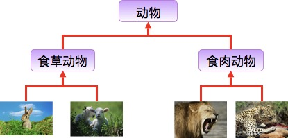

# 草稿

## ★了解更多

➹：[运算符和表达式-笔记 - 知乎](https://zhuanlan.zhihu.com/p/139687573)

➹：[Java 重写(Override)与重载(Overload) - 菜鸟教程](https://www.runoob.com/java/java-override-overload.html)

## ★总结

* 我们调用一个方法是多种多样的，对于Java而言，会发生重载（**严肃传参，多个方法供你选择**），但对于JS而言，则不会（**佛系传参，你只有一个方法可以选择**） -> 但这二者的目的都是一样的：我们只想走不同的代码逻辑去做不同的事儿…… -> TS的出现，让我们JS开发者封装一个函数的时候不用管参数校验的活儿了……
* 我看一个对象，看它有什么自有的属性和方法，那就是`has a` -> 也就是所谓的「**组合**」 -> 我看它的原型链，也就是它的`__proto__`，也就是它有什么公有属性和方法 -> 也就是所谓的「**继承**」

## ★Q&A

1）`is a` & `has a` 之间的区别？

> 继承与组合

日常表述中经常会有如下的理解——

1. 甲**生出**了乙，甲乙是「父子」
2. 甲**包含**了乙，甲乙在层级上也可以视为「父子」

但严格说来，「父子」就是「面向对象」中对「继承」关系的描述。

而第 2 种说法或许正是引发困惑的原因

问题中的两种情况，从概念上其实很好区分

ClassB **is a** ClassA
ClassA 是抽象，ClassB 是继承。因此可以说——**ClassB 是 ClassA 的子类**
当只需要考虑 ClassA 的特性时，ClassB 和 ClassA 基本等价

ClassB **has a** ClassA
ClassB 是容器，ClassA 是部件。有时会说成——**ClassA 是 ClassB 的「子类」**
ClassB 和 ClassA 一般不可相互替代

> A瓶子有「红色衣服」，B瓶子有「蓝色衣服」 -> 它们都是瓶子

➹：[「is a」和「has a」分别是什么意思？有什么区别？ - 钢盅郭子的回答 - 知乎](https://www.zhihu.com/question/20090666/answer/13941349)

➹：[Java is-a、has-a和like-a、组合、聚合和继承 两组概念的区别_caobaokang的专栏-CSDN博客_is-a 继承 java](https://blog.csdn.net/cbk861110/article/details/9028189)

2）生活中的继承？

兔子和羊属于或是食草动物类，狮子和豹属于或是食肉动物类。

食草动物和食肉动物又是属于或是动物类。

所以继承需要符合的关系是：is-a，父类更通用，子类更具体。

虽然食草动物和食肉动物都是属于或是动物，但是两者的属性和行为上有差别，所以子类会具有父类的一般特性也会具有自身的特性

➹：[Java 继承 - 菜鸟教程](https://www.runoob.com/java/java-inheritance.html)