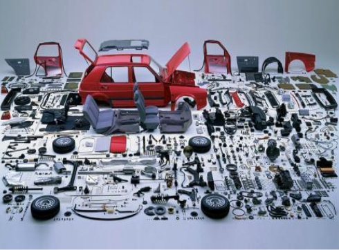

# 草稿

9）什么是currying？

Currying favour -> 拍马屁

了解curring -> 你得对闭包、高阶函数、compose函数等有一定的认识

➹：[16 Currying favour Synonyms. Similar words for Currying favour.](https://thesaurus.plus/synonyms/currying_favour)

➹：[Currying and Uncurrying in JavaScript and Flow - Joseph Junker - Medium](https://medium.com/@JosephJnk/currying-and-uncurrying-in-javascript-and-flow-98877c8274ff)

➹：[JavaScript 中的 Currying(柯里化) 和 Partial Application(偏函数应用)-WEB前端开发](https://www.html.cn/archives/7781)

➹：[What is Currying In JavaScript and Why Does it Matter? - Dotted Squirrel](https://dottedsquirrel.com/javascript/currying/)

➹：[Composing and Currying Functions](https://www.cs.oberlin.edu/~rms/classes/cs275/labs/lab5/lab52.html)

➹：[currying vs partial application](https://pt.slideshare.net/leopoa/currying-vs-partial-application-29802097)

➹：[邂逅函数柯里化 - 大前端 - SegmentFault 思否](https://segmentfault.com/a/1190000008263193)

➹：[「前端早读君004」函数柯里化（Currying）小实践 - 前端早读君 - SegmentFault 思否](https://segmentfault.com/a/1190000015957944)

➹：[大佬，JavaScript 柯里化，了解一下？ - 掘金](https://juejin.im/post/5af13664f265da0ba266efcf)

➹：[JS中的柯里化(currying) « 张鑫旭-鑫空间-鑫生活](https://www.zhangxinxu.com/wordpress/2013/02/js-currying/)

➹：[EffectiveJavaScriptItem26使用bind来进行函数的柯里化(Curry)_不忘初心，好好沉淀-CSDN博客_jsitem_bind](https://blog.csdn.net/dm_vincent/article/details/39495399)

➹：[EffectiveJavaScript笔记第26条：使用bind方法实现函数的柯里化_weixin_30652271的博客-CSDN博客](https://blog.csdn.net/weixin_30652271/article/details/96172564)

➹：[JavaScript 中至关重要的 Apply, Call 和 Bind - 知乎](https://zhuanlan.zhihu.com/p/26764679)

➹：[JavaScript函数柯里化 - 知乎](https://zhuanlan.zhihu.com/p/31271179)

➹：[「译」理解JavaScript的柯里化 - 知乎](https://zhuanlan.zhihu.com/p/50247174)

➹：[Higher-Order Functions :: Eloquent JavaScript](https://eloquentjavascript.net/05_higher_order.html)

➹：[函数式编的JS: curry - 知乎](https://zhuanlan.zhihu.com/p/36643937)