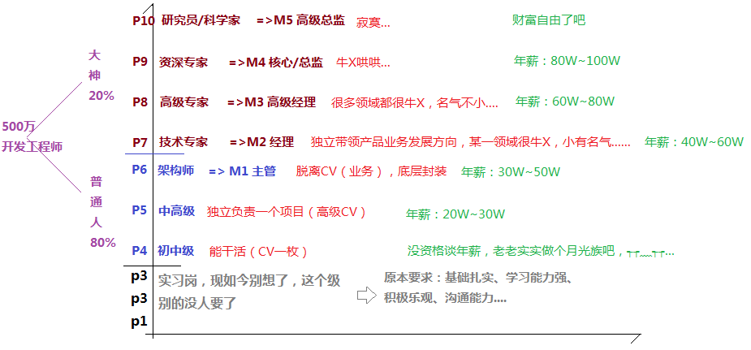

# FAQ

## 1、关于项目总结？

做完一个项目就要总结，学到了什么，对这个项目还可以完善什么，能否让这个项目进化到2.0

开始下个项目的时候，就得把上个项目学到的给用上去，不然，这不叫项目经验……

## 2、关于纵向和深度的形象比喻？

纵向变胖，深度变高，又高又胖，才能让人有安全感……

## 3、诫子书？

> 《诫子书》 夫君子之行，静以修身，俭以养德。非澹泊无以明志，非宁静无以致远。夫学须静也，才须学也，非学无以广才，非志无以成学。慆慢则不能研精，险躁则不能理性。年与时驰，意与岁去，遂成枯落，多不接世。悲守穷庐，将复何及！

《诫子书》创作背景：

这篇文章当作于蜀汉建兴十二年（元234年），是**诸葛亮晚年写给他八岁的儿子诸葛瞻的一封家书**。诸葛亮一生为国，鞠躬尽瘁，死而后已。他为了蜀汉国家事业日夜操劳，顾不上亲自教育儿子，于是写下这篇书信告诫诸葛瞻。

译文：

> 君子的行为操守，从宁静来提高自身的修养，以节俭来培养自己的品德。不恬静寡欲无法明确志向，不排除外来干扰无法达到远大目标。学习必须静心专一，而才干来自学习。所以不学习就无法增长才干，没有志向就无法使学习有所成就。放纵懒散就无法振奋精神，急躁冒险就不能陶冶性情。年华随时光而飞驰，意志随岁月而流逝。最终枯败零落，大多不接触世事、不为社会所用，只能悲哀地坐守着那穷困的居舍，其时悔恨又怎么来得及？

➹：[诸葛亮写给其儿子的《诫子书》 - 知乎](https://zhuanlan.zhihu.com/p/47410795)

➹：[诸葛亮《诫子书》的家庭教育思想剖析 - 知乎](https://zhuanlan.zhihu.com/p/25046876)

## 5、如何成为一名优秀的前端开发工程师？或者说如何给自己一个小目标？

## 6、听老师说，这个课掌握80%（老师讲的基本能听得懂，能做出来），就能拿15、16k以上了

## 7、关于总结？

从JS第17篇笔记开始，我打算用思维导图配合文字来总结！